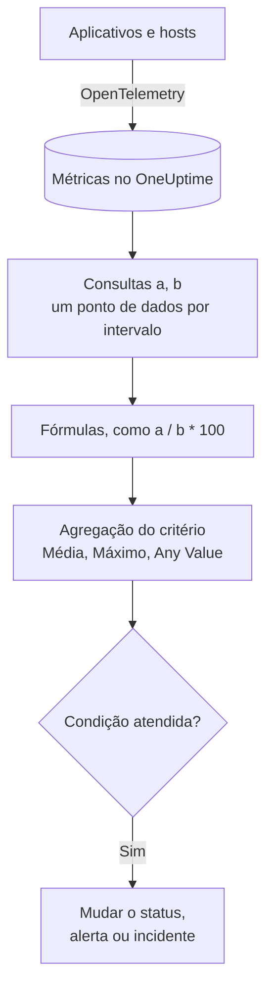

# Monitor de métricas

Um monitor de métricas consulta as métricas que seus aplicativos e sua infraestrutura enviam ao OneUptime, combina-as com fórmulas quando você precisa de uma razão ou de um total, e compara o resultado com seus critérios em um intervalo de tempo móvel. Use-o para taxas de requisições, proporções de erros, profundidade de filas, CPU, memória e disco (qualquer série numérica), com um alerta por host ou por contêiner quando você o agrupa.

:::cards
- [Criar o monitor](#criar-um-monitor-de-métricas): Consultas, fórmulas, um intervalo de tempo e critérios.
- [Como ele é avaliado](#como-ele-é-avaliado): Pontos de dados, fórmulas e a agregação dos critérios.
- [Exemplo prático](#exemplo-prático-uma-fila-que-cresce): Os mesmos dados com cada agregação.
- [Alertas por série](#alertas-por-série-group-by): Um alerta por host, contêiner ou ponto de montagem.
:::

## Como funciona

A cada minuto, o OneUptime executa cada consulta de métricas do monitor sobre o seu intervalo de tempo. Uma consulta retorna um ponto de dados por intervalo de agrupamento, e as fórmulas combinam as consultas intervalo a intervalo. Cada critério então reduz os pontos de dados da consulta ou da fórmula que verifica (à sua média, ao seu máximo ou a um teste de cada ponto) e compara o resultado com o seu limite.

## Antes de começar

- Seus aplicativos ou sua infraestrutura enviam métricas ao OneUptime pelo OpenTelemetry. Veja [OpenTelemetry](/docs/telemetry/open-telemetry).
- Saiba o nome da métrica e os atributos pelos quais você quer filtrar ou agrupar. As listas **Métrica** e **Group by** só oferecem nomes e atributos que o OneUptime já recebeu.

## Criar um monitor de métricas

:::steps
### Começar um novo monitor

Vá para **Monitores** e clique em **Criar monitor**.

### Escolher Metrics

Em **Tipo de monitor**, clique em **Mais tipos de monitor** e escolha **Métricas** em **Telemetria**, ou digite `metrics` na caixa de pesquisa. Digite um **Nome** e clique em **Próximo**.

### Escolher o intervalo de tempo

Em **Configuração do monitor de métricas**, escolha um **Intervalo de tempo**: até onde cada avaliação olha para trás. Ele começa em **Past 1 Minute**.

### Adicionar as consultas de métricas

Em **Selecionar Métricas**, escolha uma **Métrica** e como agregá-la com **Aggregate by**. Abra **Filters & grouping** para filtrar por atributos ou para agrupar com **Group by**. Clique em **Adicionar métrica** para outra consulta, ou em **Adicionar fórmula** para combiná-las. O gráfico abaixo das consultas mostra uma prévia do intervalo de tempo, para você ver os valores que os critérios vão verificar.

### Definir os critérios

Em **Critérios do monitor**, cada critério escolhe a **Métrica** a verificar (uma consulta ou uma fórmula), sua **Agregação**, uma **Condição** e um **Threshold**. Veja [Critérios](#critérios) para os critérios com que um novo monitor começa.

### Criar o monitor

Clique em **Criar monitor**. O monitor abre na sua página **Visão geral**, e sua primeira avaliação acontece em até um minuto.
:::

## O que ele consulta

### Consultas de métricas

| Campo | O que faz | Padrão |
| --- | --- | --- |
| **Métrica** | A métrica a consultar. | Obrigatório |
| **Aggregate by** | Como os valores de cada intervalo de tempo são combinados em um ponto de dados: Méd, Soma, Min, Max, Contagem, ou um percentil (P50, P75, P90, P95 ou P99). | Méd |
| **Filter by attributes** (em **Filters & grouping**) | Somente as séries cujos atributos atendem a estas condições. | Nenhum filtro |
| **Group by** (em **Filters & grouping**) | Uma série por valor único destes atributos (veja [Alertas por série](#alertas-por-série-group-by)). | Uma só série |

Cada consulta e cada fórmula recebe uma variável (`a`, `b`, `c` e assim por diante), na ordem em que você as adiciona.

### Fórmulas

Uma fórmula combina variáveis de consulta com `+`, `-`, `*`, `/`, `%`, `^` e parênteses, intervalo a intervalo. Você pode escrever as variáveis com ou sem um `$` na frente:

- `a / b * 100`: a parte de `b` que `a` representa, em porcentagem
- `a + b`: duas métricas somadas
- `a - b`: a diferença entre elas

### Janela de tempo móvel

**Intervalo de tempo** define até onde cada avaliação olha para trás: **Past 1 Minute**, **Past 5 Minutes**, **Past 10 Minutes**, **Past 15 Minutes**, **Past 30 Minutes**, **Past 1 Hour**, **Past 2 Hours**, **Past 3 Hours**, **Past 6 Hours**, **Past 12 Hours**, **Past 1 Day**, **Past 2 Days**, **Past 3 Days**, **Past 7 Days**, **Past 14 Days**, **Past 30 Days**, **Past 60 Days**, **Past 90 Days**, **Past 180 Days** ou **Past 365 Days**.

Quanto maior o intervalo, mais largo é cada intervalo de agrupamento, então um ponto de dados representa mais tempo:

| Intervalo de tempo | Um ponto de dados por |
| --- | --- |
| De Past 1 Minute a Past 3 Hours | minuto |
| Past 6 Hours, Past 12 Hours | 5 minutos |
| Past 1 Day | 15 minutos |
| Past 2 Days, Past 3 Days | 30 minutos |
| Past 7 Days | hora |
| Past 14 Days, Past 30 Days | dia |
| De Past 60 Days a Past 180 Days | semana |
| Past 365 Days | mês |

## Como ele é avaliado

- **A cada minuto.** Um monitor de métricas não é verificado por sondas, por isso não tem intervalo para configurar nem página **Sondas e intervalo**.
- **Primeiro as consultas, depois as fórmulas.** Cada consulta retorna um ponto de dados por intervalo de agrupamento do intervalo de tempo, de acordo com o seu **Aggregate by**. As fórmulas são calculadas para cada intervalo a partir dos pontos de dados das consultas.
- **Depois, a agregação do critério.** Cada critério reduz os pontos de dados da sua **Métrica** ao que compara com o limite:

| Agregação | A condição é verificada contra… |
| --- | --- |
| Média | a média dos pontos de dados |
| Soma | a soma dos pontos de dados |
| Maximum Value | o ponto de dados mais alto |
| Minimum Value | o ponto de dados mais baixo |
| All Values | cada ponto de dados: todos precisam atender à condição |
| Any Value | cada ponto de dados: basta que um atenda à condição |

- **Critérios de cima para baixo.** Em um monitor sem Group By, o primeiro critério que corresponde decide, então coloque o mais grave primeiro. Um monitor agrupado verifica todos os critérios para cada série (veja [A avaliação dos critérios é diferente](#a-avaliação-dos-critérios-é-diferente)).
- **Nenhum dado não é zero.** Quando a consulta não retorna pontos de dados no intervalo de tempo, um critério faz o que diz sua configuração **Se não houver dados**, em **Mais campos**: **Ignore** (o padrão: o critério não corresponde), **Treat As Zero** ou **Trigger**.
- **A indisponibilidade do próprio OneUptime não é silêncio.** Enquanto o intervalo de tempo contiver um período em que o próprio OneUptime não estava recebendo dados (estava reiniciando, sendo atualizado ou recuperando um atraso), a verificação espera: o status não muda, e nenhum incidente ou alerta é aberto ou resolvido, diga o que disser **Se não houver dados**. Veja [Quando o OneUptime não recebe dados](/docs/monitor/when-oneuptime-is-not-receiving).

## Critérios

Estes monitores sempre avaliam o **Metric Value**: o valor agregado da consulta de métricas ou da fórmula configurada. O formulário de critérios não tem seletor de tipo de filtro; ele mostra **Métrica**, **Agregação**, **Condição** e **Threshold**. Quando a métrica tem uma unidade, escolha a unidade do limite ao lado dele.

| Condição | Corresponde quando o valor está… |
| --- | --- |
| **Greater Than** | acima do limite |
| **Greater Than Or Equal To** | no limite ou acima |
| **Less Than** | abaixo do limite |
| **Less Than Or Equal To** | no limite ou abaixo |
| **Equal To** | exatamente no limite |
| **Anomalously High** | acima da faixa esperada para esta hora da semana |
| **Anomalously Low** | abaixo dessa faixa |
| **Anomalous** | fora dessa faixa, em qualquer direção |

As condições de anomalia não têm limite. Em vez dele, o formulário mostra **Sensibilidade** (Low, Medium, a padrão, ou High) e **Janela de linha de base** (14 dias, a padrão, 28, 60 ou 90), e compara cada ponto de dados com a linha de base da mesma hora da semana, construída a partir dessa janela. Até que essa hora da semana tenha histórico suficiente, o critério ainda está aprendendo e não gera alertas.

Um novo monitor de métricas começa com dois critérios na sua primeira consulta, ambos com a agregação **Any Value**:

| Critério | Condição | Efeito |
| --- | --- | --- |
| Check if … is offline | **Equal To** `0` | Coloca o monitor offline e declara um incidente, resolvido automaticamente |
| Check if … is online | **Greater Than** `0` | Coloca o monitor online |

> [!NOTE]
> O critério offline dispara com um valor informado de 0, não com o silêncio. Para receber um alerta quando uma métrica para de chegar, defina o **Se não houver dados** dela como **Trigger**.

## Exemplo prático: uma fila que cresce

Você quer um incidente quando a fila de checkout continua longa. A consulta `a` é o gauge `checkout.queue.depth`, com **Aggregate by** Max, e o **Intervalo de tempo** é **Past 5 Minutes**. Uma avaliação vê estes cinco pontos de dados de um minuto:

| Minuto | 10:01 | 10:02 | 10:03 | 10:04 | 10:05 |
| --- | --- | --- | --- | --- | --- |
| `a` | 640 | 980 | 1.500 | 1.620 | 1.100 |

Um critério com **Métrica** `a`, **Condição** **Greater Than** e **Threshold** `1000` dá uma resposta diferente para cada **Agregação**:

| Agregação | Comparado com 1.000 | Corresponde? |
| --- | --- | --- |
| Média | 1.168 | Sim |
| Soma | 5.840 | Sim |
| Maximum Value | 1.620 | Sim |
| Minimum Value | 640 | Não |
| All Values | 640, 980, 1.500, 1.620, 1.100 | Não: dois pontos não estão acima de 1.000 |
| Any Value | 640, 980, 1.500, 1.620, 1.100 | Sim: 1.500 está |

**Média** alerta sobre um acúmulo prolongado e ignora um único minuto de fila longa; **All Values** espera até que cada minuto do intervalo tenha fila longa; **Any Value** alerta no primeiro minuto de fila longa.

## Alertas por série (Group By)

**Group by** em uma consulta de métricas divide essa consulta em uma série por valor único de atributo (uma por host, uma por contêiner, uma por ponto de montagem), e um monitor com Group By definido avalia cada série de forma independente. Essa única configuração é a diferença entre "a frota não está bem" e "`prod-db-01` não está bem".

### Um alerta por grupo

Com Group By em `host.name`, um monitor de uso de disco que observa cinquenta hosts gera **um alerta (ou incidente) por host acima do limite**. O host A enchendo abre seu próprio alerta; o host B enchendo dez minutos depois abre um segundo alerta, separado, ao lado dele.

Sem Group By, o mesmo monitor é um único escalar: a consulta junta todos os hosts em um só número, e o monitor gera **um único alerta para o monitor inteiro**. Enquanto esse alerta está aberto, um segundo host acima do limite não produz nada (o monitor já está alertando, então não há nada novo a gerar) e o engenheiro de plantão nunca fica sabendo do host B. **Definir Group By é a forma de ter alertas por host.** Se você quer ser acionado por host, por contêiner ou por ponto de montagem, defina-o.

### Resolução independente

Cada alerta por grupo acompanha o seu próprio grupo. Quando o host A volta para baixo do limite, seu alerta se resolve sozinho, e o alerta do host B continua aberto até que o host B se recupere. A recuperação de um grupo nunca fecha o alerta de outro.

### A avaliação dos critérios é diferente

- **Monitores agrupados avaliam todos os critérios.** Assim, faixas de gravidade podem disparar em grupos diferentes ao mesmo tempo: com "Critical: maior que 95" acima de "Warning: maior que 80", um host em 96% abre um alerta crítico enquanto um host em 85% abre um alerta de aviso, na mesma verificação. Um host que ultrapassa as duas faixas ainda recebe exatamente um alerta, o do primeiro critério que corresponde; por isso, **ordene os critérios do mais grave para o menos grave**.
- **Monitores não agrupados param no primeiro critério que corresponde.** Só esse critério dispara, mais um motivo para colocar o critério de alerta acima do critério saudável: um critério saudável amplo colocado primeiro corresponde em quase todas as verificações e impede que o critério de alerta abaixo dele seja avaliado.

| Host | Disco usado | Critical (> 95) | Warning (> 80) | Alerta gerado |
| --- | --- | --- | --- | --- |
| `prod-db-01` | 96% | Sim | Sim | Critical |
| `prod-db-02` | 85% | Não | Sim | Warning |
| `prod-db-03` | 40% | Não | Não | Nenhum |

### Escolher um atributo para agrupar

Agrupe por um atributo que realmente identifique uma coisa distinta pela qual você acionaria alguém: o atributo do host para uma métrica de host de toda a frota, o atributo do contêiner ou do pod para uma métrica de contêiner, o atributo do ponto de montagem ou do dispositivo para uma métrica de sistema de arquivos ou de E/S de disco, o atributo da interface para uma métrica de rede. A lista **Group by** é preenchida com os atributos que seu coletor realmente envia, então escolha da lista em vez de digitar uma chave à mão.

Não agrupe uma métrica que já é um único escalar para o sistema inteiro (um sinalizador de líder do cluster inteiro, um acúmulo do agendador ou a CPU de um único host em um monitor de um só host). Agrupá-la produz exatamente uma série e não muda nada além dos títulos dos alertas.

Os valores do atributo de agrupamento também estão disponíveis como [variáveis de modelo](/docs/monitor/incident-alert-templating) no título, na descrição e nas notas de remediação do alerta ou do incidente: agrupar por `host.name` permite que o título diga `Disk almost full on {{host.name}}`.

## Solução de problemas

:::details O gráfico mostra uma violação, mas o monitor não alertou
Verifique primeiro a **Agregação** do critério: **All Values** só corresponde quando cada ponto de dados do intervalo ultrapassa o limite, e **Média** suaviza um pico curto. Depois verifique se a **Métrica** do critério é a consulta ou a fórmula que você quer (`a` não é a fórmula `c`) e se o limite está na unidade que você imagina.
:::

:::details A métrica parou de chegar e nada aconteceu
Um intervalo de tempo sem pontos de dados não é um valor de 0. Com **Se não houver dados** no padrão, **Ignore**, o critério não corresponde. Defina-o como **Trigger** em **Mais campos** do critério para alertar sobre o silêncio.
:::

:::details Recebo um só alerta para a frota inteira
A consulta não tem **Group by**, então todos os hosts são reduzidos a um só número. Agrupe a consulta pelo atributo do host, do contêiner ou do ponto de montagem (veja [Alertas por série](#alertas-por-série-group-by)).
:::

:::details Um critério de anomalia nunca dispara
Ele ainda está aprendendo: a hora da semana com que compara ainda não tem histórico suficiente dentro da **Janela de linha de base**.
:::

## Próximos passos

:::cards
- [Modelos de incidentes e alertas](/docs/monitor/incident-alert-templating): Coloque o host e o valor nos títulos dos alertas.
- [Monitor de logs](/docs/monitor/logs-monitor): Alerte sobre o volume e o conteúdo dos logs, por grupo.
- [Monitor de hosts](/docs/monitor/host-monitor): Verificações prontas de CPU, memória e disco para seus hosts.
- [OpenTelemetry](/docs/telemetry/open-telemetry): Envie métricas ao OneUptime.
:::
