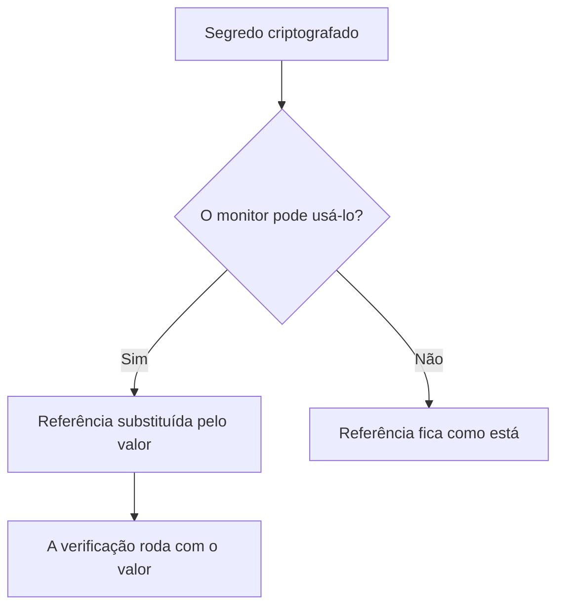

# Segredos do monitor

Os segredos do monitor mantêm fora do próprio monitor as senhas, chaves de API e tokens de que os seus monitores precisam. Você guarda um valor uma vez, criptografado, escolhe quais monitores podem usá-lo e faz referência a ele com `{{monitorSecrets.NAME}}` onde o monitor precisar.

:::cards
- [Adicionar um segredo](#adicionar-um-segredo): Guardar um valor e escolher quem pode usá-lo.
- [Escolher o acesso](#escolher-quais-monitores-podem-usar-um-segredo): Todos os monitores, monitores específicos ou monitores com rótulos.
- [Usar um segredo](#usar-um-segredo): Onde `{{monitorSecrets.NAME}}` funciona.
:::

## Como os segredos chegam a um monitor

Um segredo é guardado criptografado e nunca mais é mostrado depois de salvo. Antes de entregar um monitor a uma sonda, o OneUptime substitui cada referência que o monitor pode usar pelo valor descriptografado; uma referência que o monitor não pode usar fica como está escrita.

A sonda que executa a verificação recebe o valor, então um monitor que usa um segredo deve rodar em sondas em que você confia: as do OneUptime, ou uma [sonda personalizada](/docs/probe/custom-probe) que você mesmo opera.

## Antes de começar

- **O plano Growth ou superior**, no OneUptime Cloud. Instalações auto-hospedadas não têm planos.
- **Uma função que possa gerenciar segredos**: Project Owner, Project Admin, ou uma função personalizada com a permissão Create Monitor Secret.

## Trabalhar com segredos

### Adicionar um segredo

:::steps
1. Vá em **Monitores → Configurações → Segredos** e clique em **Criar: Monitor Segredo**.
2. Digite um **Nome** e o **Valor do segredo**. O nome é o que você referencia, por exemplo `ApiKey`. Ele só pode conter letras, números, hifens (`-`) e sublinhados (`_`), e dois segredos de um mesmo projeto não podem ter o mesmo.
3. No passo **Acesso**, escolha quais monitores podem usá-lo (veja a próxima seção) e clique em **Criar: Monitor Segredo**.
:::

> [!IMPORTANT]
> Os segredos são criptografados e guardados com segurança. O valor do segredo nunca mais é mostrado depois de salvo — nem na tabela, nem no formulário de edição, nem pela API. Se você perder o valor, precisará obtê-lo de onde ele veio e defini-lo de novo. Para rotacionar um segredo, use o botão **Atualizar Valor do Segredo** na linha dele; você não precisa excluí-lo e criá-lo de novo.

### Escolher quais monitores podem usar um segredo

Cada segredo tem uma de três opções de acesso:

| Opção | Quais monitores podem usar o segredo | Use para |
| --- | --- | --- |
| **Todos os monitores** | Todos os monitores do projeto, incluindo os que você criar depois. | Uma credencial que muitos monitores compartilham. |
| **Monitores específicos** | Só os monitores que você escolher. É o padrão, e os segredos criados antes de existirem estas opções funcionam assim. | Uma credencial para um ou poucos monitores. |
| **Monitores com rótulos** | Os monitores que têm pelo menos um dos rótulos que você escolher. Adicionar um desses rótulos a um monitor dá acesso a ele, e remover o rótulo tira o acesso na próxima vez que o monitor rodar. | Uma credencial para um grupo de monitores que muda com o tempo. |

Você pode mudar a opção a qualquer momento com **Editar** na linha do segredo. Só a lista da opção escolhida é mantida: mudar para **Todos os monitores** esvazia as listas de monitores e de rótulos do segredo, e mudar entre **Monitores específicos** e **Monitores com rótulos** esvazia a lista que você deixou.

Um segredo nunca fica disponível para monitores de outro projeto.

> [!WARNING]
> Qualquer pessoa que possa editar um monitor capaz de usar um segredo pode enviar esse segredo para qualquer lugar ao qual o monitor se conecte. Com **Todos os monitores**, é qualquer pessoa que possa criar ou editar monitores no projeto. Com **Monitores com rótulos**, inclui também qualquer pessoa que possa adicionar um desses rótulos a um monitor.

Na API, a opção de acesso é o campo `monitorAccess`: `All Monitors`, `Specific Monitors` ou `Monitors With Labels`. Os campos `monitors` e `labels` guardam as listas. Um segredo criado sem `monitorAccess` recebe `Specific Monitors`.

### Usar um segredo

Para usar um segredo, escreva `{{monitorSecrets.SECRET_NAME}}` num campo que aceite segredos. Por exemplo, um cabeçalho de requisição `Authorization: Bearer {{monitorSecrets.ApiKey}}` envia o valor do segredo `ApiKey`.

Estes tipos de monitor e campos aceitam segredos:

| Tipo de monitor | Campos |
| --- | --- |
| API | A URL, os cabeçalhos e o corpo da requisição, e o certificado do cliente, a chave privada e a frase secreta (mTLS) |
| Site | A URL, e o certificado do cliente, a chave privada e a frase secreta (mTLS) |
| Ping, IP, Porta, NTP, SSL Certificate | O host ou a URL a verificar |
| DNS | O nome de domínio e o servidor DNS |
| DNSSEC, Domínio | O nome de domínio |
| SQL Query | O host, o nome do banco de dados, o usuário, a senha e a consulta |
| Database Health | O host, o nome do banco de dados, o usuário e a senha |
| External Status Page | A URL da página de status |
| Synthetic Monitor, Custom JavaScript Code | O script |
| Network Device | A community string SNMP, e as chaves de autenticação e de privacidade do SNMPv3 |

Os segredos são preenchidos antes de o script de um monitor Synthetic Monitor ou Custom JavaScript Code rodar, então uma referência como `{{monitorSecrets.ApiKey}}` dentro do script é o valor descriptografado quando ele roda.

Se um monitor faz referência a um segredo que não pode usar, a referência fica como está e não é substituída pelo valor.

Quando você testa um monitor antes de salvá-lo, só os segredos disponíveis para **Todos os monitores** são preenchidos, porque um monitor novo não está em nenhuma lista e ainda não tem rótulos. Depois que você salva o monitor, os testes usam todos os segredos que o monitor pode usar.

## Solução de problemas

:::details O monitor envia `{{monitorSecrets.NAME}}` literalmente
O monitor não pode usar o segredo, ou o nome não confere. Confira a opção de acesso do segredo com **Editar** na linha dele, e se o nome na referência é exatamente o nome do segredo.
:::

:::details Testar um monitor novo não preenche o segredo
Antes de um monitor ser salvo, só os segredos disponíveis para **Todos os monitores** são preenchidos. Salve o monitor e teste-o de novo.
:::

:::details Um campo ignora o segredo
Só os campos da tabela acima aceitam segredos. Em qualquer outro campo, `{{monitorSecrets.NAME}}` é enviado como está escrito.
:::

## Próximos passos

:::cards
- [Monitor de API](/docs/monitor/api-monitor): Enviar um segredo num cabeçalho de requisição.
- [Monitor sintético](/docs/monitor/synthetic-monitor): Usar um segredo dentro de um script de navegador.
- [Monitor de consultas SQL](/docs/monitor/sql-monitor): Manter criptografada a senha de um banco de dados.
:::
