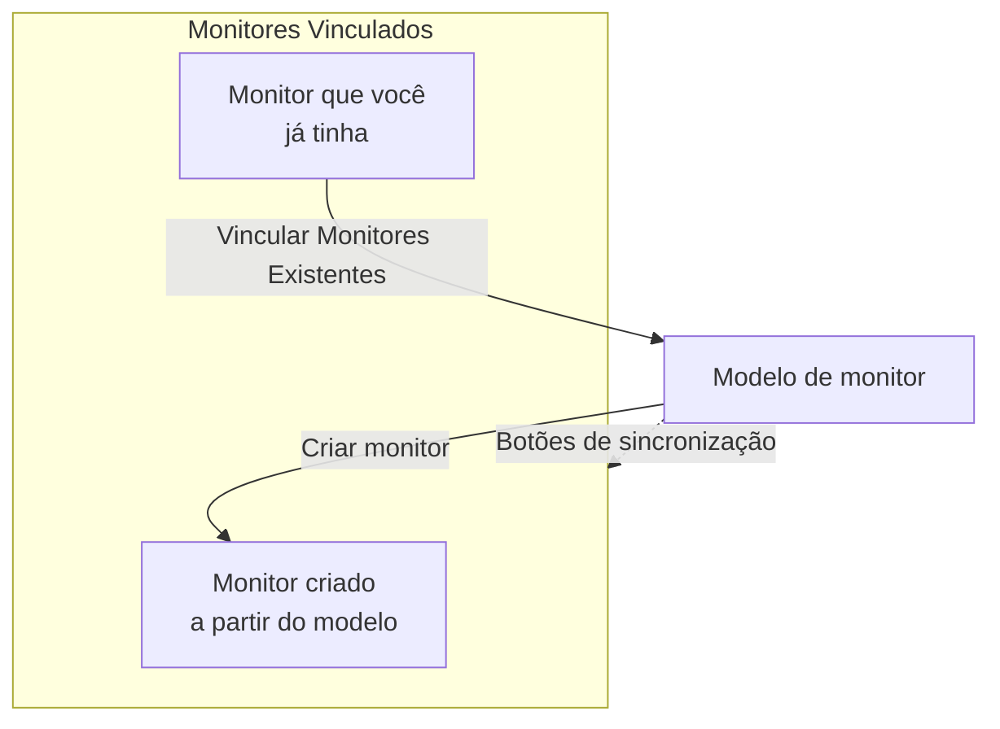

# Modelos de monitor

Um modelo de monitor é uma configuração de monitor salva (um tipo, critérios, um intervalo, rótulos e padrões de campos personalizados) a partir da qual você cria monitores com um clique. Os monitores criados a partir dele, ou vinculados a ele, continuam conectados: altere o modelo e depois sincronize a alteração com todos. Use modelos quando muitos monitores devem se comportar da mesma forma, como a mesma verificação de saúde em cada serviço, ou as mesmas verificações de API em produção e em staging.

:::cards
- [Criar um modelo](#criar-um-modelo): Quatro etapas, como em Criar monitor.
- [Criar monitores a partir dele](#criar-monitores-a-partir-de-um-modelo): Um clique, ou vincule monitores que você já tem.
- [Sincronizar alterações](#sincronizar-alterações-com-os-monitores-vinculados): O que cada botão de sincronização copia.
- [Manter valores próprios de cada monitor](#manter-valores-próprios-de-cada-monitor): Proteger um destino ou cabeçalhos de uma sincronização.
:::

## Como os modelos funcionam

Um modelo não vigia nada sozinho. Monitores são criados a partir dele, ou vinculados a ele, e a página do modelo os lista como **Monitores Vinculados**. Quando você altera o modelo, nada muda nesses monitores até você sincronizar: cada botão de sincronização copia uma parte do modelo para cada monitor vinculado, e os campos que você protege mantêm o valor próprio de cada monitor.



## Antes de começar

- **Uma função que possa criar modelos**: Project Owner, Project Admin, Project Member, Monitor Admin ou Monitor Member, ou uma função personalizada com a permissão Create Monitor Template. Alterar um modelo exige as mesmas funções, ou a permissão Edit Monitor Template.
- **Permissão para atualizar os monitores vinculados.** Uma sincronização grava em cada monitor vinculado em seu nome, e ignora os monitores que as suas permissões não cobrem.

## Criar um modelo

:::steps
### Abrir Modelos

Acesse **Monitores → Configurações → Modelos** e clique em **Criar: Monitor Modelo**.

### Dar um nome ao modelo

Em **Informações do modelo**, informe um **Nome do modelo**, como `Production API Health`, e uma **Descrição do modelo**, e então clique em **Próximo**.

### Definir os padrões do monitor

Em **Padrões do Monitor**, escolha o **Tipo de monitor**, com o mesmo seletor de Criar monitor. Opcionalmente, informe um **Nome Padrão do Monitor**; se ficar em branco, cada monitor recebe o nome do recurso que vigia. **Descrição Padrão do Monitor** e **Rótulos** ficam em **Mais campos**. Clique em **Próximo**.

### Definir os critérios e o intervalo

Em **Critérios**, preencha o que verificar e os critérios, como em [Criar monitor](/docs/monitor/create-monitor#critérios). O cartão **Template sync settings** no topo permite proteger campos das sincronizações (veja [Manter valores próprios de cada monitor](#manter-valores-próprios-de-cada-monitor)). Para um tipo de monitor que as sondas verificam, a última etapa, **Intervalo**, pede o **Intervalo de monitoramento**. Clique em **Criar: Monitor Modelo** na última etapa.
:::

O modelo é adicionado à lista. Abra-o para ver a página dele, com um cartão para cada parte: **Informações do modelo**, **Padrões do Monitor**, **Critérios de Monitoramento**, **Intervalo de monitoramento** (com **Concordância Mínima de Sondas**), **Rótulos**, **Custom Field Defaults** (quando o projeto tem campos personalizados de monitor) e **Monitores Vinculados**. Você altera cada parte no próprio cartão, por exemplo com **Editar: Critérios** ou **Editar: Intervalo**.

## Criar monitores a partir de um modelo

- **Monitor novo.** Clique em **Criar monitor** na linha do modelo na lista, ou em **Criar Monitor a partir de Modelo** na página dele. **Criar monitor** abre com o tipo e as configurações do modelo preenchidos; altere o que precisar e crie. O monitor novo fica vinculado ao modelo.
- **Monitores que você já tem.** Em **Monitores Vinculados**, clique em **Vincular Monitores Existentes** e escolha-os. Eles mantêm as configurações até você sincronizar.

Os valores definidos em **Custom Field Defaults** são gravados em cada monitor criado a partir do modelo, inclusive nos monitores que as regras de importação automática e as políticas de alerta criam a partir dele.

## Sincronizar alterações com os monitores vinculados

Editar um modelo altera apenas o modelo. Para copiar uma alteração para os monitores vinculados, use o botão de sincronização do cartão que você alterou. Cada botão mostra quantos monitores alcança, como **Sync Criteria to 3 Linked Monitors**, e fica esmaecido enquanto nada estiver vinculado. Uma sincronização não pode ser desfeita.

| Botão | Copia para cada monitor vinculado | Deixa como está |
| --- | --- | --- |
| **Sincronizar Critérios com Monitores Vinculados** | Os critérios e as configurações da etapa, como destinos e opções de requisição, exceto os campos protegidos | O intervalo de monitoramento, a concordância mínima de sondas, o nome, a descrição, os rótulos e os valores dos campos personalizados |
| **Intervalo de Sincronização com Monitores Vinculados** | O intervalo de monitoramento e a concordância mínima de sondas | Os critérios, o nome, a descrição, os rótulos e os valores dos campos personalizados |
| **Sincronizar Rótulos com Monitores Vinculados** | Os rótulos, e nada mais | Todo o resto |
| **Sync Custom Fields to Linked Monitors** | Os campos personalizados para os quais o modelo tem um padrão, substituindo o que cada monitor tinha | Os campos personalizados que o modelo deixa em branco, e todo o resto |

Para sincronizar um único monitor, clique em **Sincronizar a partir do Modelo** na linha dele em **Monitores Vinculados**. Isso copia os critérios e as configurações da etapa (exceto os campos protegidos), o intervalo de monitoramento, a concordância mínima de sondas e os rótulos, e deixa como estão o nome, a descrição e os valores dos campos personalizados do monitor. **Desvincular do Modelo** desconecta um monitor; ele mantém as configurações.

Depois de uma sincronização, um resumo informa quantos monitores foram atualizados. **Sincronizado parcialmente** significa que alguns monitores vinculados ainda têm a configuração anterior, geralmente porque as suas permissões não os cobrem.

## Manter valores próprios de cada monitor

Uma sincronização de critérios também copia configurações da etapa, como destinos, cabeçalhos de requisição e tempos limite, a menos que você proteja esses campos. Proteja um campo para que cada monitor vinculado mantenha o próprio valor.

:::steps
### Abrir o modelo

Acesse **Monitores → Configurações → Modelos** e abra o modelo.

### Editar os critérios dele

No cartão **Critérios de Monitoramento**, clique em **Editar: Critérios**.

### Proteger os campos

Em **Template sync settings**, marque **Do not sync this field** ao lado de cada campo que você quer manter nos monitores vinculados.

### Salvar

Salve as alterações. O cartão **Critérios de Monitoramento**, e a confirmação de cada sincronização, listam os campos protegidos.

### Sincronizar

Use **Sincronizar Critérios com Monitores Vinculados**, ou **Sincronizar a partir do Modelo** em um monitor vinculado específico.
:::

Por exemplo, proteja **Monitor destination** e **Request headers** em um modelo de API. Os monitores de produção e de staging mantêm as próprias URLs e cabeçalhos, enquanto ambos recebem os critérios atualizados do modelo e as demais configurações não protegidas.

As opções disponíveis dependem do tipo de monitor. Elas incluem destinos e portas, opções de requisição HTTP, conexões de banco de dados, configurações de DNS, seletores de infraestrutura e consultas de telemetria. Credenciais relacionadas, como um certificado de cliente e a sua chave privada, são mantidas juntas.

### Como as exclusões se comportam

- Os campos marcados mantêm o valor atual de cada monitor existente, inclusive um valor vazio ou não definido. Cabeçalhos de requisição e outras coleções são preservados por inteiro.
- Os campos desmarcados continuam sendo sincronizados a partir do modelo. Desmarque um campo protegido e salve para copiar o valor do modelo na próxima sincronização.
- As exclusões valem para sincronizações em massa e individuais. Elas são salvas no modelo, não escolhidas separadamente a cada sincronização.
- Monitores novos continuam começando com os valores de campo do modelo. As exclusões afetam apenas a sincronização de monitores existentes.
- Os critérios sempre são sincronizados. Uma sincronização só de critérios deixa como estão o intervalo de monitoramento, os rótulos e outras configurações no nível do monitor.
- Modelos existentes não têm exclusões de campo até você configurá-las. Monitores de dispositivo de rede continuam mantendo automaticamente a própria vinculação ao dispositivo.

Em modelos com várias etapas, os valores protegidos são associados pelos IDs das etapas. Monitores de etapa única criados de forma independente também podem receber um modelo de etapa única. Se uma etapa protegida não puder ser associada, a sincronização é rejeitada antes de qualquer monitor ser atualizado, para que uma etapa nova ou reordenada não copie por engano o destino ou as credenciais de outra etapa.

> [!IMPORTANT]
> Antes de alterar o tipo de monitor de um modelo salvo (com **Editar: Padrões do Monitor**), remova em **Editar: Critérios** as exclusões que não se aplicam ao novo tipo. Todas as exclusões de um modelo precisam existir para o tipo de monitor dele.

## Configuração por API

Cada etapa de modelo aceita um array `doNotSyncFields` no seu objeto `MonitorStep.value`. Para um monitor de API, proteja o destino e toda a coleção de cabeçalhos com:

```json title="monitorSteps (excerpt)"
{
  "_type": "MonitorSteps",
  "value": {
    "monitorStepsInstanceArray": [
      {
        "_type": "MonitorStep",
        "value": {
          "id": "<step id>",
          "doNotSyncFields": ["monitorDestination", "requestHeaders"]
        }
      }
    ]
  }
}
```

Omita o array ou defina-o como `[]` para sincronizar todas as configurações de etapa compatíveis. Nomes de campo incompatíveis e campos que não se aplicam ao tipo de monitor do modelo são rejeitados. O array do modelo controla a sincronização; metadados desse tipo em um monitor vinculado não o substituem.

:::details Nomes de campo para doNotSyncFields, por tipo de monitor
| Tipo de monitor | Nomes de campo |
| --- | --- |
| Site, API, Ping, IP, Porta, SSL Certificate, NTP | `monitorDestination`, `requestTimeoutInMs`, `retryCount` |
| Somente API | `requestHeaders`, `requestType`, `requestBody` |
| Site e API | `doNotFollowRedirects`, `allowSelfSignedCertificates`, `tlsClientAuthentication` (o certificado de cliente, a chave e a senha juntos) |
| Porta, NTP | `monitorDestinationPort` |
| Synthetic Monitor, Custom JavaScript Code | `customCode` |
| Synthetic Monitor | `browserTypes`, `screenSizeTypes`, `retryCountOnError` |
| DNS | `dnsMonitor.queryName`, `dnsMonitor.recordType`, `dnsMonitor.resolver` (o servidor DNS e a porta juntos), `dnsMonitor.timeout`, `dnsMonitor.retries` |
| Domínio | `domainMonitor.domainName`, `domainMonitor.lookupMethod`, `domainMonitor.timeout`, `domainMonitor.retries` |
| DNSSEC | `dnssecMonitor.domainName`, `dnssecMonitor.resolvers`, `dnssecMonitor.checkNameserverConsistency`, `dnssecMonitor.signatureExpiryWarningDays`, `dnssecMonitor.timeout`, `dnssecMonitor.retries` |
| SQL Query | `sqlMonitor.connection`, `sqlMonitor.connectionTimeoutInMs`, `sqlMonitor.statementTimeoutInMs`, `sqlMonitor.query`, `sqlMonitor.maxRows` |
| Database Health | `databaseMonitor.connection`, `databaseMonitor.connectionTimeoutInMs`, `databaseMonitor.statementTimeoutInMs`, `databaseMonitor.enabledMetricGroups` |
| External Status Page | `externalStatusPageMonitor.statusPageUrl`, `externalStatusPageMonitor.provider`, `externalStatusPageMonitor.components`, `externalStatusPageMonitor.timeout`, `externalStatusPageMonitor.retries` |
| Registros, Security Events, Traços, IA / LLM, Métricas, Exceções | `logMonitor`, `securityEventsMonitor`, `traceMonitor`, `llmMonitor`, `metricMonitor`, `exceptionMonitor` (toda a configuração do monitor) |

Os monitores de infraestrutura (Kubernetes, Docker, Host, Podman, Proxmox, Docker Swarm, Ceph, Array de armazenamento, IoT Device) oferecem o seu seletor de recursos, filtros, consultas de métricas e janela de tempo da consulta. Os nomes deles aparecem em **Template sync settings** em um modelo desse tipo.
:::

## Solução de problemas

:::details Uma sincronização diz "Sincronizado parcialmente"
Alguns monitores vinculados não foram atualizados, geralmente porque as suas permissões não os cobrem. Peça a alguém que possa atualizar todos os monitores vinculados que execute a sincronização de novo.
:::

:::details Uma sincronização falha com "a template step cannot be matched to an existing monitor step"
Um campo protegido não pôde ser associado a uma etapa de um dos monitores, então a sincronização parou antes de alterar qualquer um deles. Dê às etapas do modelo os mesmos IDs das etapas dos monitores, ou use um modelo de etapa única com monitores de etapa única.
:::

:::details Os botões de sincronização estão esmaecidos
Nenhum monitor está vinculado ao modelo ainda. Crie um monitor a partir dele, ou clique em **Vincular Monitores Existentes** em **Monitores Vinculados**.
:::

:::details Salvar falha com "Unsupported do not sync field"
Um nome em `doNotSyncFields` não é um campo do tipo de monitor do modelo. Confira-o com os nomes de campo acima.
:::

## Próximos passos

:::cards
- [Criar um monitor](/docs/monitor/create-monitor): O formulário que um modelo preenche.
- [Monitor de API](/docs/monitor/api-monitor): As configurações que um modelo de API leva.
- [Segredos do monitor](/docs/monitor/monitor-secrets): Compartilhar credenciais entre monitores sem copiá-las.
- [Etapas de monitor no Terraform](/docs/terraform/monitor-steps): Gerenciar monitores e as suas etapas como código.
:::
