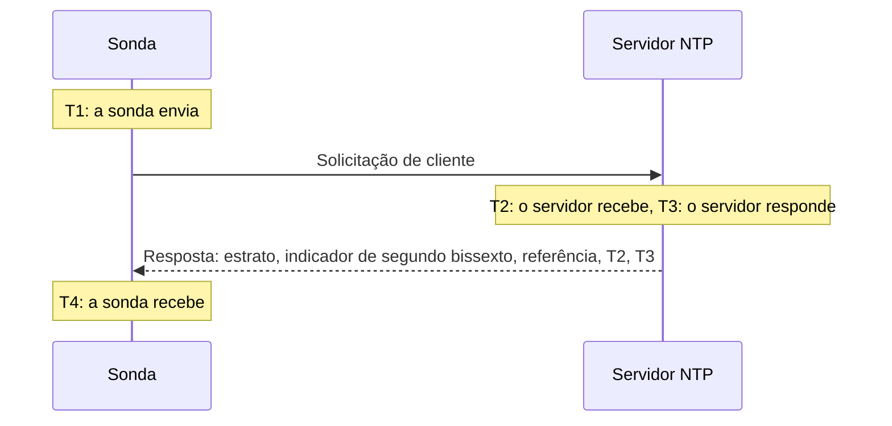

# Monitor de NTP

Um monitor NTP verifica se um servidor de hora responde na porta UDP 123 e fornece uma hora confiável: se está sincronizado, em um estrato razoável, e se o seu relógio concorda com o da sonda. Use-o para os servidores de hora que você administra, como um relógio GPS no data center ou os servidores internos com os quais suas máquinas se sincronizam, e para os servidores públicos dos quais você depende.

:::cards
- [Criar o monitor](#criar-um-monitor-ntp): Seis passos no painel.
- [O que a verificação lê](#o-que-a-verificação-lê): Estrato, desvio do relógio, indicador de segundo bissexto e o restante da resposta.
- [Critérios de monitoramento](#critérios-de-monitoramento): Disponibilidade, sincronização, estrato e desvio.
- [Solução de problemas](#solução-de-problemas): Quando o servidor está no ar, mas o monitor diz o contrário.
:::

## Como funciona

A cada verificação, uma sonda envia uma solicitação de cliente SNTP (NTP versão 4, modo cliente) de uma porta local aleatória para a porta UDP do servidor e aguarda a resposta. Só conta uma resposta real a essa solicitação: a sonda coloca 64 bits aleatórios no carimbo de tempo de transmissão da solicitação e ignora qualquer pacote que não os devolva, que seja menor que um pacote NTP ou que não esteja no modo servidor. Uma resposta antiga a uma verificação anterior, ou uma falsificada, nunca pode fazer um servidor fora do ar parecer ativo.

A partir dos quatro carimbos de tempo, a sonda calcula o **desvio do relógio**, ((T2 − T1) + (T3 − T4)) / 2: o quanto o relógio do servidor está distante do relógio da sonda. Um desvio positivo significa que o servidor está adiantado. A fórmula supõe que a solicitação e a resposta levam o mesmo tempo, então um caminho muito mais lento em um sentido pode distorcer o desvio em até metade do tempo de ida e volta.

> [!NOTE]
> O desvio é medido em relação ao próprio relógio da sonda. As sondas do OneUptime Cloud mantêm seus relógios sincronizados. Em uma [sonda personalizada](/docs/probe/custom-probe), mantenha também o relógio do host sincronizado, com chrony ou systemd-timesyncd, ou um alerta de desvio pode ser sobre a sonda e não sobre o servidor.

Um servidor que responde não é consultado de novo, mesmo quando responde sem uma hora confiável. Silêncio, uma porta recusada e uma consulta DNS com falha são repetidos com uma nova solicitação. Quando o servidor não responde de forma alguma, a sonda também traça a rota até ele e anexa o que encontrou como **Network Path at Time of Failure**. Uma sonda que perdeu a própria conexão de rede não informa nenhum resultado, então não pode marcar o seu servidor como offline.

## Antes de começar

- **Uma função que possa criar monitores**: Project Owner, Project Admin, Project Member, Monitor Admin ou Monitor Member, ou uma função personalizada com a permissão Create Monitor.
- **Uma sonda que alcance a porta UDP 123 do servidor.** Qualquer sonda pode verificar um servidor de hora público. Para um servidor em uma rede privada, use uma [sonda personalizada](/docs/probe/custom-probe) dentro dessa rede. Um firewall na frente do servidor precisa deixar passar UDP, não apenas TCP, a partir dos [endereços IP das sondas do OneUptime Cloud](/docs/configuration/ip-addresses) ou da sua sonda personalizada.

## Criar um monitor NTP

:::steps
### Começar um novo monitor

Acesse **Monitores** e clique em **Criar monitor**. Em **Tipo de monitor**, digite `ntp` na caixa de pesquisa e escolha **NTP**. Ele também aparece em **Mais tipos de monitor**, no grupo Rede.

### Dar um nome

Informe um **Nome**, como `Servidor de hora GPS`, e clique em **Próximo**.

### Informar o servidor

Em **Servidor NTP**, informe o nome do host ou o endereço IP do servidor, como `time.example.com` ou `192.168.1.10`. A solicitação vai para a porta 123. Para usar outra porta, abra **Mais campos** e defina a **Porta**.

### Testar

Clique em **Testar monitor**, escolha uma sonda em **Selecionar Sonda** e clique em **Executar teste**. **Resultado do Teste do Monitor** mostra se o servidor respondeu, se está sincronizado, o seu estrato e o quanto o seu relógio está desviado.

### Revisar os critérios

**Critérios do monitor** começa com os [critérios padrão](#critérios-padrão): offline quando o servidor não fornece uma hora confiável, online quando fornece. Altere-os se precisar e clique em **Próximo**.

### Escolher as sondas e criar

Mantenha ou altere as **Sondas** e o **Intervalo de monitoramento** (começa em **A cada 5 minutos**) e clique em **Criar monitor**. A página do monitor é aberta.
:::

## Opções de configuração

| Campo | Padrão | O que informar |
| --- | --- | --- |
| **Servidor NTP** | Nenhum | O servidor, como `time.example.com`, `192.168.1.10` ou `2001:db8::123`. Informe apenas o host, sem `udp://`. Uma porta escrita depois do host, como `time.example.com:1123`, é usada no lugar de **Porta**. |
| **Porta** (em **Mais campos**) | `123` | A porta UDP em que o servidor responde NTP, de `1` a `65535`. Deixe em branco para `123`. |
| **Tempo Limite da Requisição (segundos)** (em **Mais campos**) | `5` | Quanto tempo uma tentativa espera pela resposta, incluindo a consulta DNS. O máximo é de 60 segundos. |
| **Tentativas em caso de falha** (em **Mais campos**) | Padrão da sonda, geralmente `3` | Quantas vezes repetir uma tentativa que não obteve resposta. O máximo é 3. |

**Tentativas em caso de falha** conta as repetições _depois_ da primeira tentativa: `0` executa a verificação uma vez e `2` até três vezes, com uma pausa de um segundo entre as tentativas. Em branco, usa o padrão da sonda: 3, a menos que o `PROBE_MONITOR_RETRY_LIMIT` da sonda diga outra coisa.

## O que a verificação lê

A página do monitor mostra a verificação mais recente de cada sonda:

| Campo | O que significa |
| --- | --- |
| **Sincronizado** | Se o servidor respondeu com estrato de 1 a 15, sem o alarme no seu indicador de segundo bissexto e com carimbos de tempo reais na resposta. |
| **Desvio do relógio** | O quanto o relógio do servidor está distante do relógio da sonda, e em qual sentido. Um servidor saudável fica a poucos milissegundos. |
| **Estrato** | A quantos saltos o servidor está de um relógio de referência: 1 para um servidor com a própria fonte GPS ou atômica, 2 para um que se sincroniza com um servidor de estrato 1, e assim por diante. 16 significa não sincronizado. |
| **Referência** | Com o que o servidor se sincroniza: um nome de fonte como `GPS`, `PPS` ou `NIST` no estrato 1, o endereço do servidor superior a partir do estrato 2. |
| **Indicador de segundo bissexto** | 0 quando não há segundo bissexto pendente, 1 ou 2 quando um será adicionado ou removido no fim do dia, 3 quando o servidor informa que o seu relógio não está sincronizado. |
| **Dispersão raiz** | A estimativa do próprio servidor de quanto a sua hora pode estar distante da hora real. Ela cresce enquanto o servidor não consegue alcançar a sua fonte. O ntpd deixa de confiar em um servidor quando metade do seu atraso raiz mais este valor passa de 1,5 segundo. |
| **Atraso raiz** | A ida e volta do servidor até o seu relógio de referência. |
| **Tempo de resposta** | Do envio da solicitação pela sonda até o recebimento da resposta, sem a consulta DNS. |
| **Hora do servidor** | O relógio do servidor quando ele enviou a resposta. |

Um servidor que se recusa a informar a hora envia, em vez disso, um **kiss-o'-death**: uma resposta no estrato 0 com um código de quatro letras. Os códigos mais comuns são `RATE` (o servidor limita a frequência da sonda), `DENY` e `RSTR` (as regras de acesso dele recusam a sonda) e `INIT` (ele ainda não se sincronizou). A verificação mostra o código e conta o servidor como respondendo, mas não sincronizado.

## Critérios de monitoramento

Os critérios decidem quando o servidor conta como online, degradado ou offline, e se isso declara um incidente ou cria um alerta. Cada critério verifica um ou mais filtros:

| Filtro | Condições | O que verifica |
| --- | --- | --- |
| **NTP Is Online** | **Verdadeiro**, **Falso** | Se o servidor respondeu à solicitação da sonda com uma resposta NTP. Um kiss-o'-death é uma resposta. |
| **NTP Is Synchronized** | **Verdadeiro**, **Falso** | Se o servidor que respondeu fornece uma hora sincronizada. Quando o servidor não responde, este filtro não é verificado; use **NTP Is Online** para isso. |
| **NTP Stratum** | **Greater Than**, **Greater Than Or Equal To**, **Less Than**, **Less Than Or Equal To**, **Equal To**, **Not Equal To** | O estrato do servidor. O 0 de um kiss-o'-death conta como 16, não sincronizado. |
| **NTP Clock Offset (in ms)** | **Greater Than**, **Less Than**, **Greater Than Or Equal To**, **Less Than Or Equal To** | O quanto o relógio do servidor está distante do relógio da sonda, em qualquer sentido. |
| **NTP Response Time (in ms)** | **Greater Than**, **Less Than**, **Greater Than Or Equal To**, **Less Than Or Equal To** | Da solicitação até a resposta. |
| **NTP Root Dispersion (in ms)** | **Greater Than**, **Less Than**, **Greater Than Or Equal To**, **Less Than Or Equal To** | A estimativa do próprio servidor do seu erro máximo. |

Com dois ou mais filtros, **Condição de correspondência** decide se **Todos** eles precisam corresponder ou se basta **Qualquer** um. As **Ações** de um critério decidem o que ele faz: alterar o status do monitor, criar um alerta, declarar um incidente ou qualquer combinação deles.

### Critérios padrão

Um novo monitor NTP começa com dois critérios:

- **Offline** — o servidor não responde, não está sincronizado ou o seu relógio está a `1000` ms ou mais do relógio da sonda. O monitor é marcado como **Offline** e é criado um incidente chamado "_nome do monitor_ is not serving good time". Ele se resolve sozinho quando o servidor volta a fornecer uma hora confiável.
- **Online** — o servidor responde, está sincronizado e o seu relógio está a menos de `1000` ms do relógio da sonda. O monitor é marcado como **Operacional**.

Os critérios são verificados de cima para baixo, e o primeiro que corresponder decide o que acontece. Um servidor que responde com a hora errada é tratado de propósito como fora do ar: todo cliente que o segue também pegaria essa hora.

### Avaliar durante um período de tempo

**Avaliar este critério durante um período de tempo** é uma caixa de seleção abaixo de cada filtro NTP. Ative-a para julgar uma janela de verificações passadas em vez da mais recente: escolha uma agregação em **Avaliar** e uma janela, de 2 a 60 minutos, em **Nos últimos (em minutos)**. Só as verificações que o servidor respondeu têm estrato, desvio e dispersão raiz, então uma janela de silêncio não tem dados para esses filtros, e **Se não houver dados** decide o que acontece.

### Critérios de exemplo

| Objetivo | Filtro | Condição | Valor |
| --- | --- | --- | --- |
| Alertar quando um servidor GPS passa a usar uma fonte de rede | **NTP Stratum** | **Greater Than** | `1` |
| Alertar quando o relógio desvia | **NTP Clock Offset (in ms)** | **Greater Than** | `100` |
| Alertar quando a margem de erro do servidor cresce | **NTP Root Dispersion (in ms)** | **Greater Than** | `500` |
| Alertar quando as respostas ficam lentas | **NTP Response Time (in ms)** | **Greater Than** | `1000` |

## Solução de problemas

:::details O servidor está no ar, mas o monitor diz que ele não respondeu
A solicitação ou a resposta se perdeu no caminho. Um firewall que permite TCP mas não UDP, uma regra `restrict` do ntpd ou `allow` do chrony que deixa de fora o endereço da sonda, ou um servidor que só escuta em uma interface interna, todos se parecem com isso. **Network Path at Time of Failure** mostra até onde a rota chegou. Libere a sonda ou verifique o servidor a partir de uma [sonda personalizada](/docs/probe/custom-probe) dentro da rede.
:::

:::details O monitor diz que o servidor recusou a solicitação
O host respondeu que nada escuta naquela porta UDP (ICMP port unreachable): o serviço NTP está parado ou escuta em outra porta. Inicie o serviço ou defina em **Porta** a que ele usa.
:::

:::details O servidor responde com um kiss-o'-death
`RATE` significa que o servidor limita a frequência da sonda. A sonda pergunta uma vez por verificação, então um **Intervalo de monitoramento** mais longo, ou isentar os endereços da sonda do limite do servidor, resolve. `DENY` e `RSTR` significam que as regras de acesso do servidor recusam a sonda. `INIT` e `STEP` significam que o servidor ainda não se sincronizou, o que é normal por alguns minutos depois que ele inicia.
:::

:::details Todos os monitores NTP de uma sonda mostram um desvio parecido
O relógio desviado é o da sonda, não o dos servidores. Verifique se o host da sonda mantém o relógio sincronizado ou execute os monitores em outra sonda.
:::

:::details O desvio oscila entre as verificações
A sonda está longe do servidor ou o caminho é mais lento em um sentido do que no outro. Use uma sonda mais próxima do servidor ou julgue o desvio ao longo de alguns minutos com **Avaliar este critério durante um período de tempo** e **Média**.
:::

## Próximos passos

:::cards
- [Monitor de ping](/docs/monitor/ping-monitor): Verificar se o próprio host está acessível.
- [Monitor de porta](/docs/monitor/port-monitor): Verificar os serviços TCP no mesmo host.
- [Sondas personalizadas](/docs/probe/custom-probe): Verificar servidores de hora na sua própria rede.
- [Modelos de incidentes e alertas](/docs/monitor/incident-alert-templating): Colocar o estrato e o desvio no título de um incidente.
:::
