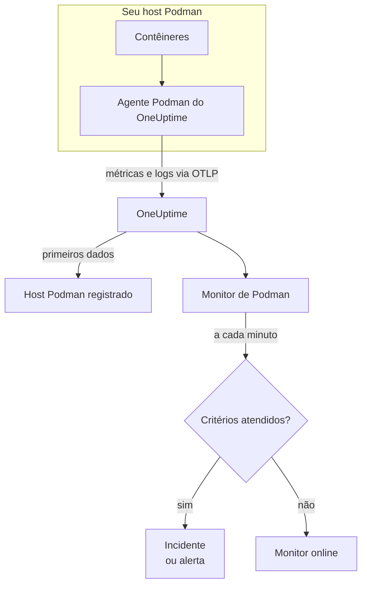

# Monitor de Podman

Um monitor de Podman acompanha os contêineres de um host Podman e avisa você quando um contêiner esquenta demais, fica sem memória ou não para de reiniciar. Ele lê as métricas que o agente Podman do OneUptime envia do host, então nada é sondado de fora: instale o agente e depois crie o monitor a partir de um modelo ou da sua própria consulta.

:::cards
- [Criar o monitor](#criar-um-monitor-de-podman): Seis passos no painel.
- [Modelos](#modelos-de-alerta-prontos): Cinco alertas prontos, um incidente por contêiner.
- [Métricas](#métricas-coletadas): O que o agente coleta e o que cada métrica significa.
- [Logs](#logs-coletados): Os logs dos contêineres e o driver de log de que eles precisam.
:::

## Como funciona

O agente Podman do OneUptime é executado como contêiner no host. A cada 30 segundos, ele lê as estatísticas dos contêineres pelo socket de API compatível com Docker do Podman, acompanha os arquivos de log dos contêineres e envia os dois para o OneUptime via OTLP. Os primeiros dados de um host o registram no OneUptime.

Um monitor de Podman está vinculado a um host. A cada minuto, ele executa sua consulta sobre as métricas dos contêineres desse host e compara o resultado com seus critérios.



## Antes de começar

- **Instale o agente Podman** no host. O [guia do agente Podman](/docs/telemetry/podman-host) cobre a instalação, a atualização e a verificação. O agente precisa do socket de API do Podman em `/run/podman/podman.sock`.
- **Verifique se o host está registrado.** Ele aparece em **Produtos → Infraestrutura → Podman → Todos os hosts**, com o nome do `PODMAN_HOST_NAME` do agente, assim que chegam os primeiros dados.
- **Para os logs dos contêineres**, execute os contêineres com o driver de log `k8s-file`. Consulte [Requisito do driver de log](#requisito-do-driver-de-log).

## Criar um monitor de Podman

:::steps
### Começar um monitor novo

Acesse **Monitores** e clique em **Criar monitor**.

### Escolher Podman Container

Em **Tipo de monitor**, clique em **Mais tipos de monitor** e escolha **Podman Container** em **Infraestrutura**, ou digite `podman` na caixa de busca. Informe um **Nome** – ele é usado nos títulos de incidentes e alertas – e clique em **Próximo**.

### Escolher o host

Em **Podman Monitor Configuration**, escolha o host em **Podman Host**. Todo host que enviou dados está na lista.

### Escolher o que monitorar

Escolha uma das três abas:

- **Quick Setup** – clique em um [modelo](#modelos-de-alerta-prontos). Ele define a métrica, a agregação, o intervalo de tempo e os limites, e substitui os critérios abaixo pelos dele. Você ainda pode mudar o **Intervalo de tempo**.
- **Custom Metric** – escolha uma métrica em **Podman Metric** e depois defina **Agregação** e **Intervalo de tempo**. **Nome do contêiner** e **Imagem do contêiner** a restringem a alguns contêineres.
- **Avançado** – monte você mesmo consultas e fórmulas em **Selecionar Métricas**. Use **Group by** `resource.container.name` para avaliar cada contêiner separadamente.

### Revisar os critérios

Abra cada critério em **Critérios do monitor** e confira sua **Métrica**, **Agregação**, **Condição** e **Threshold**. Um modelo os preenche. Com **Custom Metric** ou **Avançado**, o monitor começa com os [critérios padrão](#critérios-padrão), que só percebem uma métrica caindo para zero, então defina o seu próprio limite.

### Criar o monitor

Clique em **Criar monitor**. O OneUptime abre a página do monitor e o avalia a cada minuto. Os incidentes e alertas que ele gera também aparecem nas páginas **Incidentes** e **Alertas** do host.
:::

> [!TIP]
> Para configurar vários modelos de uma vez, abra o host em **Produtos → Infraestrutura → Podman** e vá para **Recommendations**. Escolha os modelos que quiser, escolha quem é acionado, e o OneUptime cria um monitor por modelo.

## Configurações do monitor

| Campo | Aba | O que faz |
| --- | --- | --- |
| **Podman Host** | Todas | Obrigatório. Restringe cada consulta ao `resource.host.name` do host. O OneUptime também adiciona `resource.container.runtime = podman` a cada consulta. |
| **Podman Metric** | Custom Metric | Uma métrica do catálogo do agente, agrupada em CPU, memória, rede, E/S de bloco e contêiner. |
| **Nome do contêiner** | Custom Metric, Avançado | Opcional. Correspondência exata com `resource.container.name`, por exemplo `my-container`. |
| **Imagem do contêiner** | Custom Metric, Avançado | Opcional. Correspondência exata com `resource.container.image.name`, por exemplo `nginx:latest`. |
| **Agregação** | Custom Metric | Como as amostras são combinadas: **Média**, **Máximo**, **Mínimo**, **Soma** ou **Contagem**. Começa na agregação usual da métrica. |
| **Intervalo de tempo** | Todas | A janela móvel que a consulta lê, de **Past 1 Minute** a **Past 365 Days**. Um monitor novo começa em **Past 1 Minute**; os modelos definem a sua. |
| **Selecionar Métricas** | Avançado | O construtor de consultas: **Métrica**, **Aggregate by**, **Filter by attributes**, **Group by**, além de **Adicionar métrica** e **Adicionar fórmula** para combinar consultas. |

## Modelos de alerta prontos

**Quick Setup** oferece cinco modelos. Cada um monta um monitor completo: uma consulta agrupada por `resource.container.name`, um critério que dispara e outro que se recupera. Cada contêiner é avaliado separadamente e recebe seu próprio incidente e seu próprio alerta. Os limites são pontos de partida que você pode editar.

Um critério só dispara quando a condição vale em todos os minutos da sua janela, e se recupera 10% além do limite para que um valor oscilando na linha não fique mudando de estado.

| Modelo | Gravidade | Monitora | Dispara quando | Recupera quando |
| --- | --- | --- | --- | --- |
| High Container CPU Usage | Warning | `container.cpu.utilization`, Avg por contêiner, últimos 5 minutos | Acima de 80 (% de um núcleo) | Em 72 ou menos |
| High Container Memory Usage | Warning | `container.memory.percent`, Avg por contêiner, últimos 5 minutos | Acima de 85% | Em 76,5% ou menos |
| High Container Restart Count | Crítico | `container.restarts`, Max por contêiner, últimos 5 minutos | Acima de 5 reinícios no total | 4,5 ou menos |
| High Container Process Count | Warning | `container.pids.count`, Max por contêiner, últimos 5 minutos | Acima de 500 | Em 450 ou menos |
| Container Restarted (Low Uptime) | Crítico | `container.uptime`, Min por contêiner, último 1 minuto | Abaixo de 120 segundos | Em 132 segundos ou mais |

**Gravidade** é o rótulo que o seletor mostra. O incidente e o alerta que um modelo cria começam com a gravidade de incidente e de alerta mais alta do seu projeto; altere-as nos critérios.

Os dois modelos de porcentagem usam **Média**: as métricas deles já são porcentagens por contêiner, então a média de um minuto é a leitura sustentada. A contagem de reinícios e a contagem de processos usam **Máximo**, em que uma única amostra acima do limite já é o sinal.

> [!NOTE]
> `container.cpu.utilization` é o número que o `podman stats` imprime: 100% é um núcleo de CPU inteiro, não toda a cota de CPU do contêiner. Um contêiner com vários núcleos marca bem acima de 100 quando está saudável, então aumente o limite para esses.

> [!NOTE]
> `container.restarts` é um total acumulado mantido pelo Podman, não uma contagem de reinícios na janela. Por isso **High Container Restart Count** fica aberto até o contêiner ser recriado, o que zera a contagem.

> [!CAUTION]
> `container.uptime` só existe para contêineres em execução. Um contêiner que para e continua parado não envia dados, então **Container Restarted (Low Uptime)** pega reinícios e novas implantações, não um desligamento permanente. Um contêiner feito para rodar menos de dois minutos fica em estado de alerta durante toda a vida.

Não há modelo de limitação de CPU. As métricas de limitação que o agente coleta só crescem, e um alerta de "limitado alguma vez" dispararia uma vez e nunca se resolveria. As duas continuam sendo coletadas, então você pode mostrá-las em gráficos.

## Métricas coletadas

O agente usa o receptor `docker_stats` do OpenTelemetry apontado para o socket compatível com Docker do Podman, `/run/podman/podman.sock`, a cada 30 segundos. As métricas de cada contêiner trazem sua identidade como atributos de recurso: `resource.container.name`, `resource.container.image.name`, `resource.container.id`, `resource.container.runtime` (`podman`) e `resource.host.name`.

### CPU

| Métrica | Descrição |
| --- | --- |
| `container.cpu.utilization` | Uso de CPU do contêiner, em que 100% é um núcleo de CPU inteiro. |
| `container.cpu.usage.total` | Tempo de CPU usado desde que o contêiner iniciou, em nanossegundos. Um contador de toda a vida útil. |
| `container.cpu.throttling_data.throttled_time` | Nanossegundos em que o contêiner foi limitado pelo seu limite de CPU. Um contador de toda a vida útil. |
| `container.cpu.throttling_data.throttled_periods` | Períodos de limitação desde que o contêiner iniciou. Um contador de toda a vida útil. |

### Memória

| Métrica | Descrição |
| --- | --- |
| `container.memory.usage.total` | Memória em uso, em bytes. |
| `container.memory.usage.limit` | Limite de memória, em bytes. |
| `container.memory.percent` | Uso de memória como porcentagem do limite do contêiner, ou da memória do host quando o contêiner não tem limite. |

### Rede

| Métrica | Descrição |
| --- | --- |
| `container.network.io.usage.rx_bytes` | Bytes recebidos. Um contador de toda a vida útil. |
| `container.network.io.usage.tx_bytes` | Bytes enviados. Um contador de toda a vida útil. |

### E/S de bloco

| Métrica | Descrição |
| --- | --- |
| `container.blockio.io_service_bytes_recursive.read` | Bytes lidos de dispositivos de bloco. |
| `container.blockio.io_service_bytes_recursive.write` | Bytes gravados em dispositivos de bloco. |

### Contêiner

| Métrica | Descrição |
| --- | --- |
| `container.uptime` | Segundos desde que o contêiner iniciou. Só contêineres em execução a informam. |
| `container.restarts` | Quantas vezes o contêiner reiniciou. Um total acumulado. |
| `container.pids.count` | Tarefas no contêiner. O controlador pids do cgroup conta threads além de processos. |

A lista **Podman Metric** também oferece `container.cpu.usage.percpu`, `container.memory.rss`, `container.memory.cache` e os contadores de pacotes de rede. A configuração do agente distribuída não os ativa, então confira a página **Métricas** do host antes de depender deles. `container.cpu.throttling_data.throttled_periods` não está na lista; consulte-a em **Avançado**.

## Critérios de monitoramento

Um critério compara uma das consultas ou fórmulas do monitor com um limite. Os critérios de um monitor de Podman não têm **Tipo de filtro**: cada regra verifica o valor da métrica, com estes campos.

| Campo | O que faz |
| --- | --- |
| **Métrica** | A consulta ou fórmula a verificar, pelo nome da variável. |
| **Agregação** | Como os valores da janela viram uma única resposta: **Média**, **Soma**, **Maximum Value**, **Minimum Value**, **All Values** (todos os valores precisam corresponder) ou **Any Value** (basta um). |
| **Condição** | **Greater Than**, **Less Than**, **Greater Than Or Equal To**, **Less Than Or Equal To** ou **Equal To** – ou uma condição de anomalia: **Anomalously High**, **Anomalously Low** ou **Anomalous**. |
| **Threshold** | O valor com que comparar. Uma lista de unidades fica ao lado quando a métrica tem unidade. Não aparece em condições de anomalia. |
| **Sensibilidade** | Só condições de anomalia. **Baixo** (4σ), **Médio** (3σ, o padrão) ou **Alto** (2σ). |
| **Janela de linha de base** | Só condições de anomalia. 14 dias (o padrão), 28, 60 ou 90 dias de histórico. |
| **Se não houver dados** | Em **Mais campos**. O que acontece quando a janela não tem amostras: **Ignore** (o padrão), **Treat As Zero** ou **Trigger**. |

As condições de anomalia comparam cada valor com a mesma hora da semana na linha de base. Elas ficam em um estado "Learning", e não geram nada, até a janela de linha de base ter histórico suficiente.

Cada critério também diz o que fazer quando corresponde: mudar o status do monitor, criar um alerta ou declarar um incidente. Os critérios são verificados de cima para baixo, e o primeiro que corresponde decide.

### Critérios padrão

Um monitor que você não cria a partir de um modelo começa com dois critérios:

| Ordem | Critério | Corresponde quando | Então |
| --- | --- | --- | --- |
| 1 | Check if _monitor name_ is offline | Qualquer valor da primeira consulta é `0` | Marca o monitor como **Offline** e declara o incidente "_monitor name_ is offline", que se resolve sozinho quando o monitor se recupera. |
| 2 | Check if _monitor name_ is online | Qualquer valor está acima de `0` | Marca o monitor como **Operacional**. |

> [!IMPORTANT]
> O silêncio não corresponde a nenhum dos dois critérios: um host que para de enviar dados deixa o monitor como estava. Para ser avisado quando os dados param, defina **Se não houver dados** como **Trigger** em um critério. O tempo em que o próprio OneUptime não estava recebendo nunca é ausência de dados: uma verificação cuja janela contém esse tempo espera no lugar, como explica [Quando o OneUptime não recebe dados](/docs/monitor/when-oneuptime-is-not-receiving).

## Logs coletados

O agente também acompanha o arquivo `ctr.log` de cada contêiner e envia cada linha como um registro de log do OpenTelemetry com:

| Campo | Valor |
| --- | --- |
| `resource.host.name` | O host, de `PODMAN_HOST_NAME`. |
| `resource.container.id` | O ID completo do contêiner. |
| `resource.container.runtime` | Sempre `podman`. |
| `attributes["log.iostream"]` | `stdout` ou `stderr`. |
| `severityText` / `severityNumber` | Lidos de uma palavra-chave de nível onde houver um nível na linha (`[ERROR]`, `app.INFO:`, `{"level":"warn"}`, `level=error`). Uma linha sem nível recorre ao seu fluxo: `stderr` é `ERROR`, `stdout` é `INFO`. |
| `body` | A linha que o contêiner escreveu. Linhas que começam com espaço ou com um colchete de fechamento, como as linhas de um stack trace, são unidas à linha anterior. |
| `time` | O carimbo de data/hora do Podman para a linha. |

Os logs aparecem na página **Registros** do host e na página de cada contêiner.

### Requisito do driver de log

O agente lê os arquivos que o driver de log `k8s-file` do Podman grava, em `/var/lib/containers/storage/overlay-containers/*/userdata/ctr.log`. O Podman com root usa `journald` por padrão, que grava no journal do systemd, então não há arquivo para ler:

| Driver | O que o agente vê |
| --- | --- |
| `k8s-file` (ou `json-file`, que o Podman trata da mesma forma) | Todas as linhas. |
| `journald` | Nada: os logs ficam no journal do systemd. |
| `none` | Nada: os logs são descartados. |

As métricas não dependem do driver de log: um host cujos contêineres usam `journald` continua informando métricas; só a página **Registros** dele fica vazia.

Verifique o driver de um contêiner e o padrão do Podman:

```bash
podman inspect <container> --format '{{.HostConfig.LogConfig.Type}}'
podman info --format '{{.Host.LogDriver}}'
```

Mude para `k8s-file`. O Podman define o driver de log de um contêiner quando o contêiner é criado, então recrie cada contêiner depois da mudança – um reinício mantém o driver antigo.

:::tabs
@tab podman run
Inicie o contêiner com o driver:

```bash
podman run --log-driver k8s-file ... <image>
```

Para mudar um contêiner existente, remova-o e execute-o de novo:

```bash
podman rm -f <container>
podman run --log-driver k8s-file ... <image>
```
@tab Podman Compose
Defina o driver em cada serviço:

```yaml title="docker-compose.yml"
services:
  my-app:
    image: my-app:latest
    logging:
      driver: "k8s-file"
      options:
        max-size: "100m"
```

Depois recrie o serviço:

```bash
podman compose up -d --force-recreate <service>
```
@tab containers.conf
Torne `k8s-file` o padrão para todo contêiner criado depois, em `/etc/containers/containers.conf` (com root) ou `~/.config/containers/containers.conf` (sem root):

```toml title="containers.conf"
[containers]
log_driver = "k8s-file"
```

Depois remova e recrie cada contêiner.
:::

## Solução de problemas

:::details O host não aparece na lista Podman Host
Os hosts se registram sozinhos a partir dos dados do agente. Verifique se o contêiner do agente está em execução, se o socket de API do Podman está ativado e se o host aparece em **Produtos → Infraestrutura → Podman → Todos os hosts**. O [guia do agente Podman](/docs/telemetry/podman-host) traz as verificações a executar no host.
:::

:::details As métricas chegam, mas a página Registros está vazia
Quase certamente os contêineres estão usando `journald`. Mude para `k8s-file` os contêineres cujos logs você quer (consulte [Requisito do driver de log](#requisito-do-driver-de-log)) e recrie-os.
:::

:::details O agente registra "no files match the configured criteria"
O agente procura `/var/lib/containers/storage/overlay-containers/*/userdata/ctr.log` e não encontrou nada. Ou nenhum contêiner do host usa `k8s-file`, ou a montagem de `/var/lib/containers/storage` do agente está faltando ou vazia, ou o agente e os contêineres rodam em modos diferentes – contêineres sem root guardam o armazenamento em um lugar que o caminho com root não cobre, e vice-versa.
:::

:::details Os dados chegam com o nome de host errado
O OneUptime identifica um host por `resource.host.name`, que o agente obtém de `PODMAN_HOST_NAME`. Mudar `PODMAN_HOST_NAME` depois dos primeiros dados cria um segundo host em vez de renomear o primeiro, e um monitor continua vinculado ao nome com que foi criado.
:::

:::details Um alerta de CPU nunca dispara
Agrupe a consulta por `resource.container.name`, como faz o modelo **High Container CPU Usage**, para que cada contêiner seja avaliado separadamente. Uma média de todos os contêineres de um host ocupado é puxada para baixo pelos ociosos. Lembre-se de que 100% significa um núcleo inteiro, então um contêiner que pode usar vários núcleos precisa de um limite mais alto.
:::

:::details O alerta de contagem de reinícios nunca se resolve
`container.restarts` é um total acumulado, então não volta sozinho para baixo do limite. Corrija a causa e depois recrie o contêiner para zerar a contagem, ou aumente o limite.
:::

## Próximos passos

:::cards
- [Agente Podman](/docs/telemetry/podman-host): Instalar, atualizar e solucionar problemas do agente que este monitor lê.
- [Monitor de Docker](/docs/monitor/docker-monitor): O mesmo monitor para hosts Docker.
- [Visão geral dos incidentes](/docs/incidents/index): O que acontece depois que um critério declara um incidente.
- [Agendamentos de plantão](/docs/on-call/schedules): Decidir quem é acionado quando um contêiner falha.
:::
