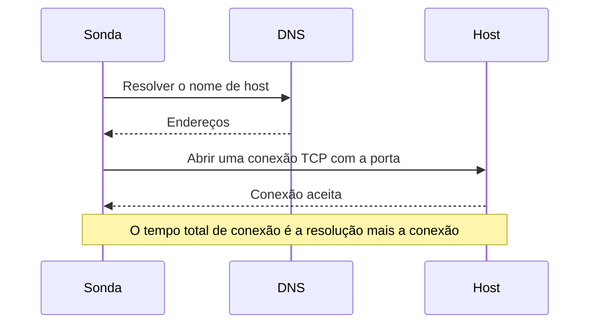

# Monitor de porta

Um monitor de porta verifica se um host aceita conexões TCP em uma porta, e mede quanto tempo a conexão leva. Use-o para serviços que não falam HTTP, ou cujo HTTP você não quer verificar: bancos de dados, servidores de e-mail, SSH, brokers de mensagens e afins.

:::cards
- [Criar o monitor](#criar-um-monitor-de-porta): Seis etapas no painel.
- [Tempos de conexão](#tempos-de-conexão): O que os tempos de DNS, TCP e total medem.
- [Critérios de monitoramento](#critérios-de-monitoramento): Alcançabilidade e tempos de conexão.
- [Solução de problemas](#solução-de-problemas): Quando o serviço está no ar mas o monitor diz que está offline.
:::

## Como funciona

A cada verificação, uma sonda resolve o nome de host, se você informou um, e abre uma conexão TCP com a porta. A porta está online assim que a conexão é aceita; a sonda então a fecha sem enviar nada. Uma conexão recusada ou que excede o tempo limite é tentada de novo, até o número de novas tentativas que você permitir. Depois, o OneUptime passa o resultado pelos critérios do monitor.

A sonda abre apenas conexões TCP: um serviço que escuta somente em UDP, como um agente SNMP, não pode ser verificado com um monitor de porta.

Quando uma verificação falha, a sonda também rastreia a rota até o host e procura o nome dele, e anexa o que encontrou ao resultado como **Network Path at Time of Failure**, para você ver onde a rota se interrompeu. Uma sonda que perdeu a própria conexão de rede não informa nenhum resultado, então não pode marcar o seu serviço como offline.

## Antes de começar

- **Uma função que possa criar monitores**: Project Owner, Project Admin, Project Member, Monitor Admin ou Monitor Member, ou uma função personalizada com a permissão Create Monitor.
- **Uma sonda que alcance a porta.** As sondas padrão do seu projeto são escolhidas para cada monitor novo. Se um firewall protege o serviço, permita que os [endereços IP das sondas do OneUptime Cloud](/docs/configuration/ip-addresses) se conectem à porta. Um serviço em uma rede privada, como um banco de dados, precisa de uma [sonda personalizada](/docs/probe/custom-probe) dentro dessa rede.

## Criar um monitor de porta

:::steps
### Começar um monitor novo

Acesse **Monitores** e clique em **Criar monitor**. Em **Tipo de monitor**, escolha **Porta**.

### Dar um nome a ele

Informe um **Nome**, como `Orders database`, e clique em **Próximo**.

### Informar o host e a porta

Em **Nome do host ou endereço IP**, informe o host em que a porta está, como `db.example.com` ou `10.0.0.12`. Em **Porta**, informe o número da porta, como `5432`.

### Testá-lo

Clique em **Testar monitor**, escolha uma sonda em **Selecionar Sonda** e clique em **Executar teste**. **Resultado do Teste do Monitor** mostra se a conexão abriu e quanto tempo cada parte levou.

### Revisar os critérios

**Critérios do monitor** começa com os [critérios padrão](#critérios-padrão): offline quando a porta não aceita uma conexão, online quando aceita. Altere-os se precisar e clique em **Próximo**.

### Escolher as sondas e criar

Mantenha ou altere as **Sondas** e o **Intervalo de monitoramento** (começa em **A cada 5 minutos**) e clique em **Criar monitor**. A página do monitor abre.
:::

## Opções de configuração

| Campo | Padrão | O que informar |
| --- | --- | --- |
| **Nome do host ou endereço IP** | Nenhum | O host, como `example.com`, `192.168.1.1` ou `2001:db8::1`. Informe só o host, sem `http://`. |
| **Porta** | Nenhuma | A porta TCP à qual se conectar, de `1` a `65535`. |
| **Tempo Limite da Requisição (segundos)** (em **Mais campos**) | `60` | Quanto uma tentativa pode durar, a resolução DNS e a conexão TCP juntas. O máximo é 60 segundos. |
| **Tentativas em caso de falha** (em **Mais campos**) | Padrão da sonda, geralmente `3` | Quantas vezes repetir uma tentativa que falhou. O máximo é 3. |

**Tentativas em caso de falha** conta as novas tentativas _depois_ da primeira, então `0` executa a verificação uma vez e `2` até três vezes. Em branco, usa o padrão da sonda: 3, a menos que `PROBE_MONITOR_RETRY_LIMIT` da sonda diga outra coisa. Toda falha é repetida, tempos limite incluídos, com uma pausa de um segundo entre as tentativas. Uma conexão bem-sucedida que demorou mais de 10 segundos também é verificada de novo.

Portas comuns:

| Porta | Serviço |
| --- | --- |
| `22` | SSH |
| `25` | SMTP |
| `80` | HTTP |
| `443` | HTTPS |
| `3306` | MySQL |
| `5432` | PostgreSQL |
| `6379` | Redis |
| `27017` | MongoDB |

> [!NOTE]
> Muitos provedores de hospedagem bloqueiam o SMTP de saída. Em uma sonda que não consegue enviar pings, que é como uma sonda percebe que roda em um provedor assim, uma verificação da porta `25` que excede o tempo limite conta como online. Para verificar a porta `25` de um servidor de e-mail de forma confiável, execute o monitor em uma [sonda personalizada](/docs/probe/custom-probe) com permissão para se conectar a ela.

## Tempos de conexão

Para um nome de host, a sonda mede a verificação em duas fases:

| Fase | De | Até |
| --- | --- | --- |
| **Resolução DNS** | O início da verificação | A primeira tentativa de conexão TCP |
| **Conexão TCP** | A primeira tentativa de conexão TCP | A aceitação da conexão, incluindo o tempo gasto alternando entre endereços IPv6 e IPv4 |

**Total Connection Time (DNS + TCP)** vai do início da verificação até a conexão ser aceita. Ele também é o tempo de resposta do monitor de porta, então os critérios, alertas e gráficos existentes que usam o tempo de resposta continuam funcionando.

Quando o destino é um endereço IP, não há resolução DNS, então essa fase fica de fora. Resultados de verificações anteriores à medição por fases mostram apenas o tempo total de conexão.

## Critérios de monitoramento

Os critérios decidem quando a porta conta como online, degradada ou offline, e se isso declara um incidente ou cria um alerta. Cada critério verifica um ou mais filtros:

| Filtro | Condições | O que verifica |
| --- | --- | --- |
| **Is Online** | **Verdadeiro**, **Falso** | Se a porta aceitou uma conexão. |
| **Total Connection Time (DNS + TCP) (in ms)** | **Greater Than**, **Less Than**, **Greater Than Or Equal To**, **Less Than Or Equal To** | O tempo de conexão inteiro, incluindo a resolução DNS de um nome de host. |
| **Port DNS Lookup Time (in ms)** | **Greater Than**, **Less Than**, **Greater Than Or Equal To**, **Less Than Or Equal To** | A resolução DNS antes da primeira tentativa TCP. Não tem valor quando o destino é um endereço IP. |
| **Port TCP Connect Time (in ms)** | **Greater Than**, **Less Than**, **Greater Than Or Equal To**, **Less Than Or Equal To** | Da primeira tentativa TCP até a conexão ser aceita, incluindo a alternância entre IPv6 e IPv4. |
| **Is Request Timeout** | **Verdadeiro**, **Falso** | Se a resolução DNS ou a conexão TCP excedeu o tempo limite, em todas as tentativas. |

Um critério de resolução DNS não tem nada a avaliar quando o destino é um endereço IP. Para critérios que precisam funcionar tanto com nomes de host quanto com endereços IP, use o tempo total ou o tempo de conexão TCP.

Com dois ou mais filtros, **Condição de correspondência** decide se **Todos** precisam corresponder ou se basta **Qualquer** um. As **Ações** de um critério decidem o que ele faz: mudar o status do monitor, criar um alerta, declarar um incidente, ou várias dessas coisas.

### Critérios padrão

Um monitor de porta novo começa com dois critérios:

- **Offline** — a porta não aceita uma conexão, depois de todas as novas tentativas. O monitor é marcado como **Offline** e um incidente chamado "_monitor name_ is offline" é criado. O incidente se resolve sozinho quando a porta volta a aceitar conexões.
- **No ar** — a porta aceita uma conexão. O monitor é marcado como **Operacional**.

Os critérios são verificados de cima para baixo, e o primeiro que corresponde decide o que acontece. Quando nenhum corresponde, o monitor mostra o status padrão: **Operacional**, a menos que você escolha outro em **Mais campos**, abaixo dos critérios.

### Avaliar durante um período de tempo

**Avaliar este critério durante um período de tempo** é uma caixa de seleção abaixo de um filtro, oferecida para **Is Online**, **Total Connection Time (DNS + TCP) (in ms)**, **Port DNS Lookup Time (in ms)** e **Port TCP Connect Time (in ms)**. Ative-a para avaliar uma janela de verificações anteriores em vez da última: escolha uma agregação em **Avaliar** e uma janela, de 2 a 60 minutos, em **Nos últimos (em minutos)**.

| Agregação | Corresponde quando |
| --- | --- |
| **Média**, **Soma**, **Maximum Value**, **Minimum Value** | Esse valor, na janela, atende à condição. Somente filtros numéricos. |
| **All Values** | Cada verificação na janela atende à condição. |
| **Any Value** | Pelo menos uma verificação na janela atende à condição. |

**All Values** só corresponde quando a janela está realmente coberta por dados. Um monitor recém-criado, ou um cujas verificações deixaram de ser registradas, não tem histórico suficiente para dizer algo sobre os últimos N minutos, então o critério espera em vez de corresponder com a única leitura que tem. **Any Value** é a configuração para "me avise no momento em que uma única verificação ultrapassar o limite" e continua disparando imediatamente.

**Se não houver dados** decide o que acontece enquanto a janela não consegue sustentar o critério:

| Opção | O que acontece | Use para |
| --- | --- | --- |
| **Ignore** (padrão) | O critério não corresponde. | Alertas de limite comuns. |
| **Trigger** | A falta de dados conta como o problema. | Verificações em que o silêncio é em si uma falha. |
| **Treat As Zero** | A janela é comparada como um único zero. | Contadores em que nenhum evento significa realmente zero. |

### Exemplos de critérios

| Objetivo | Filtro | Condição | Valor |
| --- | --- | --- | --- |
| Offline quando a porta está fechada | **Is Online** | **Falso** | — |
| Alertar quando a conexão está lenta | **Total Connection Time (DNS + TCP) (in ms)** | **Greater Than** | `500` |
| Marcar o serviço como degradado quando demora a conectar | **Total Connection Time (DNS + TCP) (in ms)** | **Greater Than** | `200` |
| Alertar quando o DNS está lento | **Port DNS Lookup Time (in ms)** | **Greater Than** | `100` |
| Alertar quando o handshake TCP está lento | **Port TCP Connect Time (in ms)** | **Greater Than** | `250` |

## Solução de problemas

:::details O serviço está no ar, mas o monitor diz que está offline
A sonda não conseguiu abrir uma conexão: um firewall a descarta, o serviço só escuta em uma interface privada, ou a porta está errada. A causa raiz do incidente, e **Registros de monitoramento** no monitor, mostram o erro, e **Network Path at Time of Failure** mostra até onde a rota chegou. Libere as sondas no firewall, ou use uma [sonda personalizada](/docs/probe/custom-probe) dentro da rede.
:::

:::details O tempo de resolução DNS está sempre vazio
O destino é um endereço IP, então não há nada a resolver. Use **Total Connection Time (DNS + TCP) (in ms)** ou **Port TCP Connect Time (in ms)**.
:::

:::details Preciso verificar um serviço UDP
Monitores de porta abrem apenas conexões TCP. Para um servidor DNS, use um [monitor de DNS](/docs/monitor/dns-monitor), e para um servidor de horário na porta UDP 123, um [monitor de NTP](/docs/monitor/ntp-monitor). Os dois enviam consultas reais.
:::

## Próximos passos

:::cards
- [Monitor de ping](/docs/monitor/ping-monitor): Verificar se o próprio host está acessível.
- [Monitor de certificado SSL](/docs/monitor/ssl-certificate-monitor): Verificar o certificado em uma porta TLS.
- [Monitor de saúde de banco de dados](/docs/monitor/database-health-monitor): Ir além de uma porta aberta e vigiar a saúde de um banco de dados.
- [Sondas personalizadas](/docs/probe/custom-probe): Verificar portas da sua própria rede.
:::
