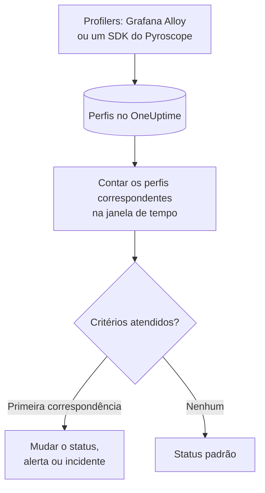

# Monitor de perfis

Um monitor de perfis conta, em uma janela de tempo, os perfis contínuos que seus serviços enviam ao OneUptime e que correspondem aos seus filtros (tipo de perfil, serviço, atributos). Quando a contagem atende aos seus critérios, ele muda o status do monitor, cria um alerta ou declara um incidente. Seu uso principal é perceber quando os dados de profiling param de chegar de um serviço.

> [!IMPORTANT]
> **Criar monitor** no painel não oferece Profiles: ainda não existe um formulário para os seus filtros. Crie um monitor de perfis pela [API](/docs/api-reference/api-reference) ou pelo [Terraform](/docs/terraform/monitor-steps), como descrito abaixo. Depois de criado, você pode ver e editar os critérios dele na página **Critérios** do monitor, no painel; os filtros só podem ser alterados pela API ou pelo Terraform.

:::cards
- [Criar o monitor](#criar-um-monitor-de-perfis): A configuração a enviar pela API ou pelo Terraform.
- [O que ele consulta](#o-que-ele-consulta): Tipos de perfil, serviços, atributos e a janela.
- [Critérios](#critérios): As condições que você pode usar.
- [Exemplo prático](#exemplo-prático-os-perfis-param-de-chegar): Saiba quando um serviço para de enviar perfis.
:::

## Como funciona



A cada minuto, o OneUptime conta os perfis que correspondem aos filtros do monitor e começaram dentro da sua janela de tempo. Ele compara essa contagem com os critérios do monitor de cima para baixo, e o primeiro critério que corresponde decide o que acontece. Quando nenhum corresponde, o monitor volta ao seu status padrão.

## Antes de começar

- Seus serviços enviam dados de profiling contínuo ao OneUptime, pelo Grafana Alloy (eBPF) ou por um SDK do Pyroscope. Veja [Profiling contínuo](/docs/telemetry/profiles).
- Você tem uma chave de API que pode criar monitores, ou o provedor Terraform do OneUptime configurado.
- Você sabe o ID de cada serviço de telemetria a observar e os tipos de perfil que ele envia, como `cpu`, `wall`, `alloc_objects`, `alloc_space` ou `goroutine`.

## Criar um monitor de perfis

:::steps
### Escolher o que contar

Escreva a configuração `profileMonitor` da etapa. Esta conta os perfis de CPU de um serviço nos últimos cinco minutos:

```json
{
  "profileMonitor": {
    "telemetryServiceIds": [],
    "profileTypes": ["cpu"],
    "profileType": "",
    "attributes": {},
    "lastXSecondsOfProfiles": 300
  }
}
```

Coloque o ID do serviço em `telemetryServiceIds`, ou deixe a lista vazia para contar os perfis de todos os serviços. [O que ele consulta](#o-que-ele-consulta) descreve cada campo.

### Criar o monitor

Crie, pela [API](/docs/api-reference/api-reference) ou pelo [Terraform](/docs/terraform/monitor-steps), um monitor do tipo `Profiles` com uma etapa que contenha esta configuração e pelo menos um critério. No Terraform, passe a configuração como o atributo `profile_monitor` da etapa, escrita com `jsonencode()`.

### Verificá-lo no painel

Abra o monitor em **Monitores**. Sua primeira avaliação acontece em até um minuto, e seu status muda assim que um critério corresponde.
:::

## O que ele consulta

| Campo | Com o que corresponde | Padrão |
| --- | --- | --- |
| `profileTypes` | Perfis de qualquer um destes tipos, comparados exatamente, como `cpu`. | Vazio: todos os tipos |
| `profileType` | Perfis cujo tipo contém este texto, sem diferenciar maiúsculas de minúsculas. Quando está definido, `profileTypes` é ignorado. | Vazio |
| `telemetryServiceIds` | Perfis de qualquer um destes serviços de telemetria. | Vazio: todos os serviços |
| `entityKeys` | Perfis de qualquer um destes hosts, pods, contêineres e outras entidades de infraestrutura. | Vazio: todas as entidades |
| `attributes` | Perfis cujos atributos têm estes valores. | Vazio: nenhuma condição |
| `lastXSecondsOfProfiles` | Perfis que começaram dentro deste número de segundos antes da avaliação. | Nenhum: defina-o sempre, ou todos os perfis armazenados são contados e a contagem nunca cai para 0 |

Todos os filtros que você definir precisam corresponder para que um perfil seja contado.

## Como ele é avaliado

- **A cada minuto.** Um monitor de perfis não é verificado por sondas, por isso não tem intervalo para configurar nem página **Sondas e intervalo**.
- **Um número por avaliação.** O monitor conta os perfis que correspondem a todos os filtros e começaram dentro de `lastXSecondsOfProfiles`. Um profiler envia dados em intervalos regulares, então dê à janela espaço para vários envios.
- **Nenhum perfil é uma contagem de 0.** Um serviço cujo profiler para de enviar dados produz 0.
- **A indisponibilidade do próprio OneUptime não é silêncio.** Enquanto a janela de tempo contiver um período em que o próprio OneUptime não estava recebendo dados (estava reiniciando, sendo atualizado ou recuperando um atraso), a verificação espera: o status não muda, e nenhum incidente ou alerta é aberto ou resolvido. Veja [Quando o OneUptime não recebe dados](/docs/monitor/when-oneuptime-is-not-receiving).
- **Critérios de cima para baixo.** O primeiro critério que corresponde decide, então coloque o mais grave primeiro.

Cada mudança de status, com o motivo, fica registrada na **Linha do tempo de status** do monitor.

## Critérios

Os critérios de um monitor de perfis têm um único filtro, **Profile Count**: o número de perfis que corresponderam na janela. Compare-o com um valor:

| Condição do filtro | Corresponde quando a contagem de perfis está… |
| --- | --- |
| **Greater Than** | acima do valor |
| **Greater Than Or Equal To** | no valor ou acima |
| **Less Than** | abaixo do valor |
| **Less Than Or Equal To** | no valor ou abaixo |
| **Equal To** | exatamente no valor |
| **Not Equal To** | em qualquer valor, menos esse |

As contagens de perfis não têm condições de anomalia: não há uma linha de base com que compará-las.

## Exemplo prático: os perfis param de chegar

O serviço de checkout executa um SDK do Pyroscope que envia perfis de CPU. Você quer um incidente quando eles param de chegar por cinco minutos:

- `profileTypes`: `["cpu"]`, `telemetryServiceIds`: o serviço de checkout, `lastXSecondsOfProfiles`: `300`
- Critério 1: **Profile Count** **Equal To** `0`: colocar o monitor offline e declarar um incidente
- Critério 2: **Profile Count** **Greater Than** `0`: colocar o monitor online

Enquanto o SDK envia dados, cada avaliação conta alguns perfis e o critério 2 mantém o monitor online. Quando o serviço é implantado sem o SDK, a contagem cai para 0 cinco minutos depois do último envio, o critério 1 corresponde e o incidente é declarado. O primeiro envio depois da correção leva a contagem de volta para acima de 0, e o incidente se resolve sozinho se **Resolver incidente automaticamente** estiver ativado para ele.

## Solução de problemas

:::details O monitor conta 0, mas aparecem perfis no OneUptime
Compare os filtros com os perfis que você vê: `profileTypes` precisa corresponder exatamente ao tipo, e `telemetryServiceIds` precisa conter os IDs de serviço certos. Um `lastXSecondsOfProfiles` curto também pode cair entre dois envios.
:::

:::details Profiles não aparece em Criar monitor
É o esperado: o painel ainda não tem um formulário para os filtros de um monitor de perfis. Crie-o pela API ou pelo Terraform, como descrito em [Criar um monitor de perfis](#criar-um-monitor-de-perfis).
:::

## Próximos passos

:::cards
- [Profiling contínuo](/docs/telemetry/profiles): Envie perfis do Grafana Alloy ou de um SDK do Pyroscope.
- [Etapas do monitor](/docs/terraform/monitor-steps): Passe a configuração da etapa pelo Terraform.
- [Monitor de traces](/docs/monitor/traces-monitor): Alerte sobre spans com falha.
- [Monitor de métricas](/docs/monitor/metrics-monitor): Alerte sobre CPU, memória e outras métricas.
:::
