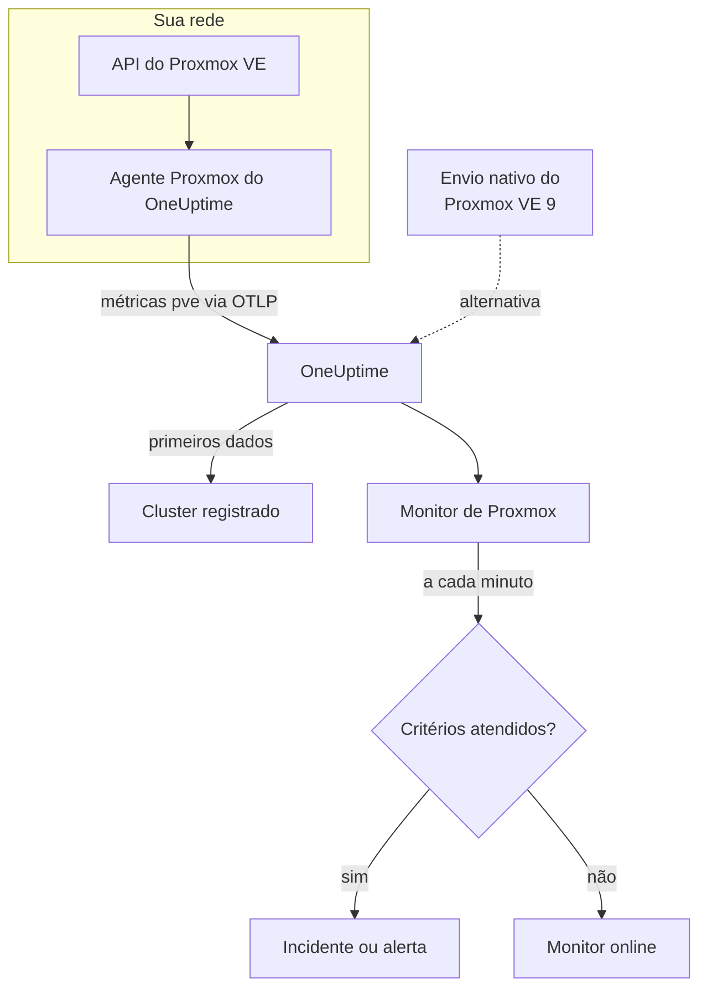

# Monitor de Proxmox

Um monitor de Proxmox acompanha um cluster Proxmox VE – seus nós, VMs e contêineres LXC, o armazenamento, o estado de HA, a cobertura dos jobs de backup e a replicação do armazenamento – e avisa você quando um nó fica offline, um convidado para ou o armazenamento enche. Ele lê as métricas `pve_*` que o agente Proxmox do OneUptime coleta, então nada é sondado de fora.

:::cards
- [Criar o monitor](#criar-um-monitor-de-proxmox): Seis passos no painel.
- [Modelos](#modelos-de-alerta-prontos): Onze alertas prontos, um incidente por nó, convidado ou volume.
- [Identidade dos recursos](#identidade-dos-recursos): Como mirar um único nó, convidado ou volume de armazenamento.
- [Métricas](#métricas-coletadas): Todas as séries `pve_*` com que o monitor pode alertar.
:::

## Como funciona

O agente Proxmox do OneUptime é executado em uma máquina que alcança a API do Proxmox VE. A cada 30 segundos, ele consulta o prometheus-pve-exporter com os coletores de cluster e de nó, rotula cada série com o recurso que ela descreve e envia as métricas para o OneUptime via OTLP, marcadas com o nome do cluster, `proxmox.cluster.name`. Os primeiros dados registram o cluster. O Proxmox VE 9 e versões posteriores podem, em vez disso, enviar métricas nativamente, sem instalar nada; consulte [o envio nativo](#o-envio-nativo-do-proxmox-ve).

Um monitor de Proxmox está vinculado a um cluster. A cada minuto, ele executa sua consulta sobre as métricas desse cluster e compara o resultado com seus critérios.

## Antes de começar

- **Instale o agente Proxmox** onde ele alcance a API do Proxmox VE, com um token de API somente leitura. O [guia do agente Proxmox](/docs/telemetry/proxmox) cobre o token, a instalação e o envio nativo.
- **Verifique se o cluster está registrado.** Ele aparece em **Produtos → Infraestrutura → Proxmox → Todos os clusters**, com o nome do `PROXMOX_CLUSTER_NAME` do agente, cerca de um minuto após a primeira coleta.

## Criar um monitor de Proxmox

:::steps
### Começar um monitor novo

Acesse **Monitores** e clique em **Criar monitor**.

### Escolher Proxmox

Em **Tipo de monitor**, clique em **Mais tipos de monitor** e escolha **Proxmox** em **Infraestrutura**, ou digite `proxmox` na caixa de busca. Informe um **Nome** – ele é usado nos títulos de incidentes e alertas – e clique em **Próximo**.

### Escolher o cluster

Em **Proxmox Monitor Configuration**, escolha o cluster em **Proxmox Cluster**. Todo cluster que enviou dados está na lista.

### Escolher o que monitorar

Escolha uma das três abas:

- **Quick Setup** – clique em um [modelo](#modelos-de-alerta-prontos). Ele define as métricas, os filtros, a agregação, o intervalo de tempo e os limites, e substitui os critérios abaixo pelos dele. Você ainda pode mudar o **Intervalo de tempo**.
- **Custom Metric** – escolha uma métrica em **Proxmox Metric** e depois defina **Agregação** e **Intervalo de tempo**. Os [filtros](#configurações-do-monitor) a restringem a um tipo de recurso ou a um único recurso.
- **Avançado** – monte você mesmo consultas e fórmulas em **Selecionar Métricas**, por exemplo uma porcentagem de memória a partir de `pve_memory_usage_bytes / pve_memory_size_bytes`. Use **Group by** `id` para avaliar cada recurso separadamente.

### Revisar os critérios

Abra cada critério em **Critérios do monitor** e confira sua **Métrica**, **Agregação**, **Condição** e **Threshold**. Um modelo os preenche. Com **Custom Metric** ou **Avançado**, o monitor começa com os [critérios padrão](#critérios-padrão), que só percebem uma métrica caindo para zero, então defina o seu próprio limite.

### Criar o monitor

Clique em **Criar monitor**. O OneUptime abre a página do monitor e o avalia a cada minuto. Os incidentes e alertas que ele gera também aparecem nas páginas **Incidentes** e **Alertas** do cluster.
:::

> [!TIP]
> Para configurar vários modelos de uma vez, abra o cluster em **Produtos → Infraestrutura → Proxmox** e vá para **Recommendations**. Escolha os modelos que quiser, escolha quem é acionado, e o OneUptime cria um monitor por modelo.

## Configurações do monitor

| Campo | Aba | O que faz |
| --- | --- | --- |
| **Proxmox Cluster** | Todas | Obrigatório. Restringe cada consulta a `resource.proxmox.cluster.name`. |
| **Escopo do recurso** | Custom Metric, Avançado | Opcional. **Nó**, **Guest (VM / container)**, **Armazenamento** ou **Cluster** – uma correspondência exata com `pve.scope`. |
| **PVE ID** | Custom Metric, Avançado | Opcional. Correspondência exata com `pve.id`: um nome de nó (`pve1`), um VMID (`100`) ou `<node>/<storage>` (`pve1/local`). Combine-o com um escopo para mirar um único recurso. |
| **Nome do nó** | Custom Metric, Avançado | Opcional. Só as séries do próprio nó (`pve.scope = node` e `pve.id`). Ele não consegue selecionar os convidados nem o armazenamento desse nó. |
| **Guest ID** | Custom Metric, Avançado | Opcional. Correspondência exata com o rótulo bruto `id`, como `qemu/100` ou `lxc/101`. Quando definido, os outros filtros são ignorados. |
| **Proxmox Metric** | Custom Metric | Uma métrica do [catálogo](#métricas-coletadas). |
| **Agregação** | Custom Metric | Como as amostras são combinadas: **Média**, **Máximo**, **Mínimo**, **Soma** ou **Contagem**. Começa na agregação usual da métrica. |
| **Intervalo de tempo** | Todas | A janela móvel que a consulta lê, de **Past 1 Minute** a **Past 365 Days**. Um monitor novo começa em **Past 1 Minute**; os modelos definem a sua. |
| **Selecionar Métricas** | Avançado | O construtor de consultas: **Métrica**, **Aggregate by**, **Filter by attributes**, **Group by**, além de **Adicionar métrica** e **Adicionar fórmula** para combinar consultas. |

## Identidade dos recursos

Toda série traz um rótulo de ponto de dados `id` que nomeia o recurso do Proxmox ao qual ela pertence:

| Valor de `id` | Recurso |
| --- | --- |
| `node/<name>` | Um nó do cluster, por exemplo `node/pve1`. |
| `qemu/<vmid>` | Uma máquina virtual QEMU, por exemplo `qemu/100`. |
| `lxc/<vmid>` | Um contêiner LXC, por exemplo `lxc/101`. |
| `storage/<node>/<storage>` | Um volume de armazenamento em um nó, por exemplo `storage/pve1/local`. |

Duas exceções: as séries de replicação (`pve_replication_*`) trazem o id do **job** de replicação em `id` (por exemplo `100-0`), e `pve_not_backed_up_total`, do cluster inteiro, não tem `id`.

Os filtros comparam por igualdade, não por prefixo, então o agente também divide `id` em três atributos que você pode filtrar. Os modelos dependem deles:

| Atributo | Valores | Para `qemu/100` |
| --- | --- | --- |
| `pve.scope` | `node`, `guest`, `storage`, `cluster` (`qemu` e `lxc` são ambos `guest`) | `guest` |
| `pve.type` | `node`, `qemu`, `lxc`, `storage` | `qemu` |
| `pve.id` | Tudo o que vem depois da primeira `/` de `id` (`pve1`, `100`, `pve1/local`) | `100` |

Filtre por `pve.scope` ou `pve.type` para um tipo de recurso, por `pve.id` ou `id` para um único recurso, e agrupe por `id` para avaliar cada recurso separadamente.

## Modelos de alerta prontos

**Quick Setup** oferece 11 modelos. Cada um monta um monitor completo – consultas, filtros de atributos, um agrupamento, um critério que dispara e outro que se recupera. A maioria agrupa por `id`, então cada nó, convidado, volume ou job recebe seu próprio incidente e seu próprio alerta. Os limites são pontos de partida que você pode editar.

Os modelos leem os últimos 5 minutos, salvo indicação contrária na tabela. Um critério só dispara quando a condição vale em todos os minutos da sua janela, e um critério de limite se recupera 10% além do seu limite para que um valor oscilando na linha não fique mudando de estado.

| Modelo | Gravidade | Monitora | Dispara quando | Recupera quando |
| --- | --- | --- | --- | --- |
| Node Offline | Crítico | `pve_up` para `pve.scope = node`, Min por `id` | Abaixo de 1 | Em 1 |
| Guest Down | Warning | `pve_up` e `pve_onboot_status` para `pve.scope = guest`, Min por `id` | `pve_up` está abaixo de 1 enquanto `pve_onboot_status` é 1 | `pve_up` volta a 1, ou a inicialização no boot é desativada |
| Cluster Quorum at Risk | Crítico | `pve_up` ÷ `pve_node_info` × 100 para `pve.scope = node` (ambos Soma): a parcela de nós online | 50% ou menos | Acima de 55% |
| High Node CPU Usage | Warning | `pve_cpu_usage_ratio` para `pve.scope = node`, Avg por `id` | Acima de 0,9 (90% dos núcleos do nó) | Em 0,81 ou menos |
| High Node Memory Usage | Warning | `pve_memory_usage_bytes` ÷ `pve_memory_size_bytes` × 100 para `pve.scope = node`, por `id` | Acima de 85% | Em 76,5% ou menos |
| High Guest CPU Usage | Warning | `pve_cpu_usage_ratio` para `pve.scope = guest`, Avg por `id`, últimos 15 minutos | Acima de 0,95 (95% das suas vCPUs) durante os 15 minutos | Em 0,855 ou menos |
| Storage Near Full | Warning | `pve_disk_usage_bytes` ÷ `pve_disk_size_bytes` × 100 para `pve.scope = storage`, por `id` | Acima de 85% | Em 76,5% ou menos |
| Container Root Disk Near Full | Warning | A mesma razão de disco para `pve.type = lxc`, por `id` | Acima de 90% | Em 81% ou menos |
| HA Resource in Error State | Crítico | `pve_ha_state` para `state = error`, Max por `id` | Acima de 0 | Em 0 |
| Guest Not Backed Up | Warning | `pve_not_backed_up_total`, Max (uma única série do cluster) | Acima de 0 | Em 0 |
| Replication Failing | Crítico | `pve_replication_failed_syncs`, Max por `id` (o id do job) | Acima de 0 | Em 0 |

**Gravidade** é o rótulo que o seletor mostra. O incidente e o alerta que um modelo cria começam com a gravidade de incidente e de alerta mais alta do seu projeto; altere-as nos critérios.

- **Os modelos de queda usam Mínimo**, então uma única coleta em que o recurso estava fora do ar já os dispara, em vez de ficar escondida pelas coletas em que ele estava no ar.
- **Guest Down** só olha os convidados configurados para iniciar no boot, então um convidado que você parou de propósito nunca aciona ninguém.
- **Cluster Quorum at Risk** é uma aproximação: o pve-exporter não tem métrica de corosync, então o modelo conta os nós online.
- **High Guest CPU Usage** é mais alto e mais lento que o modelo de nós: um convidado deve usar suas vCPUs, então só aciona um que nunca baixa.
- **As fórmulas de razão** usam a **Soma** dos dois lados. Os dois vêm da mesma coleta, então o resultado é uma porcentagem real.
- **Container Root Disk Near Full** deixa as VMs QEMU de fora: o uso de disco delas marca 0 sem o agente convidado do QEMU.
- **Guest Not Backed Up** cobre só a participação em jobs de backup. O pve-exporter não informa se os backups rodaram ou deram certo; agrupe `pve_not_backed_up_info` por `id` para listar os convidados.
- **A defasagem da replicação** (agora menos a última sincronização) não pode gerar alerta, porque os critérios não fazem aritmética com o relógio. A página **Visão geral** do cluster a mostra; alerte com **Replication Failing** no lugar.

### O envio nativo do Proxmox VE

O Proxmox VE 9 e versões posteriores podem enviar métricas pelo servidor de métricas OpenTelemetry integrado, sem instalar nada – consulte o [guia do agente Proxmox](/docs/telemetry/proxmox). O OneUptime transforma esse envio nas mesmas séries `pve_*`, então o catálogo e os modelos de CPU, memória e armazenamento funcionam com ele.

**Node Offline** e **Cluster Quorum at Risk** também funcionam: cada nó envia só o próprio status, então um nó que para de informar é dado como fora do ar (`pve_up` = 0) pelos nós que continuam vivos – consulte [Quando um nó para de informar](/docs/telemetry/proxmox#when-a-node-stops-reporting). **Guest Down**, **HA Resource in Error State**, **Guest Not Backed Up** e **Replication Failing** precisam de dados que só o agente coleta.

## Métricas coletadas

O agente consulta o prometheus-pve-exporter a cada 30 segundos com os coletores de cluster e de nó, o que também cobre os coletores `backup-info` e `replication` do exportador (ambos ativados por padrão).

### Disponibilidade

| Métrica | Unidade | Descrição |
| --- | --- | --- |
| `pve_up` | — | 1 quando o nó ou o convidado está ativo ou em execução, 0 caso contrário. |
| `pve_uptime_seconds` | seconds | Tempo de atividade do nó ou do convidado. |
| `pve_version_info` | count | A versão do Proxmox VE, nos rótulos. Sempre 1. |

### Nó

| Métrica | Unidade | Descrição |
| --- | --- | --- |
| `pve_node_info` | count | Metadados do nó, sempre 1. Some para contar os nós que estão informando. |
| `pve_cpu_usage_ratio` | ratio | CPU em uso como razão de 0 a 1 da CPU disponível. |
| `pve_cpu_usage_limit` | cores | CPU disponível, em núcleos. Para um convidado, suas vCPUs. |
| `pve_memory_usage_bytes` | bytes | Memória em uso. |
| `pve_memory_size_bytes` | bytes | Memória total. |

As séries de CPU e memória também são informadas para cada convidado, nos ids `qemu/*` e `lxc/*`.

### Convidado

| Métrica | Unidade | Descrição |
| --- | --- | --- |
| `pve_guest_info` | count | Metadados do convidado (nome, nó, tipo `qemu` ou `lxc`) nos rótulos. Sempre 1. |
| `pve_network_receive_bytes` | bytes | Bytes recebidos pelo convidado. Um contador de toda a vida útil. |
| `pve_network_transmit_bytes` | bytes | Bytes enviados pelo convidado. Um contador de toda a vida útil. |
| `pve_disk_read_bytes` | bytes | Bytes lidos do disco pelo convidado. Um contador de toda a vida útil. |
| `pve_disk_write_bytes` | bytes | Bytes gravados no disco pelo convidado. Um contador de toda a vida útil. |
| `pve_onboot_status` | count | 1 quando o convidado inicia no boot do nó. Um convidado parado com essa configuração geralmente é uma queda não planejada. |

### Armazenamento

| Métrica | Unidade | Descrição |
| --- | --- | --- |
| `pve_disk_usage_bytes` | bytes | Bytes usados no disco ou no armazenamento. Para um convidado QEMU, marca 0 a menos que o agente convidado do QEMU esteja instalado. |
| `pve_disk_size_bytes` | bytes | Tamanho total do disco ou do armazenamento. |
| `pve_storage_info` | count | Metadados do armazenamento, sempre 1. Some para contar os volumes de armazenamento. |

### HA

| Métrica | Unidade | Descrição |
| --- | --- | --- |
| `pve_ha_state` | — | Uma série por estado de HA (`started`, `stopped`, `error`, …) para cada recurso de HA, com 1 no estado atual. Filtre pelo rótulo `state` para alertar sobre um estado. |

### Backup

Vêm do coletor `backup-info` do exportador, no nível do cluster. Elas informam só a cobertura por **jobs** de backup:

| Métrica | Unidade | Descrição |
| --- | --- | --- |
| `pve_not_backed_up_total` | count | Convidados fora de qualquer job de backup. Uma única série do cluster, sem `id`. |
| `pve_not_backed_up_info` | count | Uma série por convidado sem cobertura, sempre 1, rotulada com o `id` do convidado. Ela desaparece quando o convidado entra em um job de backup. |

### Replicação

Vêm do coletor `replication` do exportador, no nível do nó. As séries só existem quando o cluster tem jobs de replicação, e trazem o id do job em `id`:

| Métrica | Unidade | Descrição |
| --- | --- | --- |
| `pve_replication_failed_syncs` | count | Tentativas de sincronização com falha seguidas. Acima de 0, a réplica está ficando defasada. |
| `pve_replication_duration_seconds` | seconds | Quanto tempo levou a última sincronização. |
| `pve_replication_last_sync_timestamp_seconds` | seconds | Hora Unix da última sincronização **bem-sucedida**. |
| `pve_replication_last_try_timestamp_seconds` | seconds | Hora Unix da última **tentativa**. Se for mais recente que a última sincronização, a tentativa mais recente falhou. |
| `pve_replication_next_sync_timestamp_seconds` | seconds | Hora Unix da próxima sincronização agendada. |
| `pve_replication_info` | count | Metadados do job – tipo, origem, destino, convidado – nos rótulos. Sempre 1. |

## Critérios de monitoramento

Um critério compara uma das consultas ou fórmulas do monitor com um limite. Os critérios de um monitor de Proxmox não têm **Tipo de filtro**: cada regra verifica o valor da métrica, com estes campos.

| Campo | O que faz |
| --- | --- |
| **Métrica** | A consulta ou fórmula a verificar, pelo nome da variável. |
| **Agregação** | Como os valores da janela viram uma única resposta: **Média**, **Soma**, **Maximum Value**, **Minimum Value**, **All Values** (todos os valores precisam corresponder) ou **Any Value** (basta um). |
| **Condição** | **Greater Than**, **Less Than**, **Greater Than Or Equal To**, **Less Than Or Equal To** ou **Equal To** – ou uma condição de anomalia: **Anomalously High**, **Anomalously Low** ou **Anomalous**. |
| **Threshold** | O valor com que comparar. Uma lista de unidades fica ao lado quando a métrica tem unidade. Não aparece em condições de anomalia. |
| **Sensibilidade** | Só condições de anomalia. **Baixo** (4σ), **Médio** (3σ, o padrão) ou **Alto** (2σ). |
| **Janela de linha de base** | Só condições de anomalia. 14 dias (o padrão), 28, 60 ou 90 dias de histórico. |
| **Se não houver dados** | Em **Mais campos**. O que acontece quando a janela não tem amostras: **Ignore** (o padrão), **Treat As Zero** ou **Trigger**. |

As condições de anomalia comparam cada valor com a mesma hora da semana na linha de base. Elas ficam em um estado "Learning", e não geram nada, até a janela de linha de base ter histórico suficiente.

Cada critério também diz o que fazer quando corresponde: mudar o status do monitor, criar um alerta ou declarar um incidente. Os critérios são verificados de cima para baixo, e o primeiro que corresponde decide.

### Critérios padrão

Um monitor que você não cria a partir de um modelo começa com dois critérios:

| Ordem | Critério | Corresponde quando | Então |
| --- | --- | --- | --- |
| 1 | Check if _monitor name_ is offline | Qualquer valor da primeira consulta é `0` | Marca o monitor como **Offline** e declara o incidente "_monitor name_ is offline", que se resolve sozinho quando o monitor se recupera. |
| 2 | Check if _monitor name_ is online | Qualquer valor está acima de `0` | Marca o monitor como **Operacional**. |

> [!IMPORTANT]
> O silêncio não corresponde a nenhum dos dois critérios: um cluster que para de enviar dados deixa o monitor como estava. Para ser avisado quando os dados param, defina **Se não houver dados** como **Trigger** em um critério. O tempo em que o próprio OneUptime não estava recebendo nunca é ausência de dados: uma verificação cuja janela contém esse tempo espera no lugar, como explica [Quando o OneUptime não recebe dados](/docs/monitor/when-oneuptime-is-not-receiving).

## Solução de problemas

:::details O cluster não aparece na lista Proxmox Cluster
Os clusters se registram sozinhos a partir dos dados do agente. Verifique se o agente está em execução e enviando dados (consulte o [guia do agente Proxmox](/docs/telemetry/proxmox)) e se `PROXMOX_CLUSTER_NAME` está definido.
:::

:::details Faltam as métricas dos convidados
As séries dos convidados vêm do coletor de cluster do exportador, que a configuração distribuída ativa com o parâmetro de coleta `cluster=1`. Se você mudou a configuração do coletor, restaure-a.
:::

:::details High Node CPU Usage nunca dispara
O modelo calcula a média de `pve_cpu_usage_ratio` por `id`, então cada nó é verificado separadamente. Se você montou sua própria consulta, agrupe-a por `id`: uma média de todos os nós é puxada para baixo pelos ociosos.
:::

:::details Node Offline continua disparando para um nó que você removeu do cluster
No envio nativo do Proxmox VE, um nó retirado do cluster parece igual a um que caiu: ele parou de informar, então os nós que continuam vivos continuam dando-o como fora do ar. Abra a página do nó e clique em **Remove Node** – o nó some e o alerta dele é resolvido. Caso contrário, ele fica Offline por até 7 dias. O agente não tem esse problema: ele consulta o cluster, que não lista mais o nó.
:::

:::details Faltam as métricas de backup ou de replicação
`pve_not_backed_up_*` vem do coletor `backup-info` do exportador e `pve_replication_*` do coletor `replication` dele. Os dois vêm ativados por padrão e são cobertos pelos parâmetros de coleta `cluster=1` e `node=1` da configuração distribuída. Se você roda seu próprio exportador, verifique se não os desativou. `pve_replication_*` só existe quando o cluster tem jobs de replicação do armazenamento.
:::

:::details Contadores como pve_network_receive_bytes só crescem
As séries de E/S de rede e de disco são contadores de toda a vida útil, e os critérios comparam valores brutos: não há operador de taxa, e **Convert to per-second rate** no construtor de consultas só muda o gráfico. Mostre-os como taxa, ou alerte sobre o crescimento com uma fórmula, como uma consulta de **Máximo** menos uma consulta de **Mínimo** do mesmo contador.
:::

## Próximos passos

:::cards
- [Agente Proxmox](/docs/telemetry/proxmox): Instalar o agente ou configurar o envio nativo.
- [Monitor de Ceph](/docs/monitor/ceph-monitor): Monitorar o armazenamento Ceph por trás de um cluster Proxmox.
- [Monitor de VMware](/docs/monitor/vmware-monitor): O mesmo tipo de monitor para o vSphere.
- [Visão geral dos incidentes](/docs/incidents/index): O que acontece depois que um critério declara um incidente.
:::
