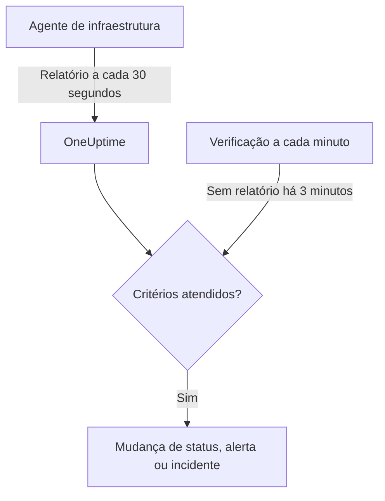

# Monitor de servidor / VM

Um monitor de servidor / VM acompanha uma máquina por meio do agente de infraestrutura do OneUptime (`oneuptime-infrastructure-agent`), um pequeno serviço que informa ao OneUptime, a cada 30 segundos, CPU, memória, discos, carga, rede e processos em execução. Esta página mostra como conectar o agente a um monitor de servidor / VM, o que o agente informa e como escrever os critérios que decidem quando o servidor está online ou offline.

> [!IMPORTANT]
> **Criar monitor** não oferece mais **Server / VM**. Os monitores de servidor / VM que você já tem continuam funcionando, e tudo nesta página se aplica a eles. Para monitorar um servidor novo, crie um [monitor de host](/docs/monitor/host-monitor): ele alerta com base nas métricas de host que o [coletor OpenTelemetry no host](/docs/telemetry/host-otel-collector) envia.

:::cards
- [Conectar o agente](#conectar-o-agente): Instalar, informar a chave secreta do monitor e iniciar.
- [O que o agente informa](#o-que-o-agente-informa): CPU, memória, discos, carga, rede e processos.
- [Critérios de monitoramento](#critérios-de-monitoramento): Decidir quando o servidor conta como online ou offline.
- [Solução de problemas](#solução-de-problemas): O agente não informa, ou o monitor nunca fica offline.
:::

## Como funciona

O agente é executado como serviço do sistema. A cada 30 segundos, ele coleta um relatório e o envia para a sua URL do OneUptime, assinado com a chave secreta do monitor. O OneUptime armazena os valores como métricas do monitor e verifica o relatório com os critérios do monitor.

O silêncio é verificado separadamente. A cada minuto, o OneUptime reavalia os critérios **Is Online** de cada monitor de servidor / VM que não informa há 3 minutos ou mais, e um servidor em silêncio por mais tempo do que seus critérios permitem (3 minutos por padrão) conta como offline. Um monitor sem critério **Is Online** nunca é marcado como offline só porque o agente ficou em silêncio. Para esse silêncio só conta o tempo em que o OneUptime estava recebendo: o tempo em que o próprio OneUptime estava reiniciando, sendo atualizado ou colocando a fila em dia não conta, como explica [Quando o OneUptime não recebe dados](/docs/monitor/when-oneuptime-is-not-receiving).



## Antes de começar

- Um monitor de servidor / VM no seu projeto.
- Permissão para editar monitores. A chave secreta, e os comandos de configuração que a contêm, só são mostrados a quem pode editar monitores.
- Acesso root (Linux, macOS) ou de administrador (Windows) no servidor. O agente se instala como serviço do sistema.
- HTTPS de saída do servidor para a sua URL do OneUptime, diretamente ou por meio de um proxy HTTP.

## Conectar o agente

Os comandos abaixo usam `https://oneuptime.com` e `YOUR_SECRET_KEY`. Os comandos de configuração do próprio monitor já trazem a sua URL do OneUptime e a chave secreta do monitor, então copie-os do monitor sempre que puder.

:::steps
### Abrir os comandos de configuração do monitor

Acesse **Monitores**, abra o monitor de servidor / VM e selecione **Documentação**. Os cartões **Set up your Server Monitor (Linux/Mac)** e **Set up your Server Monitor (Windows)** trazem os comandos deste monitor. Até o agente informar pela primeira vez, a **Visão geral** do monitor também os mostra.

### Instalar o agente

:::tabs
@tab Linux
```bash
curl -sSL https://oneuptime.com/docs/static/scripts/infrastructure-agent/install.sh | sudo bash
```
@tab macOS
```bash
curl -sSL https://oneuptime.com/docs/static/scripts/infrastructure-agent/install.sh | sudo bash
```
@tab Windows
1. Baixe o agente da [versão mais recente no GitHub](https://github.com/OneUptime/oneuptime/releases/latest): `oneuptime-infrastructure-agent_windows_amd64.zip` para x64, ou `oneuptime-infrastructure-agent_windows_arm64.zip` para ARM64.
2. Extraia o arquivo ZIP. Ele contém `oneuptime-infrastructure-agent.exe`.
3. Abra o **Prompt de Comando** como administrador na pasta em que você o extraiu.
:::

O script de instalação baixa a versão mais recente para o seu sistema operacional e processador (x86-64 ou ARM64) e coloca o binário `oneuptime-infrastructure-agent` em `$HOME/bin`. Em uma instalação auto-hospedada, o script é servido pela sua própria URL do OneUptime.

### Conectá-lo ao monitor

:::tabs
@tab Linux
```bash
sudo oneuptime-infrastructure-agent configure --secret-key=YOUR_SECRET_KEY --oneuptime-url=https://oneuptime.com
```
@tab macOS
```bash
sudo oneuptime-infrastructure-agent configure --secret-key=YOUR_SECRET_KEY --oneuptime-url=https://oneuptime.com
```
@tab Windows
```shell
oneuptime-infrastructure-agent configure --secret-key=YOUR_SECRET_KEY --oneuptime-url=https://oneuptime.com
```
:::

`configure` salva a chave secreta e a URL no arquivo de configuração do agente e instala o agente como serviço do sistema. As duas flags são obrigatórias. Em uma instalação auto-hospedada, substitua `https://oneuptime.com` pela sua própria URL.

Se o servidor acessa a internet por meio de um proxy, adicione `--proxy-url`:

```bash
sudo oneuptime-infrastructure-agent configure --proxy-url=http://proxy.example.com:8080 --secret-key=YOUR_SECRET_KEY --oneuptime-url=https://oneuptime.com
```

### Iniciar o agente

:::tabs
@tab Linux
```bash
sudo oneuptime-infrastructure-agent start
```
@tab macOS
```bash
sudo oneuptime-infrastructure-agent start
```
@tab Windows
```shell
oneuptime-infrastructure-agent start
```
:::

Ao iniciar, o agente verifica a chave secreta com o OneUptime e envia o primeiro relatório imediatamente.

### Verificar se ele informa

Execute `sudo oneuptime-infrastructure-agent status` (sem `sudo` no Windows): ele imprime `Service is running`. No OneUptime, a **Visão geral** do monitor deixa de mostrar os comandos de configuração assim que chega o primeiro relatório, e a aba **Métricas** começa a mostrar gráficos do servidor.
:::

## Referência do agente

### Comandos

| Comando | O que faz |
| --- | --- |
| `configure --secret-key=<key> --oneuptime-url=<url>` | Salva as configurações e instala o agente como serviço do sistema. Adicione `--proxy-url=<url>` para enviar os relatórios por meio de um proxy. |
| `start` | Inicia o serviço. Ele se recusa a iniciar até que `configure` tenha sido executado. |
| `stop` | Para o serviço. |
| `restart` | Reinicia o serviço. |
| `status` | Informa se o serviço está em execução ou parado. |
| `logs` | Imprime as últimas 100 linhas do log do agente. `-n <lines>` imprime outra quantidade de linhas, e `-f` acompanha as novas. |
| `uninstall` | Remove o serviço e exclui o arquivo de configuração do agente. |
| `help` | Lista os comandos. |

Execute-os com `sudo` no Linux e no macOS, e em um **Prompt de Comando** de administrador no Windows. Para trocar a chave secreta, a URL ou o proxy de um agente já configurado, execute `stop` e `uninstall` e depois `configure` e `start` de novo.

### Arquivos

| Arquivo | Linux e macOS | Windows |
| --- | --- | --- |
| Configuração | `/etc/oneuptime-infrastructure-agent/config.json` | `%PROGRAMDATA%\oneuptime-infrastructure-agent\config.json` |
| Log | `/var/log/oneuptime-infrastructure-agent/oneuptime-infrastructure-agent.log` | `%PROGRAMDATA%\oneuptime-infrastructure-agent\oneuptime-infrastructure-agent.log` |

Quando o agente não consegue gravar nesses diretórios, ele usa `~/.oneuptime-infrastructure-agent/` no lugar. As variáveis de ambiente `ONEUPTIME_AGENT_CONFIG_PATH` e `ONEUPTIME_AGENT_LOG_PATH` definem qualquer um dos caminhos explicitamente.

## O que o agente informa

Cada relatório traz o nome do host do servidor e:

| Área | O que é informado |
| --- | --- |
| CPU | Uso em %, número de núcleos, uso por núcleo e tempo gasto em user, system, idle, espera de E/S, steal, nice, IRQ e soft IRQ |
| Memória | Memória total, usada, livre e disponível, buffers e cache, uso em %, e swap total, usado, livre e uso em % |
| Discos | Para cada disco montado: caminho de montagem, dispositivo, sistema de arquivos, espaço total, usado e livre, uso em %, bytes e operações lidos e gravados, e tempo de E/S |
| Carga | Médias de carga de 1, 5 e 15 minutos |
| Rede | Para cada interface: bytes e pacotes enviados e recebidos, erros e descartes de entrada e saída; além das conexões estabelecidas e em escuta |
| Host | Sistema operacional, plataforma e versão, versão e arquitetura do kernel, tempo de atividade, hora de inicialização, virtualização e número de processos |
| Processos | Cada processo em execução: nome, PID, comando, CPU em %, memória, status, threads, usuário e hora de início |

Os valores que o sistema operacional não fornece são omitidos. A aba **Métricas** do monitor mostra gráficos de disponibilidade, CPU, memória, uso e E/S de disco, médias de carga, swap, tráfego e erros de rede, conexões, tempo de atividade e número de processos.

## Critérios de monitoramento

Os critérios decidem quando o monitor está online, degradado ou offline, e quando ele abre um alerta ou um incidente. Cada filtro de um critério tem um **Tipo de filtro**, uma **Condição do filtro** e, na maioria dos tipos, um valor.

| Tipo de filtro | O que verifica | Condições do filtro |
| --- | --- | --- |
| Is Online | Se o agente informou recentemente (nos últimos 3 minutos, por padrão) | Verdadeiro, Falso |
| CPU Usage (in %) | Uso geral da CPU | Greater Than, Less Than, Greater Than Or Equal To, Less Than Or Equal To |
| Memory Usage (in %) | Memória em uso | Igual à CPU |
| Disk Usage (in %) | Uso do disco indicado em **Caminho do disco** | Igual à CPU |
| Swap Usage (in %) | Swap em uso | Igual à CPU |
| CPU IO Wait (in %) | Parcela do tempo de CPU gasta esperando E/S | Igual à CPU |
| Load Average (1 minute) | Média de carga do último minuto | Igual à CPU |
| Load Average (5 minute) | Média de carga dos últimos 5 minutos | Igual à CPU |
| Load Average (15 minute) | Média de carga dos últimos 15 minutos | Igual à CPU |
| Server Process Name | Se um processo com este nome está em execução (sem diferenciar maiúsculas de minúsculas) | Is Executing, Is Not Executing |
| Server Process Command | Se um processo com exatamente esta linha de comando está em execução (sem diferenciar maiúsculas de minúsculas) | Is Executing, Is Not Executing |
| Server Process PID | Se um processo com este PID está em execução | Is Executing, Is Not Executing |

**Caminho do disco** aceita um ponto de montagem ou um dispositivo, como `/`, `/mnt/data`, `C:\` ou `/dev/sda1`; quando fica vazio, vale `/`. Informe `*` para verificar cada disco que o agente informa: cada disco que ultrapassa o limite recebe seu próprio alerta, então um segundo disco enchendo não fica escondido atrás do alerta aberto do primeiro.

### Avaliar durante um período de tempo

**Avaliar este critério durante um período de tempo** é uma caixa de seleção separada no formulário de critérios, e não uma condição do filtro. Ela está disponível para **Is Online** e para todo tipo de filtro numérico. Ative-a para comparar um agregado – escolhido em **Avaliar** (Média, Soma, Maximum Value, Minimum Value, All Values, Any Value) na janela definida em **Nos últimos (em minutos)** – em vez do valor da última verificação. Em um filtro **Is Online**, a janela é o tempo que o agente pode ficar em silêncio antes de o servidor contar como offline.

**All Values** só corresponde quando a janela está de fato coberta por dados. Um monitor recém-criado, ou um cujas verificações deixaram de ser registradas, não tem histórico suficiente para dizer algo sobre os últimos N minutos, então o critério espera em vez de corresponder à única leitura que tem. **Any Value** é a configuração para "me avise assim que uma única verificação ultrapassar o limite" e continua disparando na hora.

**Se não houver dados** controla o que acontece enquanto a janela não consegue sustentar o critério:

| Se não houver dados | Comportamento | Use para |
| --- | --- | --- |
| **Ignore** (padrão) | O critério não corresponde. | Alertas de limite comuns. |
| **Trigger** | Os dados ausentes são tratados como o problema. | Verificações do tipo heartbeat, em que o silêncio é a própria falha. |
| **Treat As Zero** | A janela é comparada como um único zero. | Contadores, em que "nenhum evento" significa de fato zero. |

> [!TIP]
> CPU e carga têm picos curtos o tempo todo. Avalie-as ao longo de alguns minutos com **Média** ou **All Values** em vez de alertar com base em um único relatório.

### Exemplos de critérios

| Objetivo | Tipo de filtro | Condição do filtro | Valor |
| --- | --- | --- | --- |
| Marcar o servidor como offline quando o agente para de informar | Is Online | Falso | — |
| Alertar quando o uso de CPU passar de 90% | CPU Usage (in %) | Greater Than | `90` |
| Alertar quando o disco raiz estiver mais de 85% cheio | Disk Usage (in %), **Caminho do disco** `/` | Greater Than | `85` |
| Alertar para qualquer disco mais de 85% cheio, um alerta por disco | Disk Usage (in %), **Caminho do disco** `*` | Greater Than | `85` |
| Alertar quando o uso de memória passar de 80% | Memory Usage (in %) | Greater Than | `80` |
| Alertar quando o nginx parar de executar | Server Process Name | Is Not Executing | `nginx` |

## Solução de problemas

:::details O agente não está informando
- Verifique se o serviço está em execução: `sudo oneuptime-infrastructure-agent status`.
- Leia o log dele: `sudo oneuptime-infrastructure-agent logs -n 50`. Uma linha `Metrics successfully pushed to OneUptime server` significa que os relatórios estão chegando.
- O agente verifica a chave secreta ao iniciar e encerra se o OneUptime a rejeitar, registrando `Secret key is invalid`. Compare a chave com a da página **Configurações** do monitor, em **Redefinir chave secreta do Monitor de servidor**.
- Garanta que o servidor consegue acessar a sua URL do OneUptime por HTTPS e que nenhum firewall bloqueia as conexões de saída.
:::

:::details `sudo` diz que o comando não foi encontrado
O script de instalação coloca o binário no `$HOME/bin` do usuário com que foi executado, e imprime o diretório que usou. Execute o agente pelo caminho completo, por exemplo `sudo /root/bin/oneuptime-infrastructure-agent configure ...`. Para instalá-lo em um diretório do caminho do sistema, passe `-b` ao script:

```bash
curl -sSL https://oneuptime.com/docs/static/scripts/infrastructure-agent/install.sh | sudo bash -s -- -b /usr/local/bin
```
:::

:::details `start` diz que a configuração do serviço não foi encontrada
`configure` não foi executado, ou `uninstall` removeu a configuração. Execute `configure` com a chave secreta e a URL e depois `start`.
:::

:::details O monitor nunca fica offline quando o servidor cai
Só um critério **Is Online** marca como offline um servidor em silêncio. Adicione um com a **Condição do filtro** definida como **Falso** e defina o status do monitor que ele aplica.
:::

:::details Os relatórios não passam pelo proxy
- Verifique a URL e a porta do proxy passadas em `--proxy-url`.
- Garanta que o proxy permite conexões com a sua URL do OneUptime.
- Para trocar o proxy, execute `stop` e `uninstall`, depois `configure` com a nova `--proxy-url`, e `start`.
:::

## Próximos passos

:::cards
- [Monitor de hosts](/docs/monitor/host-monitor): O monitor para usar em servidores novos, baseado nas métricas de host do OpenTelemetry.
- [Coletor OpenTelemetry no host](/docs/telemetry/host-otel-collector): Enviar métricas e logs de host do Linux, macOS e Windows.
- [Modelos de incidentes e alertas](/docs/monitor/incident-alert-templating): Colocar detalhes de CPU, memória, disco e processos nos títulos dos incidentes.
:::
