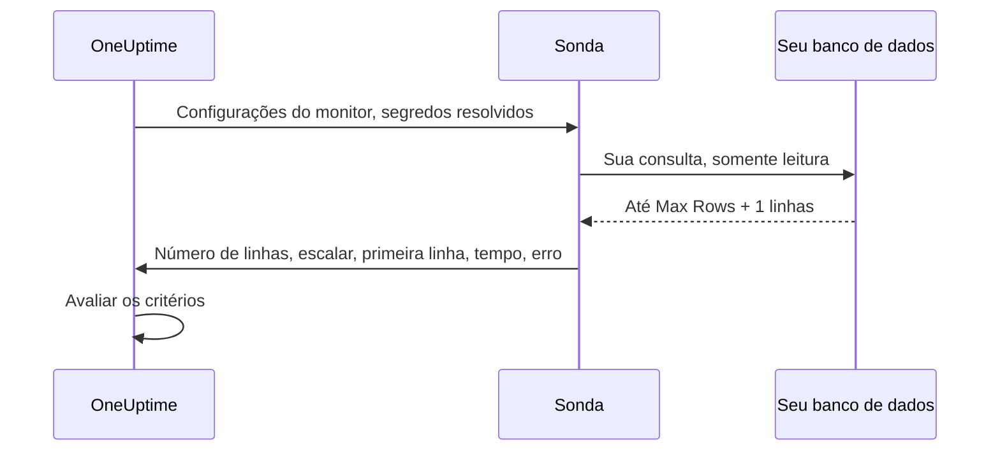

# Monitor de consultas SQL

O monitor de consultas SQL executa periodicamente, a partir de uma sonda, uma consulta SQL somente leitura e gera alertas sobre o resultado: o número de linhas retornadas, um valor escalar, quanto tempo a consulta levou ou um erro de consulta. Ele foi feito para o caso de "executar uma consulta e abrir um incidente", por exemplo alertar quando o número de pedidos cancelados nos últimos cinco minutos dispara, quando uma tabela de fila cresce demais ou quando uma linha crítica desaparece.

:::cards
- [Criar um usuário somente leitura](#criar-um-usuário-somente-leitura): O login de banco de dados que o monitor deve usar.
- [Criar o monitor](#criar-um-monitor-de-consultas-sql): Conecte uma sonda e digite a consulta.
- [Escrever a consulta](#escrever-a-consulta): Coloque na primeira coluna o valor sobre o qual você alerta.
- [Configurar os critérios](#configurar-os-critérios): Alerte sobre uma contagem, um valor, uma consulta lenta ou um erro.
:::

## Como funciona

A cada verificação, a sonda se conecta ao seu banco de dados, executa sua consulta em um contexto somente leitura, lê de volta no máximo um número limitado de linhas e envia ao OneUptime uma projeção compacta. Os critérios do monitor são então avaliados com base nessa projeção.

Como a consulta roda a partir de uma sonda dentro da sua rede, o OneUptime nunca precisa de uma conexão direta com seu banco de dados, e o conjunto completo de resultados nunca sai da sonda: só uma projeção pequena e limitada do resultado é enviada de volta.



A sonda envia apenas:

| Valor | O que é |
|---|---|
| **Row Count** | O número de linhas que a consulta retornou (limitado pelo Max Rows). |
| **Valor escalar** | A primeira coluna da primeira linha. É o valor natural de uma consulta no estilo `SELECT COUNT(*)`. |
| **First Row** | A primeira linha como pares de coluna/valor, mostrada no resumo da verificação para dar contexto. |
| **Execution Time** | Quanto tempo a verificação levou, em milissegundos, incluindo a conexão, não só a consulta. |
| **Erro da consulta** | Uma mensagem de erro higienizada, se a consulta falhou. |

O conjunto completo de resultados nunca é enviado ao OneUptime, então os dados dos seus clientes não são replicados no armazenamento do OneUptime.

## Bancos de dados compatíveis

| Banco de dados | Porta padrão |
|---|---|
| **PostgreSQL** | `5432` |
| **MySQL** | `3306` |
| **Microsoft SQL Server** | `1433` |

Mecanismos compatíveis com MySQL e PostgreSQL que falam o mesmo protocolo de rede e o mesmo dialeto SQL costumam funcionar também, mas só os três mecanismos acima são testados oficialmente.

Quando o host e a porta aos quais o monitor se conecta são um dos endpoints de um banco de dados da página [Bancos de dados](/docs/telemetry/databases), os alertas e incidentes dele também aparecem na página desse banco de dados (veja [Alertas de um banco de dados](/docs/telemetry/databases#alerts-on-a-database)). Um host informado como referência a um segredo do monitor não é associado.

## Modelo de segurança

Executar uma consulta fornecida pelo cliente em um banco de dados de produção é delicado, por isso o monitor de consultas SQL é somente leitura por design e empilha vários controles:

| Controle | O que faz |
|---|---|
| **Usuário de banco de dados com privilégio mínimo** (controle principal) | Conecte-se sempre com um usuário de banco de dados dedicado e somente leitura, com acesso apenas às tabelas de que a consulta precisa. Este é o controle mais importante: veja [Criar um usuário somente leitura](#criar-um-usuário-somente-leitura). |
| **Execução somente leitura** | No PostgreSQL e no MySQL, a sonda abre uma transação `READ ONLY`, que rejeita qualquer escrita (inclusive CTEs de escrita), seja qual for o texto da consulta. No Microsoft SQL Server, que não tem transação somente leitura, a sonda roda dentro de uma transação que é sempre revertida. |
| **Consultas de instrução única e permitidas** | A consulta precisa ser uma única instrução que comece com `SELECT`, `WITH`, `VALUES` ou `TABLE`. Instruções empilhadas (`SELECT 1; DROP TABLE …`) e palavras-chave de escrita ou DDL como `INSERT`, `UPDATE`, `DELETE`, `DROP`, `EXEC` e `INTO` são rejeitadas pela sonda antes de ela se conectar. Essa verificação é uma rede de segurança, não a fronteira: a fronteira é o usuário somente leitura. |
| **Tempo limite da instrução** | Toda consulta tem um limite de tempo rígido. Uma consulta que demora demais é cancelada. |
| **Linhas limitadas** | São lidas de volta no máximo Max Rows linhas (mais uma, para detectar truncamento), o que limita a memória da sonda e o tamanho dos dados enviados. |
| **Ocultação de credenciais** | Os erros do banco de dados são higienizados antes de serem armazenados: a senha, o host, o nome de usuário e o nome do banco de dados, além de qualquer string de conexão, são ocultados, para que as credenciais nunca vazem em mensagens de erro. |

## Antes de começar

- Uma **sonda** com acesso de rede ao host e à porta do seu banco de dados. Pode ser uma sonda hospedada pelo OneUptime (se o banco de dados for acessível pela internet) ou uma [sonda personalizada](/docs/probe/custom-probe) rodando dentro da sua rede.
- Um **usuário de banco de dados somente leitura** e os dados de conexão (host, porta, nome do banco de dados, nome de usuário, senha), ou uma identidade do Windows ou de domínio somente leitura ao usar a autenticação integrada do SQL Server.

## Criar um usuário somente leitura

Conecte-se sempre com um usuário dedicado somente leitura. Execute as instruções do seu mecanismo como administrador, substituindo `orders` pelo seu banco de dados:

:::tabs
@tab PostgreSQL
```sql
-- PostgreSQL
CREATE USER oneuptime_ro WITH PASSWORD 'a-strong-password';
GRANT CONNECT ON DATABASE orders TO oneuptime_ro;
GRANT USAGE ON SCHEMA public TO oneuptime_ro;
GRANT SELECT ON ALL TABLES IN SCHEMA public TO oneuptime_ro;
-- Include tables created in the future:
ALTER DEFAULT PRIVILEGES IN SCHEMA public GRANT SELECT ON TABLES TO oneuptime_ro;
```
@tab MySQL
```sql
-- MySQL
CREATE USER 'oneuptime_ro'@'%' IDENTIFIED BY 'a-strong-password';
GRANT SELECT ON orders.* TO 'oneuptime_ro'@'%';
FLUSH PRIVILEGES;
```
@tab Microsoft SQL Server
```sql
-- Microsoft SQL Server
CREATE LOGIN oneuptime_ro WITH PASSWORD = 'a-strong-password';
USE orders;
CREATE USER oneuptime_ro FOR LOGIN oneuptime_ro;
ALTER ROLE db_datareader ADD MEMBER oneuptime_ro;
```
:::

Para uma permissão mais restrita, dê ao usuário `SELECT` apenas nas tabelas que sua consulta lê.

## Criar um monitor de consultas SQL

:::steps
### Começar um novo monitor

Vá para **Monitores** e clique em **Criar monitor**. Em **Tipo de monitor**, clique em **Mais tipos de monitor** e escolha **SQL Query** em **Database Monitoring**, ou digite `query` na caixa de pesquisa. Digite um **Nome** e clique em **Próximo**.

### Informar os dados de conexão

Escolha o **Database Type** (a porta muda para o padrão desse mecanismo) e preencha o host, o nome do banco de dados e as credenciais do usuário somente leitura. Faça referência à senha com um [segredo do monitor](#usar-um-segredo-do-monitor-para-a-senha) em vez de digitá-la. Cada campo está descrito em [Configuração](#configuração).

### Digitar a consulta

Digite uma única instrução somente leitura em **SQL Query** (veja [Escrever a consulta](#escrever-a-consulta)).

### Testar

Clique em **Testar monitor** para executar a consulta uma vez a partir de uma sonda antes de salvar.

### Definir os critérios

Revise os critérios com que o monitor começa e adicione os seus: veja [Configurar os critérios](#configurar-os-critérios). Depois, clique em **Próximo**.

### Escolher as sondas e criar

Selecione as **Sondas** que alcançam o banco de dados e um **Intervalo de monitoramento**, e clique em **Criar monitor**.
:::

## Configuração

| Campo | O que informar |
|---|---|
| **Database Type** | PostgreSQL, MySQL ou Microsoft SQL Server. Escolher um tipo define a porta padrão. |
| **Host** | O host do banco de dados acessível pela sonda (por exemplo, `db.internal`). |
| **Porta** | A porta do banco de dados. |
| **Nome do Banco de Dados** | O banco de dados em que a consulta é executada. |
| **Use Windows Integrated Authentication** | Somente Microsoft SQL Server. Autenticar com a conta que executa a sonda em vez de um nome de usuário e senha do SQL. Veja [Autenticação integrada do Windows](#autenticação-integrada-do-windows). |
| **Nome de usuário** | Um usuário de banco de dados somente leitura e com privilégio mínimo. |
| **Senha** | A senha do banco de dados. Recomendamos fortemente fazer referência a um [segredo do monitor](/docs/monitor/monitor-secrets) com `{{monitorSecrets.name}}` em vez de digitar a senha em texto simples (veja [Usar um segredo do monitor para a senha](#usar-um-segredo-do-monitor-para-a-senha)). |
| **SQL Query** | A consulta somente leitura a executar (veja [Escrever a consulta](#escrever-a-consulta)). |
| **Use SSL/TLS** | Ative para se conectar via TLS. Quando ativado, você pode desligar **Verify server certificate** se o banco de dados usar um certificado autoassinado. |

### Mais campos

| Campo | Padrão | Máximo | O que limita |
|---|---|---|---|
| **Connection Timeout (ms)** | `10000` | `30000` | Quanto tempo esperar para estabelecer uma conexão. |
| **Statement Timeout (ms)** | `15000` | `60000` | O limite rígido de duração da consulta. |
| **Max Rows** | `100` | `1000` | O teto de linhas lidas de volta do banco de dados. |

Um valor acima do máximo é reduzido ao máximo.

### Autenticação integrada do Windows

Para o Microsoft SQL Server, ative **Use Windows Integrated Authentication** para abrir uma conexão confiável com a identidade do processo da sonda. Os campos Nome de usuário e Senha são ignorados nesse modo e não são passados ao driver. Como a sonda precisa de uma identidade em que seu domínio confie, use uma sonda auto-hospedada nesse modo de autenticação.

| A sonda roda em | O que configurar |
|---|---|
| **Windows** | Executar o serviço da sonda com uma conta de domínio que tenha um login somente leitura no SQL Server. |
| **Linux ou macOS** | Configurar o Kerberos para o domínio do SQL Server e dar ao processo da sonda um ticket válido (por exemplo, por meio de um keytab). A imagem Linux oficial da sonda inclui o Microsoft ODBC Driver 18, o unixODBC e o cliente Kerberos. Monte a configuração do Kerberos e o cache de tickets no contêiner, deixe-os legíveis para o processo da sonda e defina `KRB5_CONFIG` ou `KRB5CCNAME` quando os locais não forem os padrão. |

A sonda precisa de um Microsoft ODBC Driver for SQL Server instalado no host em que ela roda. A imagem oficial da sonda inclui o **ODBC Driver 18**. Quando você executa uma sonda auto-hospedada ou personalizada, ela detecta e usa automaticamente o `ODBC Driver N for SQL Server` mais recente registrado no host (por exemplo, o Driver 17, se for o instalado): não é preciso ter exatamente o Driver 18. Para fixar um driver específico, defina a variável de ambiente `SQL_SERVER_ODBC_DRIVER` na sonda com o nome exato do driver (por exemplo, `ODBC Driver 17 for SQL Server`).

O SQL Server precisa ter um nome de entidade de serviço `MSSQLSvc` adequado, os relógios da sonda e do controlador de domínio precisam estar sincronizados, e a sonda precisa resolver e alcançar o SQL Server pelo nome de host coberto por essa entidade de serviço. Conceda à identidade confiável apenas as permissões de banco de dados de que a consulta de monitoramento precisa.

## Escrever a consulta

A consulta precisa ser uma **única instrução somente leitura**. Ela precisa começar com `SELECT`, `WITH`, `VALUES` ou `TABLE`. Um ponto e vírgula final é permitido; várias instruções, não. Palavras-chave de escrita e DDL são rejeitadas em qualquer ponto da consulta, inclusive `INTO`, então `SELECT … INTO` também é recusada.

A sonda verifica a consulta a cada verificação, não ao salvar. Uma consulta que viola essas regras é salva, e depois cada verificação falha com "Only read-only queries are allowed (must start with SELECT, WITH, VALUES, or TABLE)."; os critérios padrão deixam o monitor offline.

Mantenha as consultas baratas e bem delimitadas: elas rodam a cada verificação, então prefira colunas indexadas e janelas de tempo estreitas. Esta consulta conta os pedidos cancelados nos últimos cinco minutos:

:::tabs
@tab PostgreSQL
```sql
-- Count recent cancellations (PostgreSQL)
SELECT COUNT(*) AS cancelled
FROM orders
WHERE status = 'CANCELLED'
  AND created_at > NOW() - INTERVAL '5 minutes';
```
@tab MySQL
```sql
-- The same idea on MySQL
SELECT COUNT(*) AS cancelled
FROM orders
WHERE status = 'CANCELLED'
  AND created_at > NOW() - INTERVAL 5 MINUTE;
```
@tab Microsoft SQL Server
```sql
-- The same idea on Microsoft SQL Server
SELECT COUNT(*) AS cancelled
FROM orders
WHERE status = 'CANCELLED'
  AND created_at > DATEADD(minute, -5, GETDATE());
```
:::

> [!TIP]
> Em uma consulta no estilo `COUNT(*)`, a contagem está disponível tanto como **Row Count** (que é `1`, já que uma linha é retornada) quanto como **Valor escalar** (a própria contagem, da primeira coluna). Para alertar sobre "quantos", compare com o **Valor escalar**.

## Usar um segredo do monitor para a senha

Para que a senha do banco de dados nunca seja armazenada em texto simples no monitor, crie um [segredo do monitor](/docs/monitor/monitor-secrets) e faça referência a ele no campo Senha:

:::steps
1. Vá para **Monitores → Configurações → Segredos** e crie um segredo do monitor.
2. Dê um nome a ele (por exemplo, `dbPassword`) e dê acesso a este monitor.
3. No campo **Senha** do monitor, digite `{{monitorSecrets.dbPassword}}`.
:::

O OneUptime resolve o segredo no servidor antes de entregar a configuração à sonda. O OneUptime nunca cria esses segredos por você: fazer referência a um é escolha sua. Os campos **Nome de usuário**, **Host**, **Nome do Banco de Dados** e **SQL Query** também aceitam referências a segredos; **Porta** não.

## Configurar os critérios

Adicione critérios para decidir quando o monitor é considerado online, degradado ou offline. Estas verificações estão disponíveis para um monitor de consultas SQL:

| Tipo de filtro | O que verifica |
|---|---|
| **SQL Is Online** | Se o banco de dados estava acessível e a consulta teve sucesso. |
| **SQL Query Row Count** | O número de linhas retornadas. Compare com operadores como maior que, menor que ou igual a. |
| **SQL Query Scalar Value** | A primeira coluna da primeira linha. Comparada como número quando o valor informado é um número; caso contrário, como string. É a verificação a usar em consultas no estilo `COUNT(*)`. |
| **SQL Query Execution Time (in ms)** | Quanto tempo a consulta levou. Útil para perceber um banco de dados lento. |
| **SQL Query Error** | A mensagem de erro da consulta. Alerte quando ela estiver (ou não) vazia, ou corresponder a uma string específica. |
| **JavaScript Expression** | Avaliar uma expressão JavaScript personalizada sobre `rowCount`, `scalarValue`, `firstRow`, `executionTimeInMs`, `queryError` e `isOnline`. Veja [Expressões JavaScript](/docs/monitor/javascript-expression#monitores-de-consultas-sql). |

Os limites numéricos são números inteiros: escreva `10`, não `10.5`. Os filtros de SQL Query não podem ser avaliados ao longo de um período; cada verificação é independente.

Um novo monitor de consultas SQL começa com dois critérios: **SQL Is Online** é falso (o monitor fica offline e declara um incidente que se resolve sozinho) e **SQL Is Online** é verdadeiro, o que o marca como online. **Adicionar critérios** adiciona um no final; arraste-o para cima do critério online, porque os critérios são verificados de cima para baixo e o primeiro que corresponde decide.

### Exemplo: alertar quando os cancelamentos disparam

Usando a consulta acima:

| Critério | Filtro |
|---|---|
| **Degradado** | `SQL Query Scalar Value` é maior que `10`. |
| **Offline** | `SQL Query Scalar Value` é maior que `50`, ou `SQL Is Online` é `false`. |

Associe uma política de plantão ao critério para que as pessoas certas sejam acionadas. Um monitor de consultas SQL não tem variáveis de modelo próprias: o título de um incidente pode citar o monitor com `{{monitorName}}`, mas não pode citar o resultado da consulta.

## Pontos a considerar

- A consulta roda a cada verificação, então mantenha-a barata. Use índices e janelas de tempo estreitas, e conte com o Statement Timeout como proteção.
- Só o número de linhas, a primeira célula (escalar) e a primeira linha são enviados: monte sua consulta de forma que o valor sobre o qual quer alertar esteja na primeira coluna.
- Se o resultado for truncado por ter passado do Max Rows, o resumo da verificação mostra **Rows Truncated**: "Yes (result capped)". Aumente o Max Rows só se precisar; conjuntos de resultados maiores custam mais memória na sonda.
- Escritas e DDL são sempre rejeitadas. Se você precisa testar um caminho de escrita, este monitor não serve para isso.
- Prefira um segredo do monitor a uma senha em texto simples, para que a credencial fique criptografada em repouso.
- Uma verificação cuja consulta falha é tentada de novo um segundo depois, até mais três vezes, antes de informar o erro, para que uma queda breve de conexão não deixe o monitor offline. Em uma sonda auto-hospedada, `PROBE_MONITOR_RETRY_LIMIT` define quantas vezes.

## Solução de problemas

:::details Toda verificação falha com "Only read-only queries are allowed"
A consulta não começa com `SELECT`, `WITH`, `VALUES` ou `TABLE`. Um comentário antes dela não tem problema; um `SET` ou um `DECLARE`, sim. Reescreva-a como uma única instrução somente leitura.
:::

:::details Uma verificação falha com "Disallowed SQL keyword"
Uma palavra-chave de escrita, DDL ou execução aparece em algum ponto da consulta, mesmo dentro de um `SELECT`, como `INTO` ou `EXEC`. Palavras entre aspas e em comentários não contam. Remova a palavra-chave, ou coloque a lógica em uma view que o usuário somente leitura possa ler.
:::

:::details A verificação estoura o tempo limite
A sonda não conseguiu se conectar dentro do **Connection Timeout (ms)**, ou a consulta demorou mais que o **Statement Timeout (ms)**. Confira se a sonda alcança o host e a porta, e depois deixe a consulta mais barata: filtre por colunas indexadas em uma janela de tempo curta.
:::

:::details A conexão falha com um erro de certificado
O certificado do banco de dados é autoassinado, ou a sonda não confia nele. Desligue **Verify server certificate**, que aparece quando **Use SSL/TLS** está ativado, ou dê ao banco de dados um certificado em que a sonda confie.
:::

:::details A autenticação integrada do Windows falha
A sonda precisa de um Microsoft ODBC Driver for SQL Server e de uma identidade em que seu domínio confie. Use a imagem oficial da sonda, ou instale o driver, e depois confira a configuração em [Autenticação integrada do Windows](#autenticação-integrada-do-windows).
:::

## Próximos passos

:::cards
- [Monitor de saúde de banco de dados](/docs/monitor/database-health-monitor): Acompanhe conexões, bloqueios e replicação sem escrever SQL.
- [Segredos do monitor](/docs/monitor/monitor-secrets): Mantenha a senha do banco de dados criptografada.
- [Expressões JavaScript](/docs/monitor/javascript-expression): Escreva critérios que combinam vários valores.
- [Sondas personalizadas](/docs/probe/custom-probe): Execute verificações de dentro da sua rede.
:::
