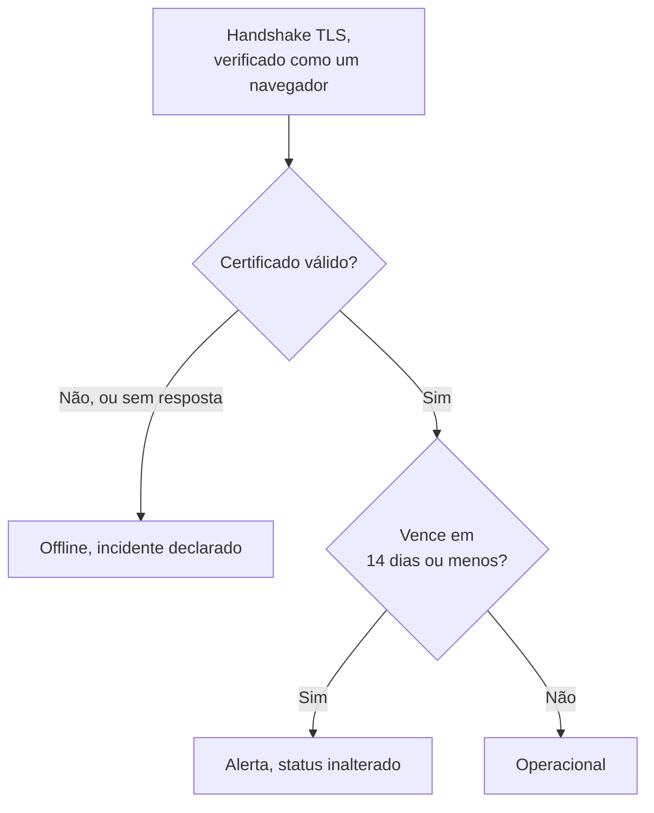

# Monitor de certificado SSL

Um monitor de certificado SSL verifica os certificados TLS que os seus sites e serviços apresentam, do jeito que um navegador faz, e avisa você antes que eles vençam. Ele também deixa o monitor offline quando um certificado não é mais válido: vencido, autoassinado, emitido para outro nome de host ou por uma autoridade em que os navegadores não confiam.

:::cards
- [Criar o monitor](#criar-um-monitor-de-certificado-ssl): Seis passos no painel.
- [Critérios padrão](#critérios-padrão): Um aviso de vencimento com 14 dias de antecedência, sem configurar nada.
- [Critérios de monitoramento](#critérios-de-monitoramento): Validade, vencimento e certificados autoassinados.
- [Solução de problemas](#solução-de-problemas): Certificados autoassinados e internos.
:::

## Como funciona

A cada verificação, uma sonda abre uma conexão TLS com o host e a porta da URL, a porta `443` a menos que a URL indique outra, e verifica o certificado como um navegador faria: um emissor confiável, um nome de host que corresponde e datas que incluem hoje. Se o certificado não passar na verificação, a sonda o lê mesmo assim, então a data de vencimento, o emissor e as impressões digitais dele são registrados de qualquer forma. Uma conexão que falha, esgota o tempo limite ou apresenta um certificado inválido é tentada de novo, até o número de tentativas que você permitir. Depois, o OneUptime avalia o resultado com os critérios do monitor.

Uma sonda que perdeu a própria conexão de rede não informa nenhum resultado, então não consegue marcar o seu certificado como inválido.

## Antes de começar

- **Uma função que possa criar monitores**: Project Owner, Project Admin, Project Member, Monitor Admin ou Monitor Member, ou uma função personalizada com a permissão Create Monitor.
- **Uma sonda que alcance o host e a porta.** As sondas padrão do seu projeto são escolhidas para cada monitor novo. Um serviço em uma rede privada precisa de uma [sonda personalizada](/docs/probe/custom-probe) dentro dessa rede.

## Criar um monitor de certificado SSL

:::steps
### Começar um monitor novo

Vá em **Monitores** e clique em **Criar monitor**. Em **Tipo de monitor**, escolha **SSL Certificate**.

### Dar um nome a ele

Digite um **Nome**, como `example.com certificate`, e clique em **Próximo**.

### Informar a URL

Em **URL do site**, digite o site cujo certificado será verificado, como `https://example.com`. Para um serviço em outra porta, inclua-a: `https://example.com:8443`.

### Testá-lo

Clique em **Testar monitor**, escolha uma sonda em **Selecionar Sonda** e clique em **Executar teste**. **Resultado do Teste do Monitor** mostra o certificado que a sonda recebeu, com o emissor e a data de vencimento.

### Revisar os critérios

**Critérios do monitor** começa com os [critérios padrão](#critérios-padrão): offline quando o certificado não é válido, um alerta quando ele vence em 14 dias ou menos. Altere-os se precisar e clique em **Próximo**.

### Escolher as sondas e criar

Mantenha ou altere as **Sondas** e o **Intervalo de monitoramento** (começa em **A cada 5 minutos**; aos monitores de certificado SSL são oferecidos 5 minutos ou mais) e clique em **Criar monitor**. A página do monitor se abre.
:::

## Opções de configuração

| Campo | Padrão | O que informar |
| --- | --- | --- |
| **URL do site** | Nenhum | O site cujo certificado é verificado, como `https://example.com` ou `https://example.com:8443`. Só o host e a porta são usados; o caminho é ignorado. |
| **Tempo Limite da Requisição (segundos)** (em **Mais campos**) | `60` | Quanto tempo esperar pelo handshake TLS em cada tentativa. O máximo é 60 segundos. |
| **Tentativas em caso de falha** (em **Mais campos**) | Padrão da sonda, normalmente `3` | Quantas vezes repetir uma tentativa que falhou. O máximo é 3. |

**Tentativas em caso de falha** conta as novas tentativas _depois_ da primeira, então `0` executa a verificação uma vez e `2` até três vezes. Se ficar em branco, usa o padrão da sonda: 3, a menos que o `PROBE_MONITOR_RETRY_LIMIT` da sonda diga outra coisa. Falhas de conexão, falhas de validação do certificado e tempos limite esgotados são todos repetidos, com uma pausa de um segundo entre as tentativas.

## Critérios de monitoramento

Os critérios decidem quando o certificado conta como bom, degradado ou quebrado, e se isso declara um incidente ou cria um alerta. Cada critério verifica um ou mais filtros:

| Filtro | Condições | O que verifica |
| --- | --- | --- |
| **Is Valid Certificate** | **Verdadeiro**, **Falso** | O certificado passa nas verificações de um navegador: um emissor confiável, um nome de host que corresponde e datas que incluem hoje. **Falso** quando o endpoint não respondeu. |
| **Is Not A Valid Certificate** | **Verdadeiro**, **Falso** | O oposto de **Is Valid Certificate**: **Verdadeiro** quando o certificado não passa nessas verificações ou não pôde ser verificado. |
| **Is Expired Certificate** | **Verdadeiro**, **Falso** | A data de vencimento do certificado já passou. |
| **Is Self Signed Certificate** | **Verdadeiro**, **Falso** | O certificado, ou um da cadeia dele, é autoassinado. |
| **Expires In Days** | **Greater Than**, **Less Than**, **Greater Than Or Equal To**, **Less Than Or Equal To** | Os dias até o certificado vencer. |
| **Expires In Hours** | **Greater Than**, **Less Than**, **Greater Than Or Equal To**, **Less Than Or Equal To** | As horas até o certificado vencer. |

**Expires In Days** conta dias inteiros: um certificado que vence em 14 dias e 20 horas tem 14 dias restantes. **Expires In Hours** conta horas inteiras do mesmo jeito.

Com dois ou mais filtros, **Condição de correspondência** decide se **Todos** precisam corresponder ou se basta **Qualquer** um. As **Ações** de um critério decidem o que ele faz: mudar o status do monitor, criar um alerta, declarar um incidente, ou várias dessas coisas.

### Critérios padrão

Um monitor de certificado SSL novo começa com três critérios, então ele avisa você antes que um certificado vença sem configurar nada:

1. **O certificado não é válido** — o certificado venceu, é autoassinado, foi emitido para outro nome de host ou por uma autoridade não confiável, ou não pôde ser verificado porque o endpoint não respondeu. O monitor é marcado como **Offline** e um incidente chamado "_monitor name_ certificate is not valid" é criado. A causa raiz dele diz qual desses casos foi. O incidente se resolve sozinho assim que o certificado volta a ser válido.
2. **O certificado vence em breve** — o certificado é válido, mas vence em 14 dias ou menos. Um **alerta** chamado "_monitor name_ certificate expires soon" é criado.
3. **O certificado é válido** — o monitor é marcado como **Operacional**.

O aviso de "vence em breve" é um alerta, não um incidente: ele não aparece nas suas páginas de status, não aciona ninguém a menos que você adicione uma política de plantão a ele, e não muda o status do monitor. Ele usa a segunda severidade de alerta do seu projeto, **Low** em um projeto novo. Quando o certificado renovado é detectado, o monitor volta para "O certificado é válido" e o alerta se resolve sozinho.

Os critérios são verificados de cima para baixo, e o primeiro que corresponde decide o que acontece. Por isso "vence em breve" fica acima de "é válido": um certificado prestes a vencer ainda é válido, então corresponderia aos dois.

Para ser avisado antes, altere o valor do filtro **Expires In Days** no critério "vence em breve", por exemplo para `30`. Para acionar alguém em vez disso, abra as **Ações** desse critério: ative **Quando os filtros corresponderem, declarar um incidente.**, ou mantenha o alerta e adicione a ele uma política de plantão em **Políticas de plantão**.

:::details Adicionar o aviso a um monitor criado antes de ele existir
Monitores criados antes de o OneUptime adicionar este aviso não têm um critério de "vence em breve". Para adicioná-lo:

1. No monitor, abra **Configuração → Critérios** e clique em **Editar: Critérios de Monitoramento**.
2. Clique em **Adicionar critérios**. Defina o filtro dele como **Is Valid Certificate** / **Verdadeiro**, clique em **Adicionar filtro** e defina o segundo como **Expires In Days** / **Less Than Or Equal To** / `14`. Deixe **Condição de correspondência** em **Todos** (ela aparece abaixo dos filtros quando há dois).
3. Em **Ações**, ative **Quando os filtros corresponderem, criar um alerta.** e deixe **Quando os filtros corresponderem, alterar o status do monitor.** desativado, para que ele crie um alerta e não mude o status do monitor.
4. Arraste o novo critério para cima do critério que marca o monitor como no ar, e salve.
:::

### Exemplos de critérios

| Objetivo | Filtro | Condição | Valor |
| --- | --- | --- | --- |
| Avisar com um mês de antecedência | **Expires In Days** | **Less Than Or Equal To** | `30` |
| Acionar alguém no último dia | **Expires In Hours** | **Less Than** | `24` |
| Offline só quando o certificado já venceu | **Is Expired Certificate** | **Verdadeiro** | — |
| Sinalizar um certificado autoassinado | **Is Self Signed Certificate** | **Verdadeiro** | — |

Um critério sobre o vencimento precisa ficar acima do critério que marca o certificado como válido: um certificado prestes a vencer ainda é válido, e o primeiro critério que corresponde vence.

## Boas práticas

1. **Dê-se tempo para renovar** — O aviso padrão chega 14 dias antes do vencimento, o que serve para certificados que se renovam sozinhos. Se renovar leva mais tempo para você (um certificado comprado, ou um processo de mudança), aumente para 30 dias.
2. **Monitore cada endpoint** — Se você tem vários domínios ou subdomínios, crie um monitor para cada um. Cada um pode ter o seu próprio certificado.
3. **Inclua outras portas** — Serviços que servem TLS em uma porta diferente de `443`, como `8443`, também têm certificados. Coloque a porta na URL.
4. **Confira depois da renovação** — Depois de renovar um certificado, confira o próximo resultado do monitor: a data de vencimento mostrada deve ser a nova.

## Solução de problemas

:::details O certificado está certo no meu navegador, mas o monitor diz que não é válido
A causa raiz do incidente diz por quê. Um caso comum é um servidor que envia o certificado sem os certificados intermediários: os navegadores muitas vezes completam a lacuna sozinhos, a sonda não. Configure o servidor para enviar a cadeia completa. Outro é uma URL cujo nome de host não está no certificado.
:::

:::details Monitoro um serviço interno com um certificado autoassinado
Um certificado autoassinado nunca é válido, então os critérios padrão mantêm o monitor offline. **Is Self Signed Certificate**, **Is Expired Certificate** e **Expires In Days** continuam funcionando para ele, então monte os critérios com eles. Em **Configuração → Critérios**:

1. No critério "não é válido", clique em **Adicionar filtro**, defina o novo filtro como **Is Self Signed Certificate** / **Falso** e defina **Condição de correspondência** como **Todos**. O critério continua deixando o monitor offline quando o endpoint não responde, ou o certificado está errado de outra forma.
2. Adicione um critério com **Is Expired Certificate** / **Verdadeiro** que marque o monitor como **Offline** e declare um incidente, e arraste-o para o topo.
3. No critério "vence em breve", substitua **Is Valid Certificate** / **Verdadeiro** por **Is Expired Certificate** / **Falso**, para que o aviso cubra também o certificado autoassinado.

Enquanto o certificado estiver em dia, nenhum critério corresponde e o monitor mostra o seu status padrão, **Operacional**.
:::

:::details O monitor está offline com "could not be checked because the endpoint is not reachable"
A sonda não conseguiu abrir uma conexão TLS com o host e a porta. Confira a porta na URL, e se um firewall deixa as sondas passarem. Um host em uma rede privada precisa de uma [sonda personalizada](/docs/probe/custom-probe).
:::

## Próximos passos

:::cards
- [Monitor de site](/docs/monitor/website-monitor): Verificar se o próprio site responde.
- [Monitor de domínio](/docs/monitor/domain-monitor): Ser avisado antes que o registro do domínio vença.
- [Regras de escalonamento](/docs/on-call/escalation-rules): Decidir quem é acionado pelos alertas e incidentes.
- [Visão geral dos incidentes](/docs/incidents/index): O que acontece depois que o monitor declara um.
:::
