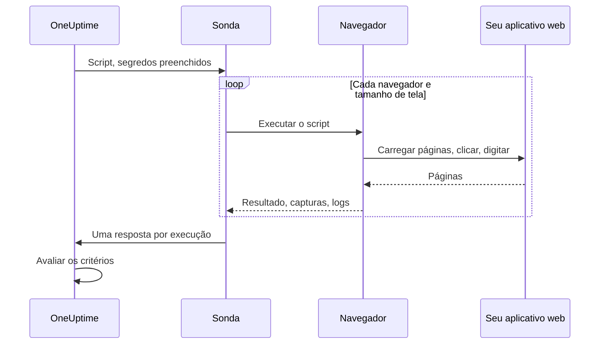

# Monitor sintético

Um monitor sintético controla seu aplicativo web em um navegador de verdade, periodicamente, com um script Playwright que você escreve: ele abre páginas, preenche formulários e percorre uma jornada do usuário, e falha quando a jornada falha. Use-o para perceber as falhas que uma verificação de disponibilidade não vê: um login que parou de funcionar, um botão de pagamento que não faz nada, um dashboard que nunca termina de carregar.

:::cards
- [Criar o monitor](#criar-um-monitor-sintético): Escreva um script, escolha navegadores e tamanhos de tela.
- [Escrever o script](#escrever-o-script): Uma jornada de login pronta para usar como ponto de partida.
- [Capturas de tela](#capturas-de-tela): Veja como a página estava quando uma execução falhou.
- [O que o script pode usar](#módulos-disponíveis-no-script): Playwright, HTTP, criptografia e métricas.
:::

## Como funciona

A cada verificação, uma sonda executa seu script uma vez para cada navegador e tamanho de tela escolhidos, um depois do outro. Cada execução inicia um navegador novo, sem cookies nem armazenamento de execuções anteriores; o script controla sua página, faz capturas de tela e retorna um resultado ou lança um erro. A sonda informa cada execução, e o OneUptime avalia seus critérios com base nelas.



| Tipo de tela | Viewport |
| --- | --- |
| Mobile | 360 × 640 |
| Tablet | 1024 × 768 |
| Desktop | 1920 × 1080 |

Os navegadores são Chromium e Firefox.

## Antes de começar

- Uma **sonda** que alcance seu aplicativo web. Use uma [sonda personalizada](/docs/probe/custom-probe) para um aplicativo dentro da sua rede. A imagem Docker da sonda inclui Chromium e Firefox; uma sonda executada fora do Docker precisa tê-los instalados.
- Toda senha ou token de que a jornada precise, armazenado como [segredo do monitor](/docs/monitor/monitor-secrets).

## Criar um monitor sintético

:::steps
### Começar um novo monitor

Vá para **Monitores** e clique em **Criar monitor**. Em **Tipo de monitor**, clique em **Mais tipos de monitor** e escolha **Synthetic Monitor** em **Synthetic Monitoring**, ou digite `playwright` na caixa de pesquisa. Digite um **Nome** e clique em **Próximo**.

### Adicionar o script

Escreva seu script no editor **Playwright Code**. Comece pelo [exemplo abaixo](#escrever-o-script).

### Escolher navegadores e tamanhos de tela

Marque os navegadores em **Tipo de navegador** e os tamanhos em **Tipo de tela**. O script roda uma vez para cada combinação, então dois navegadores e três tamanhos dão seis execuções por verificação. Em **Mais campos**, **Contagem de tentativas em caso de erro** repete uma execução que falhou até 5 vezes.

### Testar

Clique em **Testar monitor** para executar o script uma vez a partir de uma sonda, e confira o resultado, os logs e as capturas de tela de cada execução.

### Revisar os critérios

O monitor começa com dois critérios: fica offline, e declara um incidente, quando uma execução falha, e online quando nenhuma falha. Altere-os ou adicione os seus (veja [Critérios](#critérios)) e clique em **Próximo**.

### Escolher as sondas e criar

Selecione as **Sondas** e um **Intervalo de monitoramento** (monitores sintéticos recebem intervalos de 5 minutos ou mais) e clique em **Criar monitor**.
:::

## Escrever o script

O script é o corpo de uma função `async`. `page` é uma página compatível com Playwright que já está aberta; controle-a, retorne um resultado com `return` e faça a execução falhar com `throw` (ou deixando uma chamada do Playwright estourar o tempo). Este exemplo faz login e verifica se o dashboard carrega:

```javascript title="Synthetic monitor script"
await page.goto("https://app.example.com/login");
screenshots["login-page"] = await page.screenshot();

await page.fill("#email", "monitoring@example.com");
await page.fill("#password", "{{monitorSecrets.AppPassword}}");
await page.click("button[type=submit]");

// Fails the run if the dashboard does not appear within 10 seconds.
await page.waitForSelector(".dashboard", { timeout: 10000 });
screenshots["dashboard"] = await page.screenshot();

console.log(`Signed in on ${browserType}, ${screenSizeType}`);

return {
  data: { title: await page.title() },
};
```

| Para | Faça isto | O que o OneUptime registra |
| --- | --- | --- |
| Informar um resultado | `return { data: ... }` | O **Resultado** da execução. Só `data` é mantido. |
| Fazer a execução falhar | `throw new Error("...")`, ou deixar uma espera estourar o tempo | O **Erro de script** da execução. |
| Guardar evidências | `screenshots["name"] = await page.screenshot()` | Uma captura de tela, mantida mesmo quando a execução falha. |
| Deixar um rastro | `console.log(...)` | As mensagens de log da execução. |

Para ver as execuções, abra a **Visão geral** do monitor: o cartão **Resumo do monitor** tem um bloco por navegador e tamanho de tela, e **Mostrar mais detalhes** mostra as capturas de tela de cada execução.

### Uso do Playwright

Usamos o Playwright para simular as interações dos usuários. O valor `page` é uma fachada segura e compatível com Playwright para a página criada para esta execução. Os métodos comuns de `Page`, `Locator`, `Frame`, `ElementHandle`, `JSHandle`, `Request`, `Response`, do teclado, do mouse e do contexto do navegador estão disponíveis. Isso inclui navegação, locators, cliques, preenchimento de formulários, avaliação na página, pop-ups, páginas adicionais, inspeção de respostas e capturas de tela. Você chega ao contexto do navegador da execução por `page.context()`, por exemplo para abrir uma nova página ou lidar com um pop-up.

Os scripts sintéticos não rodam no processo Node.js da sonda. Os valores atravessam a fronteira de execução como dados copiados ou como capacidades opacas vinculadas à execução, então algumas APIs do Playwright funcionam de outro jeito ou não funcionam:

| Indisponível | Use em vez disso |
| --- | --- |
| Métodos de inicialização ou conexão do navegador, sessões CDP, roteamento de requisições, bindings expostos, campos privados do Playwright e qualquer opção que leia ou grave um caminho do sistema de arquivos do host. Por isso `page.context().browser()` não está disponível. | A página e o contexto do navegador que você recebe. |
| Listeners de eventos (`page.on(...)`, `page.once(...)`): chamá-los falha com um erro claro. | `page.waitForEvent(...)` para diálogos e pop-ups, ou esperas de respostas e requisições com correspondência por string ou expressão regular. |
| Predicados em forma de função para os métodos de espera de eventos, requisições, respostas e URLs. | Correspondências por string ou expressão regular, locators ou consulta explícita em laço. |
| Os acessores síncronos de frames (`page.frames()`, `page.mainFrame()`, `page.frame(...)`). | `page.frameLocator(...)` para iframes. |
| `page.request.*` | O global `axios` para requisições HTTP. |
| Capturas de página inteira e saída em PDF. | Capturas do viewport, que mantêm o comportamento de evidência de falhas descrito abaixo. |

`page.waitForNavigation(...)`, `page.setDefaultTimeout(...)` e `page.setDefaultNavigationTimeout(...)` são compatíveis. `page.waitForEvent(...)` espera por `dialog`, `domcontentloaded`, `load`, `popup`, `request`, `requestfailed`, `requestfinished` e `response`. As funções de avaliação passadas a métodos como `page.evaluate()` rodam na página do navegador monitorada, nunca no processo da sonda. Cada execução pode usar até oito páginas.

As permissões do navegador se limitam a geolocalização e notificações. Área de transferência, câmera, microfone, MIDI, fontes locais e outras permissões de dispositivos do host não estão disponíveis para scripts de monitor.

### O que o script retorna

Os dados retornados pelo script são serializados em JSON antes de serem armazenados: em objetos e arrays simples, `NaN` e `Infinity` viram `null`, propriedades `undefined` e funções são descartadas, e objetos `Date` viram strings ISO, exatamente como faz o `JSON.stringify`. Instâncias de classes e outros objetos não simples são descartados por completo. Um `BigInt` vira string. Um resultado circular, aninhado em mais de 30 níveis ou maior que 5 MB faz a execução falhar.

### Alertar sobre os dados retornados

O que o script retorna como `data` é o **Result Value** do monitor, que um critério pode comparar. Quando `data` é um objeto ou um array, preencha **Caminho do campo (opcional)** no filtro Result Value para comparar um campo dele: por exemplo `status`, `timings.loadTime` ou `errors[0].message`. O filtro é verificado com os dados de cada navegador e tamanho de tela em que o monitor roda, e corresponde quando qualquer um deles corresponde. Veja [Alertar sobre os dados retornados](/docs/monitor/custom-code-monitor#alertar-sobre-os-dados-retornados) para entender como funcionam caminhos e condições.

## Capturas de tela

Um objeto `screenshots` já declarado fica disponível no contexto do script. Atribua capturas de tela a ele em qualquer ponto do script: essas capturas são mantidas **mesmo se o script lançar um erro** (inclusive falhas de asserção, tempos esgotados ou erros inesperados), para você ver exatamente como a página estava quando a execução falhou. As capturas aparecem no dashboard do OneUptime para aquela execução específica do monitor.

```javascript
// Capture screenshots via the `screenshots` side-channel — they are preserved on both success and failure.

await page.goto("https://app.example.com/login");
screenshots["login-page"] = await page.screenshot();

await page.fill("#email", "user@example.com");
await page.fill("#password", "wrong");
await page.click("button[type=submit]");

// If the next assertion throws, the `login-page` screenshot above is still captured.
await page.waitForSelector(".dashboard", { timeout: 5000 });

screenshots["dashboard"] = await page.screenshot();

return {
  data: "Login succeeded",
};
```

Uma execução mantém até 20 capturas de tela, cada uma com até 10 MB e 50 MB no total. Uma captura também pode aparecer no incidente ou alerta aberto por uma execução que falhou (na página dele e nos e-mails sobre ele) se você a colocar na descrição de incidente ou de alerta do monitor. Veja [Mostrar uma captura de tela](/docs/monitor/incident-alert-templating#monitores-sintéticos).

:::details Retornar capturas de tela (forma legada)
Por compatibilidade, você também pode retornar capturas de tela do script como parte do valor de retorno. Capturas retornadas assim **só** são mantidas quando o script termina normalmente: elas se perdem se o script lançar um erro. Prefira o canal paralelo descrito acima quando quiser evidências das falhas.

```javascript
// Legacy pattern — screenshots only captured on successful return.
const screenshots = {};
screenshots["screenshot-name"] = await page.screenshot();

return {
  data: "Hello World",
  screenshots: screenshots,
};
```
:::

## Usar segredos do monitor

Faça referência a um segredo com `{{monitorSecrets.NAME}}` em qualquer ponto do script. O OneUptime substitui a referência pelo valor do segredo, como texto simples, antes de o script chegar à sonda. Então coloque o segredo entre aspas para usá-lo como string, e deixe-o sem aspas para usá-lo como número ou booleano:

```javascript
// Used as a string: wrap it in quotes.
const password = "{{monitorSecrets.AppPassword}}";

// Used as a number or a boolean: leave it bare.
const retryLimit = {{monitorSecrets.RetryLimit}};
const verbose = {{monitorSecrets.Verbose}};
```

Para criar um segredo e escolher quais monitores podem usá-lo, veja [Segredos do monitor](/docs/monitor/monitor-secrets).

## Métricas personalizadas

Você pode capturar métricas personalizadas a partir do script com a função `oneuptime.captureMetric()`. Essas métricas são armazenadas no OneUptime e podem ser colocadas em gráficos nos dashboards com o explorador de métricas.

```javascript
oneuptime.captureMetric(name, value, attributes);
```

| Parâmetro | Tipo | Descrição |
| --- | --- | --- |
| `name` | string, obrigatório | O nome da métrica (por exemplo, `"dashboard.load.time"`). Ele é armazenado automaticamente com o prefixo `custom.monitor.`. |
| `value` | number, obrigatório | O valor numérico da métrica. |
| `attributes` | object, opcional | Pares chave-valor para dar contexto. |

### Exemplo

```javascript
await page.goto("https://app.example.com");

const startTime = Date.now();
await page.waitForSelector("#dashboard-loaded");
const loadTime = Date.now() - startTime;

// Capture page load time, tagged with this run's browser and screen size
oneuptime.captureMetric("dashboard.load.time", loadTime, {
  page: "dashboard",
  browser: browserType,
  screen: screenSizeType,
});

screenshots["dashboard"] = await page.screenshot();

return {
  data: { loadTime },
};
```

Depois de capturadas, essas métricas aparecem no explorador de métricas com nomes como `custom.monitor.dashboard.load.time`, e na página **Métricas** do monitor, em **Métricas personalizadas**. O OneUptime adiciona o monitor e a sonda a cada ponto de dados; para filtrar por navegador ou tamanho de tela, passe-os como atributos, como faz o exemplo.

Uma execução pode capturar no máximo 100 métricas, só com valores numéricos, e o OneUptime mantém no máximo 100 por verificação, somando todas as suas execuções. Como em um monitor Custom Code, alguns nomes de atributo são [reservados](/docs/monitor/custom-code-monitor#chaves-de-atributo-reservadas) e descartados se um script os definir.

## Critérios

| Tipo de filtro | O que verifica |
| --- | --- |
| **Erro** | O erro que uma execução lançou, se houver. |
| **Result Value** | Os `data` que uma execução retornou. |
| **Tempo de execução (em ms)** | Quanto tempo uma execução levou. |
| **Tipo de navegador** | O navegador que uma execução usou: **Equal To** ou **Not Equal To**. |
| **Screen Size** | O tamanho de tela que uma execução usou: **Equal To** ou **Not Equal To**. |

Cada filtro é verificado em cada execução, e corresponde quando uma única execução corresponde. Os filtros são verificados separadamente, não execução por execução: **Erro** Is Not Empty junto com **Tipo de navegador** Equal To `Firefox` corresponde quando qualquer execução falhou e uma das execuções usou o Firefox, não só quando a execução do Firefox falhou. Para acompanhar um navegador sozinho, dê a ele um monitor próprio.

Nos modelos de incidente e de alerta, cada execução está em `{{syntheticResponses}}`: veja [Modelos de incidentes e alertas](/docs/monitor/incident-alert-templating#monitores-sintéticos).

## Módulos disponíveis no script

| Nome | O que é |
| --- | --- |
| `page` | Uma fachada segura e compatível com Playwright para interagir com o navegador. Você chega ao contexto do navegador da execução por `page.context()` para criar páginas ou lidar com pop-ups, mas inicialização/conexão do navegador, CDP, roteamento, bindings, campos privados e opções com caminhos do host não estão disponíveis. |
| `screenshots` | Um objeto já declarado ao qual você atribui capturas de tela (por exemplo, `screenshots['login-page'] = await page.screenshot()`). As capturas atribuídas aqui são mantidas mesmo que o script lance um erro depois. |
| `browserType` | O navegador desta execução: `Chromium` ou `Firefox`. |
| `screenSizeType` | O tamanho de tela desta execução: `Mobile`, `Tablet` ou `Desktop`. |
| `axios` | Um cliente HTTP baseado em promises que aceita axios chamável mais `request`, `get`, `head`, `options`, `post`, `put`, `patch`, `delete` e `create`. O corpo de uma requisição pode ter até 1 MB e uma resposta até 5 MB; ele segue até 5 redirecionamentos e estoura o tempo após no máximo 30 segundos. Transportes, adaptadores, sockets, agents e substituições de proxy personalizados não estão disponíveis. |
| `crypto` | Uma implementação para workers de navegador de hashes SHA-256, HMAC-SHA-256, `randomBytes`, `randomInt` e `randomUUID`. |
| `console` | `console.log`, `info`, `warn` e `error`. As mensagens ficam guardadas com cada execução. |
| `oneuptime.captureMetric` | Captura uma métrica personalizada. Veja [Métricas personalizadas](#métricas-personalizadas). |
| `http` | Uma fachada de compatibilidade com buffer, só do lado do cliente, que aceita `request`, `get` e `Agent`. |
| `https` | O equivalente HTTPS da fachada `http` só do lado do cliente. |
| `Buffer`, `setTimeout`, `setInterval` | E as funções `clear` correspondentes. |

O script roda em um worker de navegador, não no Node.js, e não pode abrir conexões de rede próprias: `fetch`, `XMLHttpRequest` e `WebSocket` são bloqueados. Use `axios` para requisições HTTP.

## Limites

| Limite | Padrão | Configuração da sonda |
| --- | --- | --- |
| Tempo limite do script | 60 segundos. Workers que estouram o tempo e todos os descendentes do navegador são encerrados. | `PROBE_SYNTHETIC_MONITOR_SCRIPT_TIMEOUT_IN_MS` |
| Memória de toda a árvore de processos de uma execução | 1,5 GiB | `PROBE_SYNTHETIC_MONITOR_MAX_PROCESS_TREE_RSS_BYTES` |
| Armazenamento gravável do navegador | 256 MiB | `PROBE_SYNTHETIC_MONITOR_MAX_DISK_BYTES` |
| Execuções simultâneas em uma sonda | 4 | `PROBE_SYNTHETIC_MONITOR_MAX_CONCURRENCY` |
| Páginas por execução | 8 | — |

Ultrapassar o limite de memória ou de armazenamento encerra essa execução e remove seu perfil temporário. As configurações da sonda valem para sondas auto-hospedadas; o chart do Helm define os mesmos valores por sonda (por exemplo, `syntheticMonitorScriptTimeoutInMs`).

Os navegadores vêm dentro da imagem Docker da sonda, então uma sonda auto-hospedada recebe navegadores mais novos quando você atualiza a imagem dela.

## Solução de problemas

:::details Uma execução falha, mas não consigo saber por quê
Atribua capturas de tela ao objeto `screenshots` antes de cada etapa arriscada. Elas são mantidas mesmo quando a execução falha, e mostram como a página estava naquele ponto.
:::

:::details `page.on(...)` lança um erro
Listeners de eventos não conseguem atravessar a fronteira de isolamento. Use `page.waitForEvent(...)` para diálogos e pop-ups, ou uma espera de resposta ou de requisição com correspondência por string ou expressão regular.
:::

:::details A execução estoura o tempo
Espere elementos específicos com `page.waitForSelector(...)` e um `timeout` menor que o limite do próprio script, para que a execução falhe na etapa lenta, com um erro claro.
:::

:::details Uma sonda auto-hospedada diz que não encontrou o executável do navegador
A sonda está rodando fora da sua imagem Docker, sem Chromium nem Firefox instalados. Execute a imagem da sonda, ou instale os navegadores nessa máquina.
:::

## Próximos passos

:::cards
- [Monitor de código personalizado](/docs/monitor/custom-code-monitor): Verifique APIs com um script, sem navegador.
- [Mostrar uma captura de tela](/docs/monitor/incident-alert-templating#monitores-sintéticos): Coloque no incidente a captura da execução que falhou.
- [Segredos do monitor](/docs/monitor/monitor-secrets): Mantenha as credenciais fora do seu script.
:::
