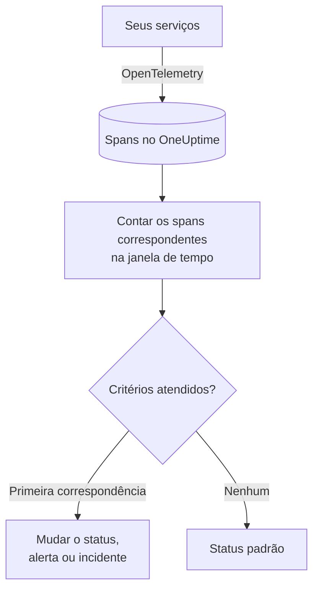

# Monitor de traces

Um monitor de traces conta, em uma janela de tempo, os spans que seus serviços enviam ao OneUptime e que correspondem aos seus filtros (nome do span, status, serviço, atributos). Quando a contagem atende aos seus critérios, ele muda o status do monitor, cria um alerta ou declara um incidente. Use-o para alertar sobre requisições com falha para um endpoint, um pico de spans de erro ou um serviço que parou de enviar traces.

:::cards
- [Criar o monitor](#criar-um-monitor-de-traces): Escolha quais spans contar e quando alertar.
- [Códigos de status de span](#códigos-de-status-de-span): O que OK, ERROR e UNSET significam, e por qual filtrar.
- [Como ele é avaliado](#como-ele-é-avaliado): A janela de tempo, a contagem e o ciclo de um minuto.
- [Critérios](#critérios): Limites, detecção de anomalias e os valores padrão.
:::

## Como funciona

A cada minuto, o OneUptime conta os spans que correspondem aos filtros do monitor e começaram dentro da sua janela de tempo. Ele compara essa contagem com os critérios do monitor de cima para baixo, e o primeiro critério que corresponde decide o que acontece. Quando nenhum corresponde, o monitor volta ao seu status padrão.

## Antes de começar

- Seus serviços enviam traces ao OneUptime pelo OpenTelemetry. Veja [OpenTelemetry](/docs/telemetry/open-telemetry).
- Procure no explorador de traces o nome exato do span que você quer observar: os nomes dos spans são definidos pela sua instrumentação, por exemplo `POST /api/checkout` ou `GET`.

## Criar um monitor de traces

:::steps
### Começar um novo monitor

Vá para **Monitores** e clique em **Criar monitor**.

### Escolher Traces

Em **Tipo de monitor**, clique em **Mais tipos de monitor** e escolha **Traços** em **Telemetria**, ou digite `traces` na caixa de pesquisa. Digite um **Nome** e clique em **Próximo**.

### Escolher os spans a contar

Em **Configuração do monitor de traces**, defina **Nome do span**, **Monitorar Traços por (tempo)** e **Filtrar por status do span**. Um filtro deixado vazio corresponde a todos os spans. **Pré-visualização de spans**, abaixo dos filtros, mostra os spans a que eles correspondem agora.

### Refinar (opcional)

Abra **Mais campos** para filtrar por serviço de telemetria, entidade de infraestrutura ou atributo.

### Definir os critérios

O cartão **Critérios do monitor** começa com dois critérios: offline, com um incidente, quando nenhum span corresponde; online quando pelo menos um corresponde. Altere-os para o que você quer alertar (veja [Critérios](#critérios)).

### Criar o monitor

Clique em **Criar monitor**. O monitor abre na sua página **Visão geral**, e sua primeira avaliação acontece em até um minuto.
:::

> [!TIP]
> Para saber quando um recurso de IA responde mal (respostas com falha, recusadas, cortadas, vazias, sinalizadas ou lentas), escolha **IA / LLM** em **Telemetria**. Esse monitor lê para você as chamadas de IA nos seus traces, sem filtros de span para escrever. Veja [Observabilidade de IA / LLM](/docs/telemetry/ai-llm-observability#seja-avisado-quando-a-ia-responder-mal).

## O que ele consulta

| Campo | Com o que corresponde | Padrão |
| --- | --- | --- |
| **Nome do span** | Spans cujo nome contém este texto, sem diferenciar maiúsculas de minúsculas. | Vazio: todos os spans |
| **Monitorar Traços por (tempo)** | Spans que começaram nos últimos 5 segundos até as últimas 24 horas. | **Último 1 minuto** |
| **Filtrar por status do span** | Spans com qualquer um dos status escolhidos: **Não definido**, **Ok** ou **Erro**. | Vazio: todos os status |
| **Filtrar por serviço de telemetria** (em **Mais campos**) | Spans de qualquer um dos serviços escolhidos. | Vazio: todos os serviços |
| **Filter by Infrastructure Entity** (em **Mais campos**) | Spans de qualquer um dos hosts, pods, contêineres e outras entidades escolhidos. | Vazio: todas as entidades |
| **Filtrar por atributos** (em **Mais campos**) | Spans cujos atributos atendem a todas as condições. Cada condição tem seu próprio operador, como "igual a" ou "contém". | Vazio: nenhuma condição |

Todos os filtros que você definir precisam corresponder para que um span seja contado.

### Códigos de Status de Span

- **OK** — A operação foi marcada explicitamente como bem-sucedida, pelo código do aplicativo ou por um pipeline de rastreamentos
- **ERROR** — A operação encontrou um erro
- **UNSET** — Nenhum status de erro foi definido. Este é o status padrão do OpenTelemetry

UNSET não significa que faltam dados. A instrumentação do OpenTelemetry define ERROR quando uma operação falha e deixa os spans bem-sucedidos como UNSET, por isso, em um serviço saudável, a maioria dos spans é UNSET. O OneUptime os exibe em verde como "Unset (no error)". Registrar uma exceção não altera o status de um span, portanto um span com status UNSET ainda pode ter exceções; elas são listadas junto com o span. Para alertar sobre falhas, filtre por ERROR. Para contar todos os spans que não falharam, selecione tanto OK quanto UNSET.

Se você quiser que as requisições bem-sucedidas apareçam como OK, adicione um pipeline de rastreamentos em **Traços > Configurações > Pipelines** com a condição de filtro **Status = Não definido** e um **Remapeador de status** que mapeie valores de `http.response.status_code`, como `200`, para Ok.

## Como ele é avaliado

- **A cada minuto.** Um monitor de traces não é verificado por sondas, por isso não tem intervalo para configurar nem página **Sondas e intervalo**.
- **Um número por avaliação.** O monitor conta os spans que correspondem a todos os filtros e começaram dentro de **Monitorar Traços por (tempo)** antes da avaliação. Com **Últimos 5 minutos**, cada avaliação olha cinco minutos para trás, então as janelas de avaliações consecutivas se sobrepõem.
- **Nenhum span é uma contagem de 0.** Um serviço que para de enviar traces produz 0, que é o que o critério offline padrão procura.
- **A indisponibilidade do próprio OneUptime não é silêncio.** Enquanto a janela de tempo contiver um período em que o próprio OneUptime não estava recebendo dados (estava reiniciando, sendo atualizado ou recuperando um atraso), a verificação espera: o status não muda, e nenhum incidente ou alerta é aberto ou resolvido. Veja [Quando o OneUptime não recebe dados](/docs/monitor/when-oneuptime-is-not-receiving).
- **Critérios de cima para baixo.** O primeiro critério que corresponde decide, então coloque o mais grave primeiro.

Cada mudança de status, com o motivo, fica registrada na **Linha do tempo de status** do monitor.

## Critérios

Os critérios de um monitor de traces têm um único **Tipo de filtro**: **Span Count**, o número de spans que corresponderam na janela. Escolha uma **Condição do filtro** e, para uma condição de limite, um **Valor**.

| Condição do filtro | Corresponde quando a contagem de spans está… |
| --- | --- |
| **Greater Than** | acima do valor |
| **Greater Than Or Equal To** | no valor ou acima |
| **Less Than** | abaixo do valor |
| **Less Than Or Equal To** | no valor ou abaixo |
| **Equal To** | exatamente no valor |
| **Anomalously High** | acima da faixa esperada para esta hora da semana |
| **Anomalously Low** | abaixo dessa faixa |
| **Anomalous** | fora dessa faixa, em qualquer direção |

As condições de anomalia não têm **Valor**. Escolha uma **Sensibilidade** (Low, Medium, a padrão, ou High) e uma **Janela de linha de base** de 14 (a padrão), 28, 60 ou 90 dias. O OneUptime transforma a contagem em uma taxa por minuto e a compara com a mesma hora da semana ao longo dessa janela. A linha de base cobre apenas os serviços e os status de span do monitor: seus filtros de nome do span e de atributos não fazem parte dela. Até que essa hora da semana tenha histórico suficiente, o critério ainda está aprendendo e não dispara.

Um novo monitor de traces começa com estes critérios:

| Critério | Filtro | Efeito |
| --- | --- | --- |
| Check if … is offline | **Span Count** **Equal To** `0` | Coloca o monitor offline e declara um incidente, resolvido automaticamente |
| Check if … is online | **Span Count** **Greater Than** `0` | Coloca o monitor online |

## Exemplo prático: requisições de checkout com falha

Em cinco minutos, o serviço de checkout registra 1.200 spans chamados `POST /api/checkout`: 1.150 UNSET, 20 OK e 30 ERROR. O mesmo monitor conta números muito diferentes conforme **Filtrar por status do span**:

| Filtrar por status do span | Span Count | O que mede |
| --- | --- | --- |
| **Erro** | 30 | As requisições que falharam |
| **Ok** | 20 | Só as requisições que o seu código marcou como bem-sucedidas |
| **Não definido** e **Ok** | 1.170 | Todas as requisições que não falharam |
| Vazio | 1.200 | Todas as requisições |

Para ser acionado quando mais de 10 requisições de checkout falharem em cinco minutos:

- **Nome do span**: `POST /api/checkout`
- **Monitorar Traços por (tempo)**: **Últimos 5 minutos**
- **Filtrar por status do span**: **Erro**
- Critério 1: **Span Count** **Greater Than** `10`: colocar o monitor offline e declarar um incidente
- Critério 2: **Span Count** **Less Than Or Equal To** `10`: colocar o monitor online

Com 30 requisições com falha, o critério 1 corresponde e o incidente é declarado. Depois que passam cinco minutos com 10 falhas ou menos, o critério 2 corresponde, o monitor volta a ficar online e o incidente se resolve sozinho.

## Solução de problemas

:::details O monitor não conta nenhum span para o meu endpoint
**Nome do span** é comparado com o nome do span, e a instrumentação costuma nomear os spans de servidor pela rota (`POST /api/checkout`) ou só pelo método (`GET`). Encontre o nome exato no explorador de traces. Depois abra a página **Critérios** do monitor (em **Configuração**) e clique em **Edit Monitoring Criteria**: **Pré-visualização de spans** mostra a que os filtros correspondem agora.
:::

:::details As requisições bem-sucedidas não são contadas quando filtro por Ok
A maioria das instrumentações deixa os spans bem-sucedidos como UNSET, não como OK (veja [Códigos de status de span](#códigos-de-status-de-span)). Selecione tanto **Não definido** quanto **Ok**, ou adicione o pipeline de rastreamentos descrito ali.
:::

:::details Um span tem uma exceção, mas não é contado como erro
Registrar uma exceção não altera o status de um span. Filtre por **Erro**, ou use um [monitor de exceções](/docs/monitor/exceptions-monitor) para alertar sobre as próprias exceções.
:::

:::details Um critério de anomalia nunca dispara
Ele ainda está aprendendo: a hora da semana com que compara ainda não tem histórico suficiente dentro da **Janela de linha de base**.
:::

## Próximos passos

:::cards
- [Monitor de exceções](/docs/monitor/exceptions-monitor): Alerte sobre as exceções que seus serviços registram.
- [Monitor de logs](/docs/monitor/logs-monitor): Alerte sobre o volume e o conteúdo dos logs.
- [Sintaxe de pesquisa](/docs/telemetry/search-syntax): Encontre nomes e status de spans no explorador de traces.
- [Modelos de incidentes e alertas](/docs/monitor/incident-alert-templating): Escreva títulos e descrições de alertas úteis.
:::
