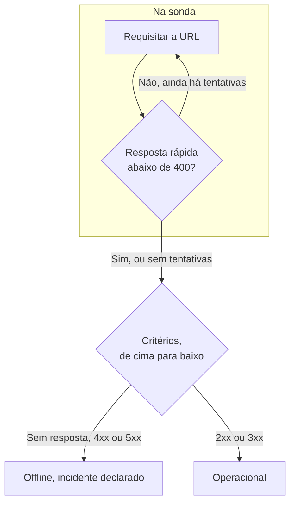

# Monitor de site

Um monitor de site verifica se uma página web responde. A cada verificação, uma sonda requisita a URL da página, e o monitor fica offline e declara um incidente quando a página não responde ou responde com um erro. Para chamar um endpoint com um método, cabeçalhos ou um corpo, use um [monitor de API](/docs/monitor/api-monitor).

:::cards
- [Criar o monitor](#criar-um-monitor-de-site): Seis etapas no painel.
- [Opções de configuração](#opções-de-configuração): Marcadores na URL, redirecionamentos, certificados, tempos limite e novas tentativas.
- [Critérios de monitoramento](#critérios-de-monitoramento): O que conta como no ar ou fora do ar, desde o início.
- [Solução de problemas](#solução-de-problemas): Quando o monitor e o seu navegador discordam.
:::

## Como funciona

A cada verificação, uma sonda requisita a URL, segue os redirecionamentos e registra o que voltou: o código de status, o tempo de resposta, os cabeçalhos e, quando um critério precisa dele, o corpo. Uma requisição que falha, excede o tempo limite, responde com um status `4xx` ou `5xx` ou demora mais de 10 segundos é tentada de novo, até o número de novas tentativas que você permitir. Depois, o OneUptime passa o resultado pelos critérios do monitor.



Quando nenhum dos critérios do monitor lê o corpo da resposta (um filtro **Corpo da Resposta** ou **JavaScript Expression**), a sonda envia uma requisição `HEAD` em vez de um `GET`, e a repete como `GET` se o servidor rejeitar `HEAD`. Os logs de acesso do seu servidor podem mostrar qualquer uma das duas.

Uma sonda que perdeu a própria conexão de rede não informa nenhum resultado, então não pode marcar o seu site como offline.

## Antes de começar

- **Uma função que possa criar monitores**: Project Owner, Project Admin, Project Member, Monitor Admin ou Monitor Member, ou uma função personalizada com a permissão Create Monitor.
- **Uma sonda que alcance o site.** As sondas padrão do seu projeto são escolhidas para cada monitor novo. Se um firewall protege o site, libere os [endereços IP das sondas do OneUptime Cloud](/docs/configuration/ip-addresses). Um site em uma rede privada precisa de uma [sonda personalizada](/docs/probe/custom-probe) dentro dessa rede, com permissão para alcançar endereços privados: veja [Acesso à rede privada](/docs/self-hosted/private-network-access).

## Criar um monitor de site

:::steps
### Começar um monitor novo

Acesse **Monitores** e clique em **Criar monitor**. Em **Tipo de monitor**, escolha **Site**.

### Dar um nome a ele

Informe um **Nome**, como `Marketing site`, e clique em **Próximo**.

### Informar a URL

Em **URL do site**, informe o endereço completo da página, incluindo `https://`, como `https://example.com`. Para alterar redirecionamentos, certificados, o tempo limite ou as novas tentativas, abra **Mais campos** logo abaixo (veja [Opções de configuração](#opções-de-configuração)).

### Testá-lo

Clique em **Testar monitor**, escolha uma sonda em **Selecionar Sonda** e clique em **Executar teste**. **Resultado do Teste do Monitor** mostra o que a sonda recebeu.

### Revisar os critérios

**Critérios do monitor** começa com os [critérios padrão](#critérios-padrão): offline quando o site não responde ou responde com um erro, online com qualquer status `2xx` ou `3xx`. Altere-os se precisar e clique em **Próximo**.

### Escolher as sondas e criar

Mantenha ou altere as **Sondas** e o **Intervalo de monitoramento** (começa em **A cada 5 minutos**) e clique em **Criar monitor**. A página do monitor abre.
:::

## Opções de configuração

### URL do site

A página a verificar, como URL completa com o esquema: `https://example.com`, `https://example.com/pricing` ou `http://example.com:8080/health`. Você pode colocar um [segredo de monitor](/docs/monitor/monitor-secrets) na URL como `{{monitorSecrets.NAME}}`, por exemplo um token na string de consulta.

### Marcadores dinâmicos na URL

Quando um CDN ou um proxy de cache fica na frente do site, a sonda pode receber a resposta do cache em vez do seu servidor. Para passar pelo cache, adicione um marcador à URL; a sonda o substitui por um valor novo a cada verificação.

| Marcador | Substituído por | Valor de exemplo |
| --- | --- | --- |
| `{{timestamp}}` | O horário Unix atual, em segundos | `1719500000` |
| `{{random}}` | Uma string aleatória e única de 32 caracteres hexadecimais | `3f2b8c1d9e7a4b6c8d0e1f2a3b4c5d6e` |

Uma URL com um marcador:

```text
https://example.com/health?cb={{timestamp}}
```

O que a sonda requisita em duas verificações com cinco minutos de intervalo:

```text
https://example.com/health?cb=1719500000
https://example.com/health?cb=1719500300
```

Use `{{random}}` da mesma forma: `https://example.com/health?nocache={{random}}`.

### Mais campos

Estas configurações ficam recolhidas em **Mais campos**, abaixo da URL. O cabeçalho recolhido as lista e mostra quais você alterou.

| Campo | Padrão | O que faz |
| --- | --- | --- |
| **Não seguir redirecionamentos** | Desativado | Avaliar a primeira resposta em vez de seguir os redirecionamentos. Veja [abaixo](#não-seguir-redirecionamentos). |
| **Permitir certificados autoassinados** | Desativado | Pular a validação do certificado TLS para o próprio nome de host do monitor. |
| **Usar certificado de cliente (mTLS)** | Desativado | Apresentar um certificado de cliente e uma chave privada. Veja [Certificado de cliente (mTLS)](#certificado-de-cliente-mtls). |
| **Tempo Limite da Requisição (segundos)** | `60` | Quanto esperar por cada tentativa. O máximo é 60 segundos. |
| **Tentativas em caso de falha** | Padrão da sonda, geralmente `3` | Quantas vezes repetir uma tentativa que falhou. O máximo é 3. Veja [Novas tentativas e tempos limite](#novas-tentativas-e-tempos-limite). |

#### Não seguir redirecionamentos

Por padrão, a sonda segue os redirecionamentos (`301`, `302`, `303`, `307` e `308`), até 10, e avalia a página em que termina. Ative **Não seguir redirecionamentos** para avaliar a própria resposta de redirecionamento, por exemplo para verificar se `http://` redireciona para `https://`. Os [critérios padrão](#critérios-padrão) contam uma resposta de redirecionamento como online.

**Permitir certificados autoassinados** segue os redirecionamentos que ficam no próprio nome de host do monitor. Um redirecionamento para outro nome de host é verificado normalmente.

#### Certificado de cliente (mTLS)

Se o site exige TLS mútuo, ative **Usar certificado de cliente (mTLS)** e preencha:

| Campo | O que informar |
| --- | --- |
| **Certificado do cliente (PEM)** | O certificado de cliente codificado em PEM a apresentar. |
| **Chave privada do cliente (PEM)** | A chave privada correspondente, codificada em PEM. |
| **Senha da chave privada do cliente** | Opcional. A senha, somente se a chave privada estiver criptografada. |

Equivale às opções `--cert` e `--key` do curl:

```bash
curl --cert client.crt --key client.key https://example.com/health
```

Para manter a chave fora das configurações do monitor, guarde o certificado e a chave como [segredos de monitor](/docs/monitor/monitor-secrets) e informe `{{monitorSecrets.NAME}}` nesses campos. Os segredos são preenchidos no servidor, e os valores deles nunca aparecem no painel.

O certificado de cliente só é apresentado enquanto a requisição permanece na origem da URL do monitor (o mesmo esquema, host e porta). Depois de um redirecionamento para outra origem, a sonda continua sem ele.

#### Novas tentativas e tempos limite

**Tentativas em caso de falha** conta as novas tentativas _depois_ da primeira, então `0` executa a verificação uma vez e `2` até três vezes. Em branco, usa o padrão da sonda: 3, a menos que `PROBE_MONITOR_RETRY_LIMIT` da sonda diga outra coisa. A sonda espera um segundo entre as tentativas, e cada tentativa recebe o **Tempo Limite da Requisição (segundos)** inteiro.

Estas falhas são repetidas: erros de conexão, tempos limite excedidos, respostas `4xx` e `5xx` e respostas mais lentas que 10 segundos. Estas não, porque tentar de novo não muda nada: uma URL inválida ou bloqueada, mais de 10 redirecionamentos e uma resposta maior que 512 KiB.

## Critérios de monitoramento

Os critérios decidem quando o site conta como online, degradado ou offline, e se isso declara um incidente ou cria um alerta. Cada critério verifica um ou mais filtros:

| Filtro | Condições | O que verifica |
| --- | --- | --- |
| **Is Online** | **Verdadeiro**, **Falso** | Se o site respondeu, seja qual for o código de status. |
| **Código de status da resposta** | **Equal To**, **Not Equal To**, **Greater Than**, **Less Than**, **Greater Than Or Equal To**, **Less Than Or Equal To** | O código de status HTTP. |
| **Tempo de resposta (em ms)** | **Greater Than**, **Less Than**, **Greater Than Or Equal To**, **Less Than Or Equal To** | Quanto a requisição demorou, redirecionamentos incluídos. |
| **Corpo da Resposta** | **Contém**, **Not Contains** | Texto no corpo da resposta. A comparação diferencia maiúsculas de minúsculas. |
| **Response Header** | **Contém**, **Not Contains** | Se a resposta tem um cabeçalho com este nome. Informe o nome em minúsculas, como `x-cache`. |
| **Response Header Value** | **Contém**, **Not Contains** | Se um cabeçalho tem exatamente este valor, comparado em minúsculas, como `no-store`. |
| **JavaScript Expression** | **Evaluates To True** | Uma expressão sobre a resposta. Veja [Expressões JavaScript](/docs/monitor/javascript-expression). |
| **Is Request Timeout** | **Verdadeiro**, **Falso** | Se a requisição excedeu o tempo limite em todas as tentativas. |

**Adicionar critérios** adiciona um critério que já leva o nome do filtro, por exemplo _Response Time (in ms) is above 3000_. O nome muda com os filtros até você digitar um nome seu. A descrição é opcional: para adicionar uma, abra as **Configurações** do critério.

Com dois ou mais filtros, **Condição de correspondência** decide se **Todos** precisam corresponder ou se basta **Qualquer** um. As **Ações** de um critério decidem o que ele faz: mudar o status do monitor, criar um alerta, declarar um incidente, ou várias dessas coisas.

### Critérios padrão

Um monitor de site novo começa com dois critérios, então funciona sem que você altere nada:

- **Offline** — o site não responde, ou responde com um código de status `400` ou maior (ou menor que `200`). O monitor é marcado como **Offline** e um incidente é criado. O incidente se resolve sozinho quando o site volta.
- **No ar** — o site responde com qualquer código de status `2xx` ou `3xx`, como `200`, `204` ou `301`. O monitor é marcado como **Operacional**.

Na lista de critérios, eles levam o nome do monitor: _Check if (name) is offline_ e _Check if (name) is online_.

Então uma página que responde `204 No Content`, ou um redirecionamento que você vigia com **Não seguir redirecionamentos** ativado, conta como no ar. Se para você só um código de status significa que está saudável, altere os dois critérios na página **Configuração → Critérios** do monitor: por exemplo **Código de status da resposta** / **Equal To** / `200` no critério online e **Not Equal To** / `200` no critério offline, no lugar dos dois filtros de código de status que cada um tem.

Os critérios são verificados de cima para baixo, e o primeiro que corresponde decide o que acontece.

Quando nenhum corresponde, o monitor volta ao status padrão: **Operacional**, a menos que você escolha outro em **Mais campos**, abaixo dos critérios. O cabeçalho recolhido de **Mais campos** mostra qual é esse status.

Os monitores criados antes de o OneUptime mudar esses padrões mantêm os critérios com que foram criados, que contam apenas `200` como online. Os monitores criados pela API ou pelo Terraform usam os critérios que você envia.

### Avaliar durante um período de tempo

**Avaliar este critério durante um período de tempo** é uma caixa de seleção abaixo de um filtro, oferecida para **Is Online**, **Código de status da resposta** e **Tempo de resposta (em ms)**. Ative-a para avaliar uma janela de verificações anteriores em vez da última: escolha uma agregação em **Avaliar** e uma janela, de 2 a 60 minutos, em **Nos últimos (em minutos)**.

| Agregação | Corresponde quando |
| --- | --- |
| **Média**, **Soma**, **Maximum Value**, **Minimum Value** | Esse valor, na janela, atende à condição. Somente filtros numéricos. |
| **All Values** | Cada verificação na janela atende à condição. |
| **Any Value** | Pelo menos uma verificação na janela atende à condição. |

**All Values** só corresponde quando a janela está realmente coberta por dados. Um monitor recém-criado, ou um cujas verificações deixaram de ser registradas, não tem histórico suficiente para dizer algo sobre os últimos N minutos, então o critério espera em vez de corresponder com a única leitura que tem. **Any Value** é a configuração para "me avise no momento em que uma única verificação ultrapassar o limite" e continua disparando imediatamente.

**Se não houver dados** decide o que acontece enquanto a janela não consegue sustentar o critério:

| Opção | O que acontece | Use para |
| --- | --- | --- |
| **Ignore** (padrão) | O critério não corresponde. | Alertas de limite comuns. |
| **Trigger** | A falta de dados conta como o problema. | Verificações em que o silêncio é em si uma falha. |
| **Treat As Zero** | A janela é comparada como um único zero. | Contadores em que nenhum evento significa realmente zero. |

### Exemplos de critérios

| Objetivo | Filtro | Condição | Valor |
| --- | --- | --- | --- |
| Marcar o site como degradado quando estiver lento | **Tempo de resposta (em ms)** | **Greater Than** | `3000` |
| Detectar uma página de erro servida com `200` | **Corpo da Resposta** | **Not Contains** | `Welcome` |
| Verificar se um cabeçalho do CDN está presente | **Response Header** | **Contém** | `x-cache` |
| Aceitar apenas `200` como saudável | **Código de status da resposta** | **Equal To** | `200` |

## Solução de problemas

:::details O monitor está offline, mas o site carrega no meu navegador
A sonda recebeu uma resposta diferente da do seu navegador. A causa raiz do incidente, e **Registros de monitoramento** no monitor, mostram o que a sonda viu. Causas comuns:

- Um firewall ou um filtro de bots bloqueia as sondas. Libere os [endereços IP das sondas do OneUptime Cloud](/docs/configuration/ip-addresses).
- O site só é acessível na sua rede. Use uma [sonda personalizada](/docs/probe/custom-probe) dentro dela.
- O certificado é autoassinado ou de uma autoridade privada. Ative **Permitir certificados autoassinados**, ou monitore o certificado separadamente com um [monitor de certificado SSL](/docs/monitor/ssl-certificate-monitor).
:::

:::details A verificação falha com "Remote response exceeded the allowed size."
A sonda lê no máximo 512 KiB de uma resposta, e esta página é maior. Aponte o monitor para uma página menor, como um endpoint de saúde, ou remova os filtros **Corpo da Resposta** e **JavaScript Expression** para que a sonda só precise dos cabeçalhos.
:::

:::details A verificação falha com "Monitor target exceeded 10 redirects."
A URL redireciona mais de 10 vezes, geralmente em um loop. Abra a URL com `curl -IL` para ver a cadeia, e aponte o monitor para a página em que a cadeia deveria terminar.
:::

:::details A verificação falha com uma mensagem sobre um endereço de rede privada
A URL é resolvida para um endereço privado, e a sonda que executou a verificação não tem permissão para alcançar endereços privados. Em uma sonda auto-hospedada, ative isso com `PROBE_ALLOW_PRIVATE_NETWORK_MONITORS`: veja [Acesso à rede privada](/docs/self-hosted/private-network-access).
:::

## Próximos passos

:::cards
- [Monitor de API](/docs/monitor/api-monitor): Chamar um endpoint com um método, cabeçalhos e um corpo.
- [Monitor de certificado SSL](/docs/monitor/ssl-certificate-monitor): Ser avisado antes que o certificado do site expire.
- [Segredos do monitor](/docs/monitor/monitor-secrets): Manter tokens e chaves fora das configurações do monitor.
- [Incidentes](/docs/incidents/index): O que acontece depois que o monitor declara um.
:::
