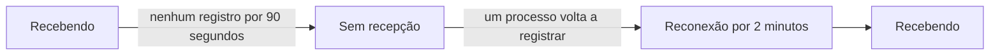

# Quando o OneUptime não recebe dados

Enquanto o OneUptime reinicia, é atualizado ou processa um atraso, nada do que seus agentes, coletores, sondas e emissores de heartbeat enviam consegue chegar aos seus monitores. O OneUptime registra quando isso acontece e nunca conta esse tempo contra um servidor, um host ou qualquer outro recurso: esse tempo não foi monitorado, então não é tempo de inatividade.

## Como funciona

Cada processo do OneUptime que recebe dados registra a cada 30 segundos que está recebendo, desde que consiga alcançar os bancos de dados onde guarda os dados. O OneUptime deixa de fora três tipos de tempo:

- Sem recepção: nenhum processo registrou nada por mais de 90 segundos. O OneUptime estava parado, reiniciando ou sendo atualizado, ou não conseguia alcançar um dos seus bancos de dados.
- Reconexão: os primeiros 2 minutos depois que o OneUptime volta a receber, enquanto os agentes se reconectam e enviam o que guardaram.
- Recuperação do atraso: enquanto a fila de dados aguardando processamento está mais de um minuto atrasada, o tempo desde os dados mais antigos que ainda aguardam nela.



Uma reinicialização que leva menos de 90 segundos não é uma interrupção: os coletores enviam de novo o que não conseguiram entregar.

## O que muda durante esse tempo

| Onde | O que o OneUptime faz |
| --- | --- |
| Monitores de servidor / VM | **Is Online** conta apenas os minutos em que o OneUptime estava recebendo: por padrão, um servidor fica offline após 3 minutos de silêncio que o OneUptime poderia ter ouvido. |
| Monitores de requisições recebidas e de e-mails recebidos | **Recieved In Minutes** e **Not Recieved In Minutes** contam apenas os minutos em que o OneUptime estava recebendo. Quando um desses critérios é atendido, o motivo informa quantos desses minutos foram deixados de fora. |
| Monitores de host, Kubernetes, Docker, métricas, logs, traces e os demais monitores que leem telemetria | Uma verificação cuja janela contém tempo sem recepção espera até que esse tempo saia da janela, e nunca mais de 15 minutos depois que ele terminou. Até lá nada muda: nenhuma mudança de status, e nenhum incidente ou alerta é aberto ou resolvido. Enquanto a fila está atrasada, uma verificação lê até onde a fila está em vez de até agora. |
| Hosts, clusters e o restante do inventário | Um recurso passa a **Desconectado** apenas depois que seu limite de silêncio, 15 minutos para a maioria, transcorre enquanto o OneUptime estava recebendo. |
| Sondas e agentes de IA | Passam a **Desconectado** após 3 minutos de silêncio enquanto o OneUptime estava recebendo. |
| Gráficos de **Disponibilidade** de hosts, hosts Docker e Podman e clusters Kubernetes | Esse tempo é sombreado como **Não monitorado**, e a linha se interrompe ali em vez de cair para fora do ar. O selo de uptime deixa esse tempo de fora; um intervalo com dados continua contando como no ar. |
| Uptime das páginas de status e SLOs | Ambos são calculados a partir dos status dos monitores: sem uma falsa mudança de status, não há falso tempo de inatividade. |

> [!NOTE]
> Deixar tempo de fora não é preenchê-lo. Um recurso nunca é mostrado como no ar por um tempo em que o OneUptime não podia ouvi-lo: esse tempo simplesmente não é julgado. Assim que o OneUptime volta a receber, um recurso que realmente está fora do ar é julgado, a partir daí, pelo que envia ou deixa de enviar.

## Instalações auto-hospedadas

### Na inicialização

Enquanto um processo do OneUptime inicia, ele responde a toda requisição, exceto às suas verificações de status, com `503 Service Unavailable` e `Retry-After: 5`, e um navegador recebe uma página que se recarrega sozinha. Os coletores e SDKs do OpenTelemetry enviam uma requisição assim de novo em vez de descartar os dados. `/status/ready` falha até que o processo esteja pronto, então o Kubernetes não lhe envia tráfego antes disso.

### Réplicas worker

Um processo só registra que o OneUptime está recebendo quando o tráfego de entrada consegue alcançá-lo. Se você executa réplicas que apenas processam filas, sem um ingress na frente, defina `RECEIVES_INGRESS_TRAFFIC` como `false` nelas. Caso contrário, elas continuam registrando enquanto todas as réplicas que recebem tráfego estão fora do ar, e essa interrupção volta a contar contra seus recursos. O chart Helm já define isso nos seus pods worker, e um único contêiner do OneUptime não precisa de nada.

```yaml title="Contêiner worker"
env:
  - name: RECEIVES_INGRESS_TRAFFIC
    value: "false"
```

### O que é registrado

O OneUptime começa a manter esse registro quando você atualiza para uma versão que o inclui; o tempo anterior é julgado como sempre foi. Enquanto nenhum processo registra que está recebendo, o tempo desde o último registro é tratado como uma interrupção por no máximo uma hora; depois disso, o silêncio volta a contar, de modo que um registro que deixou de ser escrito não consegue esconder por muito tempo uma queda dos seus recursos. Os registros são mantidos por 400 dias, e quando o OneUptime não consegue lê-los, ele julga o silêncio como se tivesse recebido o tempo todo.

## Próximos passos

:::cards
- [Monitor de hosts](/docs/monitor/host-monitor): Alertar sobre as métricas de um host.
- [Monitor de servidor / VM](/docs/monitor/server-monitor): Saber quando o agente de um servidor para de reportar.
- [Monitor de requisições recebidas](/docs/monitor/incoming-request-monitor): Transformar um heartbeat em um interruptor de homem morto.
- [Atualização](/docs/installation/upgrading): Atualizar uma instalação auto-hospedada.
:::
