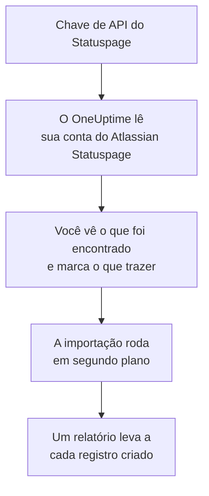

# Migrar do Atlassian Statuspage

**Importar de outra ferramenta** traz suas páginas do Atlassian Statuspage para o OneUptime em poucos minutos. Com uma chave de API do Statuspage, o OneUptime lê suas páginas, os componentes e grupos delas e seus assinantes de e-mail, mostra o que encontrou e cria o que você marcar. Nada muda no Statuspage.

:::cards
- [Importe sua conta](#importe-sua-conta-do-atlassian-statuspage): Crie uma chave, leia sua conta e marque o que trazer.
- [O que é trazido](#o-que-é-trazido): O que cada página, componente e assinante do Statuspage vira no OneUptime.
- [Conclua a troca](#conclua-a-troca): O que fazer quando a importação terminar.
:::

## Como funciona

- **A chave é usada uma vez.** Ela fica criptografada enquanto o OneUptime lê sua conta e é excluída assim que a leitura termina, tenha funcionado ou não. Nunca é mostrada de novo nem gravada em um log.
- **O OneUptime só lê.** Ele chama apenas a API do Atlassian Statuspage: `api.statuspage.io`. Ele faz uma requisição por segundo, o máximo que o Statuspage permite a uma chave. Quando o Atlassian Statuspage pede para ir mais devagar, ele espera e tenta de novo.
- **Nada é criado até você iniciar a importação.** A pré-visualização mostra, para cada item, se ele é novo, se já está no OneUptime (e é usado como está), se foi trazido por uma importação anterior ou por que não pode ser trazido.
- **Executá-la de novo nunca cria nada em dobro.** O OneUptime lembra o que cada importação trouxe, pelo ID do Atlassian Statuspage. Execute de novo depois de adicionar páginas ou componentes no Atlassian Statuspage, e só os novos são criados.

## Antes de começar

- **Um projeto do OneUptime e o direito de criar o que você traz.** Proprietários e administradores do projeto podem trazer tudo. Outros papéis também podem executar uma importação e trazer os tipos de registro que podem criar. O resto aparece como não trazido, com o motivo.
- **Uma chave de API do Statuspage.** Somente um proprietário da conta pode criar uma. A importação nunca grava no Statuspage e lê cada página que a chave consegue ver.
- **Espaço para suas páginas, no OneUptime Cloud.** Seu plano tem espaço para um certo número de páginas de status e assinantes. O que não couber aparece como não trazido. Os componentes viram monitores manuais, que são gratuitos.

## Importe sua conta do Atlassian Statuspage

:::steps
### Crie uma chave de API no Statuspage
No Statuspage, selecione seu avatar no canto inferior esquerdo e depois **API info**. Selecione **Create key**, dê a ela o nome `OneUptime import` e copie-a.

### Abra a página de importação
No OneUptime, vá em **Configurações do projeto** > **Importar de outra ferramenta** e selecione **Atlassian Statuspage**.

### Conecte o Atlassian Statuspage
Cole a chave em **Chave de API do Atlassian Statuspage** e selecione **Ler minha conta do Atlassian Statuspage**. Uma conta grande leva alguns minutos, e você pode sair da página enquanto ela é lida.

### Marque o que trazer
A pré-visualização lista o que foi encontrado, com uma seção por tipo. Tudo o que seria criado começa marcado, exceto os assinantes. Abaixo de cada item, o OneUptime diz o que não será trazido exatamente como era. Quando uma página de status marcada mostra um monitor que você deixou desmarcado, ele avisa, e **Marcar também** o marca. Para trazer assinantes, marque-os e confirme abaixo deles que eles concordaram em receber suas atualizações e que você pode transferi-los. Ninguém recebe e-mail.

### Inicie a importação
Selecione **Iniciar importação**. A importação roda em segundo plano: você pode sair da página, e o relatório espera por você lá.
:::

O relatório conta o que foi criado e não trazido, e lista cada item com um link para o registro em que ele se transformou, falhas primeiro. As importações anteriores aparecem em **Importações anteriores** na mesma página.

## O que é trazido

| No Atlassian Statuspage | No OneUptime | Como |
| --- | --- | --- |
| Components | Monitores manuais | Cada componente vira um monitor manual que a página de status mostra. Nada o verifica: você define o status dele no OneUptime, como fazia no Statuspage. Um grupo de componentes vira um grupo na página. |
| Pages | Páginas de status | Cada página é trazida com nome e descrição, seus componentes nos grupos deles, e disponibilidade e histórico dos componentes que ela destaca. Uma página que só algumas pessoas podem ver é trazida como privada. |
| Email subscribers | Assinantes da página de status | Os assinantes de e-mail confirmados são trazidos quando você confirma que pode transferi-los, e seguem os mesmos componentes. Ninguém recebe e-mail, e cada atualização que eles recebem do OneUptime tem um link para cancelar a inscrição. |

Os componentes são trazidos como operacionais. A pré-visualização nomeia cada um que não está operacional no Statuspage agora, para você definir o status depois da importação.

## O que não é trazido

- **Incidentes, manutenções programadas e seu histórico.** Um incidente no OneUptime é um registro vivo que aciona pessoas, então os passados ficam no Statuspage.
- **Assinantes por SMS, webhook, Slack ou Microsoft Teams.** A pré-visualização os conta. Só os assinantes de e-mail são trazidos.
- **Modelos de incidente e métricas do sistema.** Adicione no OneUptime o que você ainda precisar.
- **O domínio próprio e a marca de uma página de status.** No OneUptime, adicione o domínio em **Domínios personalizados** e o logotipo em **Marca**.

## Limites

Uma importação cria no máximo 2.000 registros: no máximo 1.000 monitores e 50 páginas de status. Os assinantes não contam para esse total: uma importação traz no máximo 5.000 assinantes. O que passar de um limite aparece como não trazido. Execute a importação de novo para trazer o restante.

No OneUptime Cloud, páginas de status e assinantes que não cabem no seu plano aparecem como não trazidos, com o que precisam.

Uma pré-visualização é guardada por um dia. Só a pessoa que leu a conta pode marcar itens e iniciá-la. Proprietários e administradores do projeto veem o progresso e o relatório de cada importação.

## Conclua a troca

:::steps
### Confira suas páginas de status
Em **Páginas de status**, abra cada página e compare-a com a do Statuspage. Cada componente é um monitor manual: mude o status dele no OneUptime quando algo mudar.

### Aponte o endereço da sua página de status para o OneUptime
Em **Páginas de status**, abra a página, adicione seu domínio em **Domínios personalizados** e depois altere o registro DNS dele. Assim, seus visitantes e assinantes chegam à nova página.

### Desative sua página no Atlassian Statuspage
Quando seu domínio apontar para o OneUptime, feche a página no Statuspage para que os assinantes dela não sejam avisados duas vezes.
:::

## Solução de problemas

:::details O Atlassian Statuspage não aceitou a chave de API
Confira se você copiou a chave inteira e se um proprietário da conta a criou em **API info**. Uma chave pertence a uma organização do Statuspage e lê só as páginas dela. Depois selecione **Tentar novamente**.
:::

:::details Os assinantes não podem ser trazidos
Marque a caixa abaixo deles que confirma que eles concordaram em receber suas atualizações e que você pode transferi-los: **Iniciar importação** espera por ela. Assinantes que nunca confirmaram a inscrição no Statuspage ficam lá.
:::

:::details Alguns itens não podem ser marcados
Cada um diz o motivo: um nome que o projeto já tem, algo que uma importação anterior trouxe, ou um registro que você não tem permissão para criar ou que seu plano não inclui.
:::

## Próximos passos

:::cards
- [Visão geral das páginas de status](/docs/status-pages/index): O que uma página de status mostra e quem pode vê-la.
- [Assinantes e comunicados](/docs/status-pages/subscribers): Como os assinantes ficam sabendo dos incidentes.
- [Monitor manual](/docs/monitor/manual-monitor): Um monitor cujo status você mesmo define.
:::
