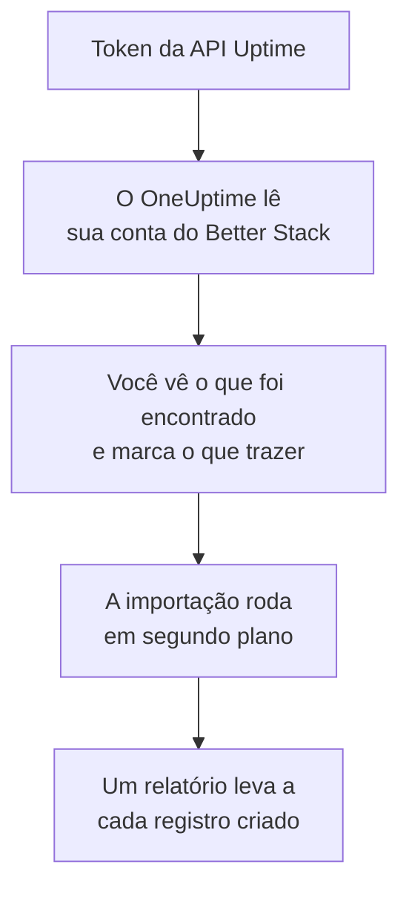

# Migrar do Better Stack

**Importar de outra ferramenta** traz seus monitores Uptime, heartbeats e páginas de status do Better Stack para o OneUptime em poucos minutos. Com um token da API Uptime do Better Stack, o OneUptime lê seus monitores, heartbeats, páginas de status e os assinantes de e-mail delas, mostra o que encontrou e cria o que você marcar. Nada muda no Better Stack.

:::cards
- [Importe sua conta](#importe-sua-conta-do-better-stack): Crie um token, leia sua conta e marque o que trazer.
- [O que é trazido](#o-que-é-trazido): O que cada monitor, heartbeat e página de status do Better Stack vira no OneUptime.
- [Conclua a troca](#conclua-a-troca): O que fazer quando a importação terminar.
:::

## Como funciona

- **A chave é usada uma vez.** Ela fica criptografada enquanto o OneUptime lê sua conta e é excluída assim que a leitura termina, tenha funcionado ou não. Nunca é mostrada de novo nem gravada em um log.
- **O OneUptime só lê.** Ele chama apenas a API do Better Stack: `incidents.betterstack.com`. Quando o Better Stack pede para ir mais devagar, ele espera e tenta de novo.
- **Nada é criado até você iniciar a importação.** A pré-visualização mostra, para cada item, se ele é novo, se já está no OneUptime (e é usado como está), se foi trazido por uma importação anterior ou por que não pode ser trazido.
- **Executá-la de novo nunca cria nada em dobro.** O OneUptime lembra o que cada importação trouxe, pelo ID do Better Stack. Execute de novo depois de adicionar monitores ou heartbeats no Better Stack, e só os novos são criados.

## Antes de começar

- **Um projeto do OneUptime e o direito de criar o que você traz.** Proprietários e administradores do projeto podem trazer tudo. Outros papéis também podem executar uma importação e trazer os tipos de registro que podem criar. O resto aparece como não trazido, com o motivo.
- **Um token da API Uptime do Better Stack.** Use um token Uptime de equipe: ele lê os monitores, heartbeats e páginas de status dessa equipe. A importação nunca grava no Better Stack.
- **Uma forma de pagamento, no OneUptime Cloud.** Monitores que fazem verificações são cobrados conforme o uso, mesmo no plano Free, então adicione uma em **Configurações do projeto** > **Cobrança** antes de importar. Sem ela, esses monitores aparecem como não trazidos.

## Importe sua conta do Better Stack

:::steps
### Crie um token de API no Better Stack
No Better Stack, vá em **API tokens** > **Team-based tokens** e selecione sua equipe. Em **Uptime API tokens**, crie um token chamado `OneUptime import` e copie-o.

### Abra a página de importação
No OneUptime, vá em **Configurações do projeto** > **Importar de outra ferramenta** e selecione **Better Stack**.

### Conecte o Better Stack
Cole o token em **Chave de API do Better Stack** e selecione **Ler minha conta do Better Stack**. Uma conta grande leva alguns minutos, e você pode sair da página enquanto ela é lida.

### Marque o que trazer
A pré-visualização lista o que foi encontrado, com uma seção por tipo. Tudo o que seria criado começa marcado, exceto monitores pausados, que são trazidos pausados se você os marcar, e assinantes. Abaixo de cada item, o OneUptime diz o que não será trazido exatamente como era. Quando uma página de status marcada mostra um monitor que você deixou desmarcado, ele avisa, e **Marcar também** o marca. Para trazer assinantes, marque-os e confirme abaixo deles que eles concordaram em receber suas atualizações e que você pode transferi-los. Ninguém recebe e-mail.

### Inicie a importação
Selecione **Iniciar importação**. A importação roda em segundo plano: você pode sair da página, e o relatório espera por você lá.
:::

O relatório conta o que foi criado e não trazido, e lista cada item com um link para o registro em que ele se transformou, falhas primeiro. As importações anteriores aparecem em **Importações anteriores** na mesma página.

## O que é trazido

| No Better Stack | No OneUptime | Como |
| --- | --- | --- |
| Monitors and heartbeats | Monitores | Cada monitor vira um monitor do mesmo tipo, com o mesmo endereço, intervalo e tempo limite. Cada heartbeat vira um monitor de requisições recebidas. |
| Status pages | Páginas de status | Cada página é trazida com suas seções como grupos e os monitores e heartbeats que mostra. Um item que você acompanha à mão vira um monitor manual. Uma página com senha ou lista de IPs permitidos é trazida como privada. |
| Email subscribers | Assinantes da página de status | Os assinantes de e-mail confirmados são trazidos quando você confirma que pode transferi-los, e seguem os mesmos recursos. Ninguém recebe e-mail, e cada atualização que eles recebem do OneUptime tem um link para cancelar a inscrição. |

- **Monitores status, expected status code, keyword e keyword absence** viram monitores de site, ou monitores de API quando enviam outro método, cabeçalhos ou um corpo JSON. Um monitor status fica disponível com qualquer resposta 2xx, e um monitor expected status code com os códigos que ele lista.
- **Monitores de ping e TCP** viram monitores de ping e de porta. **Monitores SMTP, POP e IMAP** viram monitores de porta na porta deles: o OneUptime verifica se a porta responde, não a conversa de e-mail.
- **Monitores DNS** viram monitores DNS do nome que consultam, perguntando ao mesmo servidor.
- **Heartbeats** viram monitores de requisições recebidas, que caem quando nenhuma requisição chega durante o período e a tolerância. Cada um tem um novo endereço no OneUptime.
- **Avisos de expiração SSL.** Um monitor que avisa antes de o certificado expirar ganha também um monitor de certificado SSL, com o nome dele, que avisa com os mesmos dias de antecedência.

Cada monitor é verificado pelas sondas do seu projeto, como um que você mesmo cria. Um intervalo que o OneUptime não oferece vira o mais próximo que ele oferece, e um tempo limite de mais de um minuto vira um minuto. A pré-visualização avisa quando algum dos dois muda.

## O que não é trazido

- **O histórico de disponibilidade, os tempos de resposta e os incidentes.** O OneUptime começa a verificar quando a importação termina.
- **Os contatos de alerta e as integrações.** Escolha quem é avisado no OneUptime, como descrito em [Conclua a troca](#conclua-a-troca).
- **Senhas, e cabeçalhos que podem conter um segredo.** Um monitor que faz login, ou que envia um cabeçalho `Authorization`, de cookie ou de token, é trazido sem ele: adicione-o com um [segredo de monitor](/docs/monitor/monitor-secrets).
- **Monitores UDP e Playwright.** O OneUptime não tem monitor que faça o mesmo, e a pré-visualização nomeia cada um.
- **Assinantes que nunca confirmaram a inscrição.** Eles ficam no Better Stack.
- **O que uma página de status mostra além de monitores, heartbeats e itens acompanhados à mão.** A pré-visualização nomeia cada um.
- **O domínio próprio e a marca de uma página de status.** No OneUptime, adicione o domínio em **Domínios personalizados** e o logotipo em **Marca**.

## Limites

Uma importação cria no máximo 2.000 registros: no máximo 1.000 monitores e 50 páginas de status. Os assinantes não contam para esse total: uma importação traz no máximo 5.000 assinantes. O que passar de um limite aparece como não trazido. Execute a importação de novo para trazer o restante.

No OneUptime Cloud, monitores que fazem verificações precisam de uma forma de pagamento, e o que não cabe no seu plano aparece como não trazido, com o que precisa.

Uma pré-visualização é guardada por um dia. Só a pessoa que leu a conta pode marcar itens e iniciá-la. Proprietários e administradores do projeto veem o progresso e o relatório de cada importação.

## Conclua a troca

:::steps
### Confira seus monitores
Abra cada um em **Monitores** e confira os primeiros resultados. Um monitor de heartbeat tem um novo endereço: aponte para ele a tarefa que o chama.

### Escolha quem é avisado
Adicione proprietários aos seus monitores, ou uma política de plantão em **Plantão** > **Políticas de plantão** aos incidentes que eles abrem, para que as pessoas certas saibam quando algo cair.

### Aponte o endereço da sua página de status para o OneUptime
Em **Páginas de status**, abra a página, adicione seu domínio em **Domínios personalizados** e depois altere o registro DNS dele. Assim, seus visitantes e assinantes chegam à nova página.

### Desative as verificações no Better Stack
Quando o OneUptime verificar as mesmas coisas, pause as verificações no Better Stack para ninguém ser avisado duas vezes.
:::

## Solução de problemas

:::details O Better Stack não aceitou a chave de API
Confira se você copiou o token inteiro e se ele é o token da equipe em **Uptime API tokens**, e não um de Telemetry. Depois selecione **Tentar novamente**.
:::

:::details Um monitor aparece como não trazido
Ele diz o motivo: um tipo de monitor que o OneUptime não tem, um endereço que o OneUptime não consegue ler, ou um projeto sem espaço ou sem forma de pagamento para ele. Um monitor que o OneUptime já executa, com o mesmo nome, tipo e endereço, é usado como está.
:::

:::details Alguns itens não podem ser marcados
Cada um diz o motivo: um nome que o projeto já tem, algo que uma importação anterior trouxe, ou um registro que você não tem permissão para criar ou que seu plano não inclui.
:::

## Próximos passos

:::cards
- [Monitor de requisições recebidas](/docs/monitor/incoming-request-monitor): Como um heartbeat funciona no OneUptime.
- [Visão geral das páginas de status](/docs/status-pages/index): O que uma página de status mostra e quem pode vê-la.
- [Migrar do UptimeRobot](/docs/moving-to-oneuptime/uptimerobot): Traga suas verificações do UptimeRobot.
:::
