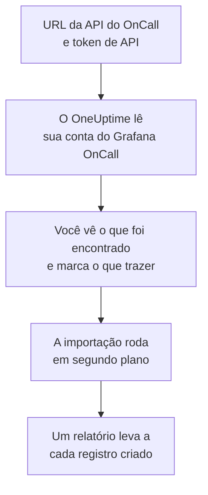

# Migrar do Grafana OnCall

A Grafana Labs arquivou a versão de código aberto do Grafana OnCall em março de 2026, e no Grafana Cloud ele continua como parte do Grafana Cloud IRM. Onde quer que o seu rode, **Importar de outra ferramenta** traz a sua configuração de plantão para o OneUptime em poucos minutos. Com a URL da API do OnCall e um token de API, o OneUptime lê seus usuários, equipes, agendamentos e cadeias de escalonamento, mostra o que encontrou e cria o que você marcar. Nada muda no Grafana OnCall.

:::cards
- [Importe sua conta](#importe-sua-conta-do-grafana-oncall): Crie um token, leia sua conta e marque o que trazer.
- [O que é trazido](#o-que-é-trazido): O que cada registro do Grafana OnCall vira no OneUptime.
- [Conclua a troca](#conclua-a-troca): O que fazer quando a importação terminar.
:::

## Como funciona

- **O token é usado uma vez.** Ele fica criptografado, junto com a URL da API, enquanto o OneUptime lê sua conta e é excluído assim que a leitura termina, tenha funcionado ou não. Nunca é mostrado de novo nem gravado em um log.
- **O OneUptime só lê, e só do endereço que você informa.** Ele chama apenas a URL da API do OnCall que você cola, no máximo uma vez por segundo, o que fica dentro do limite do Grafana OnCall de 300 solicitações por token em cinco minutos. Quando o Grafana OnCall pede para ir mais devagar, ele espera e tenta de novo.
- **O endereço é verificado antes de cada solicitação.** O OneUptime nunca chama a máquina em que roda nem um serviço de metadados de nuvem, e nunca segue um redirecionamento. No OneUptime Cloud, o endereço também precisa ser público e começar com `https://`. Um OneUptime auto-hospedado também pode ler um Grafana OnCall na sua própria rede, a menos que o administrador tenha desativado isso, como descrito em [Private Network Access](/docs/self-hosted/private-network-access).
- **Nada é criado até você iniciar a importação.** A pré-visualização mostra, para cada item, se ele é novo, se já está no OneUptime (e é usado como está), se foi trazido por uma importação anterior ou por que não pode ser trazido.
- **Executá-la de novo nunca cria nada em dobro.** O OneUptime lembra o que cada importação trouxe, pelo ID do Grafana OnCall. Execute de novo depois de adicionar pessoas ou agendamentos no Grafana OnCall, e só os novos são criados.

## Antes de começar

- **Um projeto do OneUptime e o direito de criar o que você traz.** Proprietários e administradores do projeto podem trazer tudo. Outros papéis também podem executar uma importação e trazer os tipos de registro que podem criar. O resto aparece como não trazido, com o motivo.
- **Um token de API do Grafana OnCall.** Use um token de API do OnCall, não o token de uma conta de serviço do Grafana. A importação nunca grava no Grafana OnCall. Exclua o token quando a importação terminar.
- **A URL da API do OnCall.** As configurações do OnCall a mostram ao lado dos tokens de API. No Grafana Cloud ela se parece com `https://oncall-prod-us-central-0.grafana.net/oncall`. Na sua própria instalação, é o endereço do seu motor do OnCall.

## Importe sua conta do Grafana OnCall

:::steps
### Crie um token de API no Grafana OnCall
No Grafana, abra **OnCall** > **Settings**. No Grafana Cloud, abra **IRM** > **Settings** > **Admin & API**. Copie a URL da API do OnCall mostrada ali. Em **API tokens**, crie um token chamado `OneUptime import` e copie-o.

### Abra a página de importação
No OneUptime, vá em **Configurações do projeto** > **Importar de outra ferramenta** e selecione **Grafana OnCall**.

### Conecte o Grafana OnCall
Cole o endereço em **URL da API do Grafana OnCall** e o token em **Chave de API do Grafana OnCall**, e selecione **Ler minha conta do Grafana OnCall**. Uma conta grande leva alguns minutos, e você pode sair da página durante a leitura.

### Marque o que trazer
A pré-visualização lista o que foi encontrado, com uma seção por tipo. Tudo o que seria criado começa marcado, exceto pessoas que não estão em nenhuma equipe, agendamento ou cadeia de escalonamento. Abaixo de cada item, o OneUptime diz o que não será trazido exatamente como era. Quando um item marcado usa algo que você deixou desmarcado, ele avisa, e **Marcar também** o marca.

### Inicie a importação
Se pessoas forem convidadas, escolha em **Convidar novas pessoas para** a equipe à qual elas entram. Depois selecione **Iniciar importação**. A importação roda em segundo plano: você pode sair da página, e o relatório espera por você lá.
:::

O relatório conta o que foi criado, convidado e não trazido, e lista cada item com um link para o registro em que ele se transformou, falhas primeiro. As importações anteriores aparecem em **Importações anteriores** na mesma página.

## O que é trazido

| No Grafana OnCall | No OneUptime | Como |
| --- | --- | --- |
| Usuários | Membros do projeto | Associados pelo endereço de e-mail. Quem ainda não está no projeto é convidado para a equipe que você escolher. |
| Equipes | Equipes | Criadas com seus membros. Uma equipe cujo nome o projeto já tem é usada como está, e seus membros não são alterados. |
| Agendamentos | Agendamentos de plantão | Cada rotação vira uma camada com as mesmas pessoas, o mesmo início, a mesma passagem de turno e os mesmos horários de plantão, no fuso horário do agendamento, pertencente à equipe do agendamento. Uma rotação em uma camada superior continua tendo prioridade sobre as de baixo. |
| Cadeias de escalonamento | Políticas de plantão | As etapas que notificam pessoas, uma equipe ou quem está de plantão em um agendamento viram regras de escalonamento, e uma etapa de espera vira a espera antes da próxima regra. Uma etapa que repete a cadeia vira as repetições da política. |

Rotações da mesma camada que estão de plantão ao mesmo tempo, e uma rotação que coloca várias pessoas de plantão juntas, viram, cada uma, um agendamento do OneUptime, porque um agendamento do OneUptime tem uma pessoa de plantão por vez. Cada política de plantão que acionava o agendamento aciona todos eles.

## O que não é trazido

- **Grupos de alertas e seu histórico.** O OneUptime começa com a sua configuração, não com seus alertas passados.
- **Integrações, rotas e webhooks de saída.** Aponte seus monitores e fontes de alerta para o OneUptime, como descrito em [Conclua a troca](#conclua-a-troca).
- **Substituições, turnos avulsos e rotações que já terminaram.** Adicione no OneUptime, depois da importação, as substituições de que ainda precisa.
- **Turnos de um link de calendário.** Um agendamento cujos turnos vêm de um link iCal é trazido sem camadas, então adicione-as no OneUptime.
- **As regras de notificação de cada pessoa.** Cada pessoa escolhe como é acionada nas próprias **Configurações do usuário** depois de aceitar o convite.
- **Etapas sem equivalente exato no OneUptime.** Uma etapa que notifica um grupo de usuários ou um canal do Slack, chama um webhook, declara um incidente ou resolve o alerta fica de fora. Uma etapa que notifica as pessoas uma de cada vez aciona todas ao mesmo tempo, uma etapa que só continua em certos horários ou com certo número de alertas sempre continua, e a pré-visualização diz o que muda.

## Limites

Uma importação cria no máximo 2.000 registros: no máximo 500 pessoas, 200 equipes, 200 agendamentos de plantão e 200 políticas de plantão. O que passar de um limite aparece como não trazido. Execute a importação de novo para trazer o restante.

No OneUptime Cloud, registros que o seu plano não inclui aparecem como não trazidos, com o plano de que precisam.

Uma pré-visualização é guardada por um dia. Só a pessoa que leu a conta pode marcar itens e iniciá-la. Proprietários e administradores do projeto veem o progresso e o relatório de cada importação.

## Conclua a troca

:::steps
### Confira os agendamentos de plantão
Abra cada agendamento em **Plantão** > **Agendamentos de plantão** e confira quem está de plantão agora e quem vem a seguir.

### Garanta que todos possam ser acionados
As pessoas convidadas aceitam o convite e depois adicionam um número de telefone, um endereço de e-mail ou o aplicativo móvel para serem acionadas. **Plantão** > **Prontidão** mostra quem ainda não pode ser alcançado.

### Envie seus alertas para o OneUptime
Aponte seus monitores e as ferramentas que geram alertas para o OneUptime, e acione a si mesmo uma vez para testar.

### Desative o acionamento no Grafana OnCall
Quando o OneUptime acionar as pessoas certas, desative as notificações no Grafana OnCall para ninguém ser acionado duas vezes.
:::

## Solução de problemas

:::details O Grafana OnCall não aceitou a chave de API
Confira se você copiou o token inteiro, se é um token de API do OnCall e não o token de uma conta de serviço do Grafana, e se a URL da API é a mostrada ao lado dele. Depois selecione **Tentar novamente**.
:::

:::details O OneUptime não chamou a URL da API
Cole a URL da API do OnCall exatamente como as configurações do OnCall a mostram. No OneUptime Cloud, ela precisa começar com `https://` e ser acessível pela internet. Um OneUptime auto-hospedado também alcança um endereço da sua própria rede, a menos que o administrador tenha desativado isso, mas nunca um endereço da máquina em que o OneUptime roda.
:::

:::details Falta um tipo de registro na pré-visualização
O token não conseguiu lê-lo, e a pré-visualização avisa isso no topo. Um token lê o que a pessoa que o criou pode ver, então crie-o como administrador do Grafana OnCall e leia a conta de novo.
:::

:::details Alguns itens não podem ser marcados
Cada um diz o motivo: um nome que o projeto já tem, algo que uma importação anterior trouxe, ou um registro que você não tem permissão para criar ou que seu plano não inclui.
:::

## Próximos passos

:::cards
- [Agendamentos de plantão](/docs/on-call/schedules): Camadas, restrições e passagens de turno.
- [Regras de escalonamento](/docs/on-call/escalation-rules): Como as políticas de plantão acionam as pessoas.
- [Migrar do PagerDuty](/docs/moving-to-oneuptime/pagerduty): Traga uma equipe do PagerDuty.
:::
