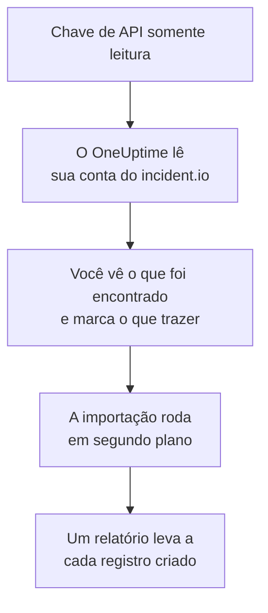

# Migrar do incident.io

**Importar de outra ferramenta** traz sua configuração do incident.io para o OneUptime em poucos minutos. Com uma chave de API do incident.io somente leitura, o OneUptime lê seus usuários, equipes, agendamentos, caminhos de escalonamento, serviços e configurações de incidentes, mostra o que encontrou e cria o que você marcar. Nada muda no incident.io.

:::cards
- [Importe sua conta](#importe-sua-conta-do-incidentio): Crie uma chave, leia sua conta e marque o que trazer.
- [O que é trazido](#o-que-é-trazido): O que cada registro do incident.io vira no OneUptime.
- [Conclua a troca](#conclua-a-troca): O que fazer quando a importação terminar.
:::

## Como funciona

- **A chave é usada uma vez.** Ela fica criptografada enquanto o OneUptime lê sua conta e é excluída assim que a leitura termina, tenha funcionado ou não. Nunca é mostrada de novo nem gravada em um log.
- **O OneUptime só lê.** Ele chama apenas a API do incident.io, `api.incident.io`. Quando o incident.io pede para ir mais devagar, ele espera e tenta de novo.
- **Nada é criado até você iniciar a importação.** A pré-visualização mostra, para cada item, se ele é novo, se já está no OneUptime (e é usado como está), se foi trazido por uma importação anterior ou por que não pode ser trazido.
- **Executá-la de novo nunca cria nada em dobro.** O OneUptime lembra o que cada importação trouxe, pelo ID do incident.io. Execute de novo depois de adicionar pessoas ou agendamentos no incident.io, e só os novos são criados.

## Antes de começar

- **Um projeto do OneUptime e o direito de criar o que você traz.** Proprietários e administradores do projeto podem trazer tudo. Outros papéis também podem executar uma importação e trazer os tipos de registro que podem criar. O resto aparece como não trazido, com o motivo.
- **Uma chave de API do incident.io que só pode ver dados.** A importação nunca grava no incident.io, então a chave não precisa de permissão para criar, editar ou gerenciar nada.

## Importe sua conta do incident.io

:::steps
### Crie uma chave de API no incident.io
No incident.io, vá em **Settings** > **API keys** e selecione **Add new**. Dê a ela o nome `OneUptime import`, conceda apenas permissões para ver dados, nenhuma para criar, editar ou gerenciar, e copie a chave.

### Abra a página de importação
No OneUptime, vá em **Configurações do projeto** > **Importar de outra ferramenta** e selecione **incident.io**.

### Conecte o incident.io
Cole a chave em **Chave de API do incident.io** e selecione **Ler minha conta do incident.io**. Uma conta grande leva alguns minutos, e você pode sair da página durante a leitura.

### Marque o que trazer
A pré-visualização lista o que foi encontrado, com uma seção por tipo. Tudo o que seria criado começa marcado, exceto pessoas que não estão em nenhuma equipe, agendamento ou caminho de escalonamento. Abaixo de cada item, o OneUptime diz o que não será trazido exatamente como era. Quando um item marcado usa algo que você deixou desmarcado, ele avisa, e **Marcar também** o marca.

### Inicie a importação
Se pessoas forem convidadas, escolha em **Convidar novas pessoas para** a equipe à qual elas entram. Depois selecione **Iniciar importação**. A importação roda em segundo plano: você pode sair da página, e o relatório espera por você lá.
:::

O relatório conta o que foi criado, convidado e não trazido, e lista cada item com um link para o registro em que ele se transformou, falhas primeiro. As importações anteriores aparecem em **Importações anteriores** na mesma página.

## O que é trazido

| No incident.io | No OneUptime | Como |
| --- | --- | --- |
| Usuários | Membros do projeto | Associados pelo endereço de e-mail. Quem ainda não está no projeto é convidado para a equipe que você escolher. Usuários desativados não são trazidos. |
| Equipes | Equipes | Criadas com seus membros. Uma equipe cujo nome o projeto já tem é usada como está, e seus membros não são alterados. |
| Agendamentos | Agendamentos de plantão | Cada rotação vira uma camada com as mesmas pessoas, o mesmo início, a mesma duração de turno e o mesmo horário de trabalho, no fuso horário do agendamento. É trazida a versão da rotação em vigor agora. |
| Caminhos de escalonamento | Políticas de plantão | Cada nível vira uma regra de escalonamento que aciona os mesmos agendamentos, usuários e equipes, após a mesma espera. Uma repetição vira as repetições da política, e de uma ramificação é trazido o primeiro caminho. |
| Serviços do catálogo | Serviços | As entradas dos seus tipos de catálogo da categoria de serviço, criadas no catálogo de serviços. Entradas arquivadas ficam de fora. |
| Severidades | Severidades de incidente | Criadas na ordem do incident.io, a mais grave primeiro. Uma severidade cujo nome o projeto já tem é usada como está. |
| Status | Estados de incidente | Um status de triagem corresponde ao estado em que o OneUptime começa os incidentes, e um status fechado ao estado em que eles são resolvidos. Os status ativos e pausados são criados entre Confirmado e Resolvido. |
| Papéis de incidente | Papéis de incidente | O papel principal corresponde ao Comandante do incidente do OneUptime, e os outros papéis são criados. O OneUptime registra quem declarou cada incidente, então o papel de relator não é necessário. |
| Campos personalizados | Campos personalizados do incidente | Campos de seleção única viram listas suspensas, os de seleção múltipla listas suspensas de seleção múltipla, os de texto e link viram texto e os numéricos viram números, com suas opções. |

Uma rotação com várias pessoas de plantão ao mesmo tempo vira um agendamento do OneUptime por pessoa de plantão, porque um agendamento do OneUptime tem uma pessoa de plantão por vez. Cada política de plantão que acionava o agendamento aciona todos eles.

## O que não é trazido

- **Incidentes, alertas e seu histórico.** O OneUptime começa com a sua configuração, não com seus incidentes passados.
- **Workflows, páginas de status, rotas de alerta e integrações.** Aponte seus monitores e fontes de alerta para o OneUptime, como descrito em [Conclua a troca](#conclua-a-troca).
- **Campos personalizados cujas opções vêm do catálogo,** e status para os quais o OneUptime não tem um estado: declined, merged, canceled e learning.
- **Substituições de agendamento e alterações em uma rotação agendadas para depois.** A pré-visualização nomeia cada alteração agendada, para que você a faça no OneUptime na hora certa.
- **Etapas de escalonamento sem equivalente exato no OneUptime.** Uma etapa que publica em um canal do Slack ou do Microsoft Teams fica de fora, porque no OneUptime isso é feito pelas regras de notificação do espaço de trabalho, assim como uma etapa que passa para outro caminho de escalonamento. Uma etapa que aciona quem estará de plantão em seguida é trazida como o mais próximo que o OneUptime tem, e a pré-visualização diz o que muda.

## Limites

Uma importação cria no máximo 2.000 registros: no máximo 500 pessoas, 200 equipes, 200 agendamentos de plantão, 200 políticas de plantão, 500 serviços, 100 campos personalizados de incidente e 25 de cada um entre severidades, estados e papéis de incidente. O que passar de um limite aparece como não trazido. Execute a importação de novo para trazer o restante.

No OneUptime Cloud, registros que o seu plano não inclui aparecem como não trazidos, com o plano de que precisam.

Uma pré-visualização é guardada por um dia. Só a pessoa que leu a conta pode marcar itens e iniciá-la. Proprietários e administradores do projeto veem o progresso e o relatório de cada importação.

## Conclua a troca

:::steps
### Confira os agendamentos de plantão
Abra cada agendamento em **Plantão** > **Agendamentos de plantão** e confira quem está de plantão agora e quem vem a seguir.

### Garanta que todos possam ser acionados
As pessoas convidadas aceitam o convite e depois adicionam um número de telefone, um endereço de e-mail ou o aplicativo móvel para serem acionadas. **Plantão** > **Prontidão** mostra quem ainda não pode ser alcançado.

### Envie seus alertas para o OneUptime
Aponte seus monitores e as ferramentas que geram alertas para o OneUptime, e acione a si mesmo uma vez para testar.

### Desative o acionamento no incident.io
Quando o OneUptime acionar as pessoas certas, desative as notificações no incident.io para ninguém ser acionado duas vezes.
:::

## Solução de problemas

:::details O incident.io não aceitou a chave de API
Confira se você copiou a chave inteira e se ela não foi excluída em **Settings** > **API keys**. Depois selecione **Tentar novamente**.
:::

:::details Falta um tipo de registro na pré-visualização
A chave não conseguiu lê-lo, e a pré-visualização avisa isso no topo. Conceda à chave permissão para ver esse tipo de dado e leia a conta de novo.
:::

:::details Alguns itens não podem ser marcados
Cada um diz o motivo: um usuário desativado, um nome que o projeto já tem, algo que uma importação anterior trouxe, ou um registro que você não tem permissão para criar ou que seu plano não inclui.
:::

## Próximos passos

:::cards
- [Agendamentos de plantão](/docs/on-call/schedules): Camadas, restrições e passagens de turno.
- [Estados e severidades de incidente](/docs/incidents/states-and-severities): Os estados e severidades pelos quais os incidentes passam.
- [Migrar do Opsgenie](/docs/moving-to-oneuptime/opsgenie): Traga uma equipe do Opsgenie.
:::
