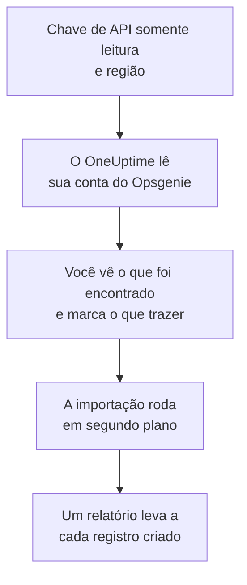

# Migrar do Opsgenie

A Atlassian está descontinuando o Opsgenie: deixou de vendê-lo em junho de 2025 e encerra o suporte em abril de 2027. O OneUptime é um novo lar para sua equipe de plantão, e **Importar de outra ferramenta** a traz em poucos minutos. Com uma chave de API do Opsgenie somente leitura, o OneUptime lê seus usuários, equipes, agendamentos, escalonamentos e serviços, mostra o que encontrou e cria o que você marcar. Nada muda no Opsgenie.

:::cards
- [Importe sua conta](#importe-sua-conta-do-opsgenie): Crie uma chave, leia sua conta e marque o que trazer.
- [O que é trazido](#o-que-é-trazido): O que cada registro do Opsgenie vira no OneUptime.
- [Conclua a troca](#conclua-a-troca): O que fazer quando a importação terminar.
:::

## Como funciona

- **A chave é usada uma vez.** Ela fica criptografada enquanto o OneUptime lê sua conta e é excluída assim que a leitura termina, tenha funcionado ou não. Nunca é mostrada de novo nem gravada em um log.
- **O OneUptime só lê.** Ele chama apenas a API do Opsgenie: `api.opsgenie.com`, ou `api.eu.opsgenie.com` para uma conta na Europa. Quando o Opsgenie pede para ir mais devagar, ele espera e tenta de novo.
- **Nada é criado até você iniciar a importação.** A pré-visualização mostra, para cada item, se ele é novo, se já está no OneUptime (e é usado como está), se foi trazido por uma importação anterior ou por que não pode ser trazido.
- **Executá-la de novo nunca cria nada em dobro.** O OneUptime lembra o que cada importação trouxe, pelo ID do Opsgenie. Execute de novo depois de adicionar pessoas ou agendamentos no Opsgenie, e só os novos são criados.

## Antes de começar

- **Um projeto do OneUptime e o direito de criar o que você traz.** Proprietários e administradores do projeto podem trazer tudo. Outros papéis também podem executar uma importação e trazer os tipos de registro que podem criar. O resto aparece como não trazido, com o motivo.
- **Uma chave de API do Opsgenie com os acessos Read e Configuration access.** O Configuration access é o que permite a uma chave ler usuários, equipes, agendamentos e escalonamentos. A importação nunca grava no Opsgenie.
- **Sua região do Opsgenie.** Se você entra em `app.eu.opsgenie.com`, sua conta está na Europa. Caso contrário, está nos Estados Unidos.

## Importe sua conta do Opsgenie

:::steps
### Crie uma chave de API no Opsgenie
No Opsgenie, vá em **Settings** > **API key management** e selecione **Add new API key**. Dê a ela o nome `OneUptime import`, conceda apenas **Read** e **Configuration access** e copie a chave.

### Abra a página de importação
No OneUptime, vá em **Configurações do projeto** > **Importar de outra ferramenta** e selecione **Opsgenie**.

### Conecte o Opsgenie
Em **Onde está sua conta do Opsgenie?**, escolha **Estados Unidos** ou **Europa**. Cole a chave em **Chave de API do Opsgenie** e selecione **Ler minha conta do Opsgenie**. Uma conta grande leva alguns minutos, e você pode sair da página durante a leitura.

### Marque o que trazer
A pré-visualização lista o que foi encontrado, com uma seção por tipo. Tudo o que seria criado começa marcado, exceto agendamentos desativados no Opsgenie e pessoas que não estão em nenhuma equipe, agendamento ou escalonamento. Abaixo de cada item, o OneUptime diz o que não será trazido exatamente como era. Quando um item marcado usa algo que você deixou desmarcado, ele avisa, e **Marcar também** o marca.

### Inicie a importação
Se pessoas forem convidadas, escolha em **Convidar novas pessoas para** a equipe à qual elas entram. Depois selecione **Iniciar importação**. A importação roda em segundo plano: você pode sair da página, e o relatório espera por você lá.
:::

O relatório conta o que foi criado, convidado e não trazido, e lista cada item com um link para o registro em que ele se transformou, falhas primeiro. As importações anteriores aparecem em **Importações anteriores** na mesma página.

## O que é trazido

| No Opsgenie | No OneUptime | Como |
| --- | --- | --- |
| Usuários | Membros do projeto | Associados pelo endereço de e-mail. Quem ainda não está no projeto é convidado para a equipe que você escolher. Usuários bloqueados não são trazidos. |
| Equipes | Equipes | Criadas com seus membros. Uma equipe cujo nome o projeto já tem é usada como está, e seus membros não são alterados. |
| Agendamentos | Agendamentos de plantão | Cada rotação vira uma camada com as mesmas pessoas, o mesmo início, a mesma duração de turno e a mesma restrição de horário, no fuso horário do agendamento, pertencente à equipe do agendamento. |
| Escalonamentos | Políticas de plantão | Cada regra vira uma regra de escalonamento que aciona o mesmo agendamento, usuário ou equipe. Regras com o mesmo atraso acionam juntas, e a espera antes da próxima regra de escalonamento é a diferença entre os atrasos. As repetições do escalonamento viram as repetições da política. |
| Serviços | Serviços | Criados no catálogo de serviços, pertencentes à sua equipe. |

Um agendamento cujas rotações colocam duas pessoas de plantão ao mesmo tempo vira um agendamento do OneUptime por rotação, porque um agendamento do OneUptime tem uma pessoa de plantão por vez. Cada política de plantão que acionava o agendamento aciona todos eles.

## O que não é trazido

- **Alertas, incidentes e seu histórico.** O OneUptime começa com a sua configuração, não com seus alertas passados.
- **Integrações, heartbeats, políticas de alerta e regras de roteamento.** Aponte seus monitores e fontes de alerta para o OneUptime, como descrito em [Conclua a troca](#conclua-a-troca).
- **Substituições de agendamento e rotações que já terminaram.** Adicione no OneUptime, depois da importação, as substituições de que ainda precisa.
- **As regras de notificação de cada pessoa.** Cada pessoa escolhe como é acionada nas próprias **Configurações do usuário** depois de aceitar o convite.
- **Etapas sem equivalente exato no OneUptime.** Uma regra que aciona quem estará de plantão em seguida, ou os administradores de uma equipe, é trazida como o mais próximo que o OneUptime tem, e a pré-visualização diz o que muda.

## Limites

Uma importação cria no máximo 2.000 registros: no máximo 500 pessoas, 200 equipes, 200 agendamentos de plantão, 200 políticas de plantão e 500 serviços. O que passar de um limite aparece como não trazido. Execute a importação de novo para trazer o restante.

No OneUptime Cloud, registros que o seu plano não inclui aparecem como não trazidos, com o plano de que precisam.

Uma pré-visualização é guardada por um dia. Só a pessoa que leu a conta pode marcar itens e iniciá-la. Proprietários e administradores do projeto veem o progresso e o relatório de cada importação.

## Conclua a troca

:::steps
### Confira os agendamentos de plantão
Abra cada agendamento em **Plantão** > **Agendamentos de plantão** e confira quem está de plantão agora e quem vem a seguir.

### Garanta que todos possam ser acionados
As pessoas convidadas aceitam o convite e depois adicionam um número de telefone, um endereço de e-mail ou o aplicativo móvel para serem acionadas. **Plantão** > **Prontidão** mostra quem ainda não pode ser alcançado.

### Envie seus alertas para o OneUptime
Aponte seus monitores e as ferramentas que geram alertas para o OneUptime, e acione a si mesmo uma vez para testar.

### Desative o acionamento no Opsgenie
Quando o OneUptime acionar as pessoas certas, desative as notificações no Opsgenie para ninguém ser acionado duas vezes.
:::

## Solução de problemas

:::details O Opsgenie não aceitou a chave de API
Confira se você copiou a chave inteira, se é uma chave de **API key management** e não a chave de uma integração, se ela tem **Read** e **Configuration access** e se você escolheu a região da sua conta. Depois selecione **Tentar novamente**.
:::

:::details Falta um tipo de registro na pré-visualização
A chave não conseguiu lê-lo, e a pré-visualização avisa isso no topo. Conceda **Configuration access** à chave e leia a conta de novo.
:::

:::details Alguns itens não podem ser marcados
Cada um diz o motivo: um usuário bloqueado, um nome que o projeto já tem, algo que uma importação anterior trouxe, ou um registro que você não tem permissão para criar ou que seu plano não inclui.
:::

## Próximos passos

:::cards
- [Agendamentos de plantão](/docs/on-call/schedules): Camadas, restrições e passagens de turno.
- [Regras de escalonamento](/docs/on-call/escalation-rules): Como as políticas de plantão acionam as pessoas.
- [Migrar do incident.io](/docs/moving-to-oneuptime/incident-io): Traga uma equipe do incident.io.
:::
