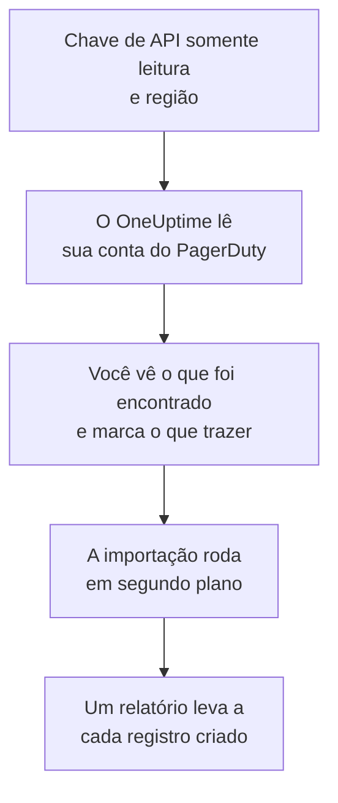

# Migrar do PagerDuty

**Importar de outra ferramenta** traz a sua configuração do PagerDuty para o OneUptime em poucos minutos. Com uma chave de API do PagerDuty somente leitura, o OneUptime lê seus usuários, equipes, agendamentos, políticas de escalonamento e serviços, mostra o que encontrou e cria o que você marcar. Nada muda no PagerDuty.

:::cards
- [Importe sua conta](#importe-sua-conta-do-pagerduty): Crie uma chave, leia sua conta e marque o que trazer.
- [O que é trazido](#o-que-é-trazido): O que cada registro do PagerDuty vira no OneUptime.
- [Conclua a troca](#conclua-a-troca): O que fazer quando a importação terminar.
:::

## Como funciona

- **A chave é usada uma vez.** Ela fica criptografada enquanto o OneUptime lê sua conta e é excluída assim que a leitura termina, tenha funcionado ou não. Nunca é mostrada de novo nem gravada em um log.
- **O OneUptime só lê.** Ele chama apenas a API REST do PagerDuty: `api.pagerduty.com`, ou `api.eu.pagerduty.com` para uma conta na Europa. Quando o PagerDuty pede para ir mais devagar, ele espera e tenta de novo.
- **Nada é criado até você iniciar a importação.** A pré-visualização mostra, para cada item, se ele é novo, se já está no OneUptime (e é usado como está), se foi trazido por uma importação anterior ou por que não pode ser trazido.
- **Executá-la de novo nunca cria nada em dobro.** O OneUptime lembra o que cada importação trouxe, pelo ID do PagerDuty. Execute de novo depois de adicionar pessoas ou agendamentos no PagerDuty, e só os novos são criados.

## Antes de começar

- **Um projeto do OneUptime e o direito de criar o que você traz.** Proprietários e administradores do projeto podem trazer tudo. Outros papéis também podem executar uma importação e trazer os tipos de registro que podem criar. O resto aparece como não trazido, com o motivo.
- **Uma chave de API REST do PagerDuty somente leitura.** Administradores e proprietários da conta no PagerDuty podem criar uma. A importação nunca grava no PagerDuty, então a chave só precisa de acesso de leitura.
- **Sua região do PagerDuty.** Se você entra em um endereço que termina em `eu.pagerduty.com`, sua conta está na Europa. Caso contrário, está nos Estados Unidos.

## Importe sua conta do PagerDuty

:::steps
### Crie uma chave de API no PagerDuty
No PagerDuty, vá em **Integrations** > **Developer Tools** > **API Access Keys** e selecione **Create New API Key**. Descreva-a como `OneUptime import`, marque **Read-only API Key**, selecione **Create Key** e copie a chave.

### Abra a página de importação
No OneUptime, vá em **Configurações do projeto** > **Importar de outra ferramenta** e selecione **PagerDuty**.

### Conecte o PagerDuty
Em **Onde está sua conta do PagerDuty?**, escolha **Estados Unidos** ou **Europa**. Cole a chave em **Chave de API do PagerDuty** e selecione **Ler minha conta do PagerDuty**. Uma conta grande leva alguns minutos, e você pode sair da página durante a leitura.

### Marque o que trazer
A pré-visualização lista o que foi encontrado, com uma seção por tipo. Tudo o que seria criado começa marcado, exceto serviços desativados no PagerDuty e pessoas que não estão em nenhuma equipe, agendamento ou política de escalonamento. Abaixo de cada item, o OneUptime diz o que não será trazido exatamente como era. Quando um item marcado usa algo que você deixou desmarcado, ele avisa, e **Marcar também** o marca.

### Inicie a importação
Se pessoas forem convidadas, escolha em **Convidar novas pessoas para** a equipe à qual elas entram. Depois selecione **Iniciar importação**. A importação roda em segundo plano: você pode sair da página, e o relatório espera por você lá.
:::

O relatório conta o que foi criado, convidado e não trazido, e lista cada item com um link para o registro em que ele se transformou, falhas primeiro. As importações anteriores aparecem em **Importações anteriores** na mesma página.

## O que é trazido

| No PagerDuty | No OneUptime | Como |
| --- | --- | --- |
| Usuários | Membros do projeto | Associados pelo endereço de e-mail. Quem ainda não está no projeto é convidado para a equipe que você escolher. |
| Equipes | Equipes | Criadas com seus membros. Uma equipe cujo nome o projeto já tem é usada como está, e seus membros não são alterados. |
| Agendamentos | Agendamentos de plantão | Cada camada vira uma camada com as mesmas pessoas, o mesmo início, a mesma duração de turno e as mesmas restrições, no fuso horário do agendamento, pertencente à equipe do agendamento. As camadas mantêm a ordem, então uma camada superior continua tendo prioridade sobre as de baixo. |
| Políticas de escalonamento | Políticas de plantão | Cada regra de escalonamento vira uma regra de escalonamento que aciona os mesmos agendamentos e usuários, e escala após o mesmo atraso. As repetições da política viram as repetições da política de plantão. |
| Serviços | Serviços | Criados no catálogo de serviços, pertencentes à sua equipe. Um serviço desativado no PagerDuty começa desmarcado. |

Um agendamento do PagerDuty continua sendo um só agendamento do OneUptime: suas camadas têm prioridade umas sobre as outras como no PagerDuty. Uma camada cujos turnos não duram um número inteiro de horas é trazida com os turnos arredondados para a hora, e a pré-visualização avisa.

## O que não é trazido

- **Incidentes, alertas e seu histórico.** O OneUptime começa com a sua configuração, não com seus incidentes passados.
- **Integrações, Event Orchestrations, Incident Workflows e páginas de status.** Aponte seus monitores e fontes de alerta para o OneUptime, como descrito em [Conclua a troca](#conclua-a-troca).
- **Substituições de agendamento e camadas que já terminaram.** Adicione no OneUptime, depois da importação, as substituições de que ainda precisa.
- **Agendamentos baseados em turnos.** A importação lê os agendamentos em camadas do PagerDuty, não os agendamentos mais novos baseados em turnos (shift-based schedules). Se a sua conta tiver algum, a pré-visualização avisa no topo, e uma regra de escalonamento que aciona um deles é trazida sem ele. Crie-os no OneUptime.
- **As regras de notificação de cada pessoa.** Cada pessoa escolhe como é acionada nas próprias **Configurações do usuário** depois de aceitar o convite.
- **Regras sem equivalente exato no OneUptime.** Uma regra de escalonamento que distribui suas pessoas em rodízio (round robin) aciona todas ao mesmo tempo no OneUptime, e a pré-visualização diz o que muda.

## Limites

Uma importação cria no máximo 2.000 registros: no máximo 500 pessoas, 200 equipes, 200 agendamentos de plantão, 200 políticas de plantão e 500 serviços. O que passar de um limite aparece como não trazido. Execute a importação de novo para trazer o restante.

No OneUptime Cloud, registros que o seu plano não inclui aparecem como não trazidos, com o plano de que precisam.

Uma pré-visualização é guardada por um dia. Só a pessoa que leu a conta pode marcar itens e iniciá-la. Proprietários e administradores do projeto veem o progresso e o relatório de cada importação.

## Conclua a troca

:::steps
### Confira os agendamentos de plantão
Abra cada agendamento em **Plantão** > **Agendamentos de plantão** e confira quem está de plantão agora e quem vem a seguir.

### Garanta que todos possam ser acionados
As pessoas convidadas aceitam o convite e depois adicionam um número de telefone, um endereço de e-mail ou o aplicativo móvel para serem acionadas. **Plantão** > **Prontidão** mostra quem ainda não pode ser alcançado.

### Envie seus alertas para o OneUptime
Aponte seus monitores e as ferramentas que geram alertas para o OneUptime, e acione a si mesmo uma vez para testar.

### Desative o acionamento no PagerDuty
Quando o OneUptime acionar as pessoas certas, desative as notificações no PagerDuty para ninguém ser acionado duas vezes.
:::

## Solução de problemas

:::details O PagerDuty não aceitou a chave de API
Confira se você copiou a chave inteira, se é uma chave de API REST de **API Access Keys** e não uma chave de integração, e se você escolheu a região da sua conta. Depois selecione **Tentar novamente**.
:::

:::details Falta um tipo de registro na pré-visualização
A chave não conseguiu lê-lo, e a pré-visualização avisa isso no topo. Alguns tipos só existem nos planos do PagerDuty que os incluem, por exemplo as equipes. Leia a conta de novo com uma chave que consiga lê-los.
:::

:::details Alguns itens não podem ser marcados
Cada um diz o motivo: um nome que o projeto já tem, algo que uma importação anterior trouxe, ou um registro que você não tem permissão para criar ou que seu plano não inclui.
:::

## Próximos passos

:::cards
- [Agendamentos de plantão](/docs/on-call/schedules): Camadas, restrições e passagens de turno.
- [Regras de escalonamento](/docs/on-call/escalation-rules): Como as políticas de plantão acionam as pessoas.
- [Migrar do Opsgenie](/docs/moving-to-oneuptime/opsgenie): Traga uma equipe do Opsgenie.
:::
