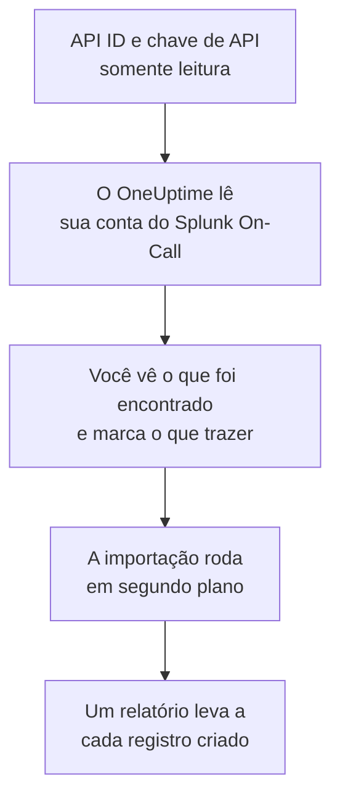

# Migrar do Splunk On-Call

**Importar de outra ferramenta** traz a sua configuração do Splunk On-Call (antigo VictorOps) para o OneUptime em poucos minutos. Com seu API ID e uma chave de API somente leitura, o OneUptime lê seus usuários, equipes, rotações e políticas de escalonamento, mostra o que encontrou e cria o que você marcar. Nada muda no Splunk On-Call.

:::cards
- [Importe sua conta](#importe-sua-conta-do-splunk-on-call): Crie uma chave, leia sua conta e marque o que trazer.
- [O que é trazido](#o-que-é-trazido): O que cada registro do Splunk On-Call vira no OneUptime.
- [Conclua a troca](#conclua-a-troca): O que fazer quando a importação terminar.
:::

## Como funciona

- **A chave é usada uma vez.** Ela fica criptografada, junto com o API ID, enquanto o OneUptime lê sua conta e é excluída assim que a leitura termina, tenha funcionado ou não. Nunca é mostrada de novo nem gravada em um log.
- **O OneUptime só lê.** Ele chama apenas a API do Splunk On-Call, `api.victorops.com`. O Splunk On-Call responde a cada tipo de solicitação no máximo duas vezes por segundo, então o OneUptime mantém esse ritmo, e quando o Splunk On-Call pede para ir mais devagar, ele espera e tenta de novo.
- **Nada é criado até você iniciar a importação.** A pré-visualização mostra, para cada item, se ele é novo, se já está no OneUptime (e é usado como está), se foi trazido por uma importação anterior ou por que não pode ser trazido.
- **Executá-la de novo nunca cria nada em dobro.** O OneUptime lembra o que cada importação trouxe, pelo ID do Splunk On-Call. Execute de novo depois de adicionar pessoas ou rotações no Splunk On-Call, e só as novas são criadas.

## Antes de começar

- **Um projeto do OneUptime e o direito de criar o que você traz.** Proprietários e administradores do projeto podem trazer tudo. Outros papéis também podem executar uma importação e trazer os tipos de registro que podem criar. O resto aparece como não trazido, com o motivo.
- **Seu API ID do Splunk On-Call e uma chave de API somente leitura.** Os dois ficam em **Integrations** > **API** no Splunk On-Call. A importação nunca grava no Splunk On-Call, então uma chave somente leitura basta.

## Importe sua conta do Splunk On-Call

:::steps
### Crie uma chave de API no Splunk On-Call
No Splunk On-Call, vá em **Integrations** > **API**. Seu API ID aparece acima das suas chaves de API. Crie uma nova chave de API chamada `OneUptime import`, marque **Read-only** e copie o API ID e a chave.

### Abra a página de importação
No OneUptime, vá em **Configurações do projeto** > **Importar de outra ferramenta** e selecione **Splunk On-Call**.

### Conecte o Splunk On-Call
Cole o API ID em **API ID do Splunk On-Call** e a chave em **Chave de API do Splunk On-Call**, e selecione **Ler minha conta do Splunk On-Call**. Uma conta grande leva alguns minutos, e você pode sair da página durante a leitura.

### Marque o que trazer
A pré-visualização lista o que foi encontrado, com uma seção por tipo. Tudo o que seria criado começa marcado, exceto pessoas que não estão em nenhuma equipe, rotação ou política de escalonamento. Abaixo de cada item, o OneUptime diz o que não será trazido exatamente como era. Quando um item marcado usa algo que você deixou desmarcado, ele avisa, e **Marcar também** o marca.

### Inicie a importação
Se pessoas forem convidadas, escolha em **Convidar novas pessoas para** a equipe à qual elas entram. Depois selecione **Iniciar importação**. A importação roda em segundo plano: você pode sair da página, e o relatório espera por você lá.
:::

O relatório conta o que foi criado, convidado e não trazido, e lista cada item com um link para o registro em que ele se transformou, falhas primeiro. As importações anteriores aparecem em **Importações anteriores** na mesma página.

## O que é trazido

| No Splunk On-Call | No OneUptime | Como |
| --- | --- | --- |
| Usuários | Membros do projeto | Associados pelo endereço de e-mail. Quem ainda não está no projeto é convidado para a equipe que você escolher. |
| Equipes | Equipes | Criadas com seus membros. Uma equipe cujo nome o projeto já tem é usada como está, e seus membros não são alterados. |
| Rotações | Agendamentos de plantão | Cada rotação vira um agendamento pertencente à sua equipe, e cada um de seus turnos uma camada com as mesmas pessoas, o mesmo início, a mesma passagem de turno e os mesmos dias e horários de plantão. Quem está de plantão agora no Splunk On-Call também está no OneUptime. |
| Políticas de escalonamento | Políticas de plantão | Pertencentes à equipe da política. Cada etapa vira uma regra de escalonamento que aciona as mesmas rotações e usuários. O tempo limite de uma etapa vira a espera antes dela, e etapas sem tempo limite entre si acionam juntas. |

Turnos de uma rotação que estão de plantão ao mesmo tempo viram, cada um, um agendamento do OneUptime, porque um agendamento do OneUptime tem uma pessoa de plantão por vez. Cada política de plantão que acionava a rotação aciona todos eles. O agendamento mantém o fuso horário do primeiro turno da rotação, e um turno definido em outro fuso horário tem seus horários convertidos para ele.

## O que não é trazido

- **Incidentes, alertas e seu histórico.** O OneUptime começa com a sua configuração, não com seus incidentes passados.
- **Integrações, routing keys e regras de alerta.** Aponte seus monitores e fontes de alerta para o OneUptime, como descrito em [Conclua a troca](#conclua-a-troca).
- **Substituições agendadas.** Adicione no OneUptime, depois da importação, as substituições de que ainda precisa.
- **A política de acionamento de cada pessoa.** Cada pessoa escolhe como é acionada nas próprias **Configurações do usuário** depois de aceitar o convite.
- **Etapas sem equivalente exato no OneUptime.** Uma etapa que chama um webhook ou encaminha para outra política de escalonamento fica de fora, assim como uma etapa que envia e-mail para um endereço que não é de nenhuma das pessoas trazidas. Uma etapa que aciona quem estará de plantão em seguida, ou quem esteve antes, aciona quem está de plantão agora, e a pré-visualização diz o que muda.

## Limites

Uma importação cria no máximo 2.000 registros: no máximo 500 pessoas, 200 equipes, 200 agendamentos de plantão e 200 políticas de plantão. O que passar de um limite aparece como não trazido. Execute a importação de novo para trazer o restante.

No OneUptime Cloud, registros que o seu plano não inclui aparecem como não trazidos, com o plano de que precisam.

Uma pré-visualização é guardada por um dia. Só a pessoa que leu a conta pode marcar itens e iniciá-la. Proprietários e administradores do projeto veem o progresso e o relatório de cada importação.

## Conclua a troca

:::steps
### Confira os agendamentos de plantão
Abra cada agendamento em **Plantão** > **Agendamentos de plantão** e confira quem está de plantão agora e quem vem a seguir.

### Garanta que todos possam ser acionados
As pessoas convidadas aceitam o convite e depois adicionam um número de telefone, um endereço de e-mail ou o aplicativo móvel para serem acionadas. **Plantão** > **Prontidão** mostra quem ainda não pode ser alcançado.

### Envie seus alertas para o OneUptime
Aponte seus monitores e as ferramentas que geram alertas para o OneUptime, e acione a si mesmo uma vez para testar.

### Desative o acionamento no Splunk On-Call
Quando o OneUptime acionar as pessoas certas, desative as notificações no Splunk On-Call para ninguém ser acionado duas vezes.
:::

## Solução de problemas

:::details O Splunk On-Call não aceitou o API ID e a chave de API
Confira se você copiou o API ID e a chave inteira de **Integrations** > **API**, e se a chave não foi excluída lá. Depois selecione **Tentar novamente**.
:::

:::details Falta um tipo de registro na pré-visualização
A chave não conseguiu lê-lo, e a pré-visualização avisa isso no topo. Confira a chave em **Integrations** > **API** e leia a conta de novo.
:::

:::details Alguns itens não podem ser marcados
Cada um diz o motivo: um nome que o projeto já tem, algo que uma importação anterior trouxe, ou um registro que você não tem permissão para criar ou que seu plano não inclui.
:::

## Próximos passos

:::cards
- [Agendamentos de plantão](/docs/on-call/schedules): Camadas, restrições e passagens de turno.
- [Regras de escalonamento](/docs/on-call/escalation-rules): Como as políticas de plantão acionam as pessoas.
- [Migrar do PagerDuty](/docs/moving-to-oneuptime/pagerduty): Traga uma equipe do PagerDuty.
:::
