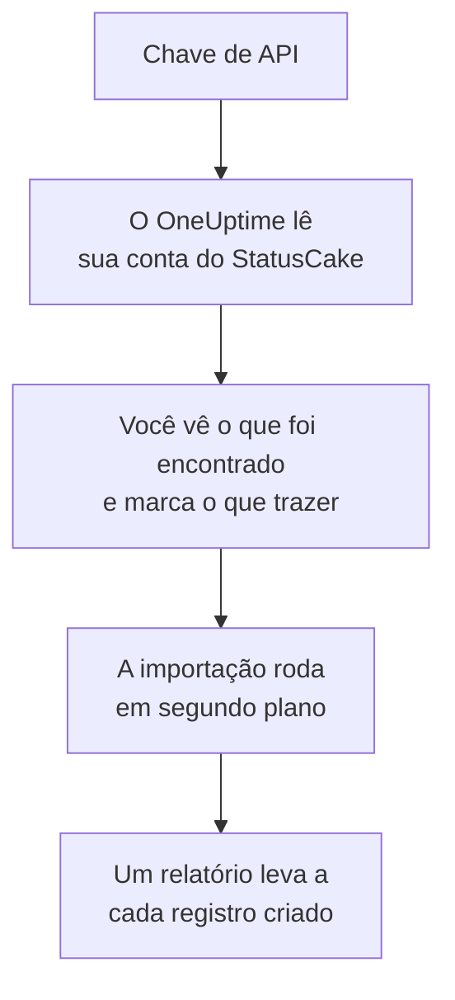

# Migrar do StatusCake

**Importar de outra ferramenta** traz suas verificações do StatusCake para o OneUptime em poucos minutos. Com uma chave de API do StatusCake, o OneUptime lê suas verificações de disponibilidade, SSL e heartbeat, mostra o que encontrou e cria o que você marcar. Nada muda no StatusCake.

:::cards
- [Importe sua conta](#importe-sua-conta-do-statuscake): Crie uma chave, leia sua conta e marque o que trazer.
- [O que é trazido](#o-que-é-trazido): Que monitor do OneUptime cada verificação do StatusCake vira.
- [Conclua a troca](#conclua-a-troca): O que fazer quando a importação terminar.
:::

## Como funciona

- **A chave é usada uma vez.** Ela fica criptografada enquanto o OneUptime lê sua conta e é excluída assim que a leitura termina, tenha funcionado ou não. Nunca é mostrada de novo nem gravada em um log.
- **O OneUptime só lê.** Ele chama apenas a API do StatusCake: `api.statuscake.com`. Ele faz uma requisição por segundo, dentro das 60 por minuto que o StatusCake permite a uma conta Free. Quando o StatusCake pede para ir mais devagar, ele espera e tenta de novo.
- **Nada é criado até você iniciar a importação.** A pré-visualização mostra, para cada item, se ele é novo, se já está no OneUptime (e é usado como está), se foi trazido por uma importação anterior ou por que não pode ser trazido.
- **Executá-la de novo nunca cria nada em dobro.** O OneUptime lembra o que cada importação trouxe, pelo ID do StatusCake. Execute de novo depois de adicionar verificações no StatusCake, e só os novos são criados.

## Antes de começar

- **Um projeto do OneUptime e o direito de criar o que você traz.** Proprietários e administradores do projeto podem trazer tudo. Outros papéis também podem executar uma importação e trazer os tipos de registro que podem criar. O resto aparece como não trazido, com o motivo.
- **Uma chave de API do StatusCake.** A importação nunca grava no StatusCake.
- **Uma forma de pagamento, no OneUptime Cloud.** Monitores que fazem verificações são cobrados conforme o uso, mesmo no plano Free, então adicione uma em **Configurações do projeto** > **Cobrança** antes de importar. Sem ela, esses monitores aparecem como não trazidos.

## Importe sua conta do StatusCake

:::steps
### Crie uma chave de API no StatusCake
No StatusCake, abra o painel da sua conta e vá em **API Keys**. Crie uma chave chamada `OneUptime import` e copie-a.

### Abra a página de importação
No OneUptime, vá em **Configurações do projeto** > **Importar de outra ferramenta** e selecione **StatusCake**.

### Conecte o StatusCake
Cole a chave em **Chave de API do StatusCake** e selecione **Ler minha conta do StatusCake**. Uma conta grande leva alguns minutos, e você pode sair da página enquanto ela é lida.

### Marque o que trazer
A pré-visualização lista o que foi encontrado, com uma seção por tipo. Tudo o que seria criado começa marcado, exceto verificações pausadas no StatusCake, que são trazidas pausadas se você as marcar. Abaixo de cada item, o OneUptime diz o que não será trazido exatamente como era.

### Inicie a importação
Selecione **Iniciar importação**. A importação roda em segundo plano: você pode sair da página, e o relatório espera por você lá.
:::

O relatório conta o que foi criado e não trazido, e lista cada item com um link para o registro em que ele se transformou, falhas primeiro. As importações anteriores aparecem em **Importações anteriores** na mesma página.

## O que é trazido

| No StatusCake | No OneUptime | Como |
| --- | --- | --- |
| Uptime, SSL and heartbeat checks | Monitores | Cada verificação vira um monitor do mesmo tipo, com o mesmo endereço, intervalo, tempo limite e o texto que uma página deve, ou não deve, conter. |

- **Verificações HTTP e HEAD** viram monitores de site, ou monitores de API quando enviam dados ou cabeçalhos. O StatusCake lista os códigos de status que geram um alerta: qualquer outro código conta como disponível também no OneUptime.
- **Verificações de ping e TCP** viram monitores de ping e de porta. **Verificações SMTP e SSH** viram monitores de porta na porta delas: o OneUptime verifica se a porta responde, não a conversa nela.
- **Verificações DNS** viram monitores DNS que perguntam ao mesmo servidor.
- **Verificações SSL** viram monitores de certificado SSL que avisam com a mesma antecedência do primeiro alerta. Uma verificação de disponibilidade com alertas SSL também ganha um.
- **Verificações de heartbeat** viram monitores de requisições recebidas, que caem quando nenhuma requisição chega durante o período. Cada um tem um novo endereço no OneUptime.

Cada monitor é verificado pelas sondas do seu projeto, como um que você mesmo cria. Um intervalo que o OneUptime não oferece vira o mais próximo que ele oferece, e um tempo limite de mais de um minuto vira um minuto. A pré-visualização avisa quando algum dos dois muda.

## O que não é trazido

- **O histórico de disponibilidade, os tempos de resposta e os incidentes.** O OneUptime começa a verificar quando a importação termina.
- **Os contatos de alerta e as integrações.** Escolha quem é avisado no OneUptime, como descrito em [Conclua a troca](#conclua-a-troca).
- **Senhas, e cabeçalhos que podem conter um segredo.** Um monitor que faz login, ou que envia um cabeçalho `Authorization`, de cookie ou de token, é trazido sem ele: adicione-o com um [segredo de monitor](/docs/monitor/monitor-secrets).
- **Os endereços que uma verificação DNS espera.** Adicione-os como critérios no OneUptime.
- **Verificações de velocidade de página, de domínio e de servidor.** O OneUptime tem seu próprio [monitor de domínio](/docs/monitor/domain-monitor) e monitoramento de servidores, para configurar no lugar delas.
- **Janelas de manutenção.** A pré-visualização as conta: planeje-as como manutenção programada no OneUptime.

## Limites

Uma importação cria no máximo 2.000 registros, e no máximo 1.000 monitores. O que passar de um limite aparece como não trazido. Execute a importação de novo para trazer o restante.

No OneUptime Cloud, monitores que fazem verificações precisam de uma forma de pagamento, e o que não cabe no seu plano aparece como não trazido, com o que precisa.

Uma pré-visualização é guardada por um dia. Só a pessoa que leu a conta pode marcar itens e iniciá-la. Proprietários e administradores do projeto veem o progresso e o relatório de cada importação.

## Conclua a troca

:::steps
### Confira seus monitores
Abra cada um em **Monitores** e confira os primeiros resultados. Um monitor de heartbeat tem um novo endereço: aponte para ele a tarefa que o chama.

### Escolha quem é avisado
Adicione proprietários aos seus monitores, ou uma política de plantão em **Plantão** > **Políticas de plantão** aos incidentes que eles abrem, para que as pessoas certas saibam quando algo cair.

### Desative as verificações no StatusCake
Quando o OneUptime verificar as mesmas coisas, pause as verificações no StatusCake para ninguém ser avisado duas vezes.
:::

## Solução de problemas

:::details O StatusCake não aceitou a chave de API
Confira se você copiou a chave inteira de **API Keys** e se ela não foi excluída. Depois selecione **Tentar novamente**.
:::

:::details Um monitor aparece como não trazido
Ele diz o motivo: um tipo de monitor que o OneUptime não tem, um endereço que o OneUptime não consegue ler, ou um projeto sem espaço ou sem forma de pagamento para ele. Um monitor que o OneUptime já executa, com o mesmo nome, tipo e endereço, é usado como está.
:::

:::details Alguns itens não podem ser marcados
Cada um diz o motivo: um nome que o projeto já tem, algo que uma importação anterior trouxe, ou um registro que você não tem permissão para criar ou que seu plano não inclui.
:::

## Próximos passos

:::cards
- [Monitor de site](/docs/monitor/website-monitor): O que um monitor de site verifica, e como.
- [Monitor de certificado SSL](/docs/monitor/ssl-certificate-monitor): Como o OneUptime avisa antes de um certificado expirar.
- [Migrar do Uptime Kuma](/docs/moving-to-oneuptime/uptime-kuma): Traga suas verificações do Uptime Kuma.
:::
