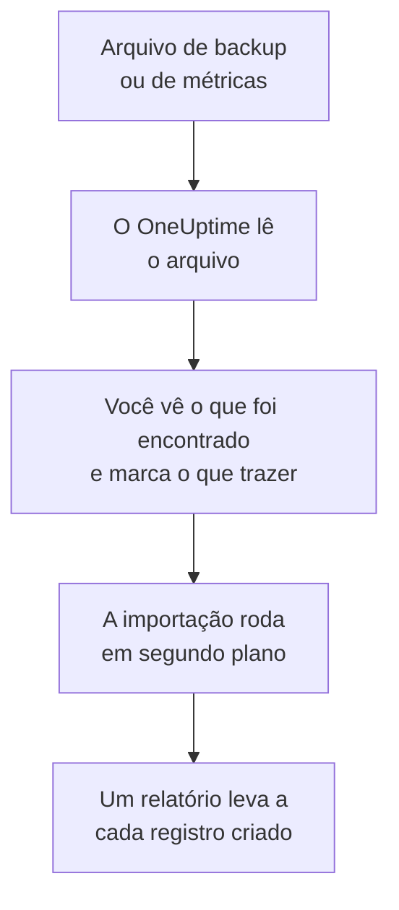

# Migrar do Uptime Kuma

O Uptime Kuma roda nas suas próprias máquinas, então **Importar de outra ferramenta** o lê a partir de um arquivo em vez de uma chave: o backup que o Uptime Kuma 1 exporta, ou a página de métricas que toda versão oferece. O OneUptime lê seus monitores desse arquivo, mostra o que encontrou e cria o que você marcar. Nada muda no Uptime Kuma.

:::cards
- [Importe seus monitores](#importe-seus-monitores-do-uptime-kuma): Salve o arquivo, leia-o e marque o que trazer.
- [O que é trazido](#o-que-é-trazido): O que cada monitor do Uptime Kuma vira no OneUptime.
- [Conclua a troca](#conclua-a-troca): O que fazer quando a importação terminar.
:::

## Como funciona

- **O arquivo é lido uma vez.** O OneUptime o lê durante o envio, para encontrar seus monitores, e nunca o guarda. Senhas, tokens e chaves push que ele contém nunca são copiados.
- **O OneUptime nunca se conecta ao Uptime Kuma.** Tudo vem do arquivo. Um arquivo que não é um backup nem uma página de métricas do Uptime Kuma é recusado, com o motivo.
- **Nada é criado até você iniciar a importação.** A pré-visualização mostra, para cada item, se ele é novo, se já está no OneUptime (e é usado como está), se foi trazido por uma importação anterior ou por que não pode ser trazido.
- **Executá-la de novo nunca cria nada em dobro.** O OneUptime lembra o que cada importação trouxe, pelo ID do Uptime Kuma. Leia um arquivo mais recente depois de adicionar monitores, e só os novos são criados.

## Antes de começar

- **Um projeto do OneUptime e o direito de criar o que você traz.** Proprietários e administradores do projeto podem trazer tudo. Outros papéis também podem executar uma importação e trazer os tipos de registro que podem criar. O resto aparece como não trazido, com o motivo.
- **Um arquivo do Uptime Kuma.** No Uptime Kuma 1, o backup JSON tem cada monitor com suas configurações. O Uptime Kuma 2 não tem backup, então salve a página de métricas dele: ela traz o nome, o tipo e o endereço de cada monitor, mas não com que frequência ele é verificado nem o que procura.
- **Uma forma de pagamento, no OneUptime Cloud.** Monitores que fazem verificações são cobrados conforme o uso, mesmo no plano Free, então adicione uma em **Configurações do projeto** > **Cobrança** antes de importar. Sem ela, esses monitores aparecem como não trazidos.

## Importe seus monitores do Uptime Kuma

:::steps
### Salve o arquivo no Uptime Kuma
No Uptime Kuma 1, vá em **Settings** > **Backup** e selecione **Export**. No Uptime Kuma 2, adicione uma chave em **Settings** > **API Keys**, abra `/metrics` no seu Uptime Kuma, entre sem nome de usuário e com a chave como senha, e salve a página como arquivo de texto.

### Abra a página de importação
No OneUptime, vá em **Configurações do projeto** > **Importar de outra ferramenta** e selecione **Uptime Kuma**.

### Leia o arquivo
Em **Arquivo de backup ou de métricas do Uptime Kuma**, selecione **Escolher arquivo**, escolha o arquivo que você salvou e selecione **Ler o arquivo**. O OneUptime o lê na hora e mostra o que encontrou.

### Marque o que trazer
A pré-visualização lista o que foi encontrado, com uma seção por tipo. Tudo o que seria criado começa marcado, exceto monitores pausados no Uptime Kuma, que são trazidos pausados se você os marcar. Abaixo de cada item, o OneUptime diz o que não será trazido exatamente como era.

### Inicie a importação
Selecione **Iniciar importação**. A importação roda em segundo plano: você pode sair da página, e o relatório espera por você lá.
:::

O relatório conta o que foi criado e não trazido, e lista cada item com um link para o registro em que ele se transformou, falhas primeiro. As importações anteriores aparecem em **Importações anteriores** na mesma página.

## O que é trazido

| No Uptime Kuma | No OneUptime | Como |
| --- | --- | --- |
| Monitors | Monitores | De um backup, cada monitor vira um monitor do mesmo tipo, com o mesmo endereço, intervalo, tempo limite e códigos de status que contam como disponível. Da página de métricas, cada um é trazido com uma verificação a cada cinco minutos: confira cada um após a importação. |

- **Monitores HTTP(S) e de palavra-chave** viram monitores de site, ou monitores de API quando enviam outro método, cabeçalhos ou um corpo JSON, com a palavra-chave onde ela deve estar.
- **Monitores de consulta JSON** viram monitores de API, sem a consulta: adicione-a como critério no OneUptime.
- **Monitores de ping, de porta e DNS** viram monitores de ping, de porta e DNS.
- **Monitores push** viram monitores de requisições recebidas, que caem quando nenhuma requisição chega durante o intervalo e suas novas tentativas. Cada um tem um novo endereço no OneUptime.
- **Monitores manuais** continuam monitores manuais. **Grupos** são pastas, então os monitores deles são trazidos um a um.
- **Expiração de certificados.** Um monitor que avisa antes de o certificado expirar ganha também um monitor de certificado SSL, com o nome dele.

Cada monitor é verificado pelas sondas do seu projeto, como um que você mesmo cria. Um intervalo que o OneUptime não oferece vira o mais próximo que ele oferece, e um tempo limite de mais de um minuto vira um minuto. A pré-visualização avisa quando algum dos dois muda.

## O que não é trazido

- **O histórico de disponibilidade, os tempos de resposta e os incidentes.** O OneUptime começa a verificar quando a importação termina.
- **Notificações.** Escolha quem é avisado no OneUptime, como descrito em [Conclua a troca](#conclua-a-troca).
- **Senhas, e cabeçalhos que podem conter um segredo.** Um monitor que faz login, ou que envia um cabeçalho `Authorization`, de cookie ou de token, é trazido sem ele: adicione-o com um [segredo de monitor](/docs/monitor/monitor-secrets).
- **Monitores invertidos**, que contam como disponíveis quando a verificação falha. O OneUptime não tem monitor que faça isso.
- **Monitores de Docker, banco de dados, servidor de jogos, MQTT e outros sem equivalente no OneUptime.** A pré-visualização nomeia cada um.
- **Páginas de status e manutenção.** Crie no OneUptime as páginas de status de que você precisa e mostre nelas os monitores importados.

## Limites

Uma importação cria no máximo 2.000 registros, e no máximo 1.000 monitores. Um arquivo pode ter no máximo 10 MB. O que passar de um limite aparece como não trazido. Execute a importação de novo para trazer o restante.

No OneUptime Cloud, monitores que fazem verificações precisam de uma forma de pagamento, e o que não cabe no seu plano aparece como não trazido, com o que precisa.

Uma pré-visualização é guardada por um dia. Só a pessoa que leu o arquivo pode marcar itens e iniciá-la. Proprietários e administradores do projeto veem o progresso e o relatório de cada importação.

## Conclua a troca

:::steps
### Confira seus monitores
Abra cada um em **Monitores** e confira os primeiros resultados. Um monitor de heartbeat tem um novo endereço: aponte para ele a tarefa que o chama.

### Escolha quem é avisado
Adicione proprietários aos seus monitores, ou uma política de plantão em **Plantão** > **Políticas de plantão** aos incidentes que eles abrem, para que as pessoas certas saibam quando algo cair.

### Desative as verificações no Uptime Kuma
Quando o OneUptime verificar as mesmas coisas, pause as verificações no Uptime Kuma para ninguém ser avisado duas vezes.
:::

## Solução de problemas

:::details O arquivo foi recusado
O OneUptime diz o motivo: um arquivo com mais de 10 MB, um que não é JSON válido, ou um que não é nem um backup nem a página de métricas do Uptime Kuma. Exporte o backup de novo, ou salve `/metrics` de novo como texto simples, e escolha-o outra vez.
:::

:::details Um monitor aparece como não trazido
Ele diz o motivo: um tipo de monitor que o OneUptime não tem, um endereço que o OneUptime não consegue ler, ou um projeto sem espaço ou sem forma de pagamento para ele. Um monitor que o OneUptime já executa, com o mesmo nome, tipo e endereço, é usado como está.
:::

:::details Alguns itens não podem ser marcados
Cada um diz o motivo: um nome que o projeto já tem, algo que uma importação anterior trouxe, ou um registro que você não tem permissão para criar ou que seu plano não inclui.
:::

## Próximos passos

:::cards
- [Monitor de site](/docs/monitor/website-monitor): O que um monitor de site verifica, e como.
- [Monitor de requisições recebidas](/docs/monitor/incoming-request-monitor): Como um heartbeat funciona no OneUptime.
- [Migrar do UptimeRobot](/docs/moving-to-oneuptime/uptimerobot): Traga suas verificações do UptimeRobot.
:::
