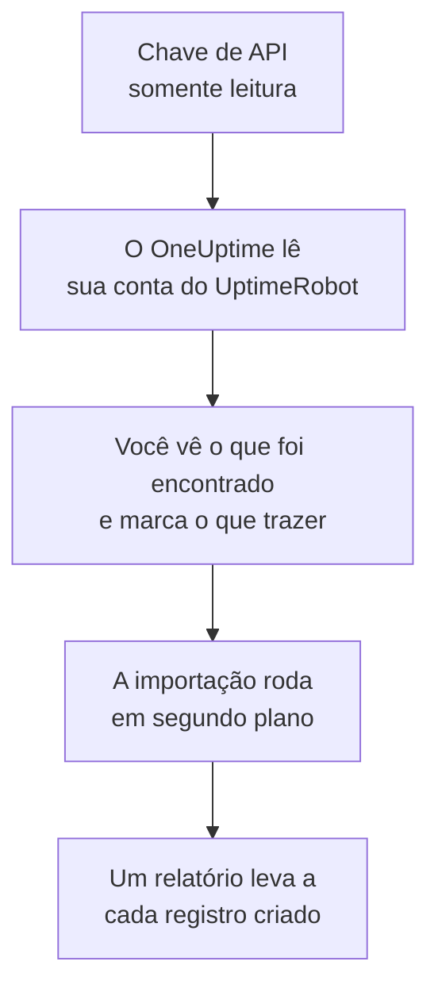

# Migrar do UptimeRobot

**Importar de outra ferramenta** traz seus monitores e páginas de status do UptimeRobot para o OneUptime em poucos minutos. Com uma chave de API do UptimeRobot somente leitura, o OneUptime lê seus monitores e páginas de status públicas, mostra o que encontrou e cria o que você marcar. Nada muda no UptimeRobot.

:::cards
- [Importe sua conta](#importe-sua-conta-do-uptimerobot): Crie uma chave, leia sua conta e marque o que trazer.
- [O que é trazido](#o-que-é-trazido): O que cada monitor e página de status do UptimeRobot vira no OneUptime.
- [Conclua a troca](#conclua-a-troca): O que fazer quando a importação terminar.
:::

## Como funciona

- **A chave é usada uma vez.** Ela fica criptografada enquanto o OneUptime lê sua conta e é excluída assim que a leitura termina, tenha funcionado ou não. Nunca é mostrada de novo nem gravada em um log.
- **O OneUptime só lê.** Ele chama apenas a API do UptimeRobot: `api.uptimerobot.com`. Ele faz uma requisição a cada seis segundos, dentro das dez por minuto que o UptimeRobot permite a uma conta Free, então uma conta grande leva alguns minutos. Quando o UptimeRobot pede para ir mais devagar, ele espera e tenta de novo.
- **Nada é criado até você iniciar a importação.** A pré-visualização mostra, para cada item, se ele é novo, se já está no OneUptime (e é usado como está), se foi trazido por uma importação anterior ou por que não pode ser trazido.
- **Executá-la de novo nunca cria nada em dobro.** O OneUptime lembra o que cada importação trouxe, pelo ID do UptimeRobot. Execute de novo depois de adicionar monitores no UptimeRobot, e só os novos são criados.

## Antes de começar

- **Um projeto do OneUptime e o direito de criar o que você traz.** Proprietários e administradores do projeto podem trazer tudo. Outros papéis também podem executar uma importação e trazer os tipos de registro que podem criar. O resto aparece como não trazido, com o motivo.
- **Uma chave de API do UptimeRobot.** A Read-only API key basta: a importação nunca grava no UptimeRobot. A Main API key também funciona, mas uma chave de um único monitor lê só esse monitor.
- **Uma forma de pagamento, no OneUptime Cloud.** Monitores que fazem verificações são cobrados conforme o uso, mesmo no plano Free, então adicione uma em **Configurações do projeto** > **Cobrança** antes de importar. Sem ela, esses monitores aparecem como não trazidos.

## Importe sua conta do UptimeRobot

:::steps
### Crie uma chave de API no UptimeRobot
No UptimeRobot, vá em **Integrations & API** > **API**. Crie uma **Read-only API key** ou copie a que você já tem.

### Abra a página de importação
No OneUptime, vá em **Configurações do projeto** > **Importar de outra ferramenta** e selecione **UptimeRobot**.

### Conecte o UptimeRobot
Cole a chave em **Chave de API do UptimeRobot** e selecione **Ler minha conta do UptimeRobot**. Uma conta grande leva alguns minutos, e você pode sair da página enquanto ela é lida.

### Marque o que trazer
A pré-visualização lista o que foi encontrado, com uma seção por tipo. Tudo o que seria criado começa marcado, exceto monitores pausados no UptimeRobot, que são trazidos pausados se você os marcar. Abaixo de cada item, o OneUptime diz o que não será trazido exatamente como era. Quando uma página de status marcada mostra um monitor que você deixou desmarcado, ele avisa, e **Marcar também** o marca.

### Inicie a importação
Selecione **Iniciar importação**. A importação roda em segundo plano: você pode sair da página, e o relatório espera por você lá.
:::

O relatório conta o que foi criado e não trazido, e lista cada item com um link para o registro em que ele se transformou, falhas primeiro. As importações anteriores aparecem em **Importações anteriores** na mesma página.

## O que é trazido

| No UptimeRobot | No OneUptime | Como |
| --- | --- | --- |
| Monitors | Monitores | Cada monitor vira um monitor do mesmo tipo, com o mesmo endereço, intervalo e tempo limite, e os mesmos códigos de status que contam como disponível. |
| Public status pages | Páginas de status | Cada página mostra os mesmos monitores: os que ela nomeia, os que têm suas tags ou todos, com disponibilidade e barras de histórico como ela mostrava. Uma página com senha é trazida como privada. |

- **Monitores HTTP(S) e de palavra-chave** viram monitores de site, ou monitores de API quando enviam outro método, cabeçalhos ou um corpo JSON. Um monitor de palavra-chave cai quando a palavra-chave aparece ou falta, como no UptimeRobot, e a compara exatamente, incluindo maiúsculas.
- **Monitores de ping e de porta** viram monitores de ping e de porta.
- **Monitores de heartbeat** viram monitores de requisições recebidas, que caem quando nenhuma requisição chega durante o intervalo e o período de tolerância. Cada um tem um novo endereço no OneUptime.
- **Monitores DNS e de API** viram monitores DNS e de API.
- **Lembretes de expiração SSL.** Um monitor que avisa antes de o certificado expirar ganha também um monitor de certificado SSL, com o nome dele, que avisa com os mesmos dias de antecedência.

Cada monitor é verificado pelas sondas do seu projeto, como um que você mesmo cria. Um intervalo que o OneUptime não oferece vira o mais próximo que ele oferece, e um tempo limite de mais de um minuto vira um minuto. A pré-visualização avisa quando algum dos dois muda.

## O que não é trazido

- **O histórico de disponibilidade, os tempos de resposta e os incidentes.** O OneUptime começa a verificar quando a importação termina.
- **Os contatos de alerta e as integrações.** Escolha quem é avisado no OneUptime, como descrito em [Conclua a troca](#conclua-a-troca).
- **Senhas, e cabeçalhos que podem conter um segredo.** Um monitor que faz login, ou que envia um cabeçalho `Authorization`, de cookie ou de token, é trazido sem ele: adicione-o com um [segredo de monitor](/docs/monitor/monitor-secrets).
- **Monitores UDP, de comparação visual e de dependência.** O OneUptime não tem monitor que faça o mesmo, e a pré-visualização nomeia cada um.
- **Monitores de porta que alertam enquanto a porta está aberta.** Eles funcionam ao contrário dos monitores de porta do OneUptime.
- **As respostas que um monitor DNS espera e as asserções de um monitor de API.** Adicione-as como critérios no OneUptime.
- **Janelas de manutenção.** A pré-visualização as conta: planeje-as como manutenção programada no OneUptime.
- **O domínio próprio e a marca de uma página de status.** No OneUptime, adicione o domínio em **Domínios personalizados** e o logotipo em **Marca**.

## Limites

Uma importação cria no máximo 2.000 registros: no máximo 1.000 monitores e 50 páginas de status. O que passar de um limite aparece como não trazido. Execute a importação de novo para trazer o restante.

No OneUptime Cloud, monitores que fazem verificações precisam de uma forma de pagamento, e o que não cabe no seu plano aparece como não trazido, com o que precisa.

Uma pré-visualização é guardada por um dia. Só a pessoa que leu a conta pode marcar itens e iniciá-la. Proprietários e administradores do projeto veem o progresso e o relatório de cada importação.

## Conclua a troca

:::steps
### Confira seus monitores
Abra cada um em **Monitores** e confira os primeiros resultados. Um monitor de heartbeat tem um novo endereço: aponte para ele a tarefa que o chama.

### Escolha quem é avisado
Adicione proprietários aos seus monitores, ou uma política de plantão em **Plantão** > **Políticas de plantão** aos incidentes que eles abrem, para que as pessoas certas saibam quando algo cair.

### Aponte o endereço da sua página de status para o OneUptime
Em **Páginas de status**, abra a página, adicione seu domínio em **Domínios personalizados** e depois altere o registro DNS dele. Assim, seus visitantes e assinantes chegam à nova página.

### Desative as verificações no UptimeRobot
Quando o OneUptime verificar as mesmas coisas, pause as verificações no UptimeRobot para ninguém ser avisado duas vezes.
:::

## Solução de problemas

:::details O UptimeRobot não aceitou a chave de API
Confira se você copiou a chave inteira e se ela é a Read-only ou a Main API key da conta, em **Integrations & API**, e não uma chave de um único monitor. Depois selecione **Tentar novamente**.
:::

:::details Um monitor aparece como não trazido
Ele diz o motivo: um tipo de monitor que o OneUptime não tem, um endereço que o OneUptime não consegue ler, ou um projeto sem espaço ou sem forma de pagamento para ele. Um monitor que o OneUptime já executa, com o mesmo nome, tipo e endereço, é usado como está.
:::

:::details Alguns itens não podem ser marcados
Cada um diz o motivo: um nome que o projeto já tem, algo que uma importação anterior trouxe, ou um registro que você não tem permissão para criar ou que seu plano não inclui.
:::

## Próximos passos

:::cards
- [Monitor de site](/docs/monitor/website-monitor): O que um monitor de site verifica, e como.
- [Monitor de requisições recebidas](/docs/monitor/incoming-request-monitor): Como um heartbeat funciona no OneUptime.
- [Migrar do Pingdom](/docs/moving-to-oneuptime/pingdom): Traga suas verificações do Pingdom.
:::
