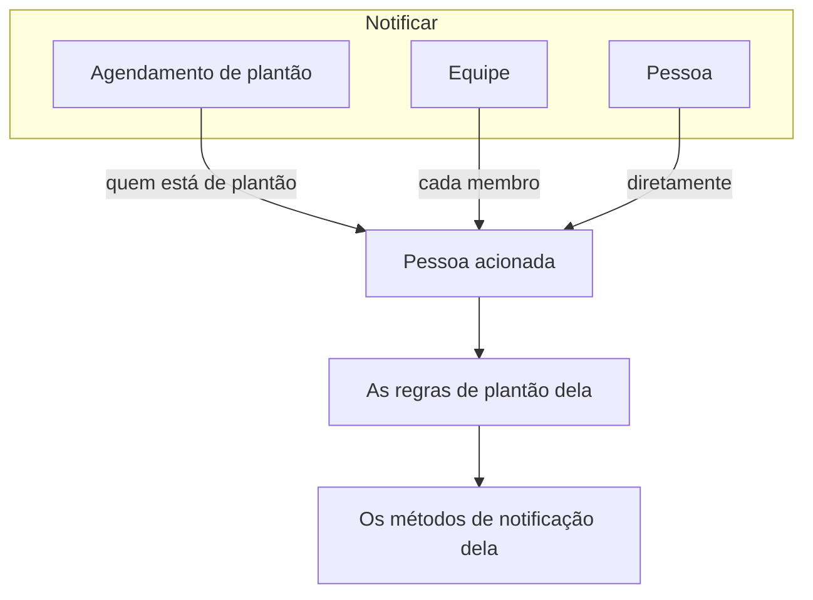

# Regras de escalonamento

Uma política de plantão aciona as pessoas por níveis. Cada regra de escalonamento é um nível: quem é acionado e quanto tempo esperar que alguém confirme antes de acionar o próximo nível. As regras de uma política aparecem, em ordem, na página **Regras de escalonamento** dela.

```mermaid title="Uma política de plantão aciona nível a nível até alguém confirmar"
flowchart TB
    trigger["Incidente ou alerta"] --> level1["Level 1 aciona"]
    level1 --> ack1{"Confirmado<br/>a tempo?"}
    ack1 -->|"Sim"| stop["Os acionamentos param"]
    ack1 -->|"Não"| level2["Level 2 aciona"]
    level2 --> ack2{"Confirmado<br/>a tempo?"}
    ack2 -->|"Sim"| stop
    ack2 -->|"Não, último nível"| repeat{"Repetir a política?"}
    repeat -->|"Sim"| level1
    repeat -->|"Não"| done["A política para"]
```

:::cards
- [Quem é acionado primeiro](#quem-é-acionado-primeiro): Crie uma política com o primeiro nível.
- [Adicionar uma regra de escalonamento](#adicionar-uma-regra-de-escalonamento): Adicione o próximo nível, passo a passo.
- [Como os níveis acionam as pessoas](#como-os-níveis-acionam-as-pessoas): Tempos, repetições e como cada pessoa é contatada.
- [API e Terraform](#criar-regras-com-a-api-ou-o-terraform): Crie políticas e regras como código.
:::

## Quem é acionado primeiro

Ao criar uma política de plantão na página **Políticas de plantão**, o formulário pede o **Nome** dela e **Quem é acionado primeiro?**. A pergunta usa o mesmo seletor de **Notificar**: agendamentos de plantão, equipes e pessoas, quantos forem necessários. Quem você escolher vira a primeira regra de escalonamento da política, **Level 1**, que espera **30 minutos** por uma confirmação antes de acionar o próximo nível.

:::steps
1. Vá em **Plantão** > **Políticas de plantão** e clique em **Criar: Política de plantão**.
2. Digite um **Nome**.
3. Em **Quem é acionado primeiro?**, clique em **Adicionar destinatário** e escolha os agendamentos de plantão, as equipes e as pessoas a acionar primeiro.
4. Clique em **Criar: Política de plantão**. A nova política abre depois na página **Regras de escalonamento** dela, onde você pode adicionar mais níveis.
:::

**Quem é acionado primeiro?** é opcional. Se você deixar em branco, a política começa sem regras de escalonamento: não aciona ninguém até você adicionar uma, e a visão geral dela avisa isso. A descrição e os rótulos ficam em **Mais campos**. A pergunta só é feita a quem pode adicionar regras de escalonamento.

## Adicionar uma regra de escalonamento

:::steps
### Abra as regras de escalonamento da política

Abra a política de plantão, escolha **Regras de escalonamento** no menu lateral dela e clique em **Adicionar regra de escalonamento**. A caixa de diálogo é uma única página curta.

### Escolha quem notificar

Em **Notificar**, clique em **Adicionar destinatário**, pesquise e escolha quantos agendamentos de plantão, equipes e pessoas este nível deve acionar. Adicione pelo menos um.

| Destinatário | Quem é acionado quando o nível é executado |
| --- | --- |
| Um **agendamento de plantão** | Quem estiver de plantão nele quando o nível for executado, não uma pessoa fixa. |
| Uma **equipe** | Cada membro da equipe. |
| Uma **pessoa** | Essa pessoa, diretamente. |

### Defina quanto esperar

**Escalonar após (em minutos)** é quanto esperar por uma confirmação antes de acionar o próximo nível. Começa em **30 minutos**; ajuste ao que fizer sentido para o nível.

### Dê um nome à regra, se quiser

Todo o resto fica em **Mais campos**, recolhido até você abrir:

- **Nome**: opcional. Uma regra sem nome recebe o nome do nível dela: a primeira regra de uma política é **Level 1**, a segunda **Level 2**, e assim por diante. O campo de nome mostra o nome que a regra vai receber.
- **Descrição**: notas opcionais, como quem este nível aciona e por quê.

Recolhido, o cabeçalho de **Mais campos** cita os dois e mostra os que a regra tem: uma descrição ou um nome próprio.

### Crie a regra

Clique em **Create Rule**. A regra é adicionada abaixo das outras, como o próximo nível da política.
:::

## Como os níveis acionam as pessoas

Quando um incidente ou alerta chega à política, **Level 1** aciona os destinatários dele na hora. Se ninguém confirmar dentro da espera, **Level 2** é acionado, e assim por diante na lista. Quando a espera do último nível passa sem confirmação, a política recomeça do **Level 1** se a **Política de Repetição** dela (abaixo das regras) mandar repetir, quantas vezes ela permitir, e caso contrário para. Confirmar ou resolver o incidente ou alerta interrompe os acionamentos em qualquer nível.

Um incidente, alerta ou episódio criado já confirmado ou resolvido — registrado depois do fato — não executa nenhuma de suas políticas: ninguém é acionado, e o feed dele informa isso, citando-as. Veja [Declarado já confirmado ou resolvido](/docs/incidents/declaring-incidents#declarado-já-confirmado-ou-resolvido).

Para repetir uma política, clique em **Editar** no cartão **Política de Repetição**, ative **Repeat if no one acknowledges** e defina **Number of times to repeat**.

### O resumo do escalonamento

O resumo no topo da página **Regras de escalonamento** mostra a escada inteira: quando cada nível é acionado, quem ele aciona e o que acontece depois do último. Um nível cujos destinatários não podem ser todos acionados avisa isso no cartão; clique no rótulo para ver quem e por quê.

### Como cada pessoa é contatada

Cada pessoa que um nível aciona é contatada do jeito que as próprias regras de plantão dela mandam: **Configurações do usuário** > **Regras de Plantão**, com uma aba para incidentes, episódios de incidente, alertas e episódios de alerta, e um cartão por severidade que mostra qual método de notificação é tentado e depois de quanto tempo. Um administrador do projeto pode ver e mudar as regras de um membro em **Usuários** > o membro > **Regras de Plantão**.



Uma substituição de usuário em vigor para uma pessoa envia os acionamentos dela para quem a cobre.

Toda mensagem é uma que o provedor aceita, então um acionamento sempre sai. Isto é o que cada canal leva:

| Canal | A maior mensagem que leva |
| --- | --- |
| SMS | 1.600 caracteres |
| Chamada telefônica | O que cabe no roteiro de chamada de 4.000 caracteres do Twilio |
| Notificação push | 4 KB, dos quais título, texto e dados ocupam no máximo 3 KB |
| WhatsApp | 1.024 caracteres |
| Telegram | 4.096 caracteres |

Uma mensagem mais longa, com um título longo ou uma descrição longa que um modelo colocou nela, é cortada e termina com um aviso de que o texto completo está no OneUptime: "… (truncated — see OneUptime for the full text)". O texto de uma mensagem de WhatsApp é um modelo fixo, então ali são cortados os valores mais longos, cada um terminando com "…". Os links de uma mensagem nunca são cortados.

### Quando um acionamento não é enviado

Um acionamento não enviado diz o motivo nos **Registros de plantão** da pessoa (Configurações do usuário): a linha mostra **Erro**, e a mensagem de status dá a razão. Ele não fica mais parado em **Sending**. A mensagem diz uma destas coisas:

- o saldo do projeto não pôde pagá-lo, e quem pode adicionar saldo;
- o canal está desligado no projeto, e quem pode ligá-lo.

Os proprietários do projeto recebem um e-mail sobre isso uma vez, até o saldo ser recarregado ou o canal ser ligado de novo.

No OneUptime Cloud, cada SMS, chamada, mensagem de WhatsApp e de Telegram é pago com o saldo do projeto em **Configurações do projeto > Notificações > Configurações de notificação**: o custo exato sai do saldo quando o provedor aceita a mensagem, não importa quantas mensagens saiam ao mesmo tempo.

- Com a **Recarga automática** ligada ali, a mensagem que encontra o saldo abaixo do limite adiciona primeiro o valor definido na recarga automática, cobrando o cartão do projeto; mensagens que o encontram baixo no mesmo momento cobram o cartão uma única vez.
- Se essa cobrança falhar (não há forma de pagamento ou o cartão foi recusado), a recarga automática tenta o cartão de novo uma hora depois, e **Configurações de notificação** avisa isso no topo até lá. Adicionar saldo manualmente, ou salvar a recarga automática de novo, tenta na hora.
- Os acionamentos continuam saindo com o saldo restante enquanto a recarga automática não consegue cobrar o cartão.

> [!IMPORTANT]
> SMS, chamadas telefônicas, WhatsApp e Telegram começam desligados em um projeto novo: no OneUptime Cloud, cada mensagem é paga com o saldo do projeto, e uma instalação auto-hospedada precisa antes de uma conta do Twilio ou de um bot do Telegram configurado. Enquanto um canal está desligado, ninguém no projeto pode adicionar um método nele. Só um proprietário do projeto ou alguém com o papel **Billing Admin** ou a permissão **Manage Billing** pode ligar um, no cartão **Canais de notificação** de **Configurações do projeto > Notificações > Configurações de notificação** — um administrador do projeto não pode. Todos os outros são informados exatamente de quem pode, onde quer que um canal esteja desligado: acima da própria lista de métodos nele, na lista de configuração deles e na mensagem que recebem quando algo precisa dele.

## Editar, reordenar e excluir regras

O cartão de cada regra tem **Edit rule** e um menu **⋯** com as outras ações:

- **Edit rule** abre a mesma caixa de diálogo de uma página, preenchida com a regra como está: os destinatários, a espera, e o nome e a descrição em **Mais campos**. Adicione ou remova destinatários e clique em **Salvar alterações**. Apagar o nome devolve à regra o nome do nível dela.
- **Move up** e **Move down**, no menu **⋯** de uma regra, mudam o nível dela. Uma regra com o nome do nível mantém um nome que corresponde ao lugar dela: quando **Level 3** sobe acima de **Level 2**, as duas trocam de nome. Um nome que você escolheu, como **Gestores**, continua igual aonde quer que a regra vá.
- **Delete rule** pergunta antes e diz quem o nível aciona. Excluir um nível sobe os níveis abaixo dele, e as regras com o nome do nível são renomeadas para corresponder.

## Criar regras com a API ou o Terraform

As regras de escalonamento são o recurso `/api/on-call-duty-policy-escalation-rule`; as pessoas, equipes e agendamentos que uma regra aciona são os recursos `/api/on-call-duty-policy-escalation-rule-user`, `-team` e `-schedule`.

- Uma regra criada sem `name` recebe o nome do nível, como no painel: **Level 3** para uma regra que vira o terceiro nível da política. O recurso de regra de escalonamento do Terraform continua exigindo um nome.
- `escalateAfterInMinutes` não tem padrão fora do painel. Uma regra criada sem ele não espera: o próximo nível é acionado assim que este é executado. Defina-o explicitamente — 30 é o que o painel sugere.
- Uma regra criada com `onCallSchedules`, `teams` ou `users` (listas de IDs) nos `miscDataProps` recebe esses destinatários; é assim que o seletor **Notificar** do painel os envia. Uma regra criada sem eles não aciona ninguém até você adicionar destinatários pelos recursos acima.
- As regras com o nome do nível são renomeadas quando você move ou exclui regras no painel. Mudar `order` pela API ou pelo Terraform muda só a ordem.
- Criar uma política de plantão em `/api/on-call-duty-policy` com `onCallSchedules`, `teams` ou `users` (listas de IDs) nos `miscDataProps` dá a ela a primeira regra de escalonamento, como faz o painel: **Level 1**, que os aciona, com um `escalateAfterInMinutes` de 30. Todo ID precisa pertencer ao projeto e quem chama precisa poder criar regras de escalonamento, senão a política não é criada. Uma política criada sem eles não tem regras, como antes; o recurso de política do Terraform não os envia.

```bash
curl -X POST https://oneuptime.com/api/on-call-duty-policy \
  -H "apikey: $ONEUPTIME_API_KEY" \
  -H "Content-Type: application/json" \
  -d '{
    "data": {
      "projectId": "<project-id>",
      "name": "Production on-call"
    },
    "miscDataProps": {
      "onCallSchedules": ["<schedule-id>"],
      "users": ["<user-id>"]
    }
  }'
```

## Próximos passos

:::cards
- [Agendamentos de plantão](/docs/on-call/schedules): Monte as rotações que um nível aciona.
- [Linha do tempo de plantões](/docs/on-call/schedule-timeline): Veja quem está de plantão em todos os agendamentos e encontre lacunas de cobertura.
- [Política de chamadas recebidas](/docs/on-call/incoming-call-policy): Deixe quem liga falar com a pessoa de plantão por telefone.
:::
