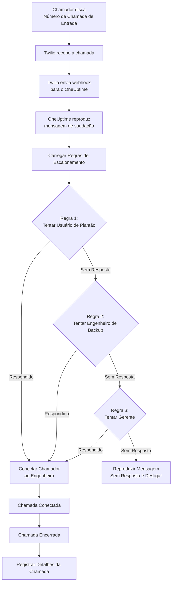

# Política de Chamadas de Entrada (Integração com Twilio)

As Políticas de Chamadas de Entrada permitem que chamadores externos alcancem seus engenheiros de plantão discando um número de telefone dedicado. Quando alguém liga, o OneUptime roteia a chamada através das suas regras de escalonamento configuradas até que um engenheiro atenda.

## Como Funciona

## Pré-requisitos

- Uma conta Twilio - Crie uma em [https://www.twilio.com](https://www.twilio.com)
- Seu Account SID e Auth Token do Twilio
- Acesso à sua instância auto-hospedada do OneUptime

## Visão Geral

O recurso de Política de Chamadas de Entrada funciona:

1. Recebendo chamadas de entrada em um número de telefone do Twilio
2. Reproduzindo uma mensagem de saudação personalizável
3. Roteando a chamada através de regras de escalonamento (agendamentos de plantão ou pessoas)
4. Conectando o chamador ao primeiro engenheiro de plantão disponível
5. Escalonando para a próxima regra se ninguém atender

Como você está auto-hospedando o OneUptime, precisará configurar sua própria conta Twilio. Isso lhe dá controle total sobre seus números de telefone e cobrança.

## Passo 1: Criar uma Conta Twilio

1. Vá para [https://www.twilio.com](https://www.twilio.com) e registre-se para uma conta
2. Conclua o processo de verificação
3. Anote seu **Account SID** e **Auth Token** no painel do Console do Twilio

## Passo 2: Configurar Call/SMS Config no OneUptime

1. Faça login no seu Painel do OneUptime
2. Vá para **Configurações do projeto** > **Notificações** > **Configurações de notificação**
3. Em **Configuração do Twilio**, clique em **Create Twilio Config**
4. Preencha os seguintes campos:
   - **Nome**: Um nome amigável (ex.: "Configuração Twilio de Produção")
   - **Descrição**: Descrição opcional
   - **SID da Conta Twilio**: Seu Account SID do Twilio (começa com `AC`)
   - **Token de Autenticação Twilio**: Seu Auth Token do Twilio
   - **Número de Telefone Principal do Twilio**: Um número de telefone da sua conta Twilio para chamadas de saída
   - **Definir como padrão do projeto**: ativado na primeira configuração do Twilio do projeto, então os SMS e as chamadas para os membros do projeto também passam por esta conta. Desative-o se esta conta for apenas para chamadas recebidas.
5. Clique em **Salvar**

## Passo 3: Criar uma Política de Chamadas de Entrada

1. Vá para **Plantão** > **Políticas de chamadas recebidas**
2. Clique em **Create Incoming Call Policy**
3. Preencha os seguintes campos:
   - **Nome**: Um nome amigável (ex.: "Linha de Suporte")
   - **Descrição**: Descrição opcional
4. Clique em **Salvar**

## Passo 4: Vincular Configuração do Twilio à Política

1. Abra sua Política de Chamadas de Entrada recém-criada
2. No cartão **Phone Number Routing**, encontre **Step 2: Link Twilio Configuration**
3. Clique em **Select Twilio Config** e escolha a configuração que você criou no Passo 2
4. Salve a seleção

## Passo 5: Configurar um Número de Telefone

Você tem duas opções para configurar um número de telefone:

### Opção A: Usar um Número de Telefone Twilio Existente

Se você já tem números de telefone na sua conta Twilio:

1. No cartão **Número de telefone**, clique em **Use Existing Number**
2. O OneUptime buscará todos os números de telefone da sua conta Twilio
3. Selecione o número de telefone que deseja usar
4. Clique em **Use This** para atribuí-lo à política

> **Nota**: Se o número de telefone já tiver um webhook configurado, ele será atualizado para apontar para o OneUptime.

### Opção B: Comprar um Novo Número de Telefone

Para comprar um novo número de telefone diretamente do OneUptime:

1. No cartão **Número de telefone**, clique em **Buy New Number**
2. Selecione um **País** no menu suspenso
3. Opcionalmente insira um **Area Code** (ex.: 415 para São Francisco)
4. Opcionalmente insira os dígitos que o número deve **Contain** (ex.: 555)
5. Clique em **Pesquisar** para encontrar números disponíveis
6. Selecione um número de telefone nos resultados
7. Clique em **Purchase** para comprar o número

O número de telefone será comprado da sua conta Twilio e o webhook será **configurado automaticamente** — sem configuração manual necessária!

## Passo 6: Configurar Regras de Escalonamento

As regras de escalonamento decidem para quem ligar quando alguém disca o número da política, de cima para baixo na lista:

1. Abra sua Política de Chamadas de Entrada
2. Vá para a aba **Regras de escalonamento**
3. Clique em **Adicionar regra de escalonamento**
4. Preencha a regra. É um único passo:
   - **Para quem ligar**: um agendamento de plantão ou uma pessoa. Um agendamento faz tocar o telefone de quem estiver de plantão nele quando a chamada chegar. As pessoas são os membros do seu projeto.
   - **Tempo de toque (em segundos)**: por quanto tempo o telefone delas toca antes de a chamada passar para a próxima regra. Começa em 20 segundos, e o Twilio aceita de 5 a 600.
   - **Nome** e **Descrição** são opcionais e ficam em **Mais campos**. Uma regra sem nome aparece conforme sua posição na lista: **Level 1**, **Level 2**.
5. Salve-a e adicione uma regra para cada agendamento ou pessoa a tentar em seguida

As regras são chamadas de cima para baixo na lista, e uma regra nova é adicionada ao final. Para mudar a ordem, arraste uma regra pela alça no canto superior esquerdo; pelo teclado, foque a alça, pressione Espaço, mova-a com as setas e pressione Espaço novamente.

> **Cuidado com a caixa postal**: mantenha o **Tempo de toque** menor do que o tempo que o telefone da pessoa leva para mandar uma chamada não atendida para a caixa postal. Se a caixa postal atender primeiro, quem liga é conectado a ela e a chamada não passa para a próxima regra. O Twilio acrescenta alguns segundos a cada toque. Por isso uma regra nova começa em 20 segundos. As regras adicionadas quando o padrão era 30 segundos mantêm os seus 30: se as chamadas delas caírem na caixa postal, diminua o **Tempo de toque** dessas regras.

### Exemplo de Regra de Escalonamento

| Nível   | Para quem ligar                   | Tempo de toque |
| ------- | --------------------------------- | -------------- |
| Level 1 | Agendamento de plantão principal  | 20 segundos    |
| Level 2 | Agendamento de plantão secundário | 20 segundos    |
| Level 3 | Líder de engenharia (uma pessoa)  | 20 segundos    |

## Passo 7: Configurar Mensagens de Voz (Opcional)

Personalize as mensagens que os chamadores ouvem:

1. Abra sua Política de Chamadas de Entrada
2. Vá para **Configurações**
3. Configure:
   - **Mensagem de Saudação**: Reproduzida quando a chamada é atendida
   - **Mensagem de Sem Resposta**: Reproduzida quando todas as regras de escalonamento falham
   - **Mensagem de Ninguém Disponível**: Reproduzida quando ninguém está de plantão

## Opções de Configuração

### Configurações da Política

| Configuração                    | Descrição                                               | Padrão                                                                     |
| ------------------------------- | ------------------------------------------------------- | -------------------------------------------------------------------------- |
| Greeting Message                | Mensagem TTS reproduzida quando a chamada é atendida    | "Aguarde enquanto conectamos você ao engenheiro de plantão."               |
| No Answer Message               | Mensagem quando todas as regras de escalonamento falham | "Ninguém está disponível. Tente novamente mais tarde."                     |
| No One Available Message        | Mensagem quando ninguém está de plantão                 | "Lamentamos, mas nenhum engenheiro de plantão está disponível no momento." |
| Repeat Policy If No One Answers | Reiniciar da primeira regra se todas falharem           | Desabilitado                                                               |
| Repeat Policy Times             | Tentativas de repetição máximas                         | 1                                                                          |

### Configurações de Regra de Escalonamento

| Configuração                 | Descrição                                                                                                                                              |
| ---------------------------- | ------------------------------------------------------------------------------------------------------------------------------------------------------ |
| Para quem ligar              | Um agendamento de plantão, que liga para quem estiver de plantão nele, ou uma pessoa. Cada regra liga para um deles                                    |
| Tempo de toque (em segundos) | Por quanto tempo o telefone toca antes de a chamada passar para a próxima regra (padrão: 20; de 5 a 600)                                               |
| Nome e Descrição             | Opcionais, em Mais campos. Uma regra sem nome aparece como Level 1, Level 2 e assim por diante, conforme sua posição na lista                            |
| Ordem                        | A posição da regra na lista: as regras são chamadas de cima para baixo. Muda-se arrastando as regras; pela API, uma regra nova sem ordem vai para o final |

Pela API, uma regra define `onCallDutyPolicyScheduleId` ou `userId` (um deles, nunca os dois) e `escalateAfterSeconds`: o tempo de toque, 20 quando omitido.

## Visualizando Logs de Chamadas

Para visualizar o histórico de chamadas de entrada:

1. Vá para **Plantão** > **Políticas de chamadas recebidas**
2. Clique na sua política
3. Vá para a aba **Registros de chamadas**

Os logs mostram:

- Número de telefone do chamador
- Status da chamada (Completada, Sem Resposta, Falhou, etc.)
- Quem atendeu a chamada
- Duração da chamada
- Timestamp

## Configuração de Número de Telefone do Usuário

Para que os usuários recebam chamadas de entrada, eles devem ter um número de telefone verificado:

1. Os usuários vão para **Configurações do usuário** > **Métodos de notificação**
2. Adicionam um número de telefone em **Incoming Call Numbers**
3. Verificam o número de telefone via código SMS

Apenas usuários com números de telefone verificados podem ser chamados através de regras de escalonamento.

Os números para chamadas recebidas são verificados por SMS, então **SMS** precisa estar ligado no projeto primeiro. Um proprietário do projeto ou alguém com **Manage Billing** o liga no cartão **Canais de notificação** em **Configurações do projeto > Notificações > Configurações de notificação**.

## Liberando um Número de Telefone

Se você não precisar mais de um número de telefone:

1. Abra sua Política de Chamadas de Entrada
2. No cartão **Número de telefone**, clique em **Liberar número**
3. Confirme a liberação

> **Aviso**: Os números liberados são devolvidos ao Twilio e podem não estar disponíveis para recompra.

## Solução de Problemas

### Chamadas não estão sendo recebidas

- Verifique se a configuração do Twilio está corretamente vinculada à política
- Verifique se sua instância do OneUptime está acessível pela internet
- Verifique se o Account SID e Auth Token do Twilio estão corretos
- Verifique o Console do Twilio para logs de erro

### Chamadas não estão conectando aos engenheiros

- Verifique se os usuários têm números de telefone verificados nas configurações de notificação
- Verifique se as regras de escalonamento estão adequadamente configuradas
- Certifique-se de que as escalas de plantão têm usuários atribuídos para o horário atual
- Verifique se a política está habilitada
- Se as chamadas caem na caixa postal de um engenheiro, defina o **Tempo de toque** da regra abaixo do tempo que o telefone dele leva para ir para a caixa postal

### Problemas de qualidade de áudio

- Certifique-se de que seu servidor tem conectividade estável com a internet
- Verifique a página de status do Twilio para quaisquer problemas em andamento
- Verifique se os números de telefone estão no formato correto (formato E.164: +15551234567)

## Considerações de Segurança

- Mantenha seu Auth Token do Twilio seguro e nunca o exponha publicamente
- Use HTTPS para sua instância do OneUptime
- O OneUptime valida assinaturas de webhook para garantir que as requisições vêm do Twilio
- Considere restringir quais números de telefone podem ligar para suas políticas de chamadas de entrada
