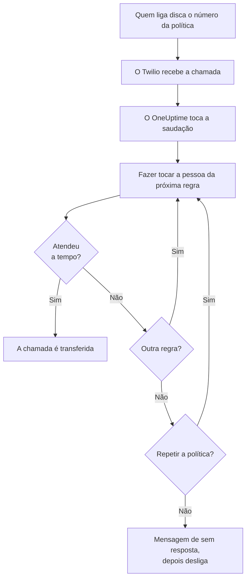
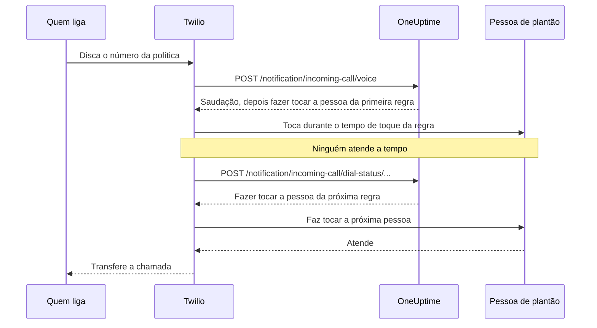

# Política de chamadas recebidas

Uma política de chamadas recebidas dá à sua equipe um número de telefone que chega a quem está de plantão. Quando alguém liga para ele, o OneUptime faz tocar, uma após a outra, as pessoas das regras de escalonamento da política até alguém atender, e transfere a chamada. Os números e as chamadas usam a sua própria conta do Twilio.

:::cards
- [Configure uma política](#configure-uma-política): Da sua conta do Twilio a uma chamada de teste, em sete passos.
- [Como uma chamada é roteada](#como-uma-chamada-é-roteada): Quem toca, por quanto tempo e o que quem liga ouve.
- [Chamadas perdidas](#chamadas-perdidas): Quem é avisado e como reagir a elas em um fluxo de trabalho.
- [Solução de problemas](#solução-de-problemas): Chamadas que nunca chegam ou nunca alcançam ninguém.
:::

## Antes de começar

| Você precisa de | Por quê |
| --- | --- |
| Uma conta do Twilio, com o Account SID e o Auth Token dela | Os números e as chamadas da política usam essa conta, e o Twilio cobra deles nela. |
| O plano **Growth**, no OneUptime Cloud | Um projeto precisa dele para ter uma configuração do Twilio própria. |
| Um servidor do OneUptime que o Twilio consiga alcançar, se você o hospeda | O Twilio envia cada chamada para `https://<your host>/notification/incoming-call/voice`. |
| **SMS** ligado no projeto | O número de cada pessoa é verificado com um código enviado por SMS. |
| Um número verificado para cada pessoa | Uma regra só faz tocar quem adicionou e verificou um número para chamadas recebidas no projeto. |

## Configure uma política

:::steps
### Adicione sua conta do Twilio

Vá em **Configurações do projeto** > **Notificações** > **Configurações de notificação**. No cartão **Configuração do Twilio**, clique em **Create Twilio Config** e preencha o formulário:

- **Nome** e **Descrição**: para que serve a conta, por exemplo "Linha de suporte".
- **SID da Conta Twilio**: do console do Twilio. Começa com `AC`.
- **Token de Autenticação Twilio**: do console do Twilio.
- **Número de Telefone Principal do Twilio**: um número dessa conta, para os SMS e as chamadas que ela envia.
- **Números de Telefone Secundários do Twilio**: opcional. Números que enviam no lugar do principal para destinatários do país deles.
- **Definir como padrão do projeto**: ligado para a primeira configuração do Twilio do projeto, para que os SMS e as chamadas para os membros do projeto também passem por esta conta. Desligue se esta conta for só para chamadas recebidas.

### Crie a política

Vá em **Plantão** > **Políticas de chamadas recebidas** e clique em **Criar: Política de chamadas recebidas**. Dê a ela um **Nome**, por exemplo "Linha de suporte", e, se quiser, uma **Descrição** e **Rótulos**. Depois abra a política na lista.

### Escolha a conta do Twilio

A **Visão geral** da política mostra um cartão **Configuração** com três passos numerados. No primeiro, clique em **Selecionar**, escolha a conta em **Configuração do Twilio** e clique em **Salvar**.

### Adicione um número de telefone

No segundo passo, clique em **Add Phone Number**. Escolha **Use Existing Phone Number** para trazer um número que sua conta do Twilio já tem, ou **Reserve New Phone Number** para conseguir um novo. O OneUptime aponta o número para si mesmo, então não há nada a configurar no Twilio. Veja [Números de telefone](#números-de-telefone).

### Adicione regras de escalonamento

No terceiro passo, clique em **Gerenciar regras**. Adicione uma regra para cada agendamento de plantão ou pessoa que deve tocar, na ordem em que devem tocar. Veja [Regras de escalonamento](#regras-de-escalonamento).

### Verifique o número de cada pessoa

Cada pessoa que uma regra pode fazer tocar adiciona e verifica o próprio número para chamadas recebidas. Veja [Números das pessoas de plantão](#números-das-pessoas-de-plantão).

### Ligue para o número

Quando os três passos estiverem concluídos, o cartão vira **Phone Numbers & Twilio Configuration**. Ligue para o número de qualquer telefone e depois abra os **Registros de chamadas** da política para ver quem tocou.
:::

## Como uma chamada é roteada

1. O Twilio envia a chamada para o OneUptime, que lê a **Mensagem de Saudação** da política.
2. O OneUptime faz tocar a pessoa citada pela primeira regra de escalonamento: essa pessoa, ou quem estiver de plantão naquele momento no agendamento de plantão da regra, substituições de usuário incluídas. O telefone dela mostra o número da política como quem está ligando.
3. Se ela atender dentro do **Tempo de toque** da regra, a chamada é transferida, e o registro de chamadas guarda quem atendeu.
4. Se não, quem liga ouve "Connecting you to the next available engineer." e a pessoa da próxima regra toca.
5. Depois da última regra, a política recomeça pela primeira se **Repetir Política Se Ninguém Responder** estiver ligado, quantas vezes **Número de Repetições da Política** mandar. Se não, quem liga ouve a **Mensagem de Sem Resposta**, e a chamada termina.

Uma regra é pulada, sem tocar para ninguém, quando agora não há ninguém para chamar por ela: o agendamento dela não tem ninguém de plantão, a pessoa não tem um número verificado para chamadas recebidas neste projeto ou não é mais membro do projeto. Quando nenhuma regra tem alguém para tocar, quem liga ouve a **Mensagem de Ninguém Disponível**. Uma política desativada responde a toda chamada com "Sorry, this service is currently disabled." e desliga.

O OneUptime confere a assinatura do Twilio em cada requisição com o Auth Token da configuração do Twilio, e recusa uma requisição que não consegue verificar.

> [!TIP]
> Salve o número da política como contato no seu telefone, por exemplo "Linha de suporte", para reconhecer uma chamada roteada quando ela tocar.

## Regras de escalonamento

As regras de escalonamento decidem quem toca quando alguém liga para o número da política, de cima para baixo na lista. Abra a política, escolha **Regras de escalonamento** no menu lateral dela e clique em **Adicionar regra de escalonamento**. Uma regra é um único passo curto:

- **Para quem ligar**: um agendamento de plantão ou uma única pessoa. Um agendamento faz tocar quem estiver de plantão nele quando a chamada chega. As pessoas são os membros do seu projeto.
- **Tempo de toque (em segundos)**: por quanto tempo o telefone delas toca antes de a chamada passar para a próxima regra. Começa em 20 segundos, e o Twilio aceita de 5 a 600.
- **Nome** e **Descrição** são opcionais, em **Mais campos**. Uma regra sem nome aparece pela posição dela na lista: **Level 1**, **Level 2**.

As regras são chamadas de cima para baixo na lista, e uma regra nova vai para o fim. Para mudar a ordem, arraste uma regra pela alça no canto superior esquerdo. Pelo teclado, foque a alça, pressione Espaço, mova com as setas e pressione Espaço de novo.

> [!WARNING]
> **Cuidado com a caixa postal**: mantenha o **Tempo de toque** menor que o tempo que o telefone da pessoa leva para mandar uma chamada não atendida para a caixa postal. Se a caixa postal atender primeiro, quem liga é conectado a ela e a chamada não passa para a próxima regra. O Twilio acrescenta alguns segundos próprios a cada toque. Por isso uma regra nova começa em 20 segundos. As regras adicionadas quando o padrão era de 30 segundos mantêm os 30 delas: se as chamadas delas acabarem na caixa postal, diminua o **Tempo de toque** dessas regras.

Por exemplo, três regras que tentam duas rotações e depois uma liderança:

| Nível | Para quem ligar | Tempo de toque |
| --- | --- | --- |
| Level 1 | Agendamento de plantão principal | 20 segundos |
| Level 2 | Agendamento de plantão secundário | 20 segundos |
| Level 3 | Líder de engenharia (uma pessoa) | 20 segundos |

## Números de telefone

Uma política pode ter vários números, e todos fazem tocar as mesmas regras. Cada número pertence a uma única política. Adicione-os com **Add Phone Number** na **Visão geral** da política:

:::tabs
@tab Usar um número que você já tem
1. Clique em **Add Phone Number** e depois em **Use Existing Phone Number**. O OneUptime lista os números da conta do Twilio da política.
2. Clique em **Selecionar** ao lado do número e depois em **Atribuir número**.

Um número cujas chamadas já vão para outro lugar avisa isso com "Currently has a webhook configured". Atribuí-lo manda as chamadas dele para o OneUptime.
@tab Reservar um número novo
1. Clique em **Add Phone Number**, depois em **Reserve New Phone Number** e em **Pesquisar números**.
2. Escolha um **País**. Se quiser, preencha **Código de área (opcional)**, por exemplo 415, ou **Contém (opcional)** com os dígitos que o número deve conter. Clique em **Pesquisar**: até 10 números locais são listados.
3. Clique em **Reservar** ao lado de um número e confirme com **Reservar**. O Twilio cobra o número na sua conta do Twilio.
:::

O OneUptime define o webhook de voz do número como `https://<your host>/notification/incoming-call/voice`, montado a partir de `HOST` e `HTTP_PROTOCOL` em uma instalação auto-hospedada. Para passar uma política para outra conta do Twilio, libere antes os números dela: a conta só pode mudar enquanto a política não tem nenhum.

Para liberar um número, clique em **Liberar** ao lado dele e confirme com **Liberar número**.

> [!CAUTION]
> Liberar um número o devolve ao Twilio, mesmo um número trazido com **Use Existing Phone Number**, e talvez você não o recupere. Excluir uma política, ou a configuração do Twilio que ela usa, também libera os números dela.

## Números das pessoas de plantão

Uma regra faz tocar uma pessoa no número que ela verificou para chamadas recebidas neste projeto, e pula quem não tem nenhum. Cada pessoa adiciona o seu:

:::steps
1. Abra **Configurações do usuário** > **Política de chamadas recebidas** > **Números de telefone recebidos**. **Política de chamadas recebidas** é uma seção do menu lateral que começa recolhida.
2. No cartão **Números de telefone para roteamento de chamadas recebidas**, clique em **Adicionar: Número de telefone para roteamento de chamadas recebidas** e digite o número com o código do país, por exemplo `+15551234567`.
3. Digite o código de 6 dígitos que o OneUptime envia por SMS para o número em **Código de verificação** e clique em **Verificar**. **Send a new code** envia outro.
:::

Cada pessoa pode ter um número verificado por projeto. Para trocá-lo, exclua antes o número antigo. Esses números são separados dos números de telefone em **Métodos de notificação**, que os acionamentos de plantão usam.

Os números para chamadas recebidas são verificados por SMS, então o **SMS** precisa estar ligado no projeto antes. Um proprietário do projeto ou alguém com o papel **Billing Admin** ou a permissão **Manage Billing** o liga no cartão **Canais de notificação** de **Configurações do projeto > Notificações > Configurações de notificação**.

## Mensagens de voz e configurações da política

Abra a política e escolha **Configurações** em **Avançado** no menu lateral dela. **Edit Messages** no cartão **Mensagens de voz** muda o que quem liga ouve; **Edit Policy Settings** no cartão **Configurações da política** muda o resto.

| Configuração | O que faz | Em uma política nova |
| --- | --- | --- |
| **Mensagem de Saudação** | Lida quando a chamada é atendida, antes de a primeira pessoa tocar. | "Please wait while we connect you to the on-call engineer." |
| **Mensagem de Sem Resposta** | Lida quando todas as regras foram tentadas e ninguém atendeu. | "No one is available. Please try again later." |
| **Mensagem de Ninguém Disponível** | Lida quando nenhuma regra tem alguém para tocar. | "We are sorry, but no on-call engineer is currently available. Please try again later or contact support." |
| **Habilitado** | Uma política desativada recusa todas as chamadas. | Ligado |
| **Repetir Política Se Ninguém Responder** | Depois da última regra, recomeça pela primeira. | Desligado |
| **Número de Repetições da Política** | Quantas vezes recomeçar. | 1 |

O Twilio lê as mensagens com uma voz sintetizada, então escreva-as do jeito que quer que soem.

## Registros de chamadas

Toda chamada aparece na página **Registros de chamadas** da política, em **Registros** no menu lateral dela: o **Chamador**, o **Number Called**, o **Status** dela, quem atendeu (**Atendida por**), a **Duração** e quando ela começou (**Iniciado em**). Clique em **View Timeline** em uma chamada para ver a **Linha do tempo da chamada**: cada pessoa que tocou, em qual número e como cada tentativa terminou.

| Status | O que aconteceu |
| --- | --- |
| **Initiated**, **Ringing**, **Escalated** | A chamada ainda está em andamento: chegou, um telefone está tocando ou passou para uma regra seguinte. |
| **Concluído** | Alguém atendeu, e a chamada foi transferida. |
| **Sem Resposta** | Todas as regras de escalonamento foram tentadas e ninguém atendeu. Quem ligou ouviu a sua **Mensagem de Sem Resposta**. |
| **Caller Hung Up** | Quem ligou desligou enquanto o telefone de uma pessoa tocava. |
| **Falhou** | Não foi possível tocar para ninguém: nenhuma regra de escalonamento tinha uma pessoa de plantão com um número verificado para chamadas recebidas (quem ligou ouviu a sua **Mensagem de Ninguém Disponível**), ou a política está desativada. |

## Chamadas perdidas

Uma chamada é perdida quando termina sem alcançar ninguém: o status dela é **Sem Resposta**, **Caller Hung Up** ou **Falhou**.

### Quem é avisado

Quando uma chamada é perdida, o OneUptime avisa os proprietários da política: os usuários e os membros das equipes adicionados na página **Proprietários** da política. Se a política não tiver proprietários, os proprietários do projeto são avisados no lugar.

O aviso diz quem ligou, qual número foi discado, por que ninguém atendeu, e quem tocou e como cada tentativa terminou. Ele traz um link para a chamada no registro de chamadas.

Os proprietários recebem um e-mail por padrão. Cada pessoa pode escolher outros canais (SMS, chamada, push e mais) ou desligá-lo em **Configurações do usuário** > **Configurações de notificação**, em **Plantão** > **Políticas de chamadas recebidas** > **Chamada perdida**.

### Reaja a chamadas perdidas em um fluxo de trabalho

Os registros de chamadas recebidas estão disponíveis como gatilhos de fluxos de trabalho:

- **On Create Incoming Call Log** é executado quando uma chamada chega.
- **On Update Incoming Call Log** é executado conforme a chamada avança. A atualização que define **Ended At** é o fim da chamada.

Para agir só sobre chamadas perdidas, por exemplo para publicá-las no Slack ou no Microsoft Teams ou abrir um ticket:

:::steps
1. Adicione o gatilho **On Update Incoming Call Log**. Defina **Listen on** como **Ended At** e selecione os campos que quer usar, como **Status**, **Caller Phone Number** e **Routing Phone Number**.
2. Adicione um passo **If / Else**. Confira o **Status** do gatilho, com a comparação **is not equal to** e `Completed`.
3. Ligue os seus passos à porta **Yes**.
:::

Um fluxo de trabalho pode ler registros de chamadas com **Find One** e **Find Many**, mas não pode criá-los nem alterá-los.

## Quem pode adicionar e liberar números de telefone

Os números de telefone de uma política seguem os mesmos papéis da própria política:

- **Pesquisar números** - procurar no Twilio um número para reservar, ou listar os números que sua conta do Twilio já tem - exige permissão para ler políticas de chamadas recebidas e para ler configurações de chamadas e SMS, porque lê sua conta do Twilio por meio de uma delas. **Project Owner**, **Project Admin**, **Project Member**, **Viewer**, **Settings Admin**, **Settings Member** e **Settings Viewer** têm as duas. Em um papel personalizado, são **Read Incoming Call Policy** e **Read Call and SMS**.
- **Reservar um número, usar um existente e liberar um** exigem permissão para editar políticas de chamadas recebidas: **Project Owner**, **Project Admin**, **Project Member**, **Settings Admin** e **Settings Member**, ou **Edit Incoming Call Policy** em um papel personalizado. Eles mudam os números de uma política que você pode editar: com um papel limitado a alguns rótulos, as políticas que têm esses rótulos.

Um bloqueio de equipe sem rótulos em uma dessas permissões a retira. Para qualquer outra pessoa, **Add Phone Number** e **Liberar** continuam na página, bloqueados, e a dica deles diz o que é preciso. A API recusa a requisição com uma frase que diz o que é preciso: "Looking up phone numbers needs permission to read incoming call policies and call and SMS settings." ou "Adding or releasing a phone number needs permission to edit incoming call policies." Reservar um número é cobrado na sua própria conta do Twilio, não no seu saldo do OneUptime, então não exige permissão de faturamento.

## Criar políticas com a API ou o Terraform

| Recurso | Rota da API |
| --- | --- |
| Políticas de chamadas recebidas | `/api/incoming-call-policy` |
| As regras de escalonamento delas | `/api/incoming-call-policy-escalation-rule` |
| Os números de telefone delas, só leitura | `/api/incoming-call-policy-phone-number` |
| Registros de chamadas, só leitura | `/api/incoming-call-log` |

Uma regra criada pela API sem `escalateAfterSeconds` toca por 20 segundos, assim como uma que o Terraform cria sem `escalate_after_seconds`.

### Configurações de uma regra de escalonamento

| Configuração | Campo da API | O que guarda |
| --- | --- | --- |
| Para quem ligar | `onCallDutyPolicyScheduleId` ou `userId` | Um dos dois, nunca ambos: o agendamento cuja pessoa de plantão toca, ou a pessoa. |
| Tempo de toque (em segundos) | `escalateAfterSeconds` | Por quanto tempo o telefone toca antes de a chamada seguir (padrão: 20; de 5 a 600). |
| Nome e Descrição | `name`, `description` | Opcionais. Uma regra sem nome aparece como Level 1, Level 2 e assim por diante, pela posição dela na lista. |
| Ordem | `order` | Onde a regra fica na lista: as regras são chamadas de cima para baixo. Uma regra nova sem ordem vai para o fim. |

## Solução de problemas

:::details As chamadas não chegam ao OneUptime
- No console do Twilio, abra o número: **A call comes in** precisa ser o webhook `https://<your host>/notification/incoming-call/voice`, com HTTP POST. O OneUptime o define quando o número é adicionado, a partir de `HOST` e `HTTP_PROTOCOL`. Se eles mudaram desde então, corrija o webhook no Twilio.
- Um OneUptime auto-hospedado precisa estar acessível pela internet por https. O registro de chamadas do número no console do Twilio, e o **Debugger** do Twilio, mostram o que o OneUptime respondeu.
- Uma resposta `403` significa que a assinatura da requisição não bateu. Confira se a configuração do Twilio tem o **Token de Autenticação Twilio** atual da conta, e se um proxy na frente do OneUptime repassa o host e o esquema que o Twilio chamou (`X-Forwarded-Host` e `X-Forwarded-Proto`).
:::

:::details A chamada é atendida, mas ninguém toca
O registro de chamadas mostra **Falhou**. Confira se a política está **Habilitado**, se o agendamento de plantão de cada regra tem alguém de plantão agora e se as pessoas que as regras fazem tocar têm um número verificado em **Configurações do usuário** > **Política de chamadas recebidas** > **Números de telefone recebidos**, neste projeto. As regras só fazem tocar membros do projeto.
:::

:::details As chamadas acabam na caixa postal
Se as chamadas acabarem na caixa postal de uma pessoa, defina o **Tempo de toque** da regra abaixo do tempo que o telefone dela leva para cair na caixa postal. Uma caixa postal que atende conta como atendimento, e a chamada para ali.
:::

:::details Não é possível reservar um número novo
Em muitos países, o Twilio exige um regulatory bundle aprovado antes de vender números locais, e alguns números exigem saldo positivo no Twilio. Configure isso no console do Twilio, ou consiga o número lá e adicione-o com **Use Existing Phone Number**.
:::

:::details Não é possível mudar a conta do Twilio da política
A conta só pode mudar enquanto a política não tem números de telefone: a página diz "Remove all phone numbers to change". Liberar os números os devolve ao Twilio, então planeje a troca antes.
:::

:::details O código para o número de uma pessoa não chega
O SMS precisa estar ligado no projeto. No OneUptime Cloud, um projeto sem uma configuração do Twilio padrão própria paga os SMS com o saldo dele, que precisa passar de 1 USD. Os códigos podem levar um minuto para chegar; clique em **Send a new code** para enviar outro, e **Configurações do projeto** > **Notificações** > **Logs de notificação** mostra o que aconteceu com ele.
:::

## Próximos passos

:::cards
- [Regras de escalonamento](/docs/on-call/escalation-rules): Como uma política de plantão aciona as pessoas, nível a nível.
- [Agendamentos de plantão](/docs/on-call/schedules): Monte as rotações que suas regras fazem tocar.
- [Fluxos de trabalho](/docs/workflows/index): Reaja a chamadas perdidas: publique-as em um canal ou abra um ticket.
- [Integração de SMS e voz do Twilio](/docs/self-hosted/twilio-integration): Configure o Twilio para uma instalação auto-hospedada.
:::
