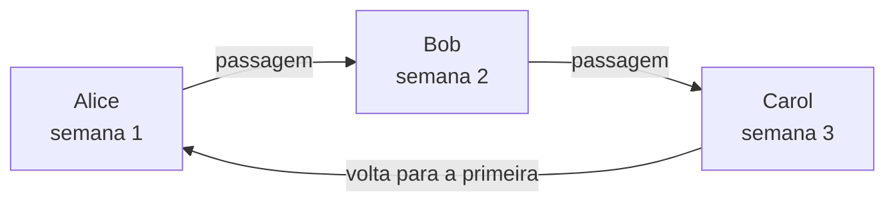
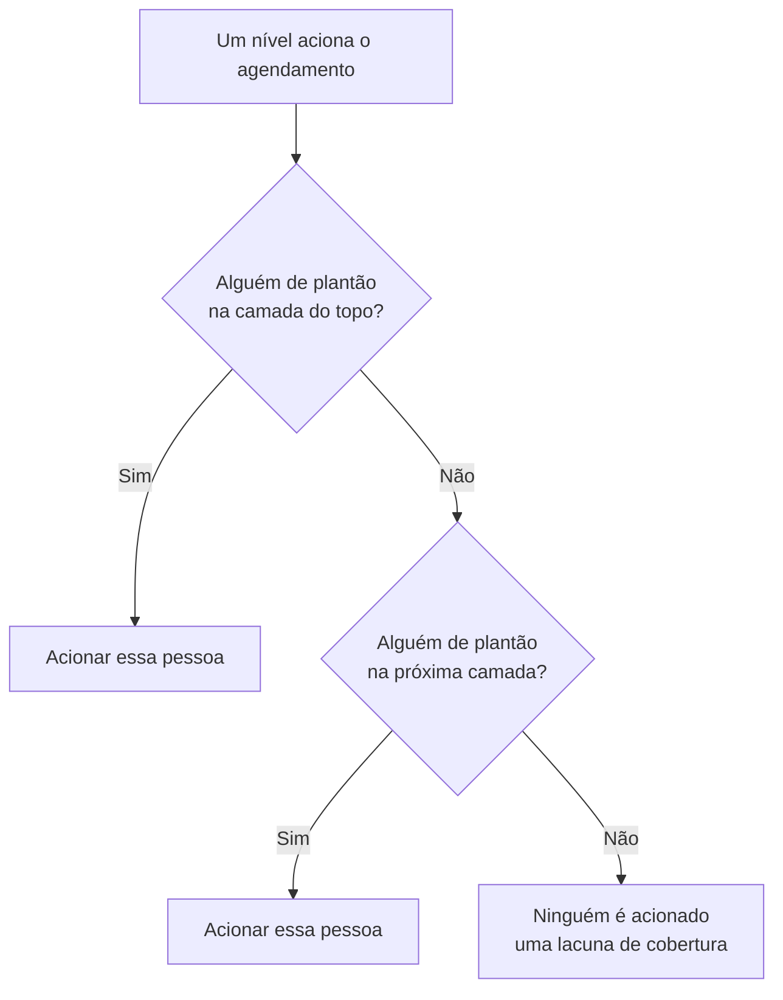

# Agendamentos de plantão

Um agendamento de plantão decide quem está de plantão a cada momento. As pessoas se revezam nele: cada uma fica de plantão por um tempo, e depois a próxima assume. Adicione um agendamento às regras de escalonamento de uma política de plantão, e a política aciona quem estiver de plantão nele quando aquele nível for executado.

> [!NOTE]
> No OneUptime Cloud, os agendamentos de plantão fazem parte do plano **Growth** e superiores. Um agendamento que um projeto ainda tem continua acionando as pessoas dele, pelas regras de escalonamento que o citam, depois que um teste do Growth termina ou o plano é rebaixado. Por isso, abaixo do **Growth**, a página **Agendamentos de plantão** mostra o aviso do plano com os agendamentos ainda configurados embaixo, onde você pode excluí-los. Criar ou alterar um agendamento exige o **Growth**.

:::cards
- [Quem se reveza](#quem-se-reveza): Crie um agendamento com a primeira rotação.
- [Camadas](#camadas): Empilhe rotações, limite os horários de plantão e adicione uma cobertura de reserva.
- [API e Terraform](#criar-agendamentos-com-a-api-ou-o-terraform): Crie agendamentos e rotações como código.
:::

## Quem se reveza

Ao criar um agendamento na página **Agendamentos de plantão**, o formulário pede o **Nome** dele e **Quem se reveza?**. As pessoas que você escolher formam a primeira camada do agendamento, **Layer 1**, de plantão 24 horas por dia.

:::steps
1. Vá em **Plantão** > **Agendamentos de plantão** e clique em **Criar agendamento de plantão**.
2. Digite um **Nome**.
3. Em **Quem se reveza?**, clique em **Adicionar usuário** e escolha as pessoas, na ordem em que se revezam.
4. Se quiser, abra **Mais campos** para mudar quanto dura cada turno, o fuso horário, a descrição ou os rótulos.
5. Clique em **Criar agendamento de plantão**. O novo agendamento abre depois na página **Camadas** dele, onde você pode mudar a rotação ou adicionar mais camadas.
:::

As pessoas se revezam uma de cada vez, e a primeira fica de plantão assim que o agendamento é criado:



**Quem se reveza?** é opcional. Se você deixar em branco, o agendamento começa sem camadas: não coloca ninguém de plantão até você adicionar uma camada na página **Camadas** dele. A pergunta só é feita a quem pode adicionar camadas.

Todo o resto fica em **Mais campos**, recolhido até você abrir:

| Campo | O que faz |
| --- | --- |
| **Cada turno dura** | **1 dia**, **1 semana**, **2 semanas** ou **1 mês**, e **1 semana** se você não mudar. É perguntado assim que alguém se reveza. Cada pessoa fica de plantão por esse tempo, e depois a próxima assume, no horário do dia em que o agendamento foi criado. |
| **Fuso horário** | O fuso horário em que os horários de passagem e os horários de plantão são guardados. Começa com o seu. |
| **Descrição** | Notas sobre o agendamento. |
| **Rótulos** | Rótulos para encontrar e agrupar o agendamento. |

Enquanto alguém se reveza e nada em **Mais campos** é alterado, o cabeçalho recolhido diz o que vai acontecer: cada pessoa fica de plantão por uma semana, e depois a próxima assume.

## Camadas

A rotação de um agendamento é feita de camadas, na página **Camadas** dele. As camadas são lidas de cima para baixo: a camada mais alta com alguém de plantão é a que aciona, então coloque a rotação principal no topo e a cobertura de reserva embaixo.



**Adicionar camada** adiciona uma camada que começa como a primeira: de plantão a partir de agora, cada pessoa por uma semana, 24 horas por dia. Expanda uma camada para adicionar pessoas a ela e para mudar quando começa, com que frequência passa o turno, quando faz a primeira passagem e os horários de plantão:

| Campo | O que define |
| --- | --- |
| **Layer name** | O que a camada cobre, por exemplo "Principal em dias úteis". |
| **Rotation starts at** | A data e a hora em que a rotação da camada começa. |
| **Rotate every** | Com que frequência o plantão passa para a próxima pessoa da camada. |
| **First hand-off time** | A primeira passagem para a próxima pessoa, no início ou depois. As passagens seguintes acompanham cada intervalo de rotação. |
| **Restrictions** | Os horários em que a camada fica de plantão: **Sem Restrições**, **Horários específicos do dia** ou **Horários específicos da semana**, no fuso horário do agendamento. Fora deles, as camadas inferiores assumem. |

Para mudar qual camada vem primeiro, use **Move layer up (higher priority)** ou **Move layer down (lower priority)** no menu de uma camada.

Cada pessoa mantém uma única cor em todo lugar, para você acompanhá-la num relance: em cada camada, no agendamento final e nas substituições dele, e na **Linha do tempo de plantões**.

## Criar agendamentos com a API ou o Terraform

Os agendamentos de plantão são o recurso `/api/on-call-duty-policy-schedule`; as camadas deles e as pessoas nelas são os recursos `/api/on-call-duty-schedule-layer` e `/api/on-call-duty-schedule-layer-user`.

- Criar um agendamento com `firstLayerUsers` (uma lista de IDs de usuário, na ordem em que se revezam) nos `miscDataProps` dá a ele a primeira camada, como faz o painel: **Layer 1**, de plantão a partir de agora, 24 horas por dia. `firstLayerRotation` diz quanto dura cada turno, como uma rotação do tipo `{"_type": "Recurring", "value": {"intervalType": "Week", "intervalCount": 1}}`; sem ela, uma semana. Todo usuário precisa ser membro do projeto e quem chama precisa poder criar camadas, senão o agendamento não é criado.
- Um agendamento criado sem eles não tem camadas, como antes; o recurso de agendamento do Terraform não os envia.
- Uma camada criada sem `rotation` passa o turno todo dia, como sempre.

```bash
curl -X POST https://oneuptime.com/api/on-call-duty-policy-schedule \
  -H "apikey: $ONEUPTIME_API_KEY" \
  -H "Content-Type: application/json" \
  -d '{
    "data": {
      "projectId": "<project-id>",
      "name": "Primary on-call",
      "timezone": "Europe/Berlin"
    },
    "miscDataProps": {
      "firstLayerUsers": ["<user-id-1>", "<user-id-2>", "<user-id-3>"],
      "firstLayerRotation": {"_type": "Recurring", "value": {"intervalType": "Week", "intervalCount": 1}}
    }
  }'
```

## Próximos passos

:::cards
- [Regras de escalonamento](/docs/on-call/escalation-rules): Faça um nível de uma política de plantão acionar este agendamento.
- [Linha do tempo de plantões](/docs/on-call/schedule-timeline): Veja todos os agendamentos lado a lado, com as lacunas de cobertura.
- [Feeds de calendário](/docs/on-call/calendar-feeds): Leve os turnos para o Google Agenda, o Outlook ou o Calendário da Apple.
:::
