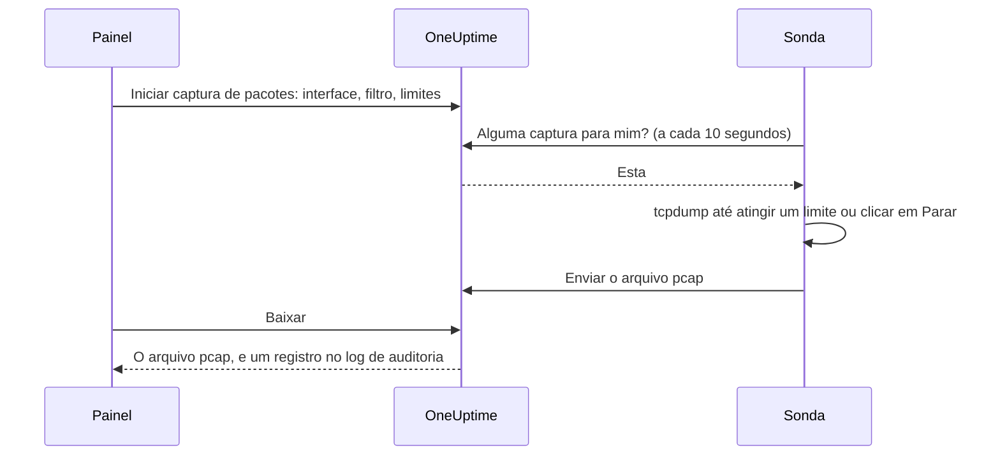

# Captura de pacotes

Capture o tráfego que uma das suas sondas vê direto do painel e abra o arquivo no Wireshark. A sonda já está na rede que você está investigando: não há VPN para abrir nem jump host para acessar.

As capturas ficam desativadas em cada sonda até que quem a executa as ative, e só são executadas nas sondas do seu próprio projeto.

:::cards
- [Como funciona](#como-funciona): De "Iniciar captura de pacotes" a um arquivo no Wireshark.
- [Ativar a captura de pacotes](#ativar-a-captura-de-pacotes): O que quem executa a sonda configura, para Docker, Docker Compose e Kubernetes.
- [Iniciar uma captura](#iniciar-uma-captura): Escolha uma interface, restrinja ao que você precisa e baixe o arquivo.
- [Referência](#referência): Limites, filtros, permissões, o log de auditoria e por quanto tempo os arquivos são mantidos.
- [Solução de problemas](#solução-de-problemas): O que significa a mensagem de uma captura que falhou.
:::

## Como funciona



1. **Iniciar.** Alguém com permissão para iniciar capturas escolhe a interface da sonda, um filtro e os limites, e clica em **Iniciar captura**. O OneUptime verifica o filtro e os limites em relação ao que a sonda permite antes de salvar a captura.
2. **Assumir.** A sonda pede trabalho ao OneUptime a cada dez segundos, como faz com os monitores. Ela assume a captura e inicia o `tcpdump`.
3. **Capturar.** A captura para no primeiro dos seus limites: a duração, o limite de pacotes ou o tamanho do arquivo. **Parar** a encerra antes e mantém o que já foi capturado.
4. **Enviar.** A sonda envia o arquivo pcap. O OneUptime o guarda como arquivo privado do projeto.
5. **Baixar.** A captura mostra **Concluído** com um botão **Baixar**. O arquivo abre no Wireshark, no tcpdump ou em qualquer outra ferramenta que leia arquivos pcap.

## Antes de começar

- **Uma sonda do seu próprio projeto.** Sondas globais transportam o tráfego de outros projetos, então nunca capturam. Para instalar uma sonda sua, veja [Sondas personalizadas](/docs/probe/custom-probe).
- **Uma sonda desta versão ou mais recente.** Sondas mais antigas não informam em que podem capturar.
- **As permissões certas.** Iniciar e parar uma captura exige **Start Packet Capture**, e baixar um arquivo, **Download Packet Capture**. Proprietários e administradores do projeto têm as duas. Veja [Permissões](#permissões).
- **Uma porta espelhada, para o tráfego que não chega à sonda.** Uma sonda só vê o tráfego das interfaces do próprio host. Para capturar o tráfego entre outros dispositivos, espelhe a porta deles no switch (SPAN) para uma interface livre do host da sonda.

## Ativar a captura de pacotes

Quem executa a sonda ativa as capturas onde a sonda é executada: o painel não pode, de propósito. A sonda precisa de três coisas:

| Configuração | Por quê |
| --- | --- |
| `PROBE_PACKET_CAPTURE_ENABLED=true` | Ativa as capturas. Qualquer outro valor, ou nenhum, as mantém desativadas. |
| Rede do host | Permite que a sonda veja as interfaces do próprio host e uma porta espelhada. Sem ela, a sonda só vê a rede do seu contêiner. |
| A capability `NET_RAW` | Permite que o tcpdump capture. O Docker a concede por padrão. O padrão Pod Security "restricted" do Kubernetes a remove, então adicione-a. |

:::tabs
@tab Docker
```bash
docker run --name oneuptime-probe --network host \
  --cap-add NET_RAW \
  -e PROBE_KEY=<probe-key> \
  -e PROBE_ID=<probe-id> \
  -e ONEUPTIME_URL=https://oneuptime.com \
  -e PROBE_PACKET_CAPTURE_ENABLED=true \
  -d oneuptime/probe:release
```
@tab Docker Compose
```yaml
services:
  oneuptime-probe:
    image: oneuptime/probe:release
    container_name: oneuptime-probe
    network_mode: host
    cap_add:
      - NET_RAW
    environment:
      - PROBE_KEY=<probe-key>
      - PROBE_ID=<probe-id>
      - ONEUPTIME_URL=https://oneuptime.com
      - PROBE_PACKET_CAPTURE_ENABLED=true
    restart: always
```
@tab Kubernetes
```yaml
apiVersion: apps/v1
kind: Deployment
metadata:
  name: oneuptime-probe
spec:
  selector:
    matchLabels:
      app: oneuptime-probe
  template:
    metadata:
      labels:
        app: oneuptime-probe
    spec:
      hostNetwork: true
      dnsPolicy: ClusterFirstWithHostNet
      containers:
        - name: oneuptime-probe
          image: oneuptime/probe:release
          securityContext:
            capabilities:
              add: ["NET_RAW"]
          env:
            - name: PROBE_KEY
              value: "<probe-key>"
            - name: PROBE_ID
              value: "<probe-id>"
            - name: ONEUPTIME_URL
              value: "https://oneuptime.com"
            - name: PROBE_PACKET_CAPTURE_ENABLED
              value: "true"
```
:::

Ao iniciar, o log da sonda diz `Packet capture is on: captures of up to 30 minutes and 25 MB can be started on this probe from the dashboard.` Em menos de um minuto, a página da sonda no painel oferece **Iniciar captura de pacotes**.

Para definir nesta sonda um teto mais baixo do que o que toda sonda respeita, adicione uma destas variáveis:

| Variável | Padrão | O que faz |
| --- | --- | --- |
| `PROBE_PACKET_CAPTURE_MAX_DURATION_IN_SECONDS` | `1800` | A captura mais longa que esta sonda executa, de 5 a 1800 segundos. |
| `PROBE_PACKET_CAPTURE_MAX_FILE_SIZE_IN_MB` | `25` | O maior arquivo de captura que esta sonda gera, de 1 a 25 MB. |

> [!NOTE]
> As sondas que vêm com uma instalação auto-hospedada do OneUptime, pelo Docker Compose ou pelo chart Helm, são sondas globais, então nunca capturam. Execute uma sonda personalizada na rede em que você quer capturar.

## Iniciar uma captura

:::steps
### Abra a sonda ou o dispositivo

Abra **Monitores → Configurações → Sondas** e clique na sua sonda: o cartão **Capturas de pacotes** dela lista as capturas. Ou abra um dispositivo de rede e vá até a página **Traffic** dele: ali as capturas rodam na própria sonda do dispositivo e começam filtradas pelo endereço dele.

### Clique em Iniciar captura de pacotes

O formulário diz o que uma captura contém antes de você iniciar uma: senhas, tokens e dados pessoais que trafegam pela rede acabam no arquivo.

### Escolha a interface

**Todas as interfaces (any)** captura em todas as interfaces da sonda. Escolha a interface para a qual um switch espelha o tráfego quando for capturar tráfego espelhado.

### Escolha quais pacotes

Preencha **Host ou rede**, **Porta** e **Protocolo** para restringir a captura, ou deixe-os em branco para manter todos os pacotes. O formulário mostra o filtro que eles formam, como `host 10.0.0.5 and tcp port 443`. Clique em **Escrever um filtro BPF** para escrever o seu.

### Confira os limites

**Mais campos** contém **Duração**, **Limite de pacotes** e **Limite de tamanho do arquivo (MB)**. O resumo diz quando a captura para: `Para após 1 minuto, 100.000 pacotes ou 10 MB, o que vier primeiro.`

### Clique em Iniciar captura

A captura mostra **Pendente** até a sonda assumi-la e depois **Em execução**, com o andamento. Clique em **Parar** para encerrá-la antes.
:::

Quando a captura mostrar **Concluído**, clique em **Baixar** e abra o arquivo `.pcap` no Wireshark. Uma captura em **Todas as interfaces (any)** é uma "Linux cooked capture", que o Wireshark lê como qualquer outra.

## Referência

### Limites

| Limite | Padrão | Intervalo |
| --- | --- | --- |
| Duração | 1 minuto | De 5 segundos a 30 minutos |
| Limite de pacotes | 100.000 | De 1 a 1.000.000 |
| Limite de tamanho do arquivo | 10 MB | De 1 a 25 MB |

- Uma captura para no primeiro limite que atingir. Um arquivo que atinge o limite de tamanho é cortado após o último pacote completo, então sempre abre.
- Uma sonda executa no máximo 2 capturas ao mesmo tempo.
- Uma captura que a sonda não assume em 5 minutos falha, e informa isso.
- A sonda aplica de novo estes limites a cada captura, e também os seus próprios, mais baixos.

### Filtros

Os campos do formulário formam um [filtro BPF](https://www.tcpdump.org/manpages/pcap-filter.7.html), a linguagem de filtros de captura do tcpdump e do Wireshark:

| Host ou rede | Porta | Protocolo | Filtro |
| --- | --- | --- | --- |
| `10.0.0.5` | | Qualquer protocolo | `host 10.0.0.5` |
| `10.0.0.0/24` | `443` | TCP | `net 10.0.0.0/24 and tcp port 443` |
| | `5060` | UDP | `udp port 5060` |
| | `8000-8080` | Qualquer protocolo | `portrange 8000-8080` |
| `10.0.0.5` | | ICMP | `host 10.0.0.5 and (icmp or icmp6)` |

Um filtro escrito por você é uma linha de no máximo 500 caracteres, feita de letras, números, espaços e `. : / ( ) [ ] ! & | < > = + - * % ^ _`. O OneUptime o verifica antes de salvar, e o tcpdump o compila na sonda. A sonda o repassa ao tcpdump como um único argumento, nunca por um shell.

### Permissões

| Permissão | Permite | Quem tem por padrão |
| --- | --- | --- |
| **Start Packet Capture** | Iniciar capturas e pará-las | Project Owner, Project Admin |
| **Download Packet Capture** | Baixar arquivos de captura | Project Owner, Project Admin |
| **Delete Packet Capture** | Excluir capturas e os arquivos delas | Project Owner, Project Admin |
| **Read Packet Capture** | Ver as capturas: quando rodaram, em qual sonda e com qual filtro | Project Owner, Project Admin, Project Member, Viewer |

Para dar a uma equipe **Start Packet Capture** ou **Download Packet Capture**, abra-a em **Configurações → Equipes** e adicione a permissão na página **Permissões** dela. Veja [Permissões](/docs/permissions/index).

### Log de auditoria e privacidade

- Iniciar uma captura é registrado no log de auditoria como um **Create** da **Packet Capture**, e excluí-la como um **Delete**. Cada download é registrado como um **Download**, com quem baixou qual captura.
- O arquivo é um arquivo privado do projeto. Só o botão **Baixar**, com **Download Packet Capture**, o entrega.
- As capturas e seus arquivos são excluídos 7 dias após o início. Excluir uma captura exclui o arquivo dela na hora.

## Solução de problemas

:::details "A captura de pacotes está desativada nesta sonda"
A sonda está rodando sem `PROBE_PACKET_CAPTURE_ENABLED=true`. Reinicie-a com as configurações de [Ativar a captura de pacotes](#ativar-a-captura-de-pacotes).
:::

:::details "The probe is not allowed to capture packets on eth0"
O tcpdump não conseguiu abrir a interface. Dê ao contêiner da sonda a capability `NET_RAW`: `--cap-add NET_RAW` com Docker, `cap_add` com Docker Compose, `securityContext.capabilities.add` com Kubernetes.
:::

:::details "The interface does not exist on the probe"
A interface sumiu desde que a sonda a informou, ou a sonda roda sem a rede do host e só vê as interfaces do seu contêiner. Execute-a com a rede do host e escolha a interface de novo.
:::

:::details "tcpdump could not use the filter"
O tcpdump não conseguiu compilar o filtro. A mensagem traz as palavras do próprio tcpdump, como `syntax error`. Confira o filtro no [manual do pcap-filter](https://www.tcpdump.org/manpages/pcap-filter.7.html).
:::

:::details "The probe did not pick up this capture within 5 minutes"
A sonda está desconectada, ou a captura de pacotes foi desativada nela depois que a captura foi iniciada. Confira o **Status da conexão** da sonda e o log dela.
:::

:::details "Nenhum pacote correspondeu ao filtro."
A captura rodou e nada na interface correspondeu ao filtro. Verifique se o tráfego passa por esta interface: o tráfego entre outros dispositivos só chega à sonda por uma porta espelhada.
:::

:::details "This probe is already running 2 packet captures"
Uma sonda executa 2 capturas ao mesmo tempo. Espere uma terminar, ou pare uma, e inicie a sua de novo.
:::

## Próximos passos

:::cards
- [Sondas personalizadas](/docs/probe/custom-probe): Instale uma sonda na rede em que você quer capturar.
- [Monitor de dispositivos de rede](/docs/monitor/network-device-monitor): Monitore os dispositivos cujo tráfego você captura.
- [Permissões](/docs/permissions/index): Dê a uma equipe as permissões de captura de pacotes.
:::
