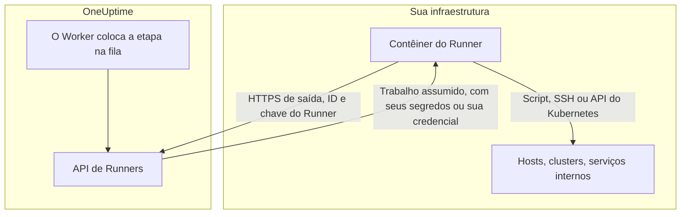
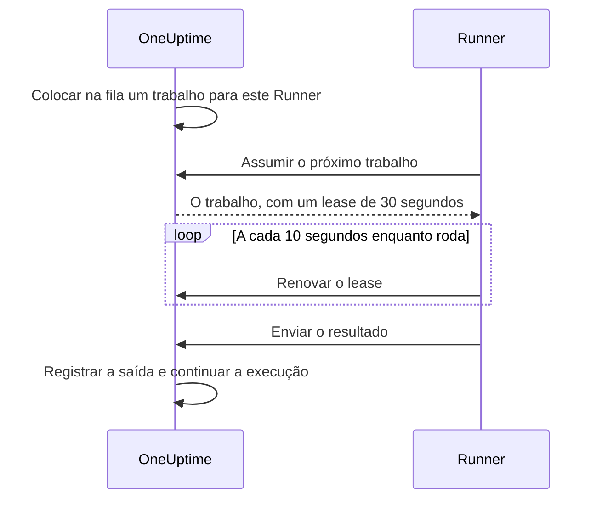

# Agentes de runbook

Um **agente de runbook**, chamado de **Runner** no painel, é um pequeno processo auto-hospedado que executa as etapas JavaScript, Bash, SSH e Kubernetes dos seus runbooks **dentro da sua própria infraestrutura**. O Worker do OneUptime nunca executa seus scripts: ele os coloca na fila, e o Runner escolhido por quem escreveu a etapa assume cada um, executa e devolve o resultado. Esta página é para quem instala e opera Runners.

:::cards
- [Instalar um Runner](#instalar-um-runner): Do painel a um contêiner conectado, em cinco etapas.
- [Apontar uma etapa para um Runner](#apontar-uma-etapa-para-um-runner): Ligar uma etapa ao Runner que deve executá-la.
- [Timeouts](#timeouts): Os timeouts de assunção e de execução, e como interagem.
- [Variáveis de ambiente](#variáveis-de-ambiente): O que o contêiner lê ao iniciar.
:::

## Como funciona



1. Você cria um Runner no OneUptime. O OneUptime gera um ID e uma chave secreta para ele.
2. Você executa o contêiner do Runner em um host dentro da sua infraestrutura, com esse ID, essa chave e a URL do seu OneUptime.
3. O Runner pede trabalho ao OneUptime a cada 5 segundos e informa que está vivo a cada 60 segundos.
4. Ao escrever uma etapa JavaScript, Bash, SSH ou Kubernetes, você escolhe o Runner em uma lista suspensa. A etapa fica ligada a esse Runner.
5. Quando a etapa roda, o Worker coloca na fila um trabalho com `targetAgentId` apontando para esse Runner. Só esse Runner pode assumi-lo.
6. O Runner executa o trabalho localmente — `bash -c <script>` para Bash, um sandbox `isolated-vm` para JavaScript, uma conexão SSH ou uma chamada ao servidor de API do cluster com a credencial da etapa —, captura o resultado e o devolve. O Worker retoma o runbook com o resultado.

O Runner só precisa de **HTTPS de saída** para a sua instância do OneUptime. Ele não aceita conexões de entrada.

O que um Runner guarda é seu ID e sua chave. Todo o resto ele recebe com o trabalho que assume: um script, com os [segredos de runbook](/docs/runbooks/credentials#segredos-para-scripts) atribuídos a ele já preenchidos, ou a [credencial](/docs/runbooks/credentials) que uma etapa SSH ou Kubernetes indica. Por isso qualquer pessoa com a chave de um Runner pode agir como esse Runner: trate a chave como as credenciais atribuídas a ele.

## Por que os scripts rodam em um Runner

Executar scripts no Worker do OneUptime tinha dois problemas:

- **Fronteira de confiança.** Qualquer pessoa que pudesse escrever um runbook podia executar código no Worker, com acesso a tudo o que o Worker alcançava.
- **Alcance.** A maioria das etapas úteis age sobre a _sua_ infraestrutura ("reinicie este serviço", "consulte um registro no nosso banco de dados interno"), não sobre a do OneUptime.

Com os Runners, essas etapas rodam em um host que você controla, e você decide o que esse host pode fazer. As etapas de requisição HTTP e de IA continuam rodando no Worker, porque não precisam de nada da sua rede.

## Antes de começar

- **Um host com Docker** dentro da sua infraestrutura, que alcance a URL do seu OneUptime por HTTPS e os sistemas sobre os quais suas etapas agem.
- **Uma função que cria Runners.** Project Owner, Project Admin, Project Member e Runbook Admin podem criar um. Só um Project Owner, Project Admin ou Runbook Admin pode ver a chave de um Runner, que o comando de instalação contém.

## Instalar um Runner

### 1. Criar o registro do agente

Vá para **Runbooks → Agentes de runbook** e crie um novo agente. Clique em **Criar: Runner** e preencha as duas etapas:

| Campo | Etapa | Observações |
| --- | --- | --- |
| **Nome** | **Runner** | Um nome claro, normalmente onde ele roda e o que alcança, como `prod-eu-west-1`. É o que você escolhe ao escrever uma etapa. |
| **Descrição** | **Runner** | Opcional. Uma frase sobre o que este host alcança. |
| **Rótulos** | **Runner** (em **Mais campos**) | Opcional. |
| **Executa runbooks** | **Capacidades** | Ligado por padrão. Permite que este Runner assuma etapas de runbook. |
| **Executa correções de código por IA** | **Capacidades** | Desligado por padrão. Permite que ele abra pull requests de correção de código por IA; consulte [Fix Tasks](/docs/ai/ai-agent). |
| **Executa comandos de remediação por IA** | **Capacidades** | Desligado por padrão. Permite que a remediação automática por IA execute nele comandos verificados por uma política. Ligá-lo em um Runner que tem credenciais SSH exige permissão para ler as credenciais de runbook; consulte [Runners que executam os comandos do OneUptime AI](/docs/runbooks/credentials#runners-que-executam-os-comandos-do-oneuptime-ai). |

Um Runner aplica uma mudança nas suas capacidades no próximo heartbeat; não é preciso reiniciá-lo.

### 2. Copiar o comando de instalação

Na linha do Runner, clique em **Mostrar instruções de configuração**. A caixa de diálogo **Configuração do Agente de Runbook** mostra um comando `docker run` já preenchido com o ID e a chave deste Runner. O mesmo comando está na página do Runner, em **Instruções de configuração**.

Só um Project Owner, Project Admin ou Runbook Admin pode ler a chave. Os demais veem "Você não tem permissão para visualizar a chave deste agente de runbook" no lugar do comando.

### 3. Executá-lo em um host da sua infraestrutura

Execute o comando em um host do seu ambiente que consiga:

- alcançar sua instância do OneUptime por HTTPS, e
- fazer o que suas etapas precisam, como alcançar outros hosts por SSH, chamar o servidor de API de um cluster ou falar com um banco de dados.

```bash
docker run --name oneuptime-runner --restart unless-stopped \
  -e ONEUPTIME_RUNNER_ID=<runner-id> \
  -e ONEUPTIME_RUNNER_KEY=<runner-key> \
  -e ONEUPTIME_URL=https://oneuptime.yourdomain.com \
  -d oneuptime/runner:release
```

### 4. Verificar que o agente está conectado

Volte para **Runbooks → Agentes de runbook**. Até um minuto depois de o contêiner iniciar, o **Status** do Runner deve mostrar **Conectado**, com um **Visto pela última vez** recente. Na página do Runner, o cartão **Status do Agente de Runbook** mostra a **Versão do Agente de Runbook** e o **Host**. Se ele continuar em **Nunca conectado** ou **Desconectado**, consulte [Solução de problemas](#solução-de-problemas).

### 5. Manter o agente atualizado

Quando um agente roda uma versão mais antiga que o seu OneUptime, um sinal de alerta aparece ao lado da **Versão do Agente de Runbook** na página dele. Selecione-o para ver como atualizar: baixe a nova imagem e remova o contêiner, depois execute de novo o comando de instalação da etapa 2. Um agente instalado pelo chart do agente Kubernetes é atualizado com o chart.

```bash
docker pull oneuptime/runner:release
docker rm -f oneuptime-runner
```

## Apontar uma etapa para um Runner

:::steps
### Adicionar uma etapa que roda em um Runner

Nas **Etapas** do seu runbook, adicione uma etapa JavaScript, Bash, SSH ou Kubernetes.

### Escolher o Runner

A lista **Runner** da etapa mostra todos os Runners do projeto e se cada um está conectado. Se o projeto ainda não tiver nenhum, a etapa avisa e indica **Runbooks › Runners**.

### Salvar as etapas

Clique em **Save Steps**. Quando uma execução chega à etapa, o Worker coloca na fila um trabalho para o ID desse Runner, e só esse Runner pode assumi-lo.
:::

O Bash é executado com `bash -c`. O JavaScript roda em um sandbox `isolated-vm` no Runner, sem acesso ao sistema de arquivos nem a processos; ele pode chamar APIs HTTP públicas com `axios`, mas não endereços de uma rede privada. As etapas SSH e Kubernetes usam a [credencial](/docs/runbooks/credentials) que a etapa indica, que precisa estar atribuída ao mesmo Runner.

Precisa de mais de um Runner? Crie-os e aponte cada etapa para o adequado. Para ter redundância, rode um segundo Runner e divida as etapas entre os dois, ou mantenha um runbook de reserva cujas etapas apontem para o outro Runner.

## Notas de operação

### Timeouts

Dois timeouts valem para cada etapa que roda em um Runner:

| Timeout | Padrão | O que controla |
| --- | --- | --- |
| **Claim timeout** | 2 minutos | Por quanto tempo o Worker espera o Runner escolhido assumir o trabalho. Se o Runner não o assumir a tempo, a etapa falha por tempo esgotado e o runbook segue (ou para, conforme **Continuar em caso de falha**). |
| **Execution timeout** | 30 segundos | Por quanto tempo o Runner deixa a etapa rodar antes de pará-la. O Bash recebe `SIGKILL`; o sandbox do JavaScript é destruído. |

Os dois são configuráveis por etapa. Abra **Runbooks › seu runbook › Etapas**, expanda a etapa e defina **Execution timeout** e **Claim timeout** (em segundos) nas configurações dela. Deixe um campo vazio para usar o padrão. Cada um aceita de 1 segundo a 1 hora; valores fora dessa faixa são ajustados ao limite quando a etapa roda.

A janela de espera total do Worker é `claim timeout + execution timeout + a few seconds`. Escolha valores adequados à etapa.

Duas coisas a lembrar ao reduzir o claim timeout:

- O Runner pede trabalho em um ciclo de consulta (`ONEUPTIME_RUNNER_POLL_INTERVAL_MS`, 5 segundos por padrão). Um claim timeout menor que um ciclo pode expirar antes que um Runner perfeitamente saudável sequer veja o trabalho, e a etapa falha com a mesma mensagem que um Runner offline provoca.
- Um Runner executa um trabalho por vez por padrão (`ONEUPTIME_RUNNER_CONCURRENCY`). Enquanto uma etapa longa o ocupa, as outras etapas apontadas para o mesmo Runner esgotam seus próprios claim timeouts. Se você aumentar um execution timeout para minutos, aumente também o claim timeout das etapas que compartilham esse Runner, ou dê a elas outro Runner.

### Lease e heartbeat



Quando um Runner assume um trabalho, ele recebe um lease curto (30 segundos por padrão). Enquanto a etapa roda, o Runner renova o lease a cada 10 segundos. Se o Runner morrer ou perder a rede no meio de um script, o lease expira e o Worker marca o trabalho como `TimedOut` em vez de esperar para sempre.

Os processos filhos do Bash **não** são cancelados automaticamente quando o lease expira (um sandbox de JavaScript também é deixado terminar, se terminar), mas o Worker para de esperar por eles, e o Runner não consegue enviar um resultado depois que outra assunção tomou o lugar. Projete scripts que possam rodar de novo com segurança se a execução única for importante para você.

### Se o Worker do OneUptime reiniciar no meio de uma etapa

Uma execução de runbook roda em um único Worker do início ao fim, então um deploy ou uma queda pode interrompê-la enquanto uma etapa está em andamento. O que acontece depois depende de a execução ser retomada:

- **Ela é retomada.** O Worker que a retoma encontra o trabalho que sua etapa já criou e **se reconecta a ele**. Ele espera esse trabalho em vez de enviar ao seu Runner uma segunda cópia do script. Se o Runner já tinha terminado, o resultado registrado é usado como está. Uma etapa é enviada a um Runner no máximo uma vez por execução.
- **Ela não é retomada.** Se a execução nunca for retomada, uma varredura a marca como `Failed` quando ela ultrapassar a janela de assunção e execução configurada para a etapa atual, com uma mensagem que nomeia essa etapa. Uma execução nunca fica presa em `Running`.

A única coisa que isso não consegue dizer é até onde um script chegou antes de o Worker sumir. Uma etapa que estava no meio da execução é informada como falha, com uma nota de que pode ter rodado em parte: verifique o sistema de destino antes de executar o runbook de novo.

### Nenhum agente online

Se o Runner escolhido estiver offline quando a etapa rodar, o trabalho espera como `Pending` até o claim timeout acabar, e então a etapa falha com "No runbook agent picked up this step before the wait window expired." A página **Agentes de runbook** é onde você confirma a cobertura antes de executar um runbook para valer.

### Limite de saída

stdout e stderr juntos são limitados a **50 KB** por etapa. Uma saída maior é cortada com um marcador. Se precisar do log completo, grave-o a partir do script no seu armazenamento de logs ou em um armazenamento de objetos e mostre a URL com `echo`.

### Cancelamento

Cancelar uma execução de runbook, pela página da execução ou pela API, marca imediatamente todos os seus trabalhos `Pending`, `Claimed` e `Running` como `Cancelled`. Um Runner que já está no meio de um script termina o trabalho, mas o servidor não aceita o resultado, e nenhuma etapa posterior do runbook é enviada.

### Concorrência

Cada Runner executa um trabalho por vez por padrão. Para permitir mais, defina `ONEUPTIME_RUNNER_CONCURRENCY` no contêiner, mas lembre que o Runner divide o host com tudo o que já roda lá.

## Variáveis de ambiente

O Runner lê estas variáveis ao iniciar:

| Variável | Obrigatória | Padrão | Observações |
| --- | --- | --- | --- |
| `ONEUPTIME_URL` | sim | — | URL base da sua instância do OneUptime, como `https://oneuptime.yourdomain.com`. |
| `ONEUPTIME_RUNNER_ID` | sim | — | O ID do Runner, do comando de instalação. |
| `ONEUPTIME_RUNNER_KEY` | sim | — | A chave secreta do Runner, do comando de instalação. |
| `ONEUPTIME_RUNNER_POLL_INTERVAL_MS` | não | `5000` | Com que frequência o Runner pede novos trabalhos. Um valor abaixo de `1000` volta ao padrão. |
| `ONEUPTIME_RUNNER_HEARTBEAT_INTERVAL_MS` | não | `60000` | Com que frequência o Runner informa que está vivo. Um valor abaixo de `5000` volta ao padrão. |
| `ONEUPTIME_RUNNER_JOB_HEARTBEAT_INTERVAL_MS` | não | `10000` | Com que frequência o Runner renova o lease de um trabalho em andamento. Um valor abaixo de `1000` volta ao padrão. |
| `ONEUPTIME_RUNNER_CONCURRENCY` | não | `1` | Número máximo de trabalhos simultâneos neste Runner. |
| `ONEUPTIME_RUNNER_ENABLE_RUNBOOKS` | não | — | Defina como `false` para que este Runner pare de assumir etapas de runbook, diga o que disser o painel. Só pode desligar a capacidade. |
| `ONEUPTIME_RUNNER_ENABLE_CODE_FIXES` | não | — | Defina como `false` para que este Runner pare de assumir correções de código por IA, diga o que disser o painel. |
| `ONEUPTIME_RUNNER_ENABLE_AI_COMMANDS` | não | — | Defina como `false` para que este Runner pare de executar comandos de remediação por IA, diga o que disser o painel. |

## Trocar a chave de um agente

Se uma chave vazar, redefina-a. A chave antiga para de funcionar na hora.

:::steps
### Redefinir a chave

Abra o Runner em **Runbooks → Agentes de runbook**, clique em **Redefinir chave do Agente de Runbook** e confirme. O Runner para de se conectar até ter a nova chave.

### Executar o contêiner com a nova chave

Copie o novo comando das **Instruções de configuração** do Runner, remova o contêiner antigo e execute o novo comando no mesmo host:

```bash
docker rm -f oneuptime-runner
```

### Verificar que ele se reconecta

Em **Runbooks → Agentes de runbook**, o **Status** do Runner volta para **Conectado** em até um minuto.
:::

## Permissões

O gerenciamento de agentes fica no grupo de permissões Runbooks existente:

- `CreateRunner`, `EditRunner`, `DeleteRunner`, `ReadRunner` — gerenciar os registros dos agentes.
- `RunbookAdmin`, `RunbookMember`, `RunbookViewer` (funções) — `RunbookAdmin` constrói runbooks, suas regras e os Runners em que eles rodam, e os executa. `RunbookMember` abre runbooks e suas execuções e os executa — inicia uma execução, conclui ou pula suas etapas e a cancela —, mas não cria, altera nem exclui nenhum runbook ou Runner. `RunbookViewer` lê runbooks e suas execuções e não executa nada. `RunbookAdmin` reúne todas as permissões granulares acima.

Disparar um runbook (e com isso enviar suas etapas aos Runners) exige uma função que executa runbooks — `ProjectOwner`, `ProjectAdmin`, `ProjectMember`, `RunbookAdmin` ou `RunbookMember` — ou `CreateRunbookExecution`; concluir, pular ou cancelar uma execução também aceita `EditRunbookExecution`. Uma função só executa os runbooks que seu escopo alcança.

A chave de um Runner só pode ser lida por Project Owners, Project Admins e Runbook Admins.

## API do agente

Para os curiosos: o Runner usa estes endpoints, montados em `/runner-ingest`. O caminho anterior à fusão, `/runbook-agent-ingest`, ainda é servido para os agentes que ainda não foram reimplantados, então atualizar o servidor não os quebra. Eles são autenticados pelo ID e pela chave do Runner no corpo JSON (`agentId` e `agentKey`), ou nos headers `x-agent-id` e `x-agent-key`.

| Endpoint | Finalidade |
| --- | --- |
| `POST /heartbeat` | Sinal de vida. Atualiza o último contato, a versão e as informações do host do Runner, e devolve as capacidades que o projeto concedeu a ele. |
| `POST /claim-next-job` | Assumir de forma atômica o trabalho `Pending` mais antigo destinado ao ID deste Runner. Devolve `{ job: null }` quando não há nada a fazer. |
| `POST /job/:jobId/heartbeat` | Renovar o lease do trabalho. Devolve 404 quando o lease expirou ou o trabalho terminou. |
| `POST /job/:jobId/result` | Enviar o resultado final. É ignorado se o lease já tiver passado adiante. |
| `POST /disconnect` | Desconectar-se em um desligamento limpo. |

Você não deve precisar chamá-los manualmente: o Runner incluído faz isso. Eles estão documentados aqui para que você possa construir seu próprio agente se tiver uma restrição à qual o nosso não se adapta.

## Solução de problemas

:::details O Runner fica em Nunca conectado ou Desconectado
- Verifique os logs do contêiner com `docker logs oneuptime-runner` em busca de erros de autenticação ou de rede.
- Verifique se o host alcança a URL do seu OneUptime, por exemplo com `curl`.
- Verifique se o ID e a chave foram copiados sem espaços, e se `ONEUPTIME_URL` é o endereço pelo qual você abre o OneUptime.

**Nunca conectado** significa que o Runner nunca se apresentou. **Desconectado** significa que ele se apresentou, mas não nos últimos 5 minutos.
:::

:::details As etapas falham com "No runbook agent picked up this step before the wait window expired."
O Runner da etapa não assumiu o trabalho dentro do seu claim timeout. Verifique se o Runner está **Conectado**, se **Executa runbooks** está ligado para ele e se ele não está ocupado com uma etapa longa: ele executa um trabalho por vez, a menos que você aumente `ONEUPTIME_RUNNER_CONCURRENCY`. Um claim timeout menor que o intervalo de consulta falha da mesma forma.
:::

:::details As etapas falham com "The runbook agent stopped responding while this step was running."
O Runner assumiu o trabalho e depois parou de renovar o lease: travou, reiniciou ou perdeu a rede. Verifique se ele está online e depois verifique o sistema de destino antes de executar o runbook de novo.
:::

:::details O Runner registra "No capability is enabled"
Todas as capacidades estão desligadas para este Runner. Ligue **Executa runbooks** na página do Runner no OneUptime. Ele aplica a mudança no próximo heartbeat.
:::

## Próximos passos

:::cards
- [Escrever um runbook](/docs/runbooks/authoring): Escrever as etapas que rodam no seu Runner.
- [Credenciais de runbook](/docs/runbooks/credentials): Dar às etapas SSH e Kubernetes acesso gerenciado.
- [Configuração e segurança de runbooks](/docs/runbooks/configuration): Limites, permissões e proteção.
:::
