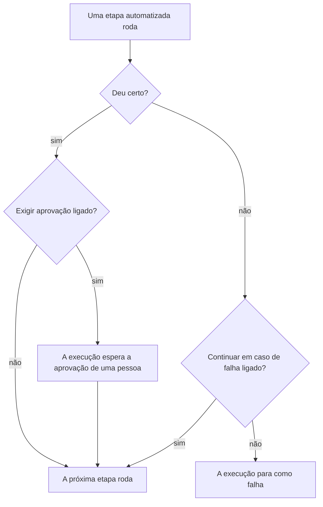

# Escrever um runbook

Você escreve um runbook como uma lista ordenada de etapas na página **Etapas** dele. Esta página mostra como criar um runbook, como configurar cada um dos sete tipos de etapa e como falhas e aprovações mudam o rumo de uma execução.

:::cards
- [Criar um runbook](#criar-um-runbook): De um runbook vazio a etapas salvas.
- [Tipos de etapa](#tipos-de-etapa): Manual, JavaScript, HTTP request, Bash, SSH, Kubernetes e AI.
- [Tratamento de falhas e aprovações](#tratamento-de-falhas-e-aprovações): O que acontece depois que uma etapa falha ou dá certo.
- [Um exemplo completo](#um-exemplo-completo): Um failover de banco de dados em cinco etapas.
:::

## Antes de começar

- **Uma função que escreve runbooks.** Project Owner, Project Admin e Runbook Admin criam runbooks e salvam suas etapas. Com permissões granulares, você precisa de **Create Runbook** e **Edit Runbook**. Consulte [Permissões](/docs/runbooks/configuration#permissões).
- **Um Runner, para etapas JavaScript, Bash, SSH e Kubernetes.** Essas etapas são executadas em um [Runner](/docs/runbooks/agents) dentro da sua própria infraestrutura, nunca no Worker do OneUptime. Instale um primeiro.
- **Uma credencial, para etapas SSH e Kubernetes, e permissão para lê-la.** Consulte [Credenciais de runbook](/docs/runbooks/credentials). Uma etapa só pode indicar uma credencial se você puder ler as credenciais de runbook: Project Owner, Project Admin ou **Read Runbook Credential**. Runbook Admin não inclui isso.
- **Um provedor de LLM, para etapas de IA.** Consulte [Provedores de LLM](/docs/ai/llm-provider).

## Criar um runbook

:::steps
### Abrir Runbooks

Abra **Produtos → Runbooks**. Runbooks fica no grupo **Painéis e automação**.

### Criar o runbook

Clique em **Criar: Runbook**, informe um **Nome** e, se quiser, uma **Descrição** do propósito do runbook. Em **Mais campos** ficam o interruptor **Habilitado**, ligado por padrão, e os **Rótulos**. O novo runbook aparece na lista: abra-o.

### Adicionar etapas

Vá para **Etapas**. Em **Start your runbook**, escolha o tipo da primeira etapa; abaixo da última etapa, **Add another step** oferece os mesmos sete tipos. Cada etapa abre com seu **Título**, sua **Descrição** (em Markdown, mostrada a quem responde) e as configurações do seu tipo. Assim que o runbook tiver uma etapa, **Adicionar etapa**, no topo do cartão, adiciona uma etapa Manual.

### Ordenar as etapas

As etapas são executadas **em ordem**. Para mudar a ordem, arraste uma etapa pela alça à esquerda do cabeçalho; pelo teclado, coloque o foco na alça, pressione Espaço, mova a etapa com as setas e pressione Espaço de novo.

### Salvar as etapas

Clique em **Save Steps**. Até fazer isso, o editor mostra **Alterações não guardadas**. Depois de salvar, você vê **Salvo**, e o runbook está pronto para [ser executado](/docs/runbooks/running).
:::

## Anatomia de uma etapa

Toda etapa tem estes campos:

| Campo | Finalidade |
| --- | --- |
| **Título** | Um rótulo curto, mostrado na lista de etapas e em cada execução. |
| **Descrição** | Contexto opcional para quem responde, em Markdown. Em uma etapa Manual, é a instrução que essa pessoa lê. |
| **Continuar em caso de falha** | Só etapas automatizadas. Se ligado, uma etapa que falha não interrompe a execução: a próxima etapa roda mesmo assim. |
| **Exigir aprovação** | Só etapas automatizadas. Se ligado, o runbook pausa depois desta etapa e espera que uma pessoa aprove antes de executar a próxima. O interruptor diz **Exigir aprovação antes de executar a próxima etapa**. |
| Configurações específicas do tipo | O script, a URL, o Runner, a credencial ou o prompt. Consulte [Tipos de etapa](#tipos-de-etapa). |

## Tipos de etapa

| Tipo | É executada em | Precisa de |
| --- | --- | --- |
| [Manual](#manual) | Uma pessoa | Nada |
| [JavaScript](#javascript) | Um Runner | Um Runner |
| [HTTP request](#http-request) | O Worker do OneUptime | Nada |
| [Bash](#bash) | Um Runner | Um Runner |
| [SSH](#ssh) | Um Runner | Um Runner e uma credencial SSH |
| [Kubernetes](#kubernetes) | Um Runner | Um Runner e uma credencial Kubernetes |
| [AI](#ai) | O Worker do OneUptime | Um provedor de LLM |

### Manual

Um item de checklist para uma pessoa. A execução pausa ao chegar a uma etapa Manual e fica em `WaitingForManualStep` (**Aguardando você**) até que alguém clique em **Mark complete** ou **Pular**. Uma execução que espera por uma pessoa nunca expira.

Use-a para o que só uma pessoa pode verificar ou fazer: "Confirmar no painel do balanceador de carga que o tráfego foi para a região secundária."

### JavaScript

Um trecho de JavaScript, executado em um sandbox `isolated-vm` em um [agente de runbook](/docs/runbooks/agents) dentro da sua própria infraestrutura, não no Worker do OneUptime.

| Campo | O que faz | Padrão |
| --- | --- | --- |
| **Runner** | O Runner que executa a etapa. Só esse Runner pode assumir o trabalho. | — |
| **Script** | O JavaScript a executar. Retorne um valor com `return` para capturá-lo; cada linha de `console.log` também é capturada. Lançar um erro faz a etapa falhar. | — |
| **Execution timeout** | Por quanto tempo o Runner deixa o trecho rodar antes de destruir o sandbox. | 30 segundos |
| **Claim timeout** | Por quanto tempo o Worker espera o Runner assumir o trabalho. | 2 minutos |

```javascript
const start = Date.now();
// ... your logic ...
console.log("replica lag checked");
return { durationMs: Date.now() - start };
```

O sandbox tem 128 MB de memória e não tem acesso ao sistema de arquivos nem a processos. Ele pode fazer requisições HTTP com `axios`, mas só para endereços públicos: uma requisição para uma rede privada, para o próprio host do Runner ou para um endpoint de metadados da nuvem é recusada. Para chegar a um serviço da sua rede, use uma etapa [Bash](#bash) com `curl`.

### HTTP request

Uma chamada HTTP de saída, feita pelo Worker do OneUptime. Nenhum Runner é necessário.

| Campo | O que faz | Padrão |
| --- | --- | --- |
| **Method** | `GET`, `POST`, `PUT`, `PATCH`, `DELETE` ou `HEAD`. | `GET` |
| **URL** | O endpoint a chamar. | Vazio |
| **Headers (JSON)** | Um objeto JSON, como `{ "Authorization": "Bearer ..." }`. Headers que não são JSON válido fazem a etapa falhar. | Nenhum |
| **Body** | Enviado como JSON quando puder ser interpretado como JSON, e como texto caso contrário. | Nenhum |
| **Request timeout** | Por quanto tempo esperar a resposta do endpoint antes de fazer a etapa falhar. | 30 segundos |

A etapa dá certo com uma resposta `2xx` ou `3xx` e falha com qualquer outra, com `HTTP <status>` como erro. Redirecionamentos não são seguidos. O status, os headers e o corpo da resposta são capturados, até 50 KB.

> [!NOTE]
> O Worker nunca chama endereços de loopback ou link-local, como um endpoint de metadados da nuvem. No OneUptime Cloud, ele chama apenas endereços públicos. Um OneUptime auto-hospedado também alcança redes privadas, a menos que `DATA_SOURCE_BLOCK_PRIVATE_ADDRESSES` seja `true`. Para chamar um serviço da sua rede a partir do OneUptime Cloud, use uma etapa [Bash](#bash) com `curl`.

Útil para: abrir um incidente no PagerDuty, publicar em um webhook do Slack, chamar a API pública do seu provedor de nuvem ou a sua.

### Bash

Um script bash, executado com `bash -c <script>` em um [agente de runbook](/docs/runbooks/agents) na sua própria infraestrutura. Bash nunca roda no Worker do OneUptime.

| Campo | O que faz | Padrão |
| --- | --- | --- |
| **Runner** | O Runner que executa a etapa. Só esse Runner pode assumir o trabalho. | — |
| **Script Bash** | O script. A saída (stdout e stderr) é capturada até 50 KB, e um código de saída diferente de zero faz a etapa falhar. | — |
| **Execution timeout** | Por quanto tempo o Runner deixa o script rodar antes de matá-lo com `SIGKILL`. Aumente-o para etapas que legitimamente levam minutos. | 30 segundos |
| **Claim timeout** | Por quanto tempo o Worker espera o Runner assumir o trabalho. | 2 minutos |

O script roda dentro do contêiner do Runner, com as ferramentas que a imagem traz, como `curl`, `wget` e o cliente `ssh`, e com o acesso de rede do host onde roda. Por exemplo, para verificar um serviço que só a sua rede alcança:

```bash
set -euo pipefail
HTTP_CODE=$(curl -s -o /tmp/resp.txt -w "%{http_code}" "http://payments.internal:8080/health")
echo "HTTP $HTTP_CODE"
cat /tmp/resp.txt
if [[ "$HTTP_CODE" != "200" ]]; then
  echo "Health check failed"
  exit 1
fi
```

Se o Runner escolhido estiver offline quando a execução chegar a esta etapa, a etapa espera até o **claim timeout** (2 minutos por padrão) e depois falha por tempo esgotado. Adicione um agente em **Runbooks → Agentes de runbook** antes de contar com uma etapa Bash.

> [!TIP]
> Mantenha senhas e tokens fora do script. Guarde-os como segredos de runbook e escreva `{{runbookSecrets.NAME}}` em um script Bash ou JavaScript: o Runner recebe o script com o valor já preenchido. Consulte [Segredos para scripts](/docs/runbooks/credentials#segredos-para-scripts).

### SSH

Executar um comando em um host que o Runner alcança por SSH. Diferente de `ssh host cmd` em uma etapa Bash, o acesso é uma [credencial](/docs/runbooks/credentials) gerenciada em vez de uma chave privada no disco do Runner: criptografada em repouso, atribuída a Runners específicos e nunca legível de volta pela API.

| Campo | O que faz |
| --- | --- |
| **Runner** | O Runner que abre a conexão. Ele precisa alcançar o host pela rede. |
| **Credential** | Uma credencial SSH com o host, a porta, o usuário e a chave ou senha. Ela precisa estar atribuída ao Runner escolhido; caso contrário, a etapa falha em vez de rodar com o acesso errado. |
| **Command** | Executado no host remoto como o usuário da credencial. A saída é capturada até 50 KB, e um código de saída diferente de zero faz a etapa falhar. |
| **Execution timeout** | Cobre conexão, autenticação e execução do comando juntas, para que um comando travado não mantenha a etapa aberta. 30 segundos por padrão. |
| **Claim timeout** | Por quanto tempo o Worker espera o Runner assumir o trabalho. 2 minutos por padrão. |

### Kubernetes

Reiniciar ou escalar uma carga de trabalho em um cluster. As ações são um conjunto fechado de propósito: uma etapa capaz de alterar qualquer objeto seria um shell de administrador do cluster, e este tipo de etapa existe para tornar as remediações comuns seguras o bastante para a remediação automática.

| Campo | O que faz |
| --- | --- |
| **Runner** | O Runner que chama o servidor de API do cluster. Ele precisa alcançá-lo. |
| **Credential** | Uma credencial Kubernetes: a URL do servidor de API, um token de conta de serviço e a CA do cluster. Vincule essa conta de serviço a uma função que permita só o que seus runbooks precisam. |
| **Ação** | **Restart workload** altera o template do pod para que o controlador recrie os pods, como faz o `kubectl rollout restart`. **Scale workload** define a quantidade de réplicas. |
| **Workload kind** | **Deployment**, **StatefulSet** ou **DaemonSet**. |
| **Namespace** e **Workload name** | A carga de trabalho alvo. |
| **Réplicas** | Só ao escalar. Zero é permitido: esvaziar uma carga de trabalho é uma remediação legítima. Um DaemonSet roda um pod por nó e não pode ser escalado; reinicie-o em vez disso. |
| **Execution timeout** | Por quanto tempo o Runner espera o servidor de API aceitar a alteração. 30 segundos por padrão. |
| **Claim timeout** | Por quanto tempo o Worker espera o Runner assumir o trabalho. 2 minutos por padrão. |

Se o servidor de API recusar a alteração, a própria mensagem dele aparece na etapa, então uma falha de permissão diz qual vínculo de função ampliar.

### AI

Peça à IA para analisar, resumir ou decidir algo no meio da execução. A resposta vira a saída da etapa na execução. As etapas de IA rodam no Worker do OneUptime; nenhum Runner é necessário.

| Campo | O que faz |
| --- | --- |
| **Prompt** | O que a IA deve fazer. Por exemplo: "Revise a saída das etapas anteriores e diga se é seguro prosseguir com a remediação." |
| **LLM provider** | Opcional. **Project default** usa o provedor padrão do projeto. Fixe um provedor quando a etapa precisar de um modelo específico, como um auto-hospedado para dados que não podem sair da sua rede. Consulte [Provedores de LLM](/docs/ai/llm-provider). |
| **Include previous step context** | Se ligado, a IA vê tudo sobre as etapas que rodaram antes desta: título, tipo, status, saída e mensagens de erro. Ela recebe até 4.000 caracteres da saída de cada etapa. |
| **Include trigger context** | Se ligado, a IA vê o que iniciou a execução: o incidente, alerta ou evento de manutenção programada vinculado (descrição, severidade, estado atual, monitores afetados, causa raiz, histórico de estados e notas públicas), ou quem executou o runbook manualmente. |

Combine uma etapa de IA com **Exigir aprovação** para manter uma pessoa no circuito: a IA analisa, alguém lê a resposta e aprova, e só então a próxima etapa (de remediação) roda.

**O que a IA nunca vê.** A resposta de uma etapa de IA fica guardada como saída da etapa na execução, e as execuções podem ser lidas por qualquer pessoa com permissão de leitura de runbooks, um público maior que o do incidente. Por isso o contexto do gatilho deixa de fora as **notas internas privadas** e as **mensagens de canais do Slack e do Microsoft Teams**. A saída das etapas anteriores é analisada em busca de segredos (tokens, chaves, credenciais), que são ocultados antes do envio ao modelo. Imagens incorporadas e dados codificados longos, como uma captura de tela colada na descrição de um incidente, também ficam de fora, com uma nota curta no lugar.

As etapas de IA são medidas e cobradas como qualquer outro recurso de IA. A etapa falha, com uma mensagem que explica o motivo, quando não tem prompt, quando os recursos de IA estão desligados no projeto, quando não há provedor de LLM disponível ou quando o provedor fixado não está mais disponível para o projeto. Ligue **Continuar em caso de falha** se o resto do runbook ainda deve rodar.

## Tratamento de falhas e aprovações



Por padrão, uma etapa que falha interrompe a execução e a marca como `Failed`, com o erro da etapa como motivo. Com **Continuar em caso de falha** ligado, a falha é registrada e a próxima etapa roda, o que combina com runbooks do tipo "tente estas três coisas e depois avise". **Exigir aprovação** vale depois que uma etapa dá certo: a execução espera nessa etapa até alguém clicar em **Approve & continue** ou **Pular**.

## Salvar e editar

As alterações nas etapas valem quando você clica em **Save Steps**. Cada execução trabalha com o instantâneo tirado quando começou, então as execuções em andamento mantêm as etapas com que começaram, e editar nunca reescreve o histórico das execuções anteriores.

## Um exemplo completo

Um runbook para "DB primary unreachable":

| # | Tipo | O que faz |
| --- | --- | --- |
| 1 | JavaScript | Buscar o host primário atual no seu serviço de configuração e registrá-lo. |
| 2 | Manual | "Confirmar que o atraso de replicação no secundário está abaixo de 5 segundos." |
| 3 | HTTP request | `POST` para a API do seu orquestrador de failover. |
| 4 | Manual | "Verificar que as gravações agora vão para o novo primário." |
| 5 | HTTP request | `POST` de uma mensagem de normalidade para um webhook do Slack. |

Quem responde vê a etapa 1 rodar, marca a etapa 2, vê a etapa 3 rodar, marca a etapa 4, e a execução termina com a etapa 5. A saída de cada etapa é capturada para o postmortem.

## Próximos passos

:::cards
- [Executar um runbook](/docs/runbooks/running): Iniciar uma execução e concluir, aprovar ou pular suas etapas.
- [Regras de runbook](/docs/runbooks/rules): Iniciar este runbook automaticamente nos incidentes que corresponderem.
- [Agentes de runbook](/docs/runbooks/agents): Instalar o Runner de que suas etapas de script precisam.
- [Credenciais de runbook](/docs/runbooks/credentials): Dar às etapas SSH e Kubernetes acesso gerenciado.
:::
