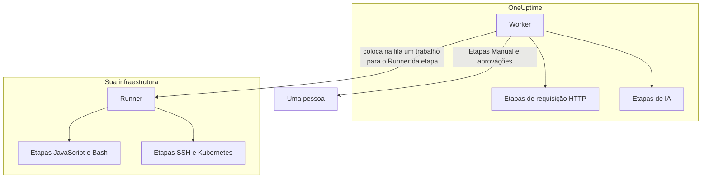

# Configuração e segurança de runbooks

Esta é a referência para operadores e revisores de segurança: onde cada tipo de etapa roda, os limites e timeouts aos quais uma etapa está sujeita, quem pode fazer o quê e como os runbooks são protegidos.

:::cards
- [Onde cada tipo de etapa roda](#onde-cada-tipo-de-etapa-roda): O Worker, um Runner ou uma pessoa.
- [Limites de saída e timeouts](#limites-de-saída-e-timeouts): Cada limite ao qual uma etapa está sujeita.
- [Permissões](#permissões): Permissões granulares, as três funções de runbook e quais runbooks uma função alcança.
- [Notas de proteção](#notas-de-proteção): Sandbox, acesso à rede e autenticação dos Runners.
:::

## Onde cada tipo de etapa roda

| Tipo de etapa | Roda em | Como |
| --- | --- | --- |
| Manual | Uma pessoa | A execução espera até alguém concluir ou pular a etapa. |
| JavaScript | Um Runner | Em um sandbox `isolated-vm`. |
| HTTP request | O Worker do OneUptime | Uma chamada HTTP de saída. |
| Bash | Um Runner | `bash -c <script>`. |
| SSH | Um Runner | Uma conexão SSH, com uma [credencial](/docs/runbooks/credentials). |
| Kubernetes | Um Runner | Uma chamada ao servidor de API do cluster, com uma credencial. |
| AI | O Worker do OneUptime | Uma chamada ao provedor de LLM do projeto. |

## Como as etapas de Runner são despachadas

As etapas JavaScript, Bash, SSH e Kubernetes **nunca rodam no Worker do OneUptime**. Elas são despachadas como trabalhos para um [agente de runbook](/docs/runbooks/agents) específico: um pequeno processo que você instala em um host da sua própria infraestrutura.

O modelo de despacho:

1. Quem escreve a etapa do runbook escolhe um Runner na lista suspensa ao escrever a etapa.
2. Quando a etapa roda, o Worker insere uma linha em `RunnerJob` com `targetAgentId` igual ao ID desse Runner e status `Pending`.
3. Esse Runner específico (e só ele) assume o trabalho de forma atômica, executa-o localmente — Bash via `bash -c <script>`, JavaScript dentro de um sandbox `isolated-vm`, SSH e Kubernetes com a credencial da etapa — e devolve o resultado.
4. O Worker retoma o runbook com o resultado.

Não existe mais o sinalizador de ambiente `RUNBOOK_BASH_ENABLED`. Se essas etapas funcionam em uma instalação depende só de o projeto ter um Runner conectado com **Executa runbooks** ligado.

## Limites de saída e timeouts

| Limite | Valor | Vale para |
| --- | --- | --- |
| Saída por etapa | **50 KB**. Uma saída maior é cortada com um marcador. | Toda etapa automatizada |
| Execution timeout | **30 segundos** por padrão | Etapas JavaScript, Bash, SSH e Kubernetes |
| Request timeout | **30 segundos** por padrão | Etapas de requisição HTTP |
| Claim timeout | **2 minutos** por padrão: por quanto tempo o Worker espera o Runner escolhido assumir o trabalho antes de fazê-lo falhar | Etapas JavaScript, Bash, SSH e Kubernetes |
| Faixa dos timeouts | **De 1 segundo a 1 hora** | Todo timeout |
| Espera por uma pessoa | Sem limite | Etapas Manual e aprovações |

Defina os timeouts etapa por etapa na página **Etapas** do runbook; deixe um campo vazio para manter o padrão. Um valor fora da faixa é ajustado ao limite quando a etapa roda, então uma configuração digitada errada não consegue desligar o timeout nem prender indefinidamente uma vaga do Worker.

## Permissões

As permissões de runbook ficam no grupo de permissões `Runbook`:

- `CreateRunbook`, `EditRunbook`, `DeleteRunbook`, `ReadRunbook` — gerenciar os modelos de runbook.
- `CreateRunbookExecution`, `EditRunbookExecution`, `DeleteRunbookExecution`, `ReadRunbookExecution` — iniciar, marcar, excluir e ler execuções.
- `CreateRunbookRule`, `EditRunbookRule`, `DeleteRunbookRule`, `ReadRunbookRule` — gerenciar as regras de disparo automático.
- `CreateRunner`, `EditRunner`, `DeleteRunner`, `ReadRunner` — gerenciar os Runners que executam etapas na sua própria infraestrutura. (Elas se chamavam `*RunbookAgent` antes da mudança de nome para Runner; as concessões existentes foram migradas, então não é preciso reatribuir nada.)
- `RunbookAdmin`, `RunbookMember`, `RunbookViewer` (funções) — `RunbookAdmin` constrói runbooks, suas regras e os Runners em que rodam, e os executa. `RunbookMember` abre runbooks e suas execuções e os executa — inicia uma execução, conclui ou pula suas etapas e a cancela —, mas não cria, altera nem exclui nenhum runbook ou Runner. `RunbookViewer` lê runbooks e suas execuções e não executa nada. `RunbookAdmin` reúne todas as permissões granulares acima.

Uma função executa os runbooks que seu escopo alcança. Uma concessão de `RunbookMember`, `RunbookAdmin` ou `ProjectMember` limitada a alguns rótulos inicia e faz avançar as execuções dos runbooks que têm esses rótulos, uma limitada a **Owned** as dos runbooks de que sua equipe é proprietária, e o bloqueio de um rótulo por uma equipe tira dela esses runbooks. `CreateRunbookExecution` e `EditRunbookExecution` tratam de execuções, que não têm rótulos, então alcançam todos os runbooks do projeto. Aprovar uma sugestão de remediação que inicia um runbook é verificado da mesma forma.

Credenciais e segredos ficam fora de `RunbookAdmin`. Gerenciá-los exige `ProjectOwner` ou `ProjectAdmin`, ou as permissões `CreateRunbookCredential`, `EditRunbookCredential`, `DeleteRunbookCredential`, `ReadRunbookCredential` e `CreateRunbookSecret`, `EditRunbookSecret`, `DeleteRunbookSecret`, `ReadRunbookSecret`. Consulte [Credenciais de runbook](/docs/runbooks/credentials).

As regras de proprietário e de rótulos em **Runbooks → Configurações** também ficam fora de `RunbookAdmin`. Gerenciá-las exige `ProjectOwner` ou `ProjectAdmin`, ou as permissões `CreateRunbookOwnerRule` e `CreateRunbookLabelRule` com suas equivalentes de edição, exclusão e leitura.

Para saber como funções e permissões granulares se combinam, consulte [Usuários, equipes e permissões](/docs/permissions/index).

## Fila e worker

As execuções de runbook rodam na fila BullMQ `Runbook`. Cada processo Worker roda até 25 execuções ao mesmo tempo; o número é fixo no código, não definido por uma variável de ambiente.

Quando uma etapa manual é marcada pela API, a execução volta para a fila para continuar a partir da próxima etapa. Ela espera como `Scheduled` até que um Worker a retome, e uma execução na fila nunca falha por esperar.

## Notas de proteção

- **JavaScript, Bash, SSH e Kubernetes** rodam em um host de Runner que você controla, não no Worker do OneUptime. O JavaScript roda em um isolado `isolated-vm` separado com 128 MB de memória e sem acesso ao sistema de arquivos nem aos processos do Runner; ele pode fazer requisições HTTP com `axios`, mas as requisições para redes privadas e para endereços de loopback e link-local são recusadas. O Bash roda via `bash -c`, com o timeout aplicado no Runner.
- **As etapas HTTP** usam uma validação de status permissiva, então uma resposta 4xx ou 5xx é registrada como etapa com falha em vez de lançar uma exceção, e a saída capturada reflete o que o serviço remoto realmente devolveu. Redirecionamentos não são seguidos. O Worker nunca chama endereços de loopback ou link-local, como um endpoint de metadados da nuvem; no OneUptime Cloud ele também recusa endereços de rede privada, e um OneUptime auto-hospedado os recusa com `DATA_SOURCE_BLOCK_PRIVATE_ADDRESSES=true`.
- **As etapas de IA** nunca veem as notas privadas dos incidentes nem as mensagens do Slack e do Microsoft Teams, e a saída das etapas anteriores é analisada em busca de segredos, que são ocultados antes de chegar ao modelo. Imagens incorporadas e dados codificados longos ficam fora do prompt. Consulte [AI](/docs/runbooks/authoring#ai).
- **A autenticação dos Runners** é feita por ID e chave secreta, definidos no contêiner do Runner como variáveis de ambiente. No servidor, a identidade válida do Runner vem da linha do banco de dados correspondente ao ID e à chave apresentados: um cliente não consegue se passar por outro Runner nem com uma chave comprometida.
- **Credenciais e segredos** são criptografados em repouso, nunca devolvidos pela API e entregues apenas aos Runners aos quais estão atribuídos, quando eles assumem uma etapa.

## Tabelas do banco de dados

| Tabela | O que guarda |
| --- | --- |
| `Runbook` | O modelo: nome, slug, descrição, `isEnabled`, rótulos e as etapas em JSON. |
| `RunbookExecution` | Uma linha por execução, com as chaves estrangeiras opcionais `incidentId`, `alertId` e `scheduledMaintenanceId` e um array JSON `stepExecutions` com um instantâneo das etapas e do estado de cada uma. |
| `RunbookRule` | As regras de disparo automático, com um discriminador `triggerEntityType` (Incident, Alert, ScheduledMaintenance), uma relação muitos-para-muitos com os runbooks a iniciar e aquilo que comparam: uma coluna JSON `criteria` (as condições) mais vínculos muitos-para-muitos com monitores, severidades de incidente, severidades de alerta, rótulos e rótulos de monitor, e padrões de título, descrição, nome de monitor e descrição de monitor. |
| `Runner` | Uma linha por Runner instalado: nome, chave secreta, `lastAlive`, `connectionStatus`, informações do host e capacidades. |
| `RunnerJob` | Uma linha por etapa despachada para um Runner: `targetAgentId` (o Runner escolhido por quem escreveu a etapa), tipo de etapa, script ou payload, status (`Pending` → `Claimed` → `Running` → `Succeeded`, `Failed`, `TimedOut` ou `Cancelled`), prazo de assunção, lease, saída e código de saída. |
| `RunbookCredential` | As credenciais SSH e Kubernetes, com os campos secretos criptografados, e os Runners aos quais estão atribuídas. |
| `RunbookSecret` | Os segredos de runbook, criptografados, e os Runners que podem recebê-los. |

## Dicas de operação

- **Garanta que o Runner escolhido em uma etapa esteja saudável.** Se precisar de redundância, rode um segundo Runner e divida as etapas entre os dois, ou mantenha um runbook de reserva que aponte para o outro Runner.
- **Capture URLs, não blobs.** Se uma etapa gerar mais do que alguns KB de saída, grave-a em um armazenamento de objetos ou no seu sistema de logs e devolva a URL.
- **Idempotência importa.** Uma etapa de requisição HTTP ou de IA roda de novo se o Worker reiniciar no meio da etapa e a execução for retomada. Uma etapa em um Runner é despachada no máximo uma vez por execução, mas um script pode ter rodado em parte antes de uma falha, e você pode executar o runbook de novo. Projete as etapas para que possam ser repetidas com segurança.

## Próximos passos

:::cards
- [Agentes de runbook](/docs/runbooks/agents): Instalar, operar e solucionar problemas dos Runners.
- [Credenciais de runbook](/docs/runbooks/credentials): Acesso SSH e Kubernetes gerenciado, e segredos para scripts.
- [Usuários, equipes e permissões](/docs/permissions/index): Como funções, rótulos e equipes decidem quem executa o quê.
:::
