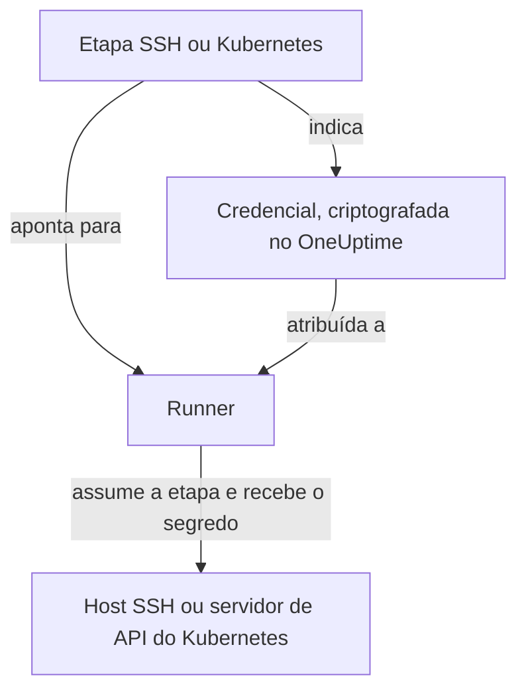

# Credenciais de runbook

Uma credencial é a forma como um runbook alcança algo que **não** é o próprio host do Runner: um servidor por SSH ou um cluster Kubernetes. Sem ela, "reiniciar o serviço" significa escrever um script de shell e colocar manualmente uma chave ou um kubeconfig no host do Runner, onde fica no disco fora do controle do OneUptime. Uma credencial é esse mesmo acesso como um objeto gerenciado: criptografada em repouso, atribuída a Runners específicos e referenciada pelo nome a partir de uma etapa.

Gerencie-as em **Runbooks → Agentes de runbook → Credenciais**.

:::cards
- [Criar uma credencial](#criar-uma-credencial): O acesso dela e os Runners que podem usá-la.
- [Privilégio mínimo do outro lado](#privilégio-mínimo-do-outro-lado): Limitar o que a chave ou o token pode fazer.
- [Segredos para scripts](#segredos-para-scripts): Dar uma senha ou um token a um script Bash ou JavaScript.
:::

## Como uma credencial é usada



Uma etapa SSH ou Kubernetes indica uma credencial e um Runner. Quando esse Runner assume a etapa, o OneUptime verifica que a credencial está atribuída a ele, descriptografa o segredo e o entrega somente na resposta a essa assunção. O segredo nunca é guardado no trabalho e nunca pode ser lido pela API.

## Antes de começar

- **Uma função que gerencia credenciais.** Project Owner e Project Admin, ou qualquer pessoa com a permissão **Create Runbook Credential**. A função Runbook Admin não a inclui. Atribuir uma credencial SSH a um Runner que executa os comandos do OneUptime AI também exige **Read Runbook Credential**; consulte [Runners que executam os comandos do OneUptime AI](#runners-que-executam-os-comandos-do-oneuptime-ai).
- **Um plano que as inclua.** No OneUptime Cloud, as credenciais de runbook exigem o plano **Growth** ou superior.
- **Um [Runner](/docs/runbooks/agents)** que alcance pela rede o host ou o servidor de API do cluster.

## Criar uma credencial

:::steps
### Abrir Credenciais

Abra **Runbooks → Agentes de runbook → Credenciais** e clique em **Criar: Runbook Credential**.

### Dar um nome e escolher o tipo

Na etapa **Credential**, informe um **Nome**, como `prod-cluster`, uma **Descrição** opcional e o **Tipo**: **SSH** ou **Kubernetes**. O tipo não pode ser alterado depois; crie uma nova credencial em vez disso.

### Informar o acesso

:::tabs
@tab SSH
Em **Host SSH**, informe o **Nome do host**, a **Porta** (22 se ficar vazia) e o **Nome de usuário**. Em **Autenticação SSH**, cole uma **Private Key (PEM)**, com sua **Private Key Passphrase** se houver, ou informe uma **Senha** para um host sem acesso por chave. Uma chave é a melhor opção quando você pode escolher.
@tab Kubernetes
Em **Kubernetes**, informe a **API Server URL**, como `https://10.0.0.1:6443`, o **Service Account Token** e o **CA Certificate (PEM)** para que o Runner possa verificar o servidor de API. Deixe a CA vazia só se o servidor de API apresentar um certificado em que o Runner já confia.
:::

### Atribuí-la a Runners

Na etapa **Agentes de runbook**, escolha os Runners que podem usar a credencial e clique em **Criar: Runbook Credential**. Uma credencial não atribuída a nenhum Runner não pode ser usada por nenhuma etapa.

### Usá-la em uma etapa

Em uma [etapa SSH ou Kubernetes](/docs/runbooks/authoring#tipos-de-etapa), escolha um desses Runners e depois a credencial em **Credential**. Uma etapa só oferece credenciais do seu próprio tipo, e salvar uma etapa que indica uma credencial exige permissão para ler as credenciais de runbook.
:::

## O que é guardado

| Tipo | Campos |
| --- | --- |
| SSH | Nome do host, porta (22 por padrão), nome de usuário e uma chave privada PEM (com senha opcional) ou uma senha. |
| Kubernetes | URL do servidor de API, um token de conta de serviço e o certificado da CA do cluster. |

## Os valores secretos são só de escrita

Chaves privadas, senhas de chave, senhas e tokens de conta de serviço são criptografados em repouso e a API **nunca os devolve**: nem ao painel, nem a um workflow, nem a uma exportação. A tabela pode mostrar o que uma credencial *é* sem nunca mostrar o que ela contém.

Por isso não existe "ver" para um valor secreto, só "substituir": informar o valor de novo é a forma de trocá-lo. Se você perder o original, emita uma nova chave no sistema de destino e atualize a credencial.

## Atribuir uma credencial a Runners

Uma credencial só pode ser usada pelos Runners aos quais você a atribui, e uma etapa precisa apontar para um desses Runners. Se uma etapa indica uma credencial que não está atribuída ao seu Runner, a etapa **falha em vez de rodar**: um Runner que silenciosamente não faz nada parece exatamente com um que funcionou.

A atribuição é a fronteira de acesso, então mantenha-a estreita: um Runner que só reinicia um cluster não precisa da chave SSH dos seus hosts de banco de dados.

### Runners que executam os comandos do OneUptime AI

Em um Runner com **Executa comandos de remediação por IA** ligado, o OneUptime AI escolhe entre as credenciais SSH atribuídas ao Runner para os comandos que executa ali. Por isso uma credencial SSH só chega a um Runner assim por meio de alguém que pode ler as credenciais de runbook (**Read Runbook Credential**, ou um Project Owner ou Project Admin), seja qual for o que é salvo primeiro:

- **Atribuir a credencial.** Criar uma credencial SSH com um Runner assim, ou adicionar um Runner assim a uma credencial, exige essa permissão. Sem ela, o salvamento é recusado e nomeia o Runner: atribua a credencial a Runners que não executam comandos de remediação por IA, ou peça a alguém com a permissão que a atribua.
- **Ligar o interruptor.** Ligar **Executa comandos de remediação por IA** em um Runner que tem credenciais SSH exige a mesma permissão.

Remover Runners de uma credencial, salvar uma credencial com os Runners que ela já tem e as credenciais Kubernetes não pedem nada além disso: os comandos kubectl do OneUptime AI rodam com a credencial vinculada ao seu cluster. Atribuições de credenciais e o ligamento do interruptor por alguém sem essa permissão são salvos um de cada vez em um projeto, para que os dois não passem juntos nas verificações; um salvamento que chega enquanto outro está sendo salvo espera por ele e, se demorar demais, é recusado com *Try again in a moment*. Salve de novo.

As etapas de um workflow agem como Project Admin, mas não recebem emprestada a leitura de credenciais de runbook de um Project Admin: uma etapa só a tem se a pessoa que salvou por último as etapas do workflow a tiver. Consulte [O que as etapas de um workflow podem fazer](/docs/workflows/configuration#o-que-os-passos-de-um-workflow-podem-fazer).

## Privilégio mínimo do outro lado

O OneUptime não pode restringir o que sua credencial pode fazer no sistema de destino: isso cabe ao sistema de destino, e vale a pena fazer:

- **SSH** — prefira uma chave a uma senha, dê ao usuário só os comandos de que ele precisa (um comando forçado ou um shell restrito quando for prático) e não reutilize a chave pessoal de um administrador.
- **Kubernetes** — vincule a conta de serviço a um Role que permita `patch` exatamente nas cargas de trabalho que seus runbooks tocam, exatamente nos namespaces em que rodam. **Restart workload** altera a própria carga de trabalho, e **Scale workload** altera o sub-recurso `scale` dela: nada mais é necessário.

Por exemplo, uma conta de serviço que pode reiniciar e escalar um Deployment, e nada mais:

```yaml title="oneuptime-runbooks-rbac.yaml"
apiVersion: v1
kind: ServiceAccount
metadata:
  name: oneuptime-runbooks
  namespace: checkout
---
apiVersion: rbac.authorization.k8s.io/v1
kind: Role
metadata:
  name: oneuptime-runbooks
  namespace: checkout
rules:
  # Restart workload: patches the Deployment's pod template.
  - apiGroups: ["apps"]
    resources: ["deployments"]
    resourceNames: ["checkout-api"]
    verbs: ["patch"]
  # Scale workload: patches the Deployment's scale subresource.
  - apiGroups: ["apps"]
    resources: ["deployments/scale"]
    resourceNames: ["checkout-api"]
    verbs: ["patch"]
---
apiVersion: rbac.authorization.k8s.io/v1
kind: RoleBinding
metadata:
  name: oneuptime-runbooks
  namespace: checkout
subjects:
  - kind: ServiceAccount
    name: oneuptime-runbooks
    namespace: checkout
roleRef:
  apiGroup: rbac.authorization.k8s.io
  kind: Role
  name: oneuptime-runbooks
```

Para um StatefulSet ou um DaemonSet, use `statefulsets` ou `daemonsets` em vez disso. Um DaemonSet não pode ser escalado, então não precisa de uma regra `scale`.

## Segredos para scripts

As etapas Bash e JavaScript não têm o campo **Credential**. Para dar a um script uma senha, um token ou uma chave de API sem escrevê-la no runbook, guarde-a como **segredo de runbook**. Os segredos são gerenciados em **Runbooks → Configurações → Segredos**, por Project Owners e Project Admins ou com a permissão **Create Runbook Secret**.

:::steps
### Criar o segredo

Clique em **Criar: Runbook Secret**. Na etapa **Segredo**, informe um **Nome** (letras, números, hífens e sublinhados), uma **Descrição** opcional e o **Valor do segredo**. Na etapa **Acesso**, escolha os Runners em **Agentes de Runbook que têm acesso a este segredo**.

### Usá-lo em um script

Escreva `{{runbookSecrets.NAME}}` onde o valor deve entrar:

```bash
curl -s -X POST \
  -H "Authorization: Bearer {{runbookSecrets.CDN_API_TOKEN}}" \
  "https://api.cdn.example.com/v1/purge"
```

Quando um Runner ao qual o segredo está atribuído assume a etapa, ele recebe o script com o valor já preenchido.
:::

Como os campos secretos de uma credencial, o valor de um segredo é criptografado em repouso e nunca devolvido pela API: **Atualizar Valor do Segredo** o substitui. No OneUptime Cloud, os segredos de runbook também exigem o plano **Growth** ou superior.

| | Credencial | Segredo de runbook |
| --- | --- | --- |
| Usado por | Etapas SSH e Kubernetes | Scripts Bash e JavaScript |
| Contém | Um host e sua chave, ou a URL e o token de um cluster | Qualquer valor único |
| Gerenciado em | **Runbooks → Agentes de runbook → Credenciais** | **Runbooks → Configurações → Segredos** |
| Chega ao Runner | Na resposta à assunção de uma etapa que o indica | Preenchido no script da etapa que ele assume |
| Legível de volta pela API | Só os campos não secretos | Nunca o valor |

## Quem pode vê-las

Criar, editar e excluir credenciais exige as permissões de credenciais de runbook (ou Project Owner/Admin). Ler uma credencial mostra só seus campos não secretos.

Observe que a **chave de agente** de um Runner equivale às credenciais atribuídas a ele: qualquer coisa que tenha a chave pode assumir trabalho como esse Runner e receber material de credenciais. Por isso as chaves de agente só podem ser lidas por Project Owners, Project Admins e Runbook Admins: trate-as como você trataria as próprias credenciais.

## Próximos passos

:::cards
- [Escrever um runbook](/docs/runbooks/authoring): Escrever as etapas SSH e Kubernetes que usam uma credencial.
- [Agentes de runbook](/docs/runbooks/agents): Instalar o Runner ao qual uma credencial é atribuída.
- [Configuração e segurança de runbooks](/docs/runbooks/configuration): Permissões e proteção para toda a pilha de runbooks.
:::
