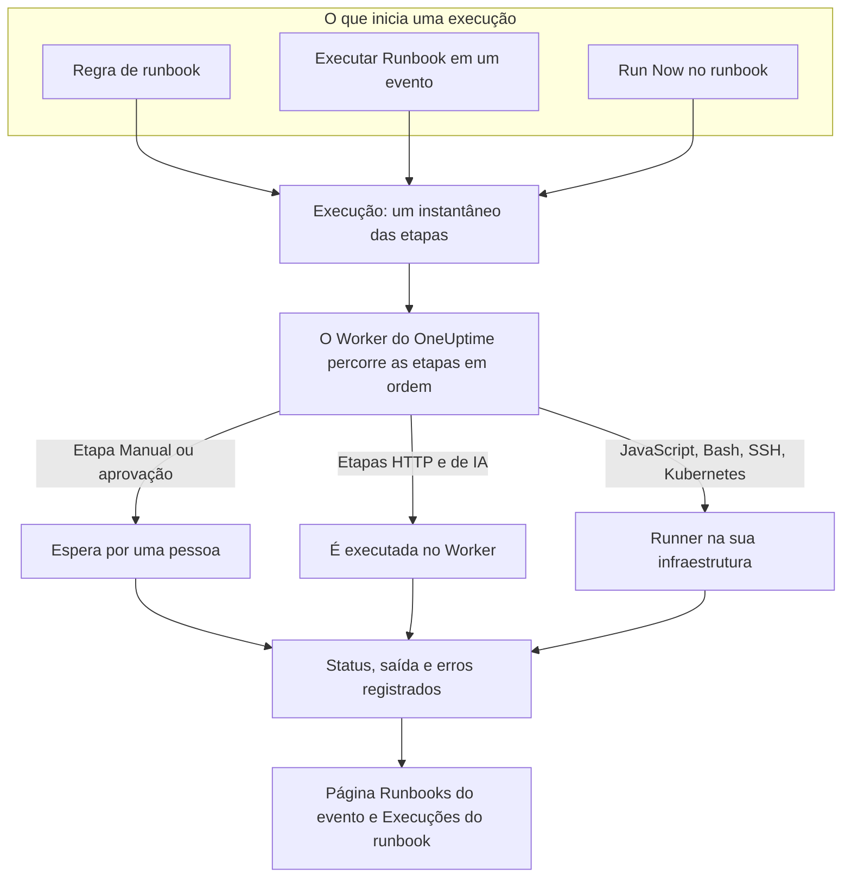

# Visão geral dos Runbooks

Um runbook é um procedimento de resposta reutilizável: uma lista ordenada de etapas manuais e automatizadas que você executa em um incidente, um alerta ou um evento de manutenção programada. Ele transforma a conversa de "e agora, o que fazemos?" em uma checklist que qualquer pessoa de plantão consegue seguir às 3 da manhã, com os scripts, as chamadas de API e as aprovações já escritos. Os runbooks são para os engenheiros de plantão que respondem a incidentes e para as equipes de plataforma que automatizam essa resposta.

:::cards
- [Escrever um runbook](/docs/runbooks/authoring): Criar um runbook e escrever suas etapas.
- [Regras de runbook](/docs/runbooks/rules): Iniciar runbooks em novos incidentes, alertas e eventos de manutenção.
- [Executar um runbook](/docs/runbooks/running): Iniciar uma execução, concluir e aprovar suas etapas, cancelá-la.
- [Agentes de runbook](/docs/runbooks/agents): Instalar o Runner que executa seus scripts na sua própria infraestrutura.
:::

## Como um runbook é executado



Cada execução de um runbook é uma **execução**. Quando ela começa, as etapas do runbook são copiadas para ela, e o OneUptime as percorre em ordem. Uma etapa Manual, ou uma etapa que precisa de aprovação, pausa a execução até que alguém aja.

As etapas HTTP e de IA são executadas no Worker do OneUptime. As etapas JavaScript, Bash, SSH e Kubernetes são executadas em um [Runner](/docs/runbooks/agents) que você instala na sua própria infraestrutura, então seus scripts nunca rodam nos servidores do OneUptime. O status, a saída e a mensagem de erro de cada etapa ficam registrados na execução, que permanece ligada ao incidente, alerta ou evento para o qual ela rodou.

## Conceitos principais

| Termo | Significado |
| --- | --- |
| **Runbook** | O modelo. Um procedimento nomeado e reutilizável, com uma lista ordenada de etapas e um interruptor **Executar este runbook**. |
| **Etapa** | Um item de um runbook. Tem um tipo (Manual, JavaScript, HTTP request, Bash, SSH, Kubernetes ou AI), um título, uma descrição e configurações específicas do tipo. |
| **Regra de runbook** | Uma regra que anexa automaticamente um ou mais runbooks a incidentes, alertas ou eventos de manutenção programada que atendem às suas condições: seus monitores, severidade, rótulos, rótulos dos monitores, título ou descrição. |
| **Execução** | Uma execução de um runbook. É criada quando uma regra dispara, quando alguém clica em **Executar Runbook** em um evento ou quando alguém clica em **Run Now** no próprio runbook. Guarda um instantâneo das etapas e o status e a saída de cada etapa. |
| **Instantâneo** | A cópia congelada das etapas do runbook que fica em cada execução. Você pode editar o runbook depois sem reescrever o histórico das execuções anteriores. |
| **Runner** | Um pequeno agente que você executa em um host da sua própria infraestrutura. Ele executa as etapas JavaScript, Bash, SSH e Kubernetes que o indicam. Também chamado de agente de runbook. |
| **Credencial** | Acesso SSH ou Kubernetes gerenciado, usado pelas etapas SSH e Kubernetes. Criptografada em repouso e entregue apenas aos Runners aos quais você a atribui. |
| **Segredo** | Um único valor, como um token de API, que um script Bash ou JavaScript usa como `{{runbookSecrets.NAME}}`. Criptografado em repouso e entregue apenas aos Runners aos quais você o atribui. |

## Tipos de etapa

Escolha o tipo que se encaixa em cada etapa. [Escrever um runbook](/docs/runbooks/authoring) detalha as configurações de cada tipo.

| Tipo de etapa | É executada em | Use quando… | Exemplo |
| --- | --- | --- | --- |
| **Manual** | Uma pessoa | Alguém precisa verificar algo, tomar uma decisão ou agir onde o OneUptime não consegue. | "Confirmar que o tráfego foi para a região secundária." |
| **JavaScript** | Um Runner | Você precisa de um cálculo pequeno e isolado, em sandbox. | Calcular o atraso da réplica e decidir se continua. |
| **HTTP request** | O Worker do OneUptime | Você chama uma API existente: um provedor de nuvem, o PagerDuty, um webhook do Slack, seu próprio serviço. | `POST` para o seu orquestrador de failover. |
| **Bash** | Um Runner | Você precisa de comandos de shell na sua própria infraestrutura. | Executar `kubectl rollout restart` ou um script de recuperação. |
| **SSH** | Um Runner | Você precisa de um comando em um host remoto, com uma credencial SSH gerenciada. | Reiniciar um serviço em um servidor web. |
| **Kubernetes** | Um Runner | Você precisa reiniciar ou escalar um Deployment, um StatefulSet ou um DaemonSet. | Reiniciar `checkout-api` em `production`. |
| **AI** | O Worker do OneUptime | Você quer uma análise, um resumo ou uma avaliação no meio da execução, vinda do provedor de LLM do seu projeto. | "Revise os diagnósticos acima. É seguro fazer o failover?" |

Um runbook pode misturar todos eles. A força dos runbooks está em intercalar verificações humanas com automação e análise de IA.

## O que inicia uma execução

| Como | Onde | A execução fica ligada a |
| --- | --- | --- |
| Uma regra de runbook | **Incidentes**, **Alertas** ou **Manutenção programada** → **Regras** → **Regras de runbook** | O novo incidente, alerta ou evento |
| **Executar Runbook** | A página **Runbooks** de um incidente, alerta ou evento de manutenção programada | Esse evento |
| **Run Now** | A página **Visão geral** do runbook | Nada: uma execução avulsa |
| Uma regra de remediação automática | Consulte [AI SRE](/docs/ai/ai-sre) | O incidente ou alerta |

Um runbook cujo interruptor **Executar este runbook** está desligado, na sua página **Configurações**, não é iniciado por nenhuma dessas vias. As execuções já iniciadas continuam.

## Onde ficam os runbooks no painel

Runbooks fica em **Produtos**, no grupo **Painéis e automação**.

| Página | O que você faz lá |
| --- | --- |
| **Produtos → Runbooks** | Navegar, criar e abrir runbooks. |
| As **Etapas** de um runbook | Escrever e reordenar suas etapas, depois **Save Steps**. |
| A **Visão geral** de um runbook | Ver sua última execução e os resultados, e clicar em **Run Now**. |
| As **Execuções** de um runbook | Todas as execuções deste runbook, filtradas por status ou data de início. |
| Os **Proprietários** de um runbook | Adicionar as pessoas e equipes responsáveis por ele. |
| As **Configurações** de um runbook | Desligar **Executar este runbook** sem excluir o runbook. |
| **Runbooks → Execuções** | Todas as execuções de todos os runbooks do projeto. |
| **Runbooks → Agentes de runbook** e **Runbooks → Agentes de runbook → Credenciais** | Instalar [Runners](/docs/runbooks/agents) e gerenciar [credenciais](/docs/runbooks/credentials). |
| **Runbooks → Configurações** | Gerenciar os [segredos](/docs/runbooks/credentials#segredos-para-scripts) dos scripts, e as **Regras de proprietário** e **Regras de Rótulos** que adicionam proprietários e rótulos aos novos runbooks. |
| **Incidentes / Alertas / Manutenção programada → Regras → Regras de runbook** | Criar as regras que iniciam runbooks automaticamente. |
| Um incidente, alerta ou evento de manutenção → **Runbooks** | Ver as execuções ligadas a ele e clicar em **Executar Runbook** para iniciar uma. |

## Um exemplo completo

Suponha que você queira que todo incidente com "db-primary" no título inicie um runbook de failover de banco de dados em cinco etapas.

:::steps
### Criar o runbook

Em **Runbooks**, clique em **Criar: Runbook** e dê o nome "DB primary failover". Abra-o, vá para **Etapas**, adicione estas etapas e clique em **Save Steps**:

| # | Tipo | Título |
| --- | --- | --- |
| 1 | JavaScript | Registrar o atraso da réplica antes do failover |
| 2 | Manual | Confirmar no painel do DBA que a réplica está saudável |
| 3 | HTTP request | `POST` para o orquestrador de failover |
| 4 | Manual | Verificar que as gravações vão para o novo primário |
| 5 | HTTP request | Publicar o aviso de normalidade em `#db-incidents` no Slack |

### Adicionar uma regra

Em **Incidentes → Regras → Regras de runbook**, crie uma regra com uma condição e o runbook a ser iniciado:

```text
Conditions:  Incident Title starts with db-primary
Runbooks:    [DB primary failover]
```

### Deixar executar

Um monitor abre o incidente `INC-4821 · db-primary connection timeout`. A regra corresponde e uma execução começa:

- A etapa 1 (JavaScript) é executada no Runner que você escolheu para ela. Seu valor de retorno, como `{ lagMs: 412 }`, é capturado.
- A etapa 2 (Manual) pausa a execução, que mostra **Aguardando você**. A pessoa de plantão confere o painel e clica em **Mark complete**.
- A etapa 3 (HTTP request) é executada, e a resposta ao `POST` é capturada.
- A etapa 4 (Manual) pausa a execução de novo até que alguém a conclua.
- A etapa 5 (HTTP request) é executada, e a execução fica **Concluído**.

### Revisar

A execução fica na página **Runbooks** do incidente. Quando você escrever o postmortem, a saída, o erro e o tempo de cada etapa estarão a um clique.
:::

## Casos de uso comuns

- **Failover de banco de dados**: capturar o estado com JavaScript, pedir ao DBA de plantão que confirme a saúde da réplica (Manual), chamar o orquestrador (HTTP request), confirmar o DNS (Manual), publicar o aviso de normalidade (HTTP request).
- **Limpeza de cache**: uma requisição HTTP e depois uma etapa Manual "confirmar que a taxa de acertos do cache está se recuperando".
- **Incidente com impacto em clientes**: Manual "publicar uma atualização na página de status", uma requisição HTTP para avisar a equipe de suporte, JavaScript para obter a lista de contas afetadas.
- **Verificação prévia de uma manutenção programada**: registrar métricas, confirmar a janela de mudança com as partes interessadas (Manual), ativar o modo de manutenção no balanceador de carga (HTTP request).
- **Diagnosticar e depois corrigir**: uma etapa Bash coleta diagnósticos, uma etapa de IA com **Exigir aprovação** os lê e recomenda uma correção, e uma etapa Kubernetes só reinicia a carga de trabalho depois que uma pessoa aprova.
- **Higiene que sempre roda**: uma regra sem condições que captura o estado do sistema em todo incidente, para o postmortem.

## Como os runbooks se encaixam no resto do OneUptime

- Os **monitores** abrem incidentes e alertas, e as **regras de runbook** os transformam em execuções de runbook: detectar, disparar, responder, registrar.
- As **[políticas de plantão](/docs/on-call/schedules)** decidem quem é acionado. Os runbooks decidem o que essa pessoa faz depois de acordar.
- As **[conexões de workspace](/docs/workspace-connections/slack)**, como Slack e Microsoft Teams, são destinos naturais para etapas de requisição HTTP que publicam atualizações.
- As **[páginas de status](/docs/status-pages/index)** costumam ser atualizadas em uma etapa Manual de um runbook voltado ao cliente.

## Próximos passos

:::cards
- [Escrever um runbook](/docs/runbooks/authoring): Criar seu primeiro runbook e suas etapas.
- [Agentes de runbook](/docs/runbooks/agents): Instalar um Runner antes de escrever uma etapa JavaScript, Bash, SSH ou Kubernetes.
- [Regras de runbook](/docs/runbooks/rules): Iniciar runbooks automaticamente quando incidentes forem criados.
- [Configuração e segurança de runbooks](/docs/runbooks/configuration): Limites, timeouts, permissões e proteção.
:::
