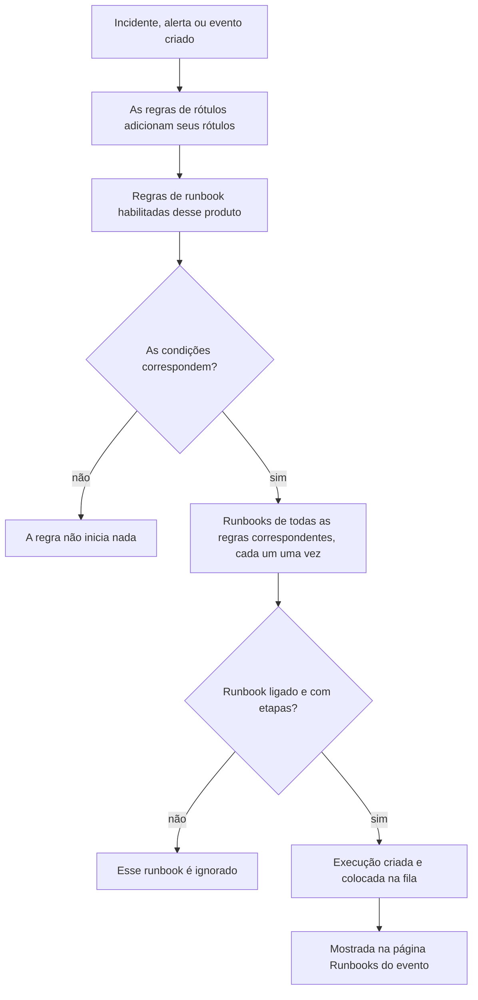

# Regras de runbook

As regras de runbook iniciam runbooks automaticamente quando um **incidente**, um **alerta** ou um **evento de manutenção programada** é criado, para que ninguém precise se lembrar de executá-los no meio de uma indisponibilidade. Cada produto tem sua própria página de regras, no seu menu **Regras**:

- Incidentes → Regras → **Regras de runbook**
- Alertas → Regras → **Regras de runbook**
- Manutenção programada → Regras → **Regras de runbook**

As três páginas editam o mesmo tipo de regra, filtrado para as regras daquele produto.

:::cards
- [Criar uma regra de runbook](#criar-uma-regra-de-runbook): Quatro etapas: um nome, condições e os runbooks a iniciar.
- [Condições](#condições): Cada critério e operador que uma regra pode usar.
- [Semântica de correspondência](#semântica-de-correspondência): Várias regras, condições de monitor e regras de rótulos.
- [Exemplos](#exemplos): Três regras para copiar.
:::

## Como uma regra inicia um runbook



Quando uma regra dispara, para cada runbook que ela indica:

1. O runbook é carregado.
2. Suas etapas são copiadas como **instantâneo** para uma nova execução de runbook.
3. A execução é colocada na fila do worker de runbooks.
4. A execução é ligada à entidade de origem: ela aparece na página **Runbooks** do incidente, alerta ou evento de manutenção programada e na lista **Execuções** do runbook.

Você vê todas as execuções, iniciadas por regras ou não, em **Runbooks → Execuções**, filtradas por status, runbook ou data de início.

## Antes de começar

- **Um runbook que possa rodar.** Ele precisa de pelo menos uma etapa e de **Executar este runbook** ligado, na página **Configurações** dele. Consulte [Escrever um runbook](/docs/runbooks/authoring).
- **Permissão para gerenciar regras.** Project Owner, Project Admin e Runbook Admin criam regras de runbook, assim como qualquer pessoa com a permissão **Create Runbook Rule**.

## Criar uma regra de runbook

:::steps
### Abrir as regras de runbook

Em **Incidentes**, **Alertas** ou **Manutenção programada**, abra **Regras → Regras de runbook** e clique em **Criar: Runbook Rule**.

### Dar um nome à regra

Em **Informações básicas**, informe um **Nome**, como "Iniciar failover de BD para incidentes de banco de dados", e, se quiser, uma **Descrição**.

### Adicionar condições

Em **Critérios de Correspondência**, clique em **Adicionar condição**, escolha um critério e um operador e digite ou escolha o valor. Adicione mais condições se precisar e escolha **Corresponder a todas** ou **Corresponder a qualquer**. Não adicione nenhuma para iniciar os runbooks em todo evento novo desse tipo.

### Escolher os runbooks

Em **Runbooks**, escolha um ou mais **Runbooks para iniciar** e clique em **Criar: Runbook Rule**. A regra fica ativa assim que é criada e aparece na lista com o status **Habilitado**.
:::

## Anatomia de uma regra

| Campo | Finalidade |
| --- | --- |
| **Nome** | Um rótulo curto e claro para a regra. |
| **Descrição** | Contexto opcional para a equipe. |
| **Habilitado** | Ligado em uma regra nova. Desligue-o no formulário de edição da regra para suspendê-la sem excluí-la. |
| **Condições** | O que a regra compara, na etapa **Critérios de Correspondência**. Deixe vazio para corresponder a todo evento do seu tipo. |
| **Runbooks para iniciar** | Um ou mais runbooks lançados quando a regra dispara. |

## Condições

Cada condição compara uma característica do incidente, alerta ou evento de manutenção programada com um valor que você informa. Uma regra de runbook oferece os mesmos critérios que as outras regras do seu produto: uma regra de runbook de incidentes compara o mesmo que uma regra de privacidade ou de plantão de incidentes.

| Critério | O que verifica |
| --- | --- |
| **Monitores** | Os monitores que o incidente ou o evento de manutenção programada afeta, ou o monitor que gerou o alerta. |
| **Incidente Severidades** / **Alerta Severidades** | A severidade do incidente ou do alerta. Eventos de manutenção programada não têm severidade, então as regras deles não a oferecem. |
| **Rótulos de incidentes** / **Rótulos de alerta** / **Rótulos do evento** | Os rótulos do próprio incidente, alerta ou evento, incluindo os que as regras de rótulos adicionaram na criação. |
| **Rótulos do Monitor** | Os rótulos dos seus monitores. Rotule seus monitores como `production` ou `staging` para executar um runbook só em um ambiente. |
| **Título do Incidente** / **Título do alerta** / **Título do evento** | O título. |
| **Descrição do incidente** / **Descrição do alerta** / **Descrição do evento** | A descrição. |
| **Nome do Monitor** / **Descrição do Monitor** | O nome ou a descrição dos seus monitores. |

Escolha um operador para cada condição:

- Um critério de lista — **Monitores**, as severidades e os rótulos — usa **Tem algum de**, **Tem todos os** ou **Não tem nenhum de** dos valores escolhidos.
- Um critério de texto usa **Contém** (com o qual uma condição nova começa), **Não contém**, **Igual a**, **Diferente de**, **Começa com**, **Termina com**, ou **Corresponde ao padrão** / **Não corresponde ao padrão** para uma expressão regular sem diferenciar maiúsculas de minúsculas ou um curinga `*`. As comparações de texto ignoram maiúsculas e minúsculas.

Com duas ou mais condições, escolha **Corresponder a todas** (todas as condições precisam ser verdadeiras) ou **Corresponder a qualquer** (pelo menos uma precisa ser).

## Semântica de correspondência

- Uma regra sem condições vale para todo evento do seu tipo (uma regra global de "sempre executar").
- Várias regras podem corresponder ao mesmo evento. Cada correspondência dispara, e a união dos runbooks delas é executada: cada runbook ganha sua própria execução, e um runbook indicado por duas regras correspondentes roda uma vez.
- As condições de monitor são verificadas um monitor de cada vez. Com **Corresponder a todas**, "**Nome do Monitor** contém `api`" e "**Rótulos do Monitor** tem algum de _Production_" precisam de um monitor que atenda às duas, não de um monitor para cada uma.
- As regras de runbook rodam depois das regras de rótulos, então um rótulo que uma regra de rótulos adiciona a um novo incidente, alerta ou evento pode iniciar um runbook.
- Um incidente ou alerta criado já resolvido não inicia nenhum runbook: ele terminou antes de ser registrado. Consulte [Declarado já confirmado ou resolvido](/docs/incidents/declaring-incidents#declarado-já-confirmado-ou-resolvido).
- Uma condição sobre a severidade de outro produto — **Alerta Severidades** em uma regra de incidentes, por exemplo — nunca pode ser verdadeira, então a API se recusa a salvá-la.
- As regras são avaliadas uma vez, quando o evento é criado. Editar depois o título, a severidade ou os rótulos de um incidente não dispara as regras de novo.

## Exemplos

### Failover de BD para incidentes de banco de dados

```text
Name:        Start DB failover for DB incidents
Trigger:     Incident
Conditions:  Incident Title matches pattern (?:^|\b)(db|database|postgres|mysql|mongo)
Runbooks:    [DB failover playbook, Notify DBA team]
```

Isso cria duas execuções de runbook toda vez que é criado um incidente com "db", "database", "postgres" e assim por diante no título.

### Só para incidentes críticos de produção

```text
Name:        Flush the CDN cache for critical production incidents
Trigger:     Incident
Conditions:  Match all
             Monitor Labels has any of Production
             Incident Severities has any of Critical
Runbooks:    [Flush CDN cache]
```

Roda para um incidente crítico em um monitor rotulado como _Production_, e para nada em staging.

### Regra de higiene que sempre roda

```text
Name:        Always-run pre-flight check
Trigger:     Incident
Conditions:  (none)
Runbooks:    [Capture pre-incident state]
```

Dispara em todo incidente: útil para capturar instantâneos do estado do sistema, métricas e coisas assim para o postmortem.

## Runbooks desligados

Se uma regra indica um runbook desligado (**Executar este runbook** desligado na página **Configurações** do runbook, `isEnabled = false`), a regra ainda corresponde, mas a execução do runbook é ignorada. Ligue o interruptor de novo para retomar. Um runbook sem etapas é ignorado da mesma forma.

## Testar uma regra

Antes de confiar em uma regra em produção, crie um incidente (ou alerta) de teste que atenda às condições da regra e verifique se os runbooks esperados aparecem na página **Runbooks** dele.

> [!NOTE]
> As regras de runbook agem só sobre eventos novos. Diferente das regras de rótulos e de proprietários, elas não podem ser [executadas sobre registros existentes](/docs/configuration/run-rules-now): isso iniciaria runbooks para incidentes que já terminaram.

## Solução de problemas

:::details Uma regra correspondeu, mas nenhum runbook rodou
Verifique, nesta ordem:

- A regra está **Habilitado**.
- Cada runbook tem **Executar este runbook** ligado, na página **Configurações** dele, e pelo menos uma etapa salva.
- O incidente ou alerta não foi criado já resolvido.
- A execução do runbook não está simplesmente esperando: abra-a pela página **Runbooks** do evento. Uma etapa Manual ou uma aprovação mostra **Aguardando você**.
:::

:::details Uma regra nunca corresponde
As regras veem o evento como ele foi criado, com os rótulos que as regras de rótulos adicionaram naquele momento. Um rótulo, uma severidade ou um título alterados depois não são vistos. Com várias condições, confira **Corresponder a todas** em comparação com **Corresponder a qualquer**, e lembre que as condições de monitor precisam valer todas para um mesmo monitor.
:::

:::details A API recusa uma regra com "can only be used by"
Um critério de severidade pertence a um único produto. **Alerta Severidades** em uma regra de incidentes, ou **Incidente Severidades** em uma regra de alertas, nunca poderia corresponder, então a regra é recusada com uma mensagem como "Alert Severities can only be used by alert runbook rules." Remova essa condição. O painel só oferece os critérios próprios de cada produto.
:::

## Próximos passos

:::cards
- [Executar um runbook](/docs/runbooks/running): O que quem responde vê quando uma regra inicia uma execução.
- [Escrever um runbook](/docs/runbooks/authoring): Escrever os runbooks que suas regras iniciam.
- [Declarar um incidente](/docs/incidents/declaring-incidents): Como os incidentes são criados e quando as regras os veem.
:::
