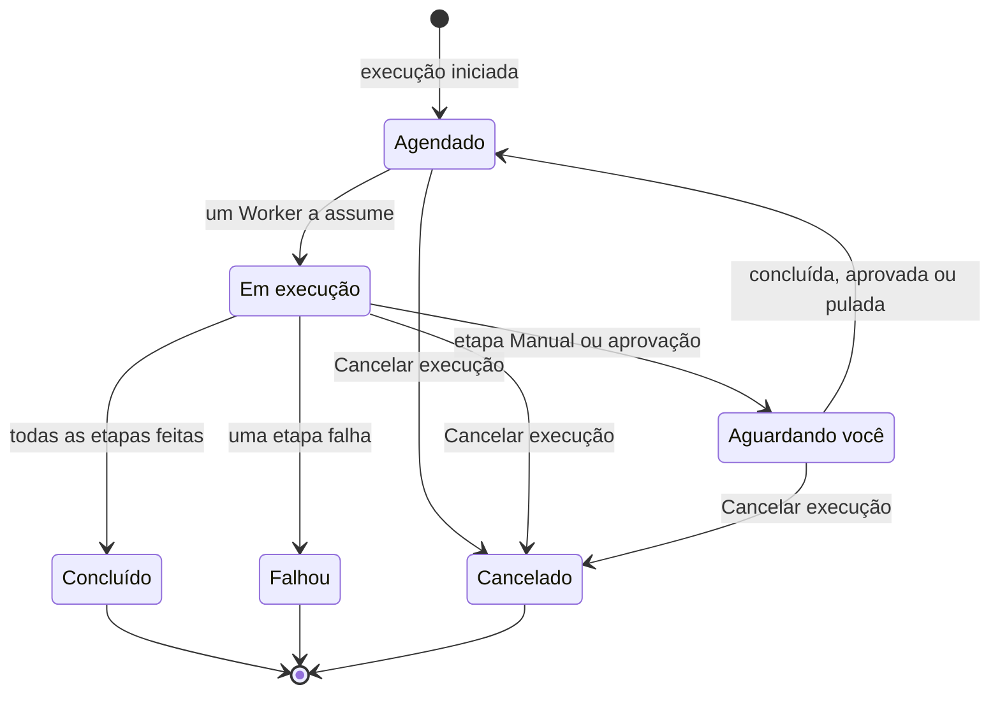

# Executar um runbook

Cada execução de um runbook é uma **execução**: um instantâneo das etapas do runbook, percorridas em ordem, com o status e a saída de cada etapa registrados. Esta página é para quem responde, inicia execuções e as faz avançar: como uma execução começa, o que a página da execução mostra e como concluir, aprovar, pular e cancelar etapas.

:::cards
- [Iniciar uma execução](#iniciar-uma-execução): A partir de um incidente, alerta ou evento, ou do próprio runbook.
- [A visão da execução](#a-visão-da-execução): O que cada etapa mostra enquanto uma execução está em andamento.
- [Concluir, aprovar e pular etapas](#concluir-aprovar-e-pular-etapas): Qual etapa aceita uma decisão, e quando.
- [Solução de problemas](#solução-de-problemas): Execuções que não começam ou não terminam.
:::

## Como uma execução avança

Uma nova execução fica **Agendado** até que um Worker a assuma e a marque como **Em execução**. Ela pausa como **Aguardando você** em uma etapa Manual, ou depois de uma etapa que precisa de aprovação, e volta para a fila assim que alguém age. Uma execução que espera por uma pessoa nunca expira. Ela termina como **Concluído**, **Falhou** ou **Cancelado**.

## Iniciar uma execução

Uma execução de runbook é criada de três maneiras:

1. **Automaticamente por uma regra**: uma [regra de runbook](/docs/runbooks/rules) a inicia quando é criado um incidente, alerta ou evento de manutenção programada que corresponde. Uma regra de remediação automática também pode iniciar uma; consulte [AI SRE](/docs/ai/ai-sre).
2. **Manualmente a partir de um evento**: clique em **Executar Runbook** em um incidente, alerta ou evento de manutenção programada. A execução fica ligada a esse evento.
3. **Manualmente a partir da página do runbook**: clique em **Run Now** na página **Visão geral** de um runbook. A execução não fica ligada a nenhum incidente, alerta ou evento de manutenção programada.

Para iniciar uma manualmente:

:::tabs
@tab A partir de um evento
1. Abra o incidente, alerta ou evento de manutenção programada e vá para a página **Runbooks** dele.
2. Clique em **Executar Runbook**. A caixa de diálogo **Executar um Runbook** lista os runbooks do projeto que estão ligados.
3. Clique em **Run** ao lado do runbook. A execução aparece na lista do evento: clique em **Visualizar** para abri-la.
@tab A partir do runbook
1. Abra o runbook em **Runbooks**.
2. Na **Visão geral** dele, clique em **Run Now**.
3. A página da execução se abre.
:::

Iniciar uma execução exige Project Owner, Project Admin, Project Member, Runbook Admin ou Runbook Member, ou a permissão **Create Runbook Execution**. Runbook Viewer e Viewer veem **Run Now** bloqueado, com o motivo. Consulte [Permissões](/docs/runbooks/configuration#permissões).

## A visão da execução

Abra qualquer execução para ver sua checklist. O topo da página mostra o **Status** da execução, seu **Progress** (etapas feitas do total), **Iniciada** (quando começou) e **Acionado por** (o que a iniciou). Cada etapa mostra:

- **Indicador de status** — Pendente, Em execução, Aguardando você, Concluído, Ignorado, Falhou ou Cancelado.
- **Título e descrição** — copiados do runbook no momento da execução.
- **Output** (recolhível) — stdout, valores de retorno, respostas HTTP ou a resposta da IA.
- **Mensagem de erro** se a etapa falhou.
- Na etapa que a execução está esperando: **Mark complete** (uma etapa Manual) ou **Approve & continue** (uma etapa com **Exigir aprovação**), e **Pular**.
- Enquanto a execução está pausada, **Pular** nas etapas automatizadas posteriores que não exigem aprovação.

Enquanto a execução está em andamento, a página se atualiza sozinha a cada 30 segundos. Clique em **Atualizar** para ver o estado mais recente na hora.

## Concluir, aprovar e pular etapas

Só a etapa que a execução está esperando pode ser marcada como concluída, aprovada ou pulada para que a execução continue. Uma etapa Manual ou uma etapa com **Exigir aprovação** não pode ser marcada nem pulada antes que a execução chegue a ela: sua função é parar a execução, então ela só aceita uma decisão quando a execução está lá (no caso de uma aprovação, depois que a etapa rodou e você pode ver a saída).

Enquanto a execução está pausada, você também pode pular uma etapa automatizada posterior que não exige aprovação, para que ela não rode quando a execução continuar. A execução continua pausada na etapa que está esperando por você. Não é possível pular enquanto há etapas em execução: espere a execução pausar ou cancele-a. Cada etapa registra quem a concluiu ou pulou.

| A etapa | Concluir ou aprovar | Pular |
| --- | --- | --- |
| A que a execução está esperando | Sim | Sim |
| Uma etapa automatizada posterior, sem **Exigir aprovação** | Não | Sim, enquanto a execução está pausada |
| Uma etapa Manual posterior, ou uma com **Exigir aprovação** | Não | Não |
| Qualquer etapa, enquanto há etapas em execução | Não | Não |

Concluir, aprovar, pular e cancelar exigem as mesmas funções que iniciar uma execução, ou a permissão **Edit Runbook Execution**.

## Intercalar etapas manuais e automatizadas

O fluxo clássico:

| # | Etapa | O que acontece |
| --- | --- | --- |
| 1 | Bash: capturar o estado do sistema | Roda no seu Runner assim que a execução começa. |
| 2 | Manual: "Avisar os clientes pelo banner da página de status." | A execução pausa até que alguém clique em **Mark complete**. |
| 3 | HTTP request: acionar o DBA pelo PagerDuty | Roda no Worker. |
| 4 | Manual: "Confirmar que o banco de dados secundário agora é o primário." | A execução pausa de novo. |
| 5 | HTTP request: publicar o aviso de normalidade em um webhook do Slack | Roda, e a execução fica **Concluído**. |

As etapas 2 e 4 pausam a execução até que alguém as marque. As etapas 1, 3 e 5 rodam automaticamente. Toda a execução é uma única execução, uma única linha do tempo e uma única fonte de verdade.

## Cancelar uma execução

Clique em **Cancelar execução** na página da execução. O status passa a `Cancelled` e nenhuma etapa posterior começa. Uma etapa que já está rodando não é interrompida, mas seu resultado não é registrado: a etapa fica `Cancelled`. Trabalhos que ainda esperam por um Runner são cancelados; um Runner que já está executando um script o termina, mas o resultado não é aceito.

## Limites de saída

A saída de cada etapa é limitada a **50 KB**, para que um script descontrolado não infle o banco de dados. Uma saída maior é cortada com um marcador. Se precisar de artefatos maiores, grave-os a partir do script em um armazenamento de objetos ou em um sistema de logs e coloque a URL na saída.

## Executar um runbook de novo

Uma execução é um registro único e imutável. Para executar o runbook de novo, clique em **Executar novamente** em uma execução terminada, ou em **Run Now** no runbook. Os dois criam uma nova execução com as etapas atuais do runbook, sem ligá-la a nenhum evento. Para executá-lo de novo em um incidente, use **Executar Runbook** na página **Runbooks** do incidente. A execução original fica intacta para a trilha de auditoria.

## Encontrar execuções anteriores

| Onde | O que lista |
| --- | --- |
| As **Execuções** de um runbook | Todas as execuções desse runbook, com filtros por status e data de início, e uma coluna **Acionado por**. |
| **Runbooks → Execuções** | Todas as execuções de todos os runbooks do projeto. |
| A página **Runbooks** de um incidente, alerta ou evento | As execuções ligadas a ele. A visão geral do evento também as mostra, assim que houver alguma. |

## Solução de problemas

:::details Run Now está bloqueado
Sua função lê runbooks, mas não os executa: o botão diz "Você não tem permissão para iniciar execuções de runbook neste projeto." Peça Runbook Member ou a permissão **Create Runbook Execution**.
:::

:::details Iniciar uma execução falha com "Runbook is disabled" ou "Runbook has no steps to run"
O interruptor **Executar este runbook** do runbook está desligado, na página **Configurações** dele, ou ele não tem etapas salvas. Ligue o interruptor, ou adicione etapas e clique em **Save Steps**.
:::

:::details Uma etapa falhou porque falta um Runner ou uma credencial
A mensagem diz, por exemplo, "Bash step is missing a Runner. Pick one under Runbooks → Runners." A etapa foi salva sem **Runner**, ou uma etapa SSH ou Kubernetes sem **Credential**. Abra as **Etapas** do runbook, escolha o que falta na etapa, clique em **Save Steps** e execute o runbook de novo.
:::

:::details Uma etapa falhou porque nenhum agente de runbook a assumiu
A mensagem diz "No runbook agent picked up this step before the wait window expired." O Runner da etapa não assumiu o trabalho dentro do seu claim timeout. Verifique em **Runbooks → Agentes de runbook** se o Runner está **Conectado** e se **Executa runbooks** está ligado. Consulte [Agentes de runbook](/docs/runbooks/agents#solução-de-problemas).
:::

:::details A execução está esperando há horas
Uma execução que espera por uma pessoa nunca expira. Abra-a e aja na etapa marcada como **Aguardando você**, ou clique em **Cancelar execução**.
:::

:::details Uma etapa diz que pode ter rodado em parte
O Worker do OneUptime que executava a etapa reiniciou ou parou de responder, e a execução foi marcada como falha em vez de ficar em andamento. Verifique o sistema de destino antes de executar o runbook de novo.
:::

## Próximos passos

:::cards
- [Escrever um runbook](/docs/runbooks/authoring): Adicionar etapas Manual e aprovações onde uma pessoa deve decidir.
- [Regras de runbook](/docs/runbooks/rules): Iniciar execuções automaticamente em novos incidentes.
- [Agentes de runbook](/docs/runbooks/agents): Manter online os Runners de que suas etapas precisam.
:::
