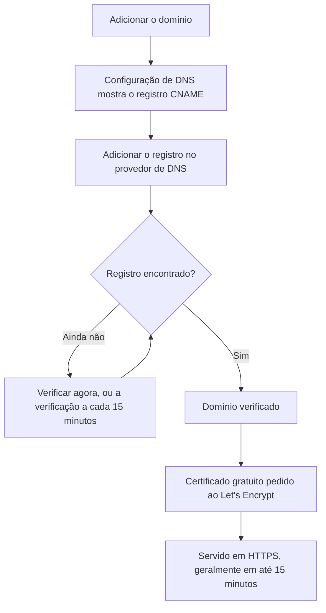

# Marca e domínios da página de status

Sua página de status é a única tela do OneUptime que seus clientes olham, então ela deve ter a sua cara e ficar no seu próprio domínio, como `status.yourcompany.com`. Esta página percorre a página **Marca** cartão por cartão e depois coloca a página de status no seu domínio: adicione o domínio, adicione um registro DNS, e o certificado SSL gratuito vem sozinho.

:::cards
- [A página Marca](#a-página-marca): Logotipo, título, favicon, links, rodapé, cores e idiomas.
- [HTML, CSS e JavaScript personalizados](#html-css-e-javascript-personalizados): Tudo o que os controles embutidos não cobrem.
- [Domínios personalizados](#domínios-personalizados): Seu próprio nome de host, com um certificado gratuito.
- [A coluna Status](#ler-a-coluna-status-do-domínio): Em que ponto cada domínio está no caminho para o HTTPS.
:::

## Onde fica cada controle de marca

Abra uma página de status: a seção **Marca** do menu lateral dela tem três itens:

| Página | O que você define ali |
| ---- | ------------------ |
| **Marca** | Logotipo e imagem de capa, título e descrição da página, favicon, links do cabeçalho, a descrição da página de visão geral, a linha de direitos autorais e os links do rodapé. Recolhidos em **Mais configurações**: as cores do gráfico de histórico, os idiomas e a indexação em mecanismos de pesquisa. |
| **Domínios personalizados** | Seu próprio domínio, o registro DNS dele e o certificado SSL gratuito dele. |
| **HTML, CSS e JavaScript** | HTML do cabeçalho, HTML do rodapé, CSS personalizado, JavaScript personalizado. |

Três coisas que parecem marca ficam, em vez disso, em **Páginas de status → sua página → Avançado → Configurações avançadas** (`{id}/settings`), porque decidem o que a página mostra, e não a aparência dela: a porcentagem geral de tempo de atividade, quais status de monitor contam contra o tempo de atividade e a linha "Powered by OneUptime". As três são linhas do cartão **O que sua página de status mostra** dessa tela.

A marca ficava dividida entre telas separadas de **Marca essencial**, **Cabeçalho**, **Rodapé**, **Página de visão geral** e **Idiomas**. Os endereços antigos delas (`{id}/header-style`, `{id}/footer-style`, `{id}/overview-page-branding` e `{id}/languages`) agora abrem a página **Marca**, então favoritos e links antigos continuam funcionando.

## A página Marca

**Páginas de status → sua página → Marca → Marca** (`{id}/branding`). Cada cartão salva por conta própria. Depois do logotipo, do título e do favicon, os cartões seguem a sua página de status de cima para baixo: os links do cabeçalho, o texto no topo da visão geral e, depois, o rodapé. O que pouca gente muda fica recolhido em **Mais configurações**, no final.

### Logotipo e imagem de capa

O primeiro cartão, **Logotipo e Imagem de Capa**, tem um botão **Edit Images** que abre duas etapas:

| Etapa | Campos |
| ---- | ------ |
| **Logotipo** | O envio do logotipo (texto de exemplo `Upload logo`) e **Logo Alt Text** (texto de exemplo `Logo of My Company`). Deixe o texto alternativo em branco e o título da página de status é usado no lugar dele. |
| **Imagem de capa** | **Capa**, um envio (texto de exemplo `Upload cover image`) para a faixa larga atrás do cabeçalho, e **Cover Image Alt Text**. Deixe o texto alternativo em branco se a capa for puramente decorativa. |

O logotipo, a imagem de capa e o favicon são arquivos enviados no próprio projeto da página de status, e isso é verificado sempre que um deles é salvo, pelo painel, pela API, pelo Terraform ou por um fluxo de trabalho. Um arquivo enviado em outro projeto é recusado com as mesmas palavras que recebe um arquivo que não existe mais: "The logo's file could not be found. Upload the logo again.", "The cover image's file could not be found. Upload the cover image again." ou "The favicon's file could not be found. Upload the favicon again." Enviar a imagem de novo pela página resolve.

Sua página de status só mostra imagens do próprio projeto; uma imagem que ela não pode mostrar fica de fora, como se a página não tivesse nenhuma. O painel, a API e o Terraform leem as imagens da página do mesmo jeito: uma imagem de outro projeto volta como nenhuma imagem. Os e-mails que a página envia (aos assinantes, e aos usuários privados sobre o acesso deles) mostram o logotipo do mesmo jeito: um logotipo que a página não pode mostrar também fica de fora deles, em vez de aparecer como uma imagem quebrada.

### Título, descrição e favicon

- **Título e descrição**: o cartão avisa que isto também é usado para SEO. **Editar** abre **Título da página** (texto de exemplo `Please enter page title here.`) e **Descrição da página**. Mecanismos de pesquisa e prévias de links mostram esses textos, então escreva-os para um cliente, não para a sua equipe.
- **Favicon**: **Edit Favicon** abre o envio **Favicon**: o pequeno ícone na aba do navegador.

### Links do cabeçalho

A tabela **Links do Cabeçalho** contém os links do cabeçalho da página de status, como o seu site, a sua documentação ou um portal de suporte. Cada link tem um **Título** e um **Link** (uma URL, texto de exemplo `https://link.com`), e você os reordena arrastando. Sem nenhum, a tabela diz **Nenhum link de cabeçalho de status para esta página de status**, com **Criar: Página de status Cabeçalho Link** abaixo.

### Descrição da página de visão geral

**Descrição da página de visão geral** é a primeira coisa na visão geral da página de status, acima dos comunicados, do status geral e dos seus recursos. **Editar descrição** abre um campo markdown. Use-o para uma frase de contexto: o que esta página cobre e onde buscar suporte. Uma imagem que você colocar nele é mostrada a todos os visitantes da página.

### Rodapé

- **Informações de direitos autorais**: **Edit Copyright** abre um campo, **Informações de direitos autorais**, com o texto de exemplo `Acme, Inc.`.
- **Links do rodapé**: o mesmo par **Título** e **Link** dos links do cabeçalho, ordenados arrastando. Sem nenhum, diz "Nenhum link de rodapé de status para esta página de status."

Os links do cabeçalho servem para navegar; os do rodapé, para as letras miúdas, como avisos legais, privacidade e termos.

### Mais configurações

A última seção da página fica recolhida em **Mais configurações**, porque pouca gente muda o que há nela. Recolhida, o cabeçalho dela nomeia as suas quatro seções (**Cor Padrão da Barra**, **Regras de cor das barras**, **Idiomas** e **Indexação em mecanismos de pesquisa**) e mostra cada uma que difere de como uma página de status nova começa: uma cor padrão da barra diferente do verde com que toda página começa, qualquer regra de cor das barras, um idioma padrão diferente do inglês, uma lista de idiomas mais curta ou a indexação em mecanismos de pesquisa desativada. Clique para abri-la: é um único cartão, com as quatro seções uma embaixo da outra, cada uma com seu próprio título e seu próprio botão, separadas por divisórias.

**Cores do gráfico de histórico.** Estes são os únicos controles de cor embutidos de uma página de status.

- **Cor Padrão da Barra do Gráfico de Histórico**: **Edit Default Bar Color** abre o seletor **Cor Padrão da Barra**. Toda página de status nova começa com verde. Com regras de cor das barras, ela também é a cor de um dia a que nenhuma regra corresponde. Um dia para o qual a página não tem dados é sempre desenhado em cinza.
- **Rules for Bar Colors of History Chart**: uma tabela ordenada de regras que você ordena arrastando. Cada regra tem **Quando a % de tempo de atividade for maior ou igual a** e **Então, use esta cor de barra**; as colunas da tabela dizem `When Uptime Percent >=` e `Then, Bar Color is`. A cor de uma regra nova já vem escolhida, uma que as outras regras ainda não usam; escolha a que você quiser no lugar dela. A ordem importa, então organize as regras na ordem em que você quer que sejam avaliadas. Sem regras, a barra de cada dia recebe a cor do status de monitor mais baixo daquele dia.

Quantos dias o gráfico cobre não é definido aqui. Isso é o **Histórico de tempo de atividade** no cartão **O que sua página de status mostra**, em **Avançado → Configurações avançadas**, de 1 a 90 dias. Quais status de monitor contam como fora do ar é **Conta como indisponibilidade**, na mesma linha desse cartão.

**Idiomas.** A seção **Idiomas** define o seletor de idioma que os visitantes encontram no rodapé da página. **Editar idiomas** abre dois campos:

| Campo | O que faz |
| ----- | ------------ |
| **Idioma Padrão** | O idioma que os visitantes veem na primeira visita, escolhido em uma lista que nomeia cada idioma na própria língua e em inglês (`Deutsch (German)`). O padrão é o inglês, e os visitantes sempre podem trocar pelo rodapé. |
| **Idiomas habilitados** | Uma seleção múltipla, texto de exemplo `All languages`. Deixe-a vazia e todos os idiomas compatíveis são oferecidos; escolha alguns e o rodapé lista só esses. |

O OneUptime vem com dezessete idiomas: inglês, alemão, francês, espanhol, italiano, português, holandês, dinamarquês, norueguês, sueco, russo, japonês, coreano, chinês (simplificado), chinês (tradicional), hindi e persa.

**Indexação em mecanismos de pesquisa.** Uma chave, **Permitir que mecanismos de pesquisa indexem esta página de status**, decide se o Google, o Bing e outros mecanismos de pesquisa podem listar a página. Ela vem ativada por padrão. Não há botão **Editar**: a chave salva no momento em que você a aciona. Desative-a e a página é servida com `noindex, nofollow` (uma meta tag robots e um cabeçalho `X-Robots-Tag`); qualquer pessoa com o link ainda consegue abri-la. Os mecanismos de pesquisa podem levar algumas semanas para tirar uma página que já indexaram.

> [!TIP]
> Desative **Permitir que mecanismos de pesquisa indexem esta página de status** enquanto uma página for só interna ou ainda estiver sendo configurada, para que uma página pela metade não comece a aparecer nas buscas pelo nome da sua marca.

## Porcentagem de tempo de atividade e status de indisponibilidade

Os dois ficam na linha **Histórico de tempo de atividade** do cartão **O que sua página de status mostra**, em **Páginas de status → sua página → Avançado → Configurações avançadas** (`{id}/settings`). Não há botão **Editar**: cada um salva no momento em que você o altera.

- **Mostrar percentual geral de tempo de atividade**: uma chave, desativada por padrão. Enquanto ela está ativada, **Precisão** ao lado escolhe quantas casas decimais a porcentagem mostra: `99%`, `99.9%`, `99.99%` (o padrão) ou `99.999%`. No OneUptime Cloud, ativar a porcentagem exige o plano **Scale**; a precisão dela pode ser alterada em qualquer plano.
- **Conta como indisponibilidade**: os status de monitor, como etiquetas coloridas, cujo tempo conta contra o tempo de atividade nesta página. É aqui que você decide se, por exemplo, um status degradado conta contra o tempo de atividade. Pelo menos um status continua escolhido.

Antes eram dois cartões próprios, **Porcentagem geral de tempo de atividade** e **Status de monitor de indisponibilidade**, cada um atrás de um botão **Editar**. Veja [Escolher o que aparece na página](/docs/status-pages/index#escolher-o-que-aparece-na-página) para o resto do cartão.

## HTML, CSS e JavaScript personalizados

**Páginas de status → sua página → Marca → HTML, CSS e JavaScript** (`{id}/custom-code`) tem quatro cartões, cada um editado por conta própria e armazenado em uma coluna da página de status:

| Cartão | Coluna | O que contém |
| ---- | ------ | ------------- |
| **HTML do Cabeçalho** | `headerHTML` | HTML adicionado ao cabeçalho da página (texto de exemplo `Insert Custom HTML here.`). |
| **HTML do rodapé** | `footerHTML` | HTML adicionado ao rodapé da página. |
| **CSS Personalizado** | `customCSS` | Estilos para a página inteira (texto de exemplo `Insert Custom CSS here.`). |
| **JavaScript Personalizado** | `customJavaScript` | Um script que a página executa (texto de exemplo `Insert Custom JavaScript here.`). |

> [!IMPORTANT]
> HTML, CSS e JavaScript personalizados só são servidos em um domínio personalizado verificado. Eles ficam desativados no endereço padrão `/status-page/:id`, porque esse endereço compartilha a origem com sessão iniciada do OneUptime.

No OneUptime Cloud, adicionar ou alterar qualquer um deles exige o plano **Growth**. Esvaziar um deles funciona em qualquer plano, então o código personalizado que um período de teste adicionou sempre pode ser removido.

**Não há seletor de tema.** As páginas de status do OneUptime não têm configuração de tema nem de cor da marca: os únicos controles de cor embutidos, em qualquer lugar, são **Cor Padrão da Barra** e as regras de cor das barras do gráfico de histórico, em **Mais configurações** na página **Marca**. Fontes, cores de fundo, cores de destaque e ajustes de layout passam todos pelo **CSS Personalizado**. Se você estava procurando um campo de "cor da marca", esta é a resposta: ele não existe, e esta caixa é a forma de fazer isso.

> [!WARNING]
> O JavaScript personalizado roda nos navegadores dos seus visitantes, em uma página que as pessoas abrem justamente quando acham que algo quebrou. Mantenha-o pequeno, hospede você mesmo o que ele carrega quando puder, e teste-o antes de depender dele.

## Domínios personalizados

Por padrão, uma página de status pode ser acessada pela URL de prévia mostrada na tela **Visão geral** dela. Para colocá-la no seu próprio nome de host, vá para **Páginas de status → sua página → Marca → Domínios personalizados** (`{id}/domains`).

O cartão **Domínios personalizados** diz o que fazer: aponte o registro CNAME de cada domínio para o registro CNAME de páginas de status da sua instalação, e o OneUptime emite o certificado SSL do domínio e o renova para você. Sem nada configurado, a tabela diz **Nenhum domínio personalizado encontrado**, com **Criar: Página de status Domínio** abaixo. A tabela tem duas colunas, **Domínio** e **Status**, e filtros para **Domínio**, **CNAME válido** e **SSL provisionado**.

Colocar a página no seu domínio leva três etapas, e só as duas primeiras são com você:

1. **Adicionar o domínio**: um subdomínio e um dos seus domínios verificados.
2. **Adicionar o registro CNAME dele** no seu provedor de DNS. A caixa de diálogo **Configuração de DNS** mostra o registro assim que você adiciona o domínio.
3. **O certificado SSL gratuito é emitido automaticamente** assim que o registro é encontrado. Não há botão para apertar.



### Antes de começar

- **O domínio pai precisa estar verificado.** A lista **Domínio** só mostra os domínios verificados em **Configurações do projeto → Domínios**, onde você prova com um registro TXT que um domínio é seu. O link **Adicionar um domínio** ao lado do campo abre essa página em uma nova aba.
- **Sua instalação precisa de um registro CNAME de páginas de status.** O OneUptime Cloud tem um. Em uma instalação auto-hospedada, defina-o como um nome de host que aponta para o seu servidor OneUptime (um registro A), e garanta que o servidor responda na porta 80, onde o Let's Encrypt faz a verificação. Sem ele, o cartão e a caixa de diálogo **Configuração de DNS** dizem "Custom Domains not enabled for this OneUptime installation" em vez de mostrar um registro.

:::tabs
@tab Docker Compose
```ini title="config.env"
STATUS_PAGE_CNAME_RECORD=oneuptime.yourcompany.com
```
@tab Kubernetes
```yaml title="values.yaml"
statusPage:
  cnameRecord: oneuptime.yourcompany.com
```
:::

### Adicionar o domínio

:::steps
#### Abrir Criar: Página de status Domínio

Em **Domínios personalizados**, clique em **Criar: Página de status Domínio**. A caixa de diálogo tem uma só página.

#### Digitar o subdomínio

Em **Subdomínio** (texto de exemplo `status (leave blank for root)`), digite só o rótulo, como `status`, não o nome de host inteiro. Deixe-o em branco, ou digite `@`, para usar o domínio raiz (apex).

#### Escolher o domínio

Em **Domínio** (texto de exemplo `Select domain`), escolha um dos seus domínios verificados. Um domínio que você não verificou não aparece na lista, porque seria recusado.

#### Manter o certificado gratuito, ou enviar o seu

**Mais campos** começa recolhido, e o cabeçalho dele diz qual certificado o domínio vai usar: "Emitimos um certificado SSL gratuito para este domínio e o renovamos automaticamente." Abra-o só para usar um certificado seu: ative **Carregar Certificado Personalizado** e cole o **Certificado** e a **Chave privada do certificado** em formato PEM. Os dois passam então a ser obrigatórios.

#### Criar o domínio

Clique em **Criar: Página de status Domínio**. A caixa de diálogo se fecha e a **Configuração de DNS** do novo domínio se abre, com o registro a adicionar.
:::

O nome completo de um domínio é fixado quando você o adiciona, então **Editar** muda só o certificado dele. Para usar outro subdomínio, adicione esse domínio e exclua o antigo.

### Configuração de DNS e verificação

A caixa de diálogo **Configuração de DNS** mostra o registro a adicionar no seu provedor de DNS, um campo por linha, cada um com um botão de copiar:

| Campo | O que digitar |
| ----- | ------------- |
| **Tipo** | `CNAME` |
| **Nome** | O domínio completo que você adicionou, por exemplo `status.yourcompany.com` |
| **Valor** | O registro CNAME de páginas de status da sua instalação |

> [!NOTE]
> Para um domínio raiz, sem subdomínio, a caixa de diálogo acrescenta uma observação: muitos provedores de DNS não permitem um registro CNAME ali. Use no lugar dele o registro ALIAS, ANAME ou de achatamento de CNAME do seu provedor, com o mesmo valor.

O OneUptime verifica cada domínio não verificado a cada 15 minutos e verifica o seu assim que o registro dele está no ar, quer você volte ou não. Para verificar na hora, clique em **Verificar agora**:

- **O registro ainda não foi encontrado.** A caixa de diálogo continua aberta e diz qual registro ela procurou. Um registro DNS novo pode demorar um pouco para aparecer: clique em **Verificar agora** de novo mais tarde, ou deixe com a verificação a cada 15 minutos.
- **O registro foi encontrado.** A caixa de diálogo diz "Seu registro CNAME está verificado." e o que acontece em seguida com o certificado. O certificado gratuito é pedido nesse momento.

Até que um domínio esteja verificado e o certificado dele esteja pronto, a linha dele tem uma ação **Configuração de DNS** que abre a mesma caixa de diálogo. Em um domínio verificado cujo pedido de certificado continua falhando, ou cujo certificado expirou, **Verificar agora** ali pede de novo e mostra por que o último pedido falhou. Ele faz no máximo um pedido por domínio a cada 15 minutos; nesse meio-tempo, o OneUptime continua tentando sozinho.

### Certificados SSL

Todo domínio personalizado recebe um certificado gratuito do Let's Encrypt, emitido e renovado automaticamente. Não há nada para clicar:

- **Verificar agora** pede o certificado no momento em que o registro é encontrado. A caixa de diálogo então diz que o certificado costuma estar no ar em até 15 minutos.
- Quando a verificação a cada 15 minutos verifica um domínio, ela pede o certificado do domínio na mesma verificação.
- A renovação é automática, bem antes de o certificado expirar. Se o seu DNS não responder por um momento enquanto um certificado está sendo renovado, o certificado continua sendo servido e é renovado em uma tentativa posterior. Uma verificação de DNS que falha nunca remove um certificado que ainda é válido.

Um certificado novo é servido em até 15 minutos depois de emitido, porque essa é a frequência com que os certificados são gravados nos servidores que respondem pelo seu domínio. A coluna Status diz _geralmente_ em até 15 minutos: quando muitos domínios estão esperando ao mesmo tempo, eles são processados alguns de cada vez.

Todo certificado do OneUptime é pedido por uma conta compartilhada do Let's Encrypt, e o Let's Encrypt limita quantos pedidos novos uma conta pode fazer em pouco tempo, e quantas vezes um pedido para o mesmo domínio pode falhar. O OneUptime mantém todos os seus pedidos (domínios novos, **Verificar agora**, reemissões e renovações) dentro desses limites em conjunto, e as renovações sempre vêm primeiro, então uma enxurrada de domínios novos nunca atrasa as renovações que mantêm os domínios existentes no ar.

Se um pedido falhar, a coluna Status do domínio diz isso, com o motivo na linha de baixo, e **Verificar agora** em **Configuração de DNS** também mostra. O OneUptime continua tentando sozinho, esperando um pouco mais depois de cada falha seguida, para que um domínio cujo pedido continua falhando não gaste os pedidos de que todos os outros domínios precisam. As causas mais comuns são um registro CAA no seu domínio que não permite `letsencrypt.org` e, em uma instalação auto-hospedada, um servidor que o Let's Encrypt não consegue alcançar na porta 80; em uma instalação auto-hospedada, os logs do worker têm os detalhes. Depois de corrigir a causa, clique em **Verificar agora** para pedir de novo na hora. Ele faz no máximo um pedido por domínio a cada 15 minutos; um clique nesse intervalo mostra como foi o último pedido.

Se você enviou o seu próprio certificado em **Mais campos**, o OneUptime serve esse, em até 15 minutos depois de salvar. Envie o substituto dele antes que ele expire, editando o domínio.

### Reemitir um certificado

A renovação automática cobre o caso comum, mas às vezes você quer um certificado novinho agora mesmo: uma chave privada que você prefere não manter, um certificado de que o seu próprio scanner não gosta, ou um domínio que mudou na origem. Assim que um certificado gratuito foi pedido para um domínio, a linha dele mostra uma ação **Reissue SSL**.

A caixa de diálogo dela, **Reissue SSL Certificate for this Status Page**, pede ao Let's Encrypt um certificado novo para o domínio e substitui por ele o que está sendo servido. Enquanto isso, sua página de status continua no ar com o certificado existente, e o certificado novo é servido em até 15 minutos. Clique em **Reissue SSL Certificate** para pedi-lo.

> [!NOTE]
> Um domínio só pode ser reemitido uma vez a cada 24 horas. O Let's Encrypt limita quantas vezes o mesmo domínio pode ser emitido, e todo certificado do OneUptime é pedido por uma conta compartilhada, inclusive as renovações automáticas que mantêm no ar as páginas de todos os outros. Dentro desse intervalo, a caixa de diálogo diz quanto tempo falta em vez de fazer o pedido. Se um certificado para o domínio estiver sendo pedido naquele momento, ou se os pedidos do Let's Encrypt da instalação estiverem esgotados no momento, a caixa de diálogo diz isso, nada é pedido e o clique não conta como a sua reemissão.

A ação não aparece em um domínio que usa um certificado que você enviou: não há certificado do Let's Encrypt para reemitir, então envie um novo editando o domínio. Ela também não aparece antes de o primeiro certificado do domínio ser pedido, o que acontece sozinho assim que o registro CNAME dele é verificado.

O mesmo botão, com o mesmo limite de 24 horas, fica nos domínios personalizados dos painéis, em **Painéis → seu painel → Marca → Domínios personalizados**, que funcionam do mesmo jeito que os domínios personalizados das páginas de status: veja [Compartilhamento e painéis públicos](/docs/dashboards/sharing#domínios-personalizados).

### Ler a coluna Status do domínio

A coluna **Status** diz em que ponto cada domínio está no caminho para o HTTPS, em um de sete estados. Quando um pedido falhou, o motivo está na linha de baixo.

| O que a coluna Status diz | O que significa |
| --------------------------- | ------------- |
| Aguardando o DNS: adicione o registro CNAME. | O registro CNAME ainda não foi encontrado. Abra **Configuração de DNS** para ver o registro, adicione-o no seu provedor de DNS e depois clique em **Verificar agora** ou espere a verificação a cada 15 minutos. |
| Emitindo um certificado gratuito, geralmente em até 15 minutos. | O registro está verificado, e o certificado está sendo pedido ou gravado. Não há nada a fazer. |
| Ainda não foi possível emitir um certificado gratuito. Continuamos tentando. | O registro está verificado, mas o pedido do certificado dele falhou, pelo motivo indicado na linha de baixo. Corrija a causa, depois abra **Configuração de DNS** e clique em **Verificar agora** para pedir de novo na hora. |
| Certificado expirado. Continuamos tentando renová-lo. | O certificado do domínio expirou porque as renovações dele falharam. Abra **Configuração de DNS** e clique em **Verificar agora** para renová-lo na hora e ver por quê. |
| Certificado emitido, renovado automaticamente. | Pronto. O domínio serve o certificado dele em HTTPS, e o OneUptime o renova. |
| Certificado emitido, mas a renovação falhou. Continuamos tentando. | O domínio ainda serve um certificado válido, mas a última renovação dele falhou, pelo motivo indicado na linha de baixo. O OneUptime tenta de novo bem antes de o certificado expirar. |
| Usa o seu certificado carregado. | O registro está verificado, e o domínio é servido com o certificado que você enviou. |

:::details Um domínio continua em "Aguardando o DNS" muito depois de eu adicionar o registro
Verifique se o nome do registro é o domínio completo, como `status.yourcompany.com`, e se o valor dele corresponde exatamente ao registro CNAME da sua instalação. Em um domínio raiz, use um registro ALIAS, ANAME ou CNAME achatado. Depois clique em **Verificar agora** em **Configuração de DNS**.
:::

:::details A coluna Status diz que não foi possível emitir um certificado gratuito
Procure no seu domínio um registro CAA que deixe `letsencrypt.org` de fora e, em uma instalação auto-hospedada, verifique se o seu servidor responde na porta 80. Corrija a causa e depois clique em **Verificar agora** em **Configuração de DNS** para pedir de novo.
:::

### Quem pode verificar e reemitir

**Verificar agora**, pedir o certificado de um domínio e **Reissue SSL** alteram o domínio, então exigem permissão para editá-lo: **Edit Status Page Domain**, ou um papel que a inclua (Project Owner, Project Admin, Project Member, Status Page Admin ou Status Page Member).

Quem só pode ler o domínio, como um Viewer ou um Status Page Viewer, ainda vê a coluna **Status** e o registro a adicionar em **Configuração de DNS**. Para essas pessoas, **Verificar agora** e **Reissue SSL** ficam bloqueados e dizem qual permissão é necessária. O OneUptime continua verificando cada domínio e pedindo o certificado dele sozinho de qualquer forma.

O mesmo vale para as chaves de API. Uma chave que só pode ler os domínios das páginas de status não consegue chamar `verify-cname`, `order-ssl` nem `reissue-ssl` em `/status-page-domain`. Dê a ela **Read Status Page Domain** e **Edit Status Page Domain** se precisar.

## Powered by OneUptime

A linha "Powered by OneUptime" não é uma configuração de marca. Ela é a última chave do cartão **O que sua página de status mostra**, em **Páginas de status → sua página → Avançado → Configurações avançadas** (`{id}/settings`): **Mostrar a marca Powered By OneUptime**, ativada por padrão. Desative-a para esconder a linha; ela salva na hora. No OneUptime Cloud, escondê-la exige o plano **Scale**.

## Próximos passos

:::cards
- [Visão geral das páginas de status](/docs/status-pages/index): O que a página mostra e quem pode vê-la.
- [Recursos e grupos da página de status](/docs/status-pages/resources-and-groups): Escolha o que os visitantes realmente veem na página.
- [Assinantes e comunicados](/docs/status-pages/subscribers): Os e-mails que levam o seu logotipo e apontam para o seu domínio.
- [API pública](/docs/status-pages/public-api): Leia a página como JSON, também no seu próprio domínio.
:::
