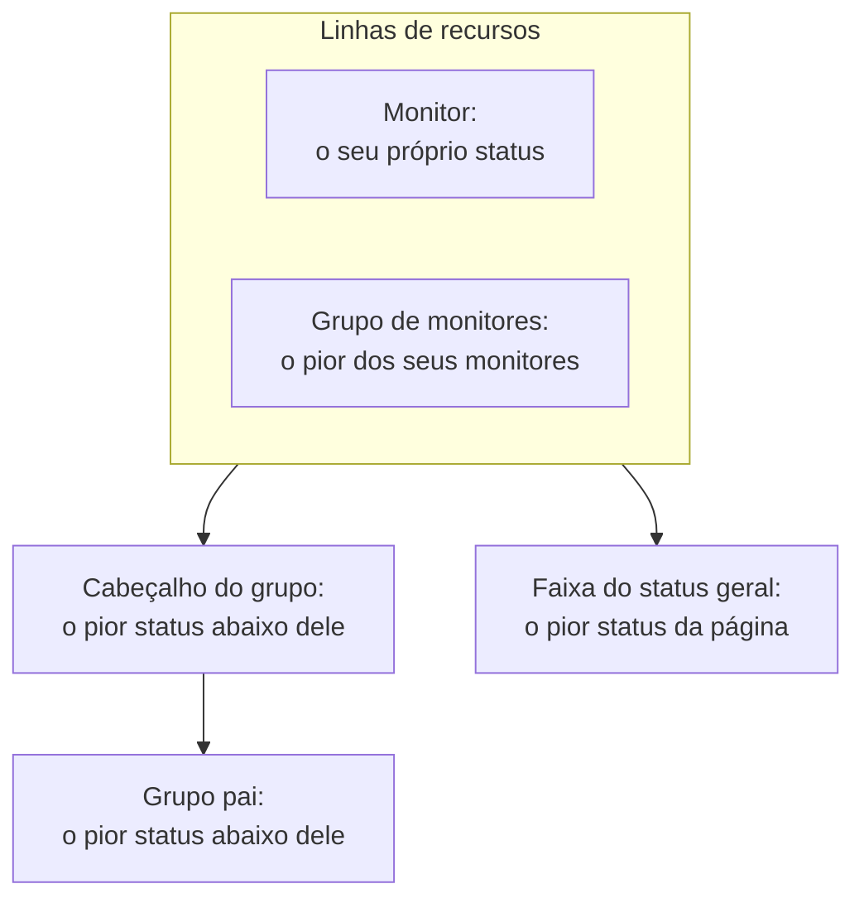

# Recursos e grupos da página de status

Um recurso é uma linha da sua página de status: um monitor ou um grupo de monitores, com um nome que seus clientes entendem, seu status atual e, se você quiser, seu tempo de atividade e seu histórico. Os grupos são seções que contêm recursos, de modo que uma página com quarenta monitores se lê como "API", "Aplicativo web" e "Pipeline de dados" em vez de uma lista sem fim. Você monta os dois em uma única tela: abra uma página de status e escolha **Recursos** no menu lateral dela.

:::cards
- [Adicionar um monitor](#adicionar-um-monitor): Coloque um monitor na página, com o nome que os visitantes leem.
- [Grupos](#grupos): Divida a página em seções e aninhe-as.
- [Regras de monitores](#adicionar-monitores-automaticamente-com-regras-de-monitores): Deixe uma regra adicionar por você cada monitor correspondente.
- [Importar grupos de um CSV](#importar-grupos-de-um-csv): Monte uma hierarquia profunda de uma vez.
:::

Os visitantes decidem "o problema é comigo ou com eles?" olhando estas linhas, então dê a elas os nomes que os clientes usam para falar do seu produto: **Checkout API**, não `prod-checkout-lb-healthcheck-us-east-1`.

## Como um status sobe pela página

Cada linha mostra o status atual do seu monitor. Cada nível acima dela mostra o pior status de tudo o que está abaixo, sendo o pior status aquele com a prioridade mais alta entre os status de monitor do seu projeto.

Um recurso decide mais do que a cor da sua linha:

- **Monitores arquivados não são mostrados.** Um monitor arquivado não é mais verificado, então seu último status fica congelado; a página deixa a linha dele de fora (e o deixa de fora do status de um grupo de monitores) em vez de mostrar esse status congelado como se estivesse atualizado. A linha é mantida, então desarquivar o monitor a traz de volta na hora.
- **Os recursos decidem quais incidentes a página mostra.** Um incidente aparece aqui, e os assinantes da página são avisados dele, quando um dos monitores do incidente é um recurso da página, diretamente ou por meio de um grupo de monitores. Coloque o mesmo monitor em várias páginas e os incidentes dele chegam a todas, a menos que um incidente esteja limitado a algumas delas. Veja [Uma página de status por público](/docs/status-pages/one-status-page-per-audience).
- **A linha de um grupo de monitores representa cada monitor dele, também para os assinantes.** Em uma página que deixa os assinantes escolherem recursos, quem assina um grupo de monitores é avisado sobre incidentes, eventos de manutenção programada e comunicados de qualquer monitor do grupo, como se tivesse escolhido esse monitor. Veja [Assinantes e comunicados](/docs/status-pages/subscribers#deixar-o-assinante-escolher-recursos-e-tipos-de-evento).

## A tela Recursos

O item se chama **Recursos** nos projetos com grupos de monitores ativados, e **Monitores** nos outros; é a mesma tela. Os grupos tinham uma página própria, e o antigo endereço `/groups` agora abre esta tela.

A tela é dividida em duas:

| Parte | O que contém |
| ---- | ------------- |
| **Navegador de grupos** (à esquerda) | Todos os grupos da página, em árvore, com uma caixa **Search groups...** acima e uma contagem abaixo, como `3 groups · 12 resources`. Uma lista longa termina com um botão **Show N more of M**. |
| **Top of page** | A primeira linha do navegador: os recursos sem grupo, que os visitantes veem primeiro, acima de todos os grupos. Em uma página sem grupos, o painel da direita se chama **All resources**. |
| **Painel de recursos** (à direita) | Os recursos do grupo selecionado. Seu cabeçalho contém **Edit Group**, o botão principal **Adicionar monitor** e um menu **More actions**. |
| Cabeçalho do cartão | **New Group** e um menu de três pontos com **Import groups from CSV** e **Atualizar**. |

**Os estados vazios dizem o que fazer.** Um grupo vazio mostra **No monitors here yet** com **Adicionar monitor**, **Add Multiple** e, só enquanto a página não tem nenhum grupo, **Create a Group**. Uma pesquisa sem resultados mostra **No resources match your search**.

## Adicionar um monitor

:::steps
### Escolher onde a linha fica

No navegador de grupos, selecione o grupo a que o recurso pertence, ou **Top of page** para uma linha sem grupo.

### Clicar em Adicionar monitor

A caixa de diálogo **Add a monitor to {group}** se abre. Ela tem uma só página.

### Escolher o monitor

Escolha-o em **Monitor** (texto de exemplo **Selecionar Monitor**). **Nome de exibição**, o texto que os visitantes leem, é preenchido com o nome do monitor e acompanha a troca quando você escolhe outro monitor, até você digitar um nome seu. Ele é armazenado separado do nome do próprio monitor, então renomeá-lo aqui não muda nada no monitoramento.

### Definir as opções de exibição, se quiser

**Mais campos** começa recolhido. Ele contém **Descrição** (markdown opcional mostrado abaixo da linha, bom para uma frase que explique o que o serviço realmente faz; uma imagem nela é mostrada a todos os visitantes) e as [opções de exibição](#opções-de-exibição-de-um-recurso). Deixe-o fechado e o recurso recebe os valores padrão delas.

### Salvar o recurso

Clique em **Adicionar monitor**. A linha aparece no grupo e na página de status.
:::

Em um grupo em grade, a caixa de diálogo também pede a linha e a coluna em que o monitor fica, acima de **Mais campos**; veja [Layout em lista ou em grade](#layout-em-lista-ou-em-grade).

> [!TIP]
> Para mostrar várias verificações como uma única linha, adicione um grupo de monitores. Com a chave **Grupos de monitores** ativada (**Configurações do projeto** > **Avançado** > **Sinalizadores de recursos**, que salva assim que você a aciona), um link abaixo da lista suspensa diz **Add a Monitor Group instead.** Clique nele e **Monitor** vira **Monitor Grupo** (**Selecionar Grupo de Monitores**); **Add a Monitor instead.** volta atrás.

### Adicionar vários de uma vez

**Add Multiple** (também **Add multiple monitors** no menu **More actions**) abre **Add Multiple Monitors**. Ela também tem uma só página: uma seleção múltipla **Monitores**, depois o mesmo **Mais campos** recolhido, cujas opções de exibição valem para cada monitor que você escolher. Cada recurso recebe o nome de exibição e a descrição do seu monitor, e **Add Monitors** adiciona todos. É a forma mais rápida de preencher uma página nova.

A seleção múltipla tem uma aba **Rótulos**: clique em um rótulo e cada monitor que o tem é selecionado de uma vez.

### Adicionar duas vezes pelo rótulo é seguro

Uma página de status lista cada monitor uma só vez. A adição é idempotente, então escolher de novo o mesmo rótulo depois de rotular alguns monitores novos adiciona só os novos: os monitores que já estão na página ficam exatamente como estão, com o nome de exibição e as opções que você deu a eles.

O resumo ao final da adição em lote diz isso: os monitores adicionados aparecem em **Adicionado**, e os que já estavam lá em **Already Added**. Nada é informado como falha, e nada é gravado para eles.

A mesma regra vale em todo lugar onde um recurso é criado. Adicionar pelo formulário de adição individual um monitor que já está na página, ou apontar para ele um recurso existente pelo formulário de edição, é recusado com *"This monitor is already added to this status page"*, inclusive quando o recurso existente está em outro grupo, porque um visitante ainda veria o monitor duas vezes. Para mostrar um monitor em outro grupo, exclua o recurso que ele já tem e adicione-o onde você quiser.

## Opções de exibição de um recurso

A seção **Mais campos** é a mesma no formulário de adição individual e na caixa de diálogo de adição em lote. Ela começa recolhida nos dois, e também em **Editar recurso**, onde seu cabeçalho recolhido mostra o que nela não está no padrão. Tudo aqui vale por recurso: duas linhas do mesmo grupo podem ser configuradas de formas diferentes.

| Campo | Padrão | O que faz |
| ----- | ------- | ------------ |
| **Dica de ferramenta** (`displayTooltip`) | Vazio | Mostrada como dica ao lado do recurso na sua página de status. Use-a para o escopo: "Clientes dos EUA e da UE". |
| **Mostrar status atual do recurso** (`showCurrentStatus`) | Ativado | Mostra o status atual, como operacional, degradado ou offline, ao lado da linha. |
| **Mostrar % de tempo de atividade** (`showUptimePercent`) | Desativado | Mostra uma porcentagem de tempo de atividade ao lado do recurso. |
| **Selecionar Precisão de Disponibilidade** (`uptimePercentPrecision`) | Uma casa decimal | Aparece quando **Mostrar % de tempo de atividade** está ativado, e então é obrigatório. |
| **Mostrar gráfico de histórico de status** (`showStatusHistoryChart`) | Ativado | Mostra as barras diárias do histórico de tempo de atividade do recurso. |

**Nome de exibição** (`displayName`) e **Descrição** (`displayDescription`) também servem só para a exibição: nunca mudam o próprio monitor.

## Porcentagens de tempo de atividade e gráficos de histórico

**Mostrar % de tempo de atividade** e **Mostrar gráfico de histórico de status** leem uma mesma configuração da página inteira: quantos dias eles cobrem. É **Histórico de tempo de atividade** no cartão **O que sua página de status mostra**, em **Páginas de status → sua página → Avançado → Configurações avançadas**. Aceita de 1 a 90 dias, e o padrão é 90. Então ative as chaves recurso por recurso e defina a janela uma única vez para a página toda.

**A precisão é uma questão de bom senso.** **Selecionar Precisão de Disponibilidade** oferece `99% (No Decimal)`, `99.9% (One Decimal)`, `99.99% (Two Decimal)` e `99.999% (Three Decimal)`. Mais casas decimais parecem precisas e convidam a discussões sobre a terceira; se você publica um SLA de três noves, acompanhe-o e não vá além.

Os grupos têm suas próprias cópias dessas chaves (veja abaixo), então um grupo pode mostrar uma porcentagem consolidada enquanto os monitores dentro dele ficam discretos, ou o contrário.

As cores das barras do gráfico de histórico são definidas em **Mais configurações** na página **Marca**, e quais status de monitor contam como "fora do ar" em **Conta como indisponibilidade**, no cartão **O que sua página de status mostra** das **Configurações avançadas**; as duas coisas estão em [Marca e domínios da página de status](/docs/status-pages/branding-and-domains).

## Grupos

A maioria dos grupos só precisa de um nome.

:::steps
### Clicar em New Group

**Create New Status Page Group** se abre: dois campos e, depois, duas seções recolhidas.

### Dar um nome ao grupo

Digite o **Nome do Grupo**: o cabeçalho de seção que os visitantes veem.

### Aninhá-lo, se ele pertence a outro grupo

Escolha um **Parent Group**, ou deixe em **No parent group (top level)**. **Add a sub group** nos menus de um grupo preenche isso para você.

### Criar o grupo

Clique em **Create Status Page Group**. O grupo aparece no navegador, pronto para receber monitores.
:::

Os dois campos são **Nome do Grupo** (`name`) e **Parent Group** (`parentStatusPageGroupId`). As duas seções recolhidas guardam todo o resto:

- **Layout**: seu cabeçalho recolhido diz **List** ou **Grid**. Ela contém **Modo de visualização** e os eixos de uma grade (veja [Layout em lista ou em grade](#layout-em-lista-ou-em-grade)), e se abre sozinha em um grupo em grade.
- **Mais campos**: as cópias, no nível do grupo, das opções dos recursos:
  - **Descrição do Grupo** (`description`): markdown opcional, mostrado abaixo do cabeçalho. Uma imagem nele é mostrada a todos os visitantes.
  - **Expandir na Página de status por padrão** (`isExpandedByDefault`): ativado por padrão; define se a seção começa aberta ou recolhida para os visitantes.
  - **Mostrar status atual do grupo** (`showCurrentStatus`): ativado por padrão. Mostra um status ao lado do cabeçalho do grupo.
  - **Mostrar % de tempo de atividade** (`showUptimePercent`): desativado por padrão, com **Selecionar Precisão de Disponibilidade** quando está ativado.

Para alterar um grupo, use **Edit Group** no cabeçalho do painel, ou **Edit group** no menu da linha do navegador: **Edit Status Page Group** se abre, com um botão **Salvar alterações**. O cabeçalho do painel mostra etiquetas para as configurações ativadas (**Grid**, **Collapsed by default**, **Uptime %**), para você ver como um grupo está configurado sem abrir o formulário.

### Gerenciar um grupo

| Onde | Ações |
| ----- | ------- |
| O menu da linha do navegador | **Edit group**, **Move up**, **Move down**, **Mostrar ID**, **Delete group** |
| O menu **More actions** do painel | **Edit this group**, **Add a sub group**, **Move group up**, **Move group down**, **Show group ID**, **Atualizar**, **Delete this group** |

Um grupo salvo sem nome aparece como **Untitled group**, um bom sinal de que você queria digitar alguma coisa.

## Aninhar grupos

Os grupos se aninham: defina **Parent Group** no grupo filho, ou use **Add a sub group inside this group** no navegador. O texto de ajuda do formulário descreve a forma para a qual ele foi pensado (algo como Unidades corporativas › Região › Mercado), e cada nível mostra o status e o tempo de atividade consolidados de tudo o que está abaixo dele.

Quando um grupo tem filhos, o painel de recursos mostra uma fileira de etiquetas **Sub groups** que leva direto a cada filho, para você percorrer a hierarquia sem voltar ao navegador.

O aninhamento compensa em páginas grandes: um provedor de hospedagem com regiões dentro dos produtos, ou um varejista com mercados dentro das unidades de negócio. Em uma página com doze monitores, um único nível plano é mais amigável.

## Layout em lista ou em grade

A seção **Layout** do formulário do grupo define o **Modo de visualização** (`viewMode`) do grupo, que muda como o grupo aparece na página de status.

| Se você quer… | Escolha |
| --------------- | ---- |
| Mostrar uma lista vertical simples de serviços, um por linha | **List** (o padrão) |
| Mostrar o mesmo serviço em várias regiões ou locatários como uma matriz | **Grid** |

Escolha **Grid** e aparecem mais quatro campos:

| Campo | O que digitar |
| ----- | ------------- |
| **Rótulo do eixo de linhas** | O nome da dimensão das linhas, texto de exemplo `Service`. |
| **Valores do eixo de linhas** | As linhas, adicionadas uma de cada vez com **Add Row** (texto de exemplo `e.g. Auth`). |
| **Rótulo do eixo da coluna** | A dimensão das colunas, texto de exemplo `Region`. |
| **Valores do eixo da coluna** | As colunas, adicionadas com **Add Column** (texto de exemplo `e.g. US-East`). |

Cada monitor de um grupo em grade ocupa uma célula, então **Adicionar monitor** e a caixa de diálogo de adição em lote pedem a linha e a coluna junto com o monitor, usando os seus próprios rótulos de eixo.

> [!IMPORTANT]
> Configure os eixos antes de adicionar monitores. Um grupo em grade sem linhas nem colunas mostra um aviso de que ainda não há onde colocar um monitor, com um botão **Set up the grid** que abre o formulário do grupo na seção **Layout**, e o botão **Adicionar monitor** dele some até você fazer isso.

## Ordenar o que os visitantes veem

A ordem é você quem define, não o alfabeto:

| O quê | Como reordenar |
| ---- | ----------------- |
| Recursos dentro de um grupo | Arraste uma linha. O painel avisa: **Drag a row to change the order visitors see**. |
| Grupos entre si | **Move up** / **Move down** no menu da linha do navegador, ou **Move group up** / **Move group down** em **More actions**. |
| Recursos sem grupo | Ficam em **Top of page** e sempre aparecem acima de todos os grupos, então coloque ali a coisa que todo mundo verifica primeiro. |

**Dois casos em que arrastar fica desativado.** Pesquisar na caixa **Search in {group}...** desativa a reordenação (o painel diz `N of M shown · drag to reorder is off while filtering`), então limpe a pesquisa primeiro. E os grupos em grade nunca se reordenam arrastando, porque o lugar de um monitor vem da sua linha e da sua coluna.

Coloque no topo o serviço sobre o qual mais perguntam. Os visitantes que chegam à página durante uma interrupção costumam parar de ler depois da primeira tela.

## Adicionar monitores automaticamente com regras de monitores

Uma regra de monitores adiciona monitores à página por você: descreva os monitores uma vez, e cada monitor que corresponde vai para o grupo que você escolheu. As regras ficam em **Recursos → Monitor Rules**, ao lado da tela Recursos.

:::steps
### Abrir Monitor Rules

Abra a página de status, escolha **Monitor Rules** na seção **Recursos** do menu lateral dela e clique em **Criar: Status Page Monitor Rule**.

### Dar um nome à regra

Em **Informações básicas**, digite um **Nome**. **Habilitado** vem ativado por padrão.

### Dizer a quais monitores ela corresponde

Em **Critérios de Correspondência**, preencha pelo menos um entre **Rótulos do Monitor** (corresponde um monitor que tenha qualquer um deles), **Nome do Monitor** e **Descrição do Monitor**. Um monitor precisa passar em cada critério que você preencher. Os dois padrões aceitam uma expressão regular sem diferenciar maiúsculas de minúsculas (`^api-.*`) ou um curinga `*` (`*checkout*`); `.*` corresponde a todos os monitores.

### Escolher o grupo

Em **Grupo**, escolha **Add Monitors To Group**, ou deixe vazio para adicionar os monitores sem grupo. Em seguida vêm as mesmas opções de exibição de um recurso; em uma regra, **Mostrar % de tempo de atividade** começa ativado.

### Salvar a regra

A regra é executada na hora contra cada monitor que já existe, e a lista mostra o grupo a que ela adiciona monitores em **Adds Monitors To**.
:::

Depois disso, uma regra é executada de novo para um monitor sempre que um é criado ou quando seus rótulos, seu nome ou sua descrição mudam. Uma regra remove só os recursos que ela adicionou: desativá-la ou excluí-la tira esses recursos da página, e um monitor que você adicionou à mão nunca é tocado. Um monitor que já está na página nunca é adicionado duas vezes.

## Importar grupos de um CSV

Montar uma hierarquia profunda à mão é cansativo. **Import groups from CSV**, no menu de três pontos do cabeçalho do cartão, abre a caixa de diálogo **Import Groups from CSV**.

:::steps
### Baixar o modelo

Clique em **Download CSV Template** para obter `status-page-groups-template.csv`.

### Preenchê-lo

Uma linha por grupo. Só `name` é obrigatório; as colunas estão listadas abaixo.

### Enviar e pré-visualizar

Clique em **Choose CSV File**, escolha o seu arquivo e depois **Preview Import** para conferir o que será criado antes que qualquer coisa seja gravada.

### Importar

Execute a importação. Uma tabela **Import results** lista cada linha como **Criado**, **Falhou** ou **Ignorado**, com o motivo, para que uma linha com problema nunca desapareça em silêncio.
:::

| Coluna | O que define |
| ------ | ------------ |
| `name` | O nome do grupo. Obrigatório. |
| `parentName` | O nome do grupo dentro do qual este fica. |
| `description` | A descrição do grupo. |
| `isExpandedByDefault` | Se a seção começa aberta para os visitantes. |
| `showCurrentStatus` | Se um status aparece ao lado do cabeçalho do grupo. |
| `showUptimePercent` | Se uma porcentagem de tempo de atividade aparece ao lado do grupo. |
| `uptimePercentPrecision` | Quantas casas decimais essa porcentagem usa. |
| `viewMode` | `List` ou `Grid`. |
| `rowAxisLabel` | O nome da dimensão das linhas, para um grupo em grade. |
| `rowAxisValues` | Os valores das linhas, para um grupo em grade. |
| `columnAxisLabel` | O nome da dimensão das colunas, para um grupo em grade. |
| `columnAxisValues` | Os valores das colunas, para um grupo em grade. |

A importação cria grupos, não recursos: depois, adicione os monitores com **Adicionar monitor**, **Add Multiple** ou uma regra de monitores.

## Solução de problemas

:::details "This monitor is already added to this status page"
Uma página lista cada monitor uma só vez, mesmo entre grupos diferentes. O monitor já tem um recurso, talvez em outro grupo ou adicionado por uma regra de monitores. Procure-o no navegador, exclua esse recurso e adicione o monitor onde você quiser.
:::

:::details Um monitor que adicionei não aparece na página de status
Verifique se o monitor está arquivado: a linha de um monitor arquivado fica de fora até você desarquivá-lo. Verifique também o grupo: um grupo configurado para começar recolhido (**Expandir na Página de status por padrão** desativado) esconde suas linhas até um visitante abri-lo.
:::

:::details Não há botão Adicionar monitor em um grupo em grade
A grade ainda não tem linhas nem colunas. Clique em **Set up the grid**, adicione os valores dos eixos na seção **Layout**, e **Adicionar monitor** volta.
:::

:::details Não consigo arrastar as linhas
Limpe a caixa **Search in {group}...**: a reordenação fica desativada enquanto o painel está filtrado. Os grupos em grade nunca se reordenam arrastando.
:::

## Próximos passos

:::cards
- [Marca e domínios da página de status](/docs/status-pages/branding-and-domains): Logotipo, favicon, cores do gráfico de histórico e o seu próprio domínio.
- [Assinantes e comunicados](/docs/status-pages/subscribers): Quem é avisado quando estes recursos mudam.
- [Uma página de status por público](/docs/status-pages/one-status-page-per-audience): O mesmo monitor em várias páginas, e um incidente que chega só a algumas delas.
- [API pública](/docs/status-pages/public-api): Leia recursos, grupos e tempo de atividade como JSON.
:::
