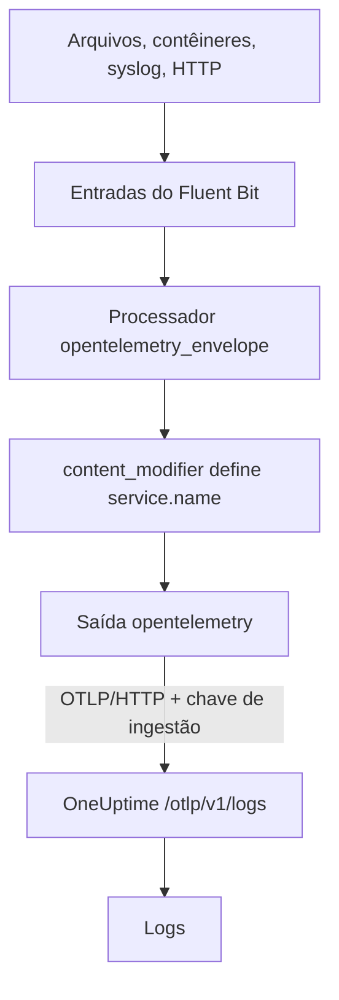

# Fluent Bit

O [Fluent Bit](https://docs.fluentbit.io/manual) é um agente leve que coleta logs de arquivos, systemd, contêineres, syslog, HTTP e muitas outras fontes. A sua [saída OpenTelemetry](https://docs.fluentbit.io/manual/pipeline/outputs/opentelemetry) envia o que ele coleta ao endpoint OpenTelemetry (OTLP) do OneUptime, onde os logs passam a ser pesquisáveis em **Produtos → Registros**.

:::cards
- [Configurar o Fluent Bit](#configurar-o-fluent-bit): Adicione a saída OpenTelemetry e dê nome ao seu serviço.
- [Exemplo completo](#exemplo-completo): Um arquivo de configuração inteiro para começar.
- [OneUptime auto-hospedado](#oneuptime-auto-hospedado): Aponte o Fluent Bit para a sua própria instância.
:::

## Como funciona



O Fluent Bit embrulha cada registro num envelope do OpenTelemetry, para que ele possa levar atributos de recurso como `service.name`. Depois, a saída OpenTelemetry envia os registros ao OneUptime com a sua chave de ingestão no cabeçalho `x-oneuptime-token`. O OneUptime os guarda sob o serviço nomeado por `service.name` e cria esse serviço na primeira vez que ele envia.

## Antes de começar

- **Instalar o Fluent Bit** — veja o [guia de instalação](https://docs.fluentbit.io/manual/installation/getting-started-with-fluent-bit). A configuração desta página usa o formato YAML do Fluent Bit e o processador `opentelemetry_envelope`, então use uma versão atual.
- **Um projeto do OneUptime.** No OneUptime Cloud, a telemetria é cobrada por GB ingerido — veja os [preços](https://oneuptime.com/pricing) — e um projeto no plano Free precisa de um método de pagamento antes de poder enviar telemetria.
- **Uma chave de ingestão de telemetria.** Se você ainda não tem uma:

:::steps
### Abrir as chaves de ingestão

Vá em **Produtos → Configurações do projeto**, abra **Telemetria e APM** no menu lateral e selecione **Chaves de ingestão**.


### Criar uma chave

Clique em **Criar chave de ingestão**. A janela já vem com o nome da chave preenchido e **Servidor** escolhido — o tipo de chave com que uma aplicação ou um collector envia —, então clique em **Criar chave de ingestão** para criá-la, ou renomeie-a antes.

### Copiar o segredo

A nova chave abre na própria página. Copie a **Chave secreta** dela: esse é o `YOUR_TELEMETRY_INGESTION_TOKEN` da configuração abaixo.


:::

## Configurar o Fluent Bit

O Fluent Bit lê a sua configuração YAML de um arquivo como `/etc/fluent-bit/fluent-bit.yaml`.

:::steps
### Adicionar a saída OpenTelemetry

Adicione uma saída `opentelemetry` que envie ao OneUptime. Mantenha a saída `stdout` enquanto testa, se quiser ver os registros localmente:

```yaml title="fluent-bit.yaml"
pipeline:
  outputs:
    - name: stdout
      match: "*"
    - name: opentelemetry
      match: "*"
      host: "oneuptime.com"
      port: 443
      metrics_uri: "/otlp/v1/metrics"
      logs_uri: "/otlp/v1/logs"
      traces_uri: "/otlp/v1/traces"
      tls: On
      header:
        - x-oneuptime-token YOUR_TELEMETRY_INGESTION_TOKEN
```

### Embrulhar os logs num envelope do OpenTelemetry e nomear o serviço

Adicione o processador `opentelemetry_envelope` a cada entrada, seguido de um `content_modifier` que define `service.name`. Troque `YOUR_SERVICE_NAME` pelo nome com que os logs devem aparecer no OneUptime:

```yaml title="fluent-bit.yaml"
pipeline:
  inputs:
    - name: tail # or any other input
      path: /var/log/my-app/*.log

      processors:
        logs:
          - name: opentelemetry_envelope

          - name: content_modifier
            context: otel_resource_attributes
            action: upsert
            key: service.name
            value: YOUR_SERVICE_NAME
```

### Reiniciar o Fluent Bit

Reinicie o serviço do Fluent Bit, ou inicie-o com `fluent-bit -c /etc/fluent-bit/fluent-bit.yaml`. Em poucos segundos os logs aparecem em **Produtos → Registros**, e o serviço aparece em **Produtos → Serviços**.
:::

## Exemplo completo

Esta configuração recebe logs por HTTP na porta `8888` e os encaminha ao OneUptime:

```yaml title="fluent-bit.yaml"
service:
  flush: 1
  log_level: info

pipeline:
  inputs:
    - name: http
      listen: 0.0.0.0
      port: 8888

      processors:
        logs:
          - name: opentelemetry_envelope

          - name: content_modifier
            context: otel_resource_attributes
            action: upsert
            key: service.name
            value: YOUR_SERVICE_NAME

  outputs:
    - name: stdout
      match: "*"
    - name: opentelemetry
      match: "*"
      host: "oneuptime.com"
      port: 443
      metrics_uri: "/otlp/v1/metrics"
      logs_uri: "/otlp/v1/logs"
      traces_uri: "/otlp/v1/traces"
      tls: On
      header:
        - x-oneuptime-token YOUR_TELEMETRY_INGESTION_TOKEN
```

Troque a entrada `http` pelas entradas de que você precisa — por exemplo `tail` para arquivos de log ou `systemd` para o journal — e mantenha os dois processadores em cada uma delas.

## OneUptime auto-hospedado

Defina `host` como o host da sua instância do OneUptime. Se ela for servida por HTTP simples em vez de HTTPS, defina também `port` como a porta em que ela escuta (normalmente `80`) e remova `tls`:

```yaml title="fluent-bit.yaml"
pipeline:
  outputs:
    - name: stdout
      match: "*"
    - name: opentelemetry
      match: "*"
      host: "your-oneuptime-instance.com"
      port: 80
      metrics_uri: "/otlp/v1/metrics"
      logs_uri: "/otlp/v1/logs"
      traces_uri: "/otlp/v1/traces"
      header:
        - x-oneuptime-token YOUR_TELEMETRY_INGESTION_TOKEN
```

## Solução de problemas

:::details O Fluent Bit registra `401` da saída OpenTelemetry
A chave de ingestão está ausente, é desconhecida ou expirou. Confira a linha `header`: é `x-oneuptime-token`, um espaço e depois a **Chave secreta** da chave.
:::

:::details O Fluent Bit registra `402` ou `422`
`402`: no OneUptime Cloud, o projeto está no plano Free e não tem método de pagamento. Adicione um em **Configurações do projeto → Cobrança e faturas → Cobrança**. `422`: a chave está desativada, ou é uma chave de navegador. Ligue de novo **Habilitado** nas configurações da chave, ou crie uma chave **Servidor**.
:::

:::details Os logs chegam a um serviço inesperado
O serviço vem de `service.name`. Verifique se cada entrada tem o processador `opentelemetry_envelope` seguido do `content_modifier` que o define.
:::

:::details Nada chega, e o Fluent Bit registra erros de conexão
Verifique se `tls: On` e `port: 443` estão definidos para um endpoint HTTPS, e se o host que executa o Fluent Bit alcança o seu host do OneUptime nessa porta.
:::

Se tiver dúvidas ou precisar de ajuda com a configuração, escreva para support@oneuptime.com.

## Próximos passos

:::cards
- [Pipelines de registros](/docs/telemetry/log-pipelines): Analise e enriqueça os logs que o Fluent Bit envia.
- [Sintaxe de pesquisa](/docs/telemetry/search-syntax): Encontre os logs no explorador de registros.
- [OpenTelemetry](/docs/telemetry/open-telemetry): Endpoints, chaves e limites para toda a telemetria.
- [Fluentd](/docs/telemetry/fluentd): Use o Fluentd em vez disso.
:::
