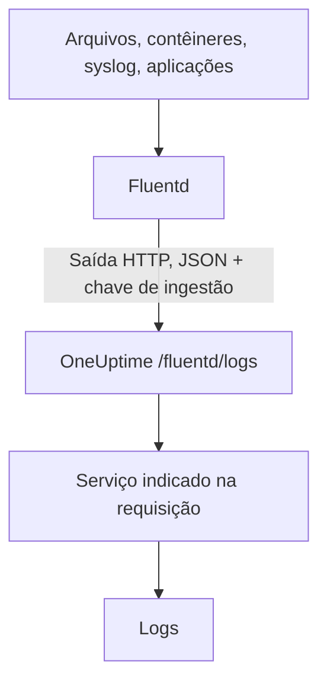

# Fluentd

O [Fluentd](https://www.fluentd.org/) coleta logs de arquivos, contêineres, syslog, aplicações e [muitas outras fontes](https://www.fluentd.org/datasources). A sua [saída HTTP](https://docs.fluentd.org/output/http) embutida os envia ao endpoint Fluentd do OneUptime, onde passam a ser pesquisáveis em **Produtos → Registros**.

:::cards
- [Configurar o Fluentd](#configurar-o-fluentd): Adicione uma saída HTTP que aponte para o OneUptime.
- [Como os registros são lidos](#como-os-registros-são-lidos): Quais campos viram a mensagem, a severidade e os atributos.
- [OneUptime auto-hospedado](#oneuptime-auto-hospedado): Aponte o Fluentd para a sua própria instância.
:::

## Como funciona



O Fluentd envia os registros em lotes como JSON, com a sua chave de ingestão no cabeçalho `x-oneuptime-token` e o nome do serviço em `x-oneuptime-service-name`. O OneUptime transforma cada registro num log desse serviço e cria o serviço na primeira vez que ele envia.

## Antes de começar

- **Instalar o Fluentd** — veja o [guia de instalação](https://docs.fluentd.org/installation).
- **Um projeto do OneUptime.** No OneUptime Cloud, a telemetria é cobrada por GB ingerido — veja os [preços](https://oneuptime.com/pricing) — e um projeto no plano Free precisa de um método de pagamento antes de poder enviar telemetria.
- **Uma chave de ingestão de telemetria.** Se você ainda não tem uma:

:::steps
### Abrir as chaves de ingestão

Vá em **Produtos → Configurações do projeto**, abra **Telemetria e APM** no menu lateral e selecione **Chaves de ingestão**.


### Criar uma chave

Clique em **Criar chave de ingestão**. A janela já vem com o nome da chave preenchido e **Servidor** escolhido — o tipo de chave com que uma aplicação ou um collector envia —, então clique em **Criar chave de ingestão** para criá-la, ou renomeie-a antes.

### Copiar o segredo

A nova chave abre na própria página. Copie a **Chave secreta** dela: esse é o `YOUR_SERVICE_TOKEN` da configuração abaixo.


:::

## Configurar o Fluentd

O arquivo de configuração do Fluentd costuma ser `/etc/fluent/fluentd.conf`, ou `/etc/td-agent/td-agent.conf` no antigo pacote td-agent.

:::steps
### Adicionar uma saída HTTP

Adicione uma seção `<match>` que envie os registros ao OneUptime. Troque `YOUR_SERVICE_TOKEN` pela sua chave de ingestão e `YOUR_SERVICE_NAME` pelo nome com que os logs devem aparecer — qualquer nome que quiser:

```text title="fluentd.conf"
# Match all patterns
<match **>
  @type http

  endpoint https://oneuptime.com/fluentd/logs
  open_timeout 2

  headers {"x-oneuptime-token":"YOUR_SERVICE_TOKEN", "x-oneuptime-service-name":"YOUR_SERVICE_NAME"}

  content_type application/json
  json_array true

  <format>
    @type json
  </format>
  <buffer>
    flush_interval 10s
    chunk_limit_size 900k
  </buffer>
</match>
```

`json_array true` envia cada bloco do buffer como um único array JSON, e `flush_interval 10s` envia o buffer a cada 10 segundos. `chunk_limit_size 900k` mantém cada requisição abaixo de 1 MB, o máximo que o OneUptime aceita neste endpoint.

### Reiniciar o Fluentd

Reinicie o serviço do Fluentd para que ele carregue a nova saída.

### Verificar se os logs chegam

Poucos segundos depois da próxima descarga, os logs aparecem em **Produtos → Registros**. O serviço aparece em **Produtos → Serviços** — se ainda não existia, o OneUptime o cria.
:::

## Exemplo completo

Esta configuração recebe registros pelo protocolo forward do Fluentd na porta `24224` e envia todos ao OneUptime:

```text title="fluentd.conf"
####
## Source descriptions:
##

## built-in TCP input
## @see https://docs.fluentd.org/input/forward
<source>
  @type forward
  port 24224
  bind 0.0.0.0
</source>

<match **>
  @type http

  endpoint https://oneuptime.com/fluentd/logs
  open_timeout 2

  headers {"x-oneuptime-token":"YOUR_SERVICE_TOKEN", "x-oneuptime-service-name":"YOUR_SERVICE_NAME"}

  content_type application/json
  json_array true

  <format>
    @type json
  </format>
  <buffer>
    flush_interval 10s
    chunk_limit_size 900k
  </buffer>
</match>
```

Para enviar fontes diferentes como serviços diferentes, use uma seção `<match>` por tag, cada uma com o seu próprio `x-oneuptime-service-name`.

## Como os registros são lidos

O OneUptime lê estes campos de cada registro:

| Campo do log | Lido do primeiro campo presente entre | Observações |
| --- | --- | --- |
| Corpo | `message`, `log`, `msg`, `body`, `text` | A linha de log. Um registro sem nenhum deles é guardado inteiro, como JSON. |
| Severidade | `level`, `severity`, `loglevel`, `log_level`, `priority`, `severityText`, `severity_text` | Nomes como `trace`, `debug`, `info`, `notice`, `warn`, `error`, `critical` e `fatal`, em maiúsculas ou minúsculas. Qualquer outro valor é guardado como `Unspecified`. |
| ID do trace | `trace_id`, `traceId`, `traceid` | Liga o log ao seu trace. |
| ID do span | `span_id`, `spanId`, `spanid` | Liga o log ao seu span. |
| Serviço | o cabeçalho `x-oneuptime-service-name` | `Fluentd` quando o cabeçalho não está definido. |
| Hora | — | A hora em que o OneUptime recebe o registro. |

Qualquer outro campo vira um atributo chamado `fluentd.` seguido do nome do campo, pelo qual você pode pesquisar e filtrar: um campo `container_name` é `@fluentd.container_name` no explorador de registros. Um objeto aninhado é achatado com pontos, como `fluentd.kubernetes.pod_name`, e uma lista é guardada como JSON.

Os logs do Fluentd passam pelos seus [pipelines de registros](/docs/telemetry/log-pipelines), filtros de descarte e regras de mascaramento como qualquer outro log.

## OneUptime auto-hospedado

Troque `https://oneuptime.com` em `endpoint` pela URL da sua instância do OneUptime: `http(s)://YOUR_ONEUPTIME_HOST/fluentd/logs`.

## Solução de problemas

:::details O Fluentd registra `401` da saída HTTP
A chave de ingestão está ausente, é desconhecida ou expirou. Confira o valor de `x-oneuptime-token` em `headers`.
:::

:::details O Fluentd registra `402` ou `422`
`402`: no OneUptime Cloud, o projeto está no plano Free e não tem método de pagamento. Adicione um em **Configurações do projeto → Cobrança e faturas → Cobrança**. `422`: a chave está desativada, ou é uma chave de navegador. Ligue de novo **Habilitado** nas configurações da chave, ou crie uma chave **Servidor**.
:::

:::details O Fluentd registra `413`
A requisição passa de 1 MB, o máximo que o OneUptime aceita neste endpoint. Defina `chunk_limit_size 900k` na seção `<buffer>`, como na configuração acima.
:::

:::details Os logs chegam ao serviço `Fluentd`
Falta o cabeçalho `x-oneuptime-service-name`. Adicione-o a `headers` em cada seção `<match>`.
:::

:::details O corpo do log mostra o registro inteiro como JSON
O OneUptime pega o corpo do primeiro campo presente entre `message`, `log`, `msg`, `body` ou `text`, e guarda o registro inteiro quando ele não tem nenhum deles. Renomeie o campo que contém a sua linha de log para um desses, por exemplo com o filtro `record_transformer` do Fluentd.
:::

Se tiver dúvidas ou precisar de ajuda com a configuração, escreva para support@oneuptime.com.

## Próximos passos

:::cards
- [Pipelines de registros](/docs/telemetry/log-pipelines): Analise e enriqueça os logs que o Fluentd envia.
- [Sintaxe de pesquisa](/docs/telemetry/search-syntax): Encontre os logs no explorador de registros.
- [Fluent Bit](/docs/telemetry/fluentbit): Um agente mais leve que envia por OpenTelemetry.
- [Monitor de logs](/docs/monitor/logs-monitor): Alerte quando aparecerem logs correspondentes.
:::
