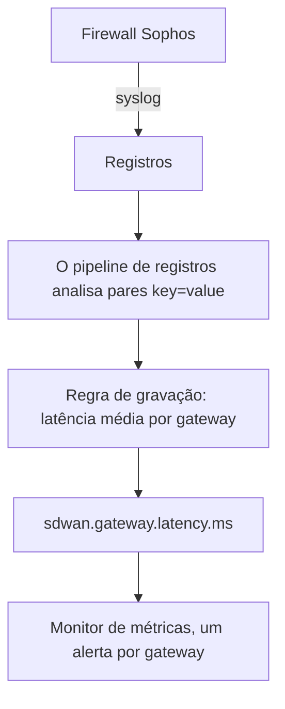

# Regras de gravação de registros

Uma **Log Recording Rule** transforma registros em uma métrica. A cada minuto ela pega os registros que correspondem ao filtro dela e grava um número por minuto no armazenamento de métricas: quantos registros corresponderam, ou a soma, a média, o mínimo, o máximo ou um percentil de um atributo numérico desses registros. Divida o resultado por até cinco atributos de registro e você terá uma série por valor: uma por gateway, por host, por cliente.

:::cards
- [Como uma regra funciona](#como-uma-regra-funciona): Buckets, tempos, recuperação e lacunas.
- [Criar uma regra](#criar-uma-regra): Os campos do editor de regras.
- [Exemplo: latência de gateways SD-WAN](#exemplo-latência-de-gateways-sd-wan-de-um-firewall-sophos): Do syslog de um firewall a um alerta por gateway.
- [Permissões](#permissões): Quem pode criar, alterar e ler regras.
:::

## Visão geral

O resultado é uma métrica comum. Mostre-a no **Explorador de Métricas** e em painéis, e crie alertas sobre ela com um monitor de **Métricas**, inclusive alertas por série com **Agrupar Por**.

Use uma regra de gravação de registros quando o número que interessa só existe nos seus registros: os resumos de SLA de um firewall, um job em lote que registra quanto tempo levou, os tamanhos de resposta de um log de acesso, ou simplesmente quantos registros de erro um serviço grava por minuto.

As regras de gravação de registros ficam em **Registros → Configurações → Regras de gravação**. As equivalentes para métricas e spans ficam em **Métricas → Configurações → Regras de gravação** e **Traços → Configurações → Regras de gravação**.

## Como uma regra funciona

```mermaid title="O que uma regra de gravação de registros faz a cada minuto"
flowchart TB
    logs["Registros que correspondem à regra"] --> bucket["Bucket de um minuto,<br/>pelo timestamp do registro"]
    bucket --> groups["Um grupo por valor de agrupamento"]
    groups --> agg["Contar, ou agregar um atributo numérico"]
    agg --> points["Um ponto de métrica por série"]
    points --> explorer["Explorador de Métricas e painéis"]
    points --> monitor["Monitores de métricas"]
```

- **Um ponto por minuto, por série.** Os registros são agrupados em buckets de 1 minuto pelo timestamp. Cada bucket produz um ponto para cada combinação distinta dos valores dos atributos de agrupamento.
- **Calculado 30 segundos depois que o minuto termina.** A espera curta deixa os registros que chegam um pouco atrasados ainda caírem no minuto certo. Um registro que chega depois disso não é contado.
- **Sem lacunas, sem contagem dupla.** Cada regra lembra o último minuto que gravou (mostrado como **Computed Until** na lista de regras). Depois de um reinício do worker ou de outra parada, ela recupera os minutos perdidos, até 60 minutos para trás, e nunca grava o mesmo minuto duas vezes.
- **Uma contagem sem agrupamento nunca tem lacunas.** Um minuto sem registros correspondentes é gravado como `0`. Qualquer outra regra não grava nada num minuto sem nada para agregar, então gráficos e monitores veem ausência de dados em vez de um zero inventado.
- **Gravado como qualquer outra métrica derivada.** Os pontos são dados do tipo Gauge com o **Nome da métrica de saída** da regra, levam os atributos de agrupamento e `oneuptime.derived.log_rule_id` (o ID da regra) e seguem a mesma retenção dos pontos das regras de gravação de métricas e traces: 15 dias.

Alterar a definição de uma regra vale a partir do próximo minuto que ela grava; os pontos já gravados não são regravados. Desligar uma regra a interrompe; religada, ela recupera os minutos que perdeu enquanto estava desligada, até os mesmos 60 minutos.

## Criar uma regra

:::steps
### Abrir as regras de gravação

Acesse **Registros → Configurações → Regras de gravação** e escolha **Criar: Log Recording Rule**.

### Dar um nome à regra

Digite um **Nome**. O **Nome da métrica de saída** logo abaixo é formado a partir do nome enquanto você digita; escolha **Editar** ao lado para digitar o seu.

### Escolher os registros e o que calcular

Em **Which Logs**, restrinja a regra com serviços de telemetria, gravidades, texto do corpo e filtros de atributo. Escolha uma **Agregação** e, para tudo que não for uma contagem, o **Numeric Attribute** a agregar.

### Dividir o resultado e salvar

Se quiser, adicione atributos em **Agrupar Por** e uma **Unit**. Confira a linha no fim do editor e salve. Em poucos minutos a lista de regras mostra um horário em **Computed Until**.
:::

| Campo | O que faz |
| --- | --- |
| Nome | O que a regra calcula, por exemplo *SD-WAN gateway latency*. |
| Nome da métrica de saída | A métrica que a regra grava. Formado a partir do nome (*SD-WAN gateway latency* grava `sd_wan_gateway_latency`), a menos que você escolha **Editar** e digite o seu. Precisa ser único entre as regras de gravação do projeto. |
| Which Logs | Filtros opcionais, todos combinados com AND: serviços de telemetria, gravidades, texto contido no corpo e filtros de atributo (um atributo igual a um valor). |
| Agregação | `Count of logs`, ou uma agregação de um atributo numérico (veja abaixo). |
| Numeric Attribute | Para toda agregação exceto a contagem: o atributo cujos valores são agregados, por exemplo `latency`. |
| Agrupar Por | Opcional: até 5 chaves de atributo. Uma série por combinação distinta dos valores delas. |
| Unit | Opcional: a unidade da métrica de saída, por exemplo `ms`. Mostrada onde quer que a métrica apareça em gráfico. |
| Descrição | Em **Mais campos**: para que serve a regra. |
| Habilitado | Em **Mais campos**: ligado por padrão. Só as regras habilitadas são calculadas. |

A linha no fim do editor diz o que a regra vai gravar, por exemplo `avg(latency) by gw_name, profile_name`.

Uma regra pode filtrar no máximo 10 atributos e 100 serviços de telemetria.

### Agregações

| Agregação | O ponto de cada minuto |
| --- | --- |
| Count of logs | Quantos registros corresponderam ao filtro. |
| Média | A média dos valores do atributo numérico. |
| Soma | Os valores do atributo somados. |
| Mínimo | O menor valor. |
| Máximo | O maior valor. |
| p50 (median) | O valor mediano. |
| p75 | O percentil 75. |
| p90 | O percentil 90. |
| p95 | O percentil 95. |
| p99 | O percentil 99. |

### Atributos numéricos

O valor do atributo numérico precisa ser um número simples. Ele pode chegar como número (`latency=11` analisado como número) ou como texto (`"11"`, `"11.5"`, `"1e3"`). Um registro cujo valor está ausente ou não é número (`"11ms"`, `"n/a"`, uma string vazia) é **ignorado**. Ele nunca conta como `0`, então um registro malformado não consegue puxar uma média para baixo.

### Chaves de atributo

As chaves dos filtros de atributo correspondem sem diferenciar maiúsculas de minúsculas, como os filtros do explorador de registros. O atributo numérico e as chaves de agrupamento precisam ser escritos exatamente como seus registros os trazem, inclusive qualquer prefixo que um pipeline de registros adicione. Os campos de chave sugerem as chaves que os registros do seu projeto trazem, então escolha da lista em vez de digitar uma chave à mão.

As chaves podem conter letras, dígitos e `. _ : / -`.

### Agrupamento e o limite de séries

Cada chave de agrupamento multiplica o número de séries que uma regra grava, então agrupe por atributos que identificam algo que você quer ver ou monitorar separadamente (um gateway, um host, um cliente), e não por atributos diferentes em cada registro, como um ID de requisição ou o endereço IP de um cliente.

Uma regra grava no máximo 1.000 séries por minuto. Acima disso, as séries com mais registros correspondentes são mantidas e o resto daquele minuto é descartado. Um registro que não traz um dos atributos de agrupamento ainda conta; a série dele é gravada sem esse atributo.

## Exemplo: latência de gateways SD-WAN de um firewall Sophos

Um firewall Sophos XGS com o log de SD-WAN ligado envia a cada poucos minutos um resumo de SLA por perfil de SD-WAN e por gateway:

```text
log_type="SD-WAN" log_component="SLA" profile_name="Branch-Internet" gw_name="WAN2" latency=11 jitter=2 packet_loss=0 gw_status="up" sla_status="SLA met"
```

Este exemplo transforma esses resumos em uma métrica de latência por gateway e alerta quando a latência de um gateway continua alta.



:::steps
### Trazer os registros, com os campos como atributos

1. Envie o syslog do firewall ao OneUptime: veja [Syslog](/docs/telemetry/syslog).
2. Em **Registros → Configurações → Pipelines**, adicione um pipeline com um processador que divide os pares `key=value` do corpo em atributos do registro, para que cada resumo traga `log_type`, `log_component`, `profile_name`, `gw_name`, `latency`, `jitter` e `packet_loss` como atributos. O [Key=Value Parser](/docs/telemetry/log-pipelines#keyvalue-parser) faz isso.
3. Abra o explorador de **Registros** e confira os nomes dos atributos em um registro de SLA. Se o seu pipeline adiciona um prefixo, use os nomes com prefixo abaixo.

### Criar a regra de gravação

Em **Registros → Configurações → Regras de gravação**, crie uma regra:

- **Nome:** SD-WAN gateway latency
- **Nome da métrica de saída:** escolha **Editar** e digite `sdwan.gateway.latency.ms`
- **Which Logs:** filtros de atributo `log_type` = `SD-WAN` e `log_component` = `SLA`
- **Agregação:** Média, **Numeric Attribute:** `latency`
- **Agrupar Por:** `gw_name` e `profile_name`
- **Unit:** `ms`

Pela API, pelo MCP ou pelo Terraform, a **definição** da mesma regra é:

```json
{
  "filter": {
    "attributeFilters": [
      { "key": "log_type", "value": "SD-WAN" },
      { "key": "log_component", "value": "SLA" }
    ]
  },
  "aggregationType": "Avg",
  "valueAttribute": "latency",
  "groupByAttributes": ["gw_name", "profile_name"],
  "unit": "ms"
}
```

Repita com `jitter` (`sdwan.gateway.jitter.ms`, unidade `ms`) e `packet_loss` (`sdwan.gateway.packet_loss.percent`, unidade `%`) para as outras duas medições de SLA. Uma regra **Count of logs** filtrada por `gw_status` = `down` e agrupada por `gw_name` conta os avisos de gateway fora do ar por gateway.

Em poucos minutos a lista de regras mostra um horário em **Computed Until**, e `sdwan.gateway.latency.ms` aparece no Explorador de Métricas: escolha-a, agrupe por `gw_name` e você terá uma linha de latência por gateway.

### Alertar quando a latência de um gateway continua alta

Crie um monitor de **Métricas** (veja [Monitor de métricas](/docs/monitor/metrics-monitor)):

1. **Consulta de métrica:** `sdwan.gateway.latency.ms`, agregação **Média**, **Agrupar Por** `gw_name` e `profile_name`.
2. **Janela de tempo móvel:** Past 15 Minutes. O firewall informa a cada poucos minutos, então a janela contém vários pontos por gateway.
3. **Estratégia de agregação:** **All Values**: todos os pontos da janela precisam ultrapassar o limite, para que um único resumo lento não acione ninguém. Use **Média** em vez disso para alertar sobre uma média alta.
4. **Critérios:** Metric value **Greater Than** `150` abre um alerta.
5. Se quiser, use os valores de agrupamento no título do alerta, por exemplo `SD-WAN latency high on {{gw_name}} ({{profile_name}})`.

Com o agrupamento definido, cada gateway é uma série própria: se o WAN2 ficar lento, abre-se um alerta só para o WAN2, que se resolve sozinho quando o WAN2 se recupera. Veja [Alertas por série](/docs/monitor/metrics-monitor#alertas-por-série-group-by).
:::

## Bom saber

- **Os timestamps vêm dos registros.** Um registro cai no minuto do próprio timestamp. Um dispositivo cujo relógio está errado em mais do que um pouco coloca os registros no minuto errado, ou totalmente fora da janela.
- **Sem cálculo retroativo.** Uma regra nova começa pelo minuto anterior à primeira execução; registros mais antigos não são calculados.
- **Excluir uma regra** a interrompe. Os pontos que ela já gravou ficam até expirar.
- **As regras de gravação veem todos os registros do projeto.** Quem pode ler a métrica de saída vê números calculados a partir de todo registro que corresponde ao filtro da regra, então criar e editar regras de gravação de registros é restrito a proprietários e administradores do projeto e às permissões **Create / Edit Log Recording Rule**.

## Permissões

| Permissão | Permite |
| --- | --- |
| Create Log Recording Rule | Criar regras. |
| Edit Log Recording Rule | Alterar regras e desligá-las. |
| Delete Log Recording Rule | Excluir regras. |
| Read Log Recording Rule | Ver as regras e o que elas calculam. |

Proprietários e administradores do projeto podem fazer tudo isso. Membros do projeto, visualizadores e os papéis de telemetria podem ler as regras.

## Próximos passos

:::cards
- [Monitor de métricas](/docs/monitor/metrics-monitor): Alertar sobre as métricas que suas regras gravam.
- [Pipelines de registros](/docs/telemetry/log-pipelines): Extrair os atributos que uma regra agrega.
- [Syslog](/docs/telemetry/syslog): Enviar ao OneUptime os registros de firewalls e servidores.
:::
