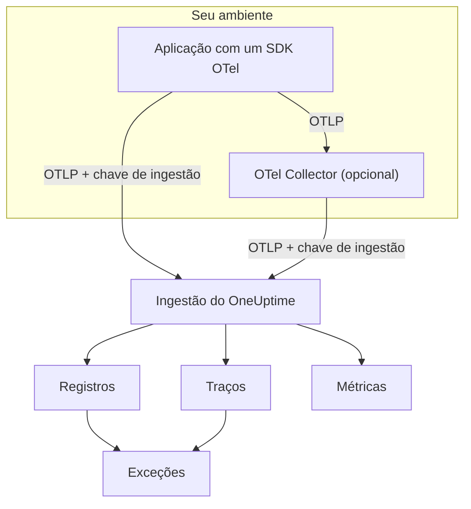

# OpenTelemetry

O OneUptime ingere logs, métricas e traces pelo OpenTelemetry Protocol (OTLP). Aponte qualquer SDK do OpenTelemetry, ou um OpenTelemetry Collector, para o OneUptime com uma chave de ingestão, e seus dados aparecem em **Registros**, **Traços**, **Métricas** e **Exceções**. Esta página faz um serviço começar a enviar dados em poucos minutos e depois cobre os endpoints, limites e erros de que você precisa em produção.

:::cards
- [Início rápido](#início-rápido): Criar uma chave, definir quatro variáveis de ambiente e adicionar o SDK.
- [Usar um Collector](#enviar-por-meio-de-um-opentelemetry-collector): Adicionar o OneUptime como exportador a um collector que você já usa.
- [Endpoints e limites](#endpoints-e-limites): URLs, portas, codificações, limites de tamanho e códigos de status.
- [Solução de problemas](#solução-de-problemas): O que verificar quando nenhum dado chega.
:::

## Como funciona

Sua aplicação exporta OTLP diretamente para o OneUptime, ou para um OpenTelemetry Collector que o encaminha. Toda requisição leva sua chave de ingestão no cabeçalho `x-oneuptime-token`, e o OneUptime usa a chave para encontrar seu projeto.



- **Os serviços são criados para você.** O atributo de recurso `service.name` (definido com `OTEL_SERVICE_NAME`) dá nome ao serviço a que seus dados pertencem. O OneUptime cria o serviço na primeira vez que ele envia e o lista em **Produtos → Serviços**.
- **Erros viram exceções.** Eventos de exceção em spans e exceções registradas em logs são agrupados em problemas em **Exceções** — veja [Exceções a partir de logs](#exceções-a-partir-de-logs).

## Antes de começar

- Um projeto do OneUptime em que você possa criar chaves de ingestão: os proprietários e administradores do projeto podem, assim como qualquer pessoa com a permissão **Create Telemetry Ingestion Key**.
- Uma aplicação à qual você possa adicionar um SDK do OpenTelemetry, ou um OpenTelemetry Collector.
- HTTPS de saída (porta 443) da sua aplicação ou do collector para `oneuptime.com`, ou para o seu próprio host do OneUptime.

> [!NOTE]
> No OneUptime Cloud, a telemetria é cobrada por GB ingerido. Um projeto no plano Free precisa de um método de pagamento antes de poder enviar telemetria — a janela que cria a chave mostra os preços.

## Início rápido

:::steps
### Criar uma chave de ingestão

1. Vá em **Produtos → Configurações do projeto**.
2. No menu lateral, abra **Telemetria e APM** e selecione **Chaves de ingestão**.
3. Clique em **Criar chave de ingestão**. A janela preenche um nome e escolhe o tipo de chave **Servidor**, que é o usado por uma aplicação ou um collector para enviar. Renomeie se quiser e clique em **Criar chave de ingestão**.


A nova chave abre na própria página. Copie a **Chave secreta** dela — esse é o token que você envia como `x-oneuptime-token`.


### Definir as variáveis de ambiente do OpenTelemetry

Todo SDK do OpenTelemetry lê as mesmas variáveis de ambiente padrão, então esta etapa é igual em qualquer linguagem.

| Variável de ambiente | Valor | O que faz |
| --- | --- | --- |
| `OTEL_EXPORTER_OTLP_ENDPOINT` | `https://oneuptime.com/otlp` | Para onde enviar. O SDK acrescenta `/v1/traces`, `/v1/metrics` e `/v1/logs` sozinho. |
| `OTEL_EXPORTER_OTLP_HEADERS` | `x-oneuptime-token=YOUR_ONEUPTIME_INGESTION_KEY` | Envia sua chave de ingestão em toda requisição. |
| `OTEL_EXPORTER_OTLP_PROTOCOL` | `http/protobuf` | OTLP sobre HTTP. Alguns SDKs usam gRPC por padrão, que usa outro endpoint. |
| `OTEL_SERVICE_NAME` | `my-service` | O serviço sob o qual seus dados aparecem no OneUptime. |

```bash
export OTEL_EXPORTER_OTLP_ENDPOINT="https://oneuptime.com/otlp"
export OTEL_EXPORTER_OTLP_HEADERS="x-oneuptime-token=YOUR_ONEUPTIME_INGESTION_KEY"
export OTEL_EXPORTER_OTLP_PROTOCOL="http/protobuf"
export OTEL_SERVICE_NAME="my-service"
```

Auto-hospedado? Substitua `https://oneuptime.com` pela URL da sua instância do OneUptime, por exemplo `https://oneuptime.example.com/otlp`. Para marcar as exceções com um ambiente, defina também `OTEL_RESOURCE_ATTRIBUTES` como `deployment.environment=production`.

### Adicionar o OpenTelemetry à sua aplicação

Escolha sua linguagem. Cada configuração lê as variáveis de ambiente acima, então nenhum endpoint ou chave aparece no seu código.

:::tabs
@tab Node.js
Instale o SDK, as instrumentações automáticas e os exportadores OTLP/HTTP:

```bash
npm install @opentelemetry/sdk-node @opentelemetry/auto-instrumentations-node \
  @opentelemetry/exporter-trace-otlp-proto @opentelemetry/exporter-metrics-otlp-proto \
  @opentelemetry/exporter-logs-otlp-proto @opentelemetry/sdk-metrics @opentelemetry/sdk-logs
```

Crie o SDK em um arquivo próprio:

```javascript title="instrumentation.js"
const { NodeSDK } = require("@opentelemetry/sdk-node");
const { getNodeAutoInstrumentations } = require("@opentelemetry/auto-instrumentations-node");
const { OTLPTraceExporter } = require("@opentelemetry/exporter-trace-otlp-proto");
const { OTLPMetricExporter } = require("@opentelemetry/exporter-metrics-otlp-proto");
const { OTLPLogExporter } = require("@opentelemetry/exporter-logs-otlp-proto");
const { PeriodicExportingMetricReader } = require("@opentelemetry/sdk-metrics");
const { BatchLogRecordProcessor } = require("@opentelemetry/sdk-logs");

// The exporters read OTEL_EXPORTER_OTLP_ENDPOINT and OTEL_EXPORTER_OTLP_HEADERS.
const sdk = new NodeSDK({
  traceExporter: new OTLPTraceExporter(),
  metricReader: new PeriodicExportingMetricReader({
    exporter: new OTLPMetricExporter(),
  }),
  logRecordProcessors: [new BatchLogRecordProcessor(new OTLPLogExporter())],
  instrumentations: [getNodeAutoInstrumentations()],
});

sdk.start();
```

Carregue-o antes do código da sua aplicação:

```bash
node --require ./instrumentation.js app.js
```
@tab Python
Instale a distribuição do OpenTelemetry e o exportador, depois as instrumentações das bibliotecas que sua aplicação usa:

```bash
pip install opentelemetry-distro opentelemetry-exporter-otlp
opentelemetry-bootstrap -a install
```

Inicie sua aplicação por meio de `opentelemetry-instrument`. Ele exporta traces, métricas e logs; a variável de logging também envia os registros escritos com o módulo `logging` do Python:

```bash
OTEL_PYTHON_LOGGING_AUTO_INSTRUMENTATION_ENABLED=true opentelemetry-instrument python app.py
```
@tab Go
Adicione o SDK e os exportadores OTLP/HTTP:

```bash
go get go.opentelemetry.io/otel go.opentelemetry.io/otel/sdk go.opentelemetry.io/otel/sdk/metric \
  go.opentelemetry.io/otel/exporters/otlp/otlptrace/otlptracehttp \
  go.opentelemetry.io/otel/exporters/otlp/otlpmetric/otlpmetrichttp
```

Crie os provedores de tracer e de meter quando o programa iniciar:

```go title="main.go"
package main

import (
	"context"
	"log"

	"go.opentelemetry.io/otel"
	"go.opentelemetry.io/otel/exporters/otlp/otlpmetric/otlpmetrichttp"
	"go.opentelemetry.io/otel/exporters/otlp/otlptrace/otlptracehttp"
	sdkmetric "go.opentelemetry.io/otel/sdk/metric"
	sdktrace "go.opentelemetry.io/otel/sdk/trace"
)

func main() {
	ctx := context.Background()

	// Both exporters read OTEL_EXPORTER_OTLP_ENDPOINT and OTEL_EXPORTER_OTLP_HEADERS.
	traceExporter, err := otlptracehttp.New(ctx)
	if err != nil {
		log.Fatal(err)
	}
	tracerProvider := sdktrace.NewTracerProvider(sdktrace.WithBatcher(traceExporter))
	defer tracerProvider.Shutdown(ctx)
	otel.SetTracerProvider(tracerProvider)

	metricExporter, err := otlpmetrichttp.New(ctx)
	if err != nil {
		log.Fatal(err)
	}
	meterProvider := sdkmetric.NewMeterProvider(
		sdkmetric.WithReader(sdkmetric.NewPeriodicReader(metricExporter)),
	)
	defer meterProvider.Shutdown(ctx)
	otel.SetMeterProvider(meterProvider)

	// Your application code.
}
```

Os provedores pegam `OTEL_SERVICE_NAME` do ambiente. Para logs, adicione `otlploghttp` com uma ponte de log como `otelslog`; ela lê as mesmas variáveis.
@tab Java
Baixe o agente Java do OpenTelemetry e anexe-o à sua aplicação. Não é preciso alterar o código:

```bash
curl -L -O https://github.com/open-telemetry/opentelemetry-java-instrumentation/releases/latest/download/opentelemetry-javaagent.jar
java -javaagent:opentelemetry-javaagent.jar -jar my-app.jar
```

O agente instrumenta frameworks e bibliotecas comuns e exporta traces, métricas e logs escritos por meio do Logback ou do Log4j.
@tab .NET
Adicione os pacotes do OpenTelemetry para ASP.NET Core:

```bash
dotnet add package OpenTelemetry.Extensions.Hosting
dotnet add package OpenTelemetry.Exporter.OpenTelemetryProtocol
dotnet add package OpenTelemetry.Instrumentation.AspNetCore
dotnet add package OpenTelemetry.Instrumentation.Http
```

Registre o OpenTelemetry na inicialização. `UseOtlpExporter()` envia traces, métricas e logs, e lê as variáveis `OTEL_EXPORTER_OTLP_*`:

```csharp title="Program.cs"
using OpenTelemetry;
using OpenTelemetry.Metrics;
using OpenTelemetry.Trace;

var builder = WebApplication.CreateBuilder(args);

builder.Services.AddOpenTelemetry()
    .WithTracing(tracing => tracing
        .AddAspNetCoreInstrumentation()
        .AddHttpClientInstrumentation())
    .WithMetrics(metrics => metrics
        .AddAspNetCoreInstrumentation()
        .AddHttpClientInstrumentation())
    .WithLogging()
    .UseOtlpExporter();

var app = builder.Build();
app.Run();
```

Usa Serilog? Veja [Serilog](/docs/telemetry/serilog) para enviar os logs dele ao OneUptime.
:::

### Verificar se os dados chegam

Pergunte ao OneUptime se ele aceita sua chave:

```bash
curl -i -H "x-oneuptime-token: YOUR_ONEUPTIME_INGESTION_KEY" \
  https://oneuptime.com/otlp/v1/validate
```

Uma chave que funciona retorna `200` com `"valid": true`. Qualquer outra coisa retorna `401` com uma mensagem dizendo o que está errado — desconhecida, desativada ou expirada.

Depois execute sua aplicação e use-a por um minuto. Abra **Produtos → Serviços**: seu serviço aparece com o nome definido em `OTEL_SERVICE_NAME`, com seus logs, traces, métricas e exceções. **Produtos → Registros**, **Produtos → Traços** e **Produtos → Métricas** mostram os mesmos dados de todos os serviços.
:::

:::details Enviar um log de teste sem SDK
O OTLP/HTTP também aceita JSON, então você pode enviar um log com `curl`. O valor `9` de `severityNumber` faz dele um log informativo:

```bash
curl -i https://oneuptime.com/otlp/v1/logs \
  -H "Content-Type: application/json" \
  -H "x-oneuptime-token: YOUR_ONEUPTIME_INGESTION_KEY" \
  -d '{
    "resourceLogs": [{
      "resource": {
        "attributes": [
          { "key": "service.name", "value": { "stringValue": "my-service" } }
        ]
      },
      "scopeLogs": [{
        "logRecords": [{
          "severityNumber": 9,
          "body": { "stringValue": "Hello from curl" }
        }]
      }]
    }]
  }'
```

Um `200` significa que o log foi aceito. Ele aparece em **Produtos → Registros** em poucos segundos, no serviço `my-service`.
:::

## Enviar por meio de um OpenTelemetry Collector

Use um collector quando você já tiver um, quando quiser agrupar, filtrar ou enriquecer dados em um só lugar, ou para manter a chave de ingestão fora das suas aplicações. Suas aplicações exportam para o collector, e só o collector fala com o OneUptime.

:::steps
### Adicionar o OneUptime como exportador

Adicione um exportador `otlphttp` que aponte para o OneUptime e passe todos os pipelines por ele:

```yaml title="otel-collector-config.yaml"
receivers:
  otlp:
    protocols:
      grpc:
        endpoint: 0.0.0.0:4317
      http:
        endpoint: 0.0.0.0:4318

processors:
  batch: {}

exporters:
  otlphttp:
    endpoint: https://oneuptime.com/otlp
    headers:
      x-oneuptime-token: YOUR_ONEUPTIME_INGESTION_KEY

service:
  pipelines:
    traces:
      receivers: [otlp]
      processors: [batch]
      exporters: [otlphttp]
    metrics:
      receivers: [otlp]
      processors: [batch]
      exporters: [otlphttp]
    logs:
      receivers: [otlp]
      processors: [batch]
      exporters: [otlphttp]
```

Mantenha os padrões do exportador: ele envia protobuf, comprimido com gzip, e o OneUptime aceita os dois. Não defina um cabeçalho `Content-Type` no exportador — o OneUptime escolhe o decodificador por esse cabeçalho, então um tipo de conteúdo JSON na frente de bytes protobuf quebra a ingestão.

### Executar o collector

:::tabs
@tab Docker
```bash
docker run -d --name otel-collector \
  -p 4317:4317 -p 4318:4318 \
  -v "$(pwd)/otel-collector-config.yaml:/etc/otelcol-contrib/config.yaml" \
  otel/opentelemetry-collector-contrib:latest
```
@tab Linux
```bash
otelcol-contrib --config otel-collector-config.yaml
```
:::

O collector escuta OTLP na porta `4317` (gRPC) e `4318` (HTTP), as portas para as quais os SDKs enviam por padrão.

### Apontar suas aplicações para o collector

Nas suas aplicações, defina `OTEL_EXPORTER_OTLP_ENDPOINT` para o collector, por exemplo `http://localhost:4318`, e remova `OTEL_EXPORTER_OTLP_HEADERS` — o collector adiciona a chave. Mantenha `OTEL_SERVICE_NAME` em cada aplicação.

Os dados chegam ao OneUptime exatamente como no início rápido. Se não chegarem, o próprio log do collector diz por quê — veja [Solução de problemas](#solução-de-problemas).
:::

Já exporta para outro fornecedor? Adicione o exportador `otlphttp` ao lado do existente e liste os dois em `exporters` de cada pipeline para enviar aos dois enquanto compara. Para coletar também métricas do host e arquivos de log, veja o guia [Host OpenTelemetry Collector](/docs/telemetry/host-otel-collector).

## Endpoints e limites

| Configuração | OTLP/HTTP (recomendado) | OTLP/gRPC |
| --- | --- | --- |
| Endpoint | `https://oneuptime.com/otlp` | `https://oneuptime.com:443` |
| Autenticação | Cabeçalho `x-oneuptime-token` | Metadado `x-oneuptime-token` |
| Codificação | Protobuf (`application/x-protobuf`) ou JSON (`application/json`) | Protobuf |
| Compressão | Nenhuma, `gzip`, `deflate` ou `zstd` | Nenhuma ou `gzip` |
| Tamanho da requisição | Até 4 MB por requisição em `/otlp` | Até 4 MB por mensagem |

Por HTTP, cada sinal tem o próprio caminho sob o endpoint. Os SDKs e o collector o acrescentam para você; defina-o você mesmo só quando uma ferramenta pedir uma URL completa.

| Sinal | URL do OTLP/HTTP |
| --- | --- |
| Traces | `https://oneuptime.com/otlp/v1/traces` |
| Métricas | `https://oneuptime.com/otlp/v1/metrics` |
| Logs | `https://oneuptime.com/otlp/v1/logs` |
| Perfis | `https://oneuptime.com/otlp/v1/profiles` |

Para o profiling contínuo, a maioria dos profilers envia para o endpoint compatível com o Pyroscope — veja [Profiling contínuo](/docs/telemetry/profiles). Um collector que exporta perfis OTLP precisa definir o `profiles_endpoint` do exportador como `https://oneuptime.com/otlp/v1/profiles`, porque por padrão ele envia perfis para um caminho de desenvolvimento que o OneUptime não atende.

### OTLP sobre gRPC

O OneUptime atende OTLP/gRPC no mesmo host da aplicação web, na porta 443 com TLS. Defina `OTEL_EXPORTER_OTLP_PROTOCOL` como `grpc` e `OTEL_EXPORTER_OTLP_ENDPOINT` como `https://oneuptime.com:443`, e envie o mesmo cabeçalho `x-oneuptime-token`. Em um collector, use o exportador `otlp` com `endpoint: oneuptime.com:443` e os mesmos `headers`.

Em uma instalação auto-hospedada, o gRPC só chega ao OneUptime por HTTPS: uma conexão HTTP em texto puro (h2c) é recusada. Se a sua instância é servida por HTTP simples, use OTLP/HTTP.

Duas configurações de uma chave valem só para OTLP/HTTP: o **Requests Per Minute Limit** e o **Pinned Service Name**. Dados enviados por gRPC mantêm o `service.name` com que foram enviados e não contam para o limite.

### Respostas

O OneUptime responde a uma exportação assim que os dados entram na fila, e os dados aparecem alguns segundos depois.

| Resposta | Status gRPC | Significado | O que fazer |
| --- | --- | --- | --- |
| `200` | `OK` | Aceito. | Nada. |
| `401` | `UNAUTHENTICATED` | A chave está ausente, é desconhecida ou expirou. | Confira o valor de `x-oneuptime-token` com a **Chave secreta** da chave. |
| `402` | `PERMISSION_DENIED` | Só no OneUptime Cloud: o projeto está no plano Free e não tem método de pagamento. | Adicione um em **Configurações do projeto → Cobrança e faturas → Cobrança**. |
| `413` | — | A requisição é maior que o limite de tamanho. | Envie lotes menores. |
| `415` | — | `Content-Encoding` não suportado. | Use `gzip`, `deflate` ou `zstd`, ou nenhuma compressão. |
| `422` | `PERMISSION_DENIED` | A chave está desativada, ou é uma chave de navegador usada fora das origens permitidas. | Reative a chave, ou envie com uma chave de servidor. |
| `429` | — | O **Requests Per Minute Limit** da chave foi atingido. | Nada no início: os exportadores tentam de novo depois do tempo de `Retry-After`. Aumente o limite se continuar acontecendo. |
| `503` | `UNAVAILABLE` | O OneUptime está iniciando, ou a fila de ingestão está indisponível. | Nada: os exportadores OTLP repetem um `503` sozinhos. |

`401`, `402`, `413`, `415` e `422` são erros permanentes para os exportadores OTLP: o exportador descarta o lote e registra o erro em vez de tentar de novo.

### Reinícios e atualizações

Enquanto o OneUptime reinicia ou é atualizado, ele responde às exportações com `503` e `Retry-After: 5` até ficar pronto, e os exportadores as enviam de novo. O exportador de um collector continua tentando por cinco minutos por padrão (`retry_on_failure`) e guarda na sua `sending_queue` o que não conseguiu enviar, então deixe os dois ativados. O tempo em que o OneUptime não estava recebendo nunca é contado contra seus servidores, hosts ou outros recursos: veja [Quando o OneUptime não está recebendo dados](/docs/monitor/when-oneuptime-is-not-receiving#na-inicialização).

### Chaves de ingestão

A página de cada chave, em **Configurações do projeto → Telemetria e APM → Chaves de ingestão**, tem estas configurações:

| Configuração | O que faz |
| --- | --- |
| **Tipo de chave** | **Servidor** (o padrão) para aplicações, collectors e agentes. **Browser** para chaves que vão numa página web: só de escrita, e aceitas apenas das suas **Allowed Origins**. Não pode ser alterado depois que a chave é criada. |
| **Allowed Origins** | As origens web de onde uma chave de navegador funciona, como `https://app.example.com`. Ignorado numa chave de servidor. |
| **Pinned Service Name** | Quando definido, substitui `service.name` em tudo o que é enviado com esta chave por OTLP/HTTP. |
| **Habilitado** | Desligue para parar na hora de aceitar dados enviados com a chave, sem excluí-la. |
| **Expira em** | Depois dessa data a chave é recusada. Vazio significa que ela nunca expira. |
| **Requests Per Minute Limit** | O máximo de requisições OTLP/HTTP por minuto aceitas com a chave, somando todos os clientes que a usam. Vazio significa sem limite numa chave de servidor, e 6.000 numa chave de navegador. |
| **Last Used At** | Quando dados foram aceitos pela última vez com a chave. Use para encontrar chaves que podem ser trocadas ou excluídas com segurança. |

**Redefinir chave secreta** na página da chave substitui o segredo. Toda aplicação e todo collector que envia com o antigo é recusado até você atualizá-lo.

## OneUptime auto-hospedado

Tudo nesta página funciona da mesma forma na sua própria instalação. Use a URL do seu OneUptime onde esta página diz `https://oneuptime.com`:

- `OTEL_EXPORTER_OTLP_ENDPOINT` é `https://YOUR-ONEUPTIME-HOST/otlp`, ou `http://YOUR-ONEUPTIME-HOST/otlp` se você serve o OneUptime por HTTP simples.
- O ingress incluído aceita requisições de até 4 MB em `/otlp`. Um proxy que você coloque na frente do OneUptime pode ter um limite menor — o ingress-nginx define `proxy-body-size` como 1 MB por padrão —, então aumente-o também para `/otlp`, ou os exportadores recebem `413`.
- Se `DISABLE_TELEMETRY_INGESTION=true` estiver definido, o OneUptime aceita toda exportação e não armazena nada. Verifique isso primeiro quando uma instância auto-hospedada não mostra nenhum dado.

## Exceções a partir de logs

O OneUptime encontra exceções dentro dos seus **logs** e as reúne na mesma visualização **Exceções** alimentada pelos erros de traces. Cada log já pertence a um serviço ou host, então a exceção é atribuída a ele. Exceções de logs e de traces compartilham o agrupamento por impressão digital, de modo que um erro relatado tanto por um trace quanto por um log vira um único problema.

Há duas maneiras de um log virar uma exceção:

| Detecção | Logs a que se aplica | Como funciona |
| --- | --- | --- |
| **Atributos de exceção** (recomendado) | Qualquer log | Um registro de log com o atributo do OpenTelemetry `exception.type`, `exception.message` ou `exception.stacktrace` vira uma exceção diretamente. A maioria das integrações de logging os define quando você registra uma exceção: appenders do Logback e do Log4j, o Serilog, a instrumentação de logging do Python. É preciso e funciona em qualquer linguagem. |
| **Stack trace no corpo** | Logs de erro e fatais que não têm ID de trace e ID de span | O OneUptime examina os primeiros 16 KB do corpo em busca de um stack trace de JavaScript, Python, Java, Go, Ruby, C#/.NET ou PHP, e extrai dele o tipo, a mensagem e os frames. Um log escrito dentro de um span é ignorado, porque o próprio span relata a exceção. |

O exame do corpo serve para logs em texto puro, como stdout bruto, journald ou syslog lidos por um collector. Um stack trace de várias linhas precisa chegar como um único registro de log, então ative a recombinação de várias linhas no collector — veja o guia [Host OpenTelemetry Collector](/docs/telemetry/host-otel-collector).

A detecção vem ativada. Numa instalação auto-hospedada, desative-a definindo `TELEMETRY_LOG_EXCEPTION_EXTRACTION_ENABLED=false` no serviço `app` — e também no `worker`, se você usa o worker dedicado do chart do Helm.

## Solução de problemas

:::details Nenhum dado aparece e o exportador registra `401`
A chave está ausente, é desconhecida ou expirou. Verifique se `OTEL_EXPORTER_OTLP_HEADERS` é `x-oneuptime-token=` seguido da **Chave secreta** da chave, sem aspas nem espaços no valor, e se a chave pertence ao projeto que você está olhando. A requisição de validação em [Verificar se os dados chegam](#verificar-se-os-dados-chegam) diz qual desses casos é.
:::

:::details O exportador registra `422`
A chave está desativada, ou é uma chave de navegador. Ligue de novo **Habilitado** nas configurações da chave, ou crie uma chave **Servidor**: uma chave de navegador só é aceita a partir de uma página web numa das origens permitidas.
:::

:::details O exportador registra `402`
O projeto está no plano Free do OneUptime Cloud e não tem método de pagamento, e a telemetria é cobrada conforme o uso. Adicione um método de pagamento em **Configurações do projeto → Cobrança e faturas → Cobrança**, e as exportações voltam a ser aceitas.
:::

:::details O exportador registra `404`
O SDK está enviando para o caminho errado. `OTEL_EXPORTER_OTLP_ENDPOINT` precisa terminar em `/otlp`, sem barra no final e sem `/v1/...` — o SDK acrescenta isso. Se você definir uma variável específica de um sinal, como `OTEL_EXPORTER_OTLP_TRACES_ENDPOINT`, ela espera a URL completa, por exemplo `https://oneuptime.com/otlp/v1/traces`.
:::

:::details Nada acontece e o SDK registra erros de conexão
Provavelmente o SDK está exportando por gRPC para um endpoint HTTP, ou para `localhost`. Defina `OTEL_EXPORTER_OTLP_PROTOCOL=http/protobuf`, ou use o endpoint gRPC descrito em [OTLP sobre gRPC](#otlp-sobre-grpc). Verifique também se o processo realmente enxerga as variáveis de ambiente — num contêiner, defina-as no contêiner, não no seu shell.
:::

:::details O collector registra `Exporting failed` com `413`
Um lote é maior que o limite de tamanho. Reduza o tamanho dos lotes, por exemplo com `send_batch_max_size: 1000` no processador `batch`. Se você auto-hospeda atrás do seu próprio proxy, verifique também o limite de tamanho de corpo desse proxy.
:::

:::details Os dados chegam no serviço errado, ou em Unknown Service
O serviço vem do atributo de recurso `service.name`. Defina `OTEL_SERVICE_NAME` em cada aplicação. Se a chave tiver um **Pinned Service Name**, toda exportação OTLP/HTTP com essa chave é registrada sob esse nome.
:::

## Próximos passos

:::cards
- [Sintaxe de pesquisa](/docs/telemetry/search-syntax): Filtrar logs, traces, métricas e exceções nos exploradores.
- [Pipelines de logs](/docs/telemetry/log-pipelines): Analisar e enriquecer logs à medida que chegam.
- [Monitor de logs](/docs/monitor/logs-monitor): Ser alertado quando aparecerem logs correspondentes.
- [Host OpenTelemetry Collector](/docs/telemetry/host-otel-collector): Coletar métricas do host e arquivos de log com um collector.
:::
