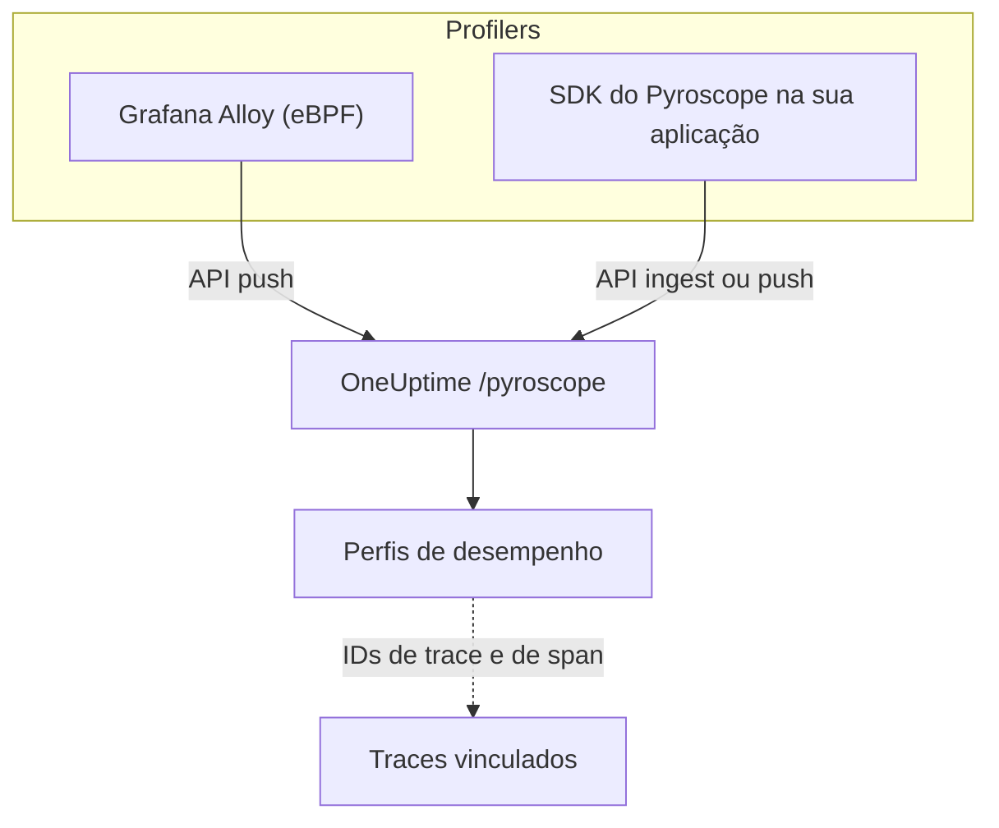

# Profiling contínuo

O profiling contínuo mostra como sua aplicação gasta tempo de CPU e memória, função por função. O OneUptime oferece uma **API de ingestão compatível com Pyroscope**, então tudo o que consegue enviar dados a um servidor Pyroscope (o profiler eBPF do Grafana Alloy ou um SDK do Pyroscope para a sua linguagem) consegue enviá-los ao OneUptime, e você lê o resultado como gráficos de chama ao lado dos seus registros, métricas e traces.

:::cards
- [Enviar perfis](#enviar-perfis): Grafana Alloy com eBPF, ou um SDK do Pyroscope na sua aplicação.
- [Endpoint de ingestão](#endpoint-de-ingestão): A URL base e as três formas de passar a chave.
- [Verificar se está funcionando](#verificar-se-está-funcionando): Conferir a chave, a página e o status dos envios.
- [Explorar perfis](#explorar-perfis-no-oneuptime): Gráficos de chama, principais funções, comparações e links para traces.
:::

## Como funciona

Um profiler amostra seus processos e envia um perfil a cada poucos segundos para o endpoint `/pyroscope` do OneUptime, com sua chave de ingestão. O OneUptime armazena cada perfil sob o serviço que ele indica e o desenha como gráfico de chama em **Perfis de desempenho**.



## Antes de começar

Você precisa de uma chave de ingestão de telemetria do tipo **Servidor**. Se ainda não tiver uma:

:::steps
### Abrir as chaves de ingestão

Acesse **Produtos → Configurações do projeto**, abra **Telemetria e APM** no menu lateral e selecione **Chaves de ingestão**.


### Criar uma chave

Clique em **Criar chave de ingestão**. A caixa de diálogo já vem com o nome da chave preenchido e **Servidor** escolhido (o tipo de chave com que uma aplicação ou um coletor envia dados), então clique em **Criar chave de ingestão** para criá-la, ou renomeie-a antes.

### Copiar o segredo

A nova chave abre na página dela. Copie a **Chave secreta**: é o token de ingestão que os exemplos abaixo chamam de `YOUR_ONEUPTIME_INGESTION_TOKEN`.


:::

## Endpoint de ingestão

| Configuração | Valor |
| --- | --- |
| URL base (endereço do servidor Pyroscope) | `https://oneuptime.com/pyroscope` |
| Cabeçalho de autenticação | `x-oneuptime-token: YOUR_ONEUPTIME_INGESTION_TOKEN` |

Os clientes acrescentam o próprio caminho à URL base (`/ingest` na maioria dos SDKs do Pyroscope, `/push.v1.PusherService/Push` no Grafana Alloy e no SDK .NET a partir da v0.14), então você sempre configura só a URL base, sem barra no final.

O OneUptime lê o token de ingestão de qualquer uma destas formas; use a que o seu cliente aceitar:

| Método | Quando usar |
| --- | --- |
| Cabeçalho `x-oneuptime-token` | Clientes que permitem adicionar cabeçalhos personalizados. |
| `Authorization: Bearer <token>` | SDKs com uma opção `authToken` / `auth_token`: é isso que eles enviam. |
| Autenticação HTTP basic, com o token como **senha** (qualquer nome de usuário) | Clientes que só oferecem usuário e senha de basic auth. |

> [!NOTE]
> Hospeda o OneUptime por conta própria? Substitua `https://oneuptime.com` pelo seu próprio host, por exemplo `https://YOUR-ONEUPTIME-HOST/pyroscope`.

## Formatos de perfil suportados

| Formato | Enviado por | Suportado |
| --- | --- | --- |
| pprof (protobuf binário, opcionalmente compactado com gzip) | SDKs do Pyroscope para Go, Node.js e .NET; Grafana Alloy | Sim |
| Texto folded / collapsed | SDKs do Pyroscope para Python, Ruby e Rust (o formato de envio padrão deles) | Sim |
| JFR (Java Flight Recorder) | Agente Java do Pyroscope | Ainda não: use o Grafana Alloy para serviços Java |

## Enviar perfis

O Grafana Alloy faz o profiling de todos os processos de um host sem mudar o código e é a forma recomendada de começar. Já um SDK do Pyroscope é executado dentro da sua aplicação.

:::tabs
@tab Grafana Alloy
O [Grafana Alloy](https://grafana.com/docs/alloy/latest/) coleta com eBPF os perfis de CPU de todos os processos de um host Linux: nenhum agente dentro da sua aplicação e nenhuma mudança de código. Funciona com Go, Rust, C/C++, Java, Python, Ruby, PHP, Node.js e .NET.

Crie a configuração do Alloy:

```hcl title="alloy-config.alloy"
discovery.process "all" {
  refresh_interval = "60s"
}

discovery.relabel "alloy_profiles" {
  targets = discovery.process.all.targets

  rule {
    action       = "replace"
    source_labels = ["__meta_process_exe"]
    target_label  = "service_name"
  }
}

pyroscope.ebpf "default" {
  targets    = discovery.relabel.alloy_profiles.output
  forward_to = [pyroscope.write.oneuptime.receiver]

  collect_interval = "15s"
  sample_rate      = 97
}

pyroscope.write "oneuptime" {
  endpoint {
    url = "https://oneuptime.com/pyroscope"
    headers = {
      "x-oneuptime-token" = "YOUR_ONEUPTIME_INGESTION_TOKEN",
    }
  }
}
```

Execute-o com Docker. O eBPF precisa de um contêiner privilegiado com o namespace de PID do host:

```yaml title="docker-compose.yml"
services:
  alloy:
    image: grafana/alloy:latest
    privileged: true
    pid: host
    volumes:
      - ./alloy-config.alloy:/etc/alloy/config.alloy
      - /proc:/proc:ro
      - /sys:/sys:ro
    command:
      - run
      - /etc/alloy/config.alloy
```

Ou execute-o diretamente no host:

```bash
alloy run alloy-config.alloy
```

A regra de reetiquetagem dá ao serviço de cada perfil o nome do executável do processo.
@tab Go
O SDK de Go envia pprof. Aponte o endereço do servidor dele para a URL base do OneUptime e passe seu token de ingestão como token de autenticação:

```go
import "github.com/grafana/pyroscope-go"

pyroscope.Start(pyroscope.Config{
    ApplicationName: "my-service",
    ServerAddress:   "https://oneuptime.com/pyroscope",
    AuthToken:       "YOUR_ONEUPTIME_INGESTION_TOKEN",
    ProfileTypes: []pyroscope.ProfileType{
        pyroscope.ProfileCPU,
        pyroscope.ProfileAllocObjects,
        pyroscope.ProfileAllocSpace,
        pyroscope.ProfileInuseObjects,
        pyroscope.ProfileInuseSpace,
        pyroscope.ProfileGoroutines,
    },
})
```
@tab Node.js
O SDK de Node.js envia pprof:

```javascript
const Pyroscope = require("@pyroscope/nodejs");

Pyroscope.init({
  serverAddress: "https://oneuptime.com/pyroscope",
  appName: "my-service",
  authToken: "YOUR_ONEUPTIME_INGESTION_TOKEN",
});

Pyroscope.start();
```
@tab Python
O SDK de Python envia texto folded:

```python
import pyroscope

pyroscope.configure(
    application_name="my-service",
    server_address="https://oneuptime.com/pyroscope",
    auth_token="YOUR_ONEUPTIME_INGESTION_TOKEN",
)
```
@tab .NET
O profiler .NET do Pyroscope é um profiler CLR nativo: não precisa de mudanças de código e é ligado totalmente por variáveis de ambiente. Baixe a versão para a sua imagem em [pyroscope-dotnet releases](https://github.com/grafana/pyroscope-dotnet/releases) (`glibc` ou `musl` para Alpine, `x86_64` ou `aarch64`) e carregue-a no runtime:

```dockerfile title="Dockerfile"
FROM alpine:3.20 AS pyroscope-profiler
ARG PYROSCOPE_DOTNET_VERSION=1.5.1
ADD https://github.com/grafana/pyroscope-dotnet/releases/download/pyroscope-${PYROSCOPE_DOTNET_VERSION}/pyroscope.${PYROSCOPE_DOTNET_VERSION}-glibc-x86_64.tar.gz /tmp/pyroscope.tar.gz
RUN mkdir -p /pyroscope && tar -xzf /tmp/pyroscope.tar.gz -C /pyroscope

FROM mcr.microsoft.com/dotnet/aspnet:10.0
# ... your application ...
COPY --from=pyroscope-profiler /pyroscope /pyroscope
ENV CORECLR_ENABLE_PROFILING=1
ENV CORECLR_PROFILER={BD1A650D-AC5D-4896-B64F-D6FA25D6B26A}
ENV CORECLR_PROFILER_PATH=/pyroscope/Pyroscope.Profiler.Native.so
ENV LD_PRELOAD=/pyroscope/Pyroscope.Linux.ApiWrapper.x64.so
ENV LD_LIBRARY_PATH=/pyroscope
```

Depois aponte-o para o OneUptime, por exemplo no seu ambiente Kubernetes / Helm:

```bash
PYROSCOPE_APPLICATION_NAME=my-service
PYROSCOPE_PROFILING_ENABLED=1
PYROSCOPE_SERVER_ADDRESS=https://oneuptime.com/pyroscope
PYROSCOPE_BASIC_AUTH_USER=oneuptime
PYROSCOPE_BASIC_AUTH_PASSWORD=YOUR_ONEUPTIME_INGESTION_TOKEN
```

O token de ingestão vai na senha da basic auth. O nome de usuário pode ser qualquer valor não vazio, mas o profiler não envia credencial nenhuma se os dois não estiverem definidos. Para enviar o token como cabeçalho, defina `PYROSCOPE_HTTP_HEADERS={"x-oneuptime-token":"YOUR_ONEUPTIME_INGESTION_TOKEN"}`.

A forma de passar o token depende da versão do profiler. As versões 1.5 e posteriores ignoram `PYROSCOPE_AUTH_TOKEN`, então se você atualizar de uma versão mais antiga mantendo essa configuração, todo envio é rejeitado com `401`:

| Versão do pyroscope-dotnet | Envia para | Configuração do token |
| --- | --- | --- |
| v0.13 e anteriores | `/pyroscope/ingest` | `PYROSCOPE_AUTH_TOKEN` |
| v0.14 a 1.4 | `/pyroscope/push.v1.PusherService/Push` | `PYROSCOPE_AUTH_TOKEN` |
| 1.5 e posteriores | `/pyroscope/push.v1.PusherService/Push` | `PYROSCOPE_BASIC_AUTH_USER=oneuptime` e `PYROSCOPE_BASIC_AUTH_PASSWORD=<token>` (as duas precisam estar definidas), ou `PYROSCOPE_HTTP_HEADERS={"x-oneuptime-token":"<token>"}` |

As versões anteriores à 1.0 usam a tag `v<version>-pyroscope` em vez de `pyroscope-<version>` (por exemplo `https://github.com/grafana/pyroscope-dotnet/releases/download/v0.13.0-pyroscope/pyroscope.0.13.0-glibc-x86_64.tar.gz`); o GUID do profiler e os nomes de arquivo são os mesmos em todas as versões.

O profiling de CPU vem ligado por padrão. Os profilings de tempo decorrido, alocação, exceções e contenção de bloqueio são opcionais: defina `PYROSCOPE_PROFILING_WALLTIME_ENABLED`, `PYROSCOPE_PROFILING_ALLOCATION_ENABLED`, `PYROSCOPE_PROFILING_EXCEPTION_ENABLED` ou `PYROSCOPE_PROFILING_LOCK_ENABLED` como `true`. Rótulos estáticos vão em `PYROSCOPE_LABELS` (`key:value,key:value`).

O profiler envia a cada 15 segundos e **não** compacta os envios, então um serviço com carga pode enviar vários MB por envio. O ingress do próprio OneUptime aceita até 16 MB em `/pyroscope`; se outro proxy ficar na frente do OneUptime (por exemplo o ingress-nginx, cujo `proxy-body-size` padrão é 1 MB), aumente também o limite de tamanho dele para `/pyroscope`, ou os envios grandes serão rejeitados com `413` antes de chegarem ao OneUptime.
@tab Java
O agente Java do Pyroscope envia perfis no formato JFR, que o OneUptime ainda não ingere. Faça o profiling de serviços Java com o Grafana Alloy (a aba **Grafana Alloy**): ele captura perfis de CPU da JVM sem agente e sem mudanças de código.
:::

**Ruby** e **Rust** funcionam como Go, Node.js e Python: instale o [SDK do Pyroscope para a sua linguagem](https://grafana.com/docs/pyroscope/latest/configure-client/) e defina o endereço do servidor como `https://oneuptime.com/pyroscope`, com seu token de ingestão como token de autenticação (ou, se a sua versão do SDK só oferecer basic auth, como senha da basic auth).

## Tipos de perfil suportados

Um pprof pode declarar vários tipos de amostra; cada perfil enviado é armazenado sob um deles: o tempo de CPU (`cpu` em nanossegundos) se ele tiver; se não, o tempo decorrido; se não, os bytes em uso e depois os alocados; e se não, o primeiro tipo que ele declara. Qualquer tipo é armazenado e pode ser visto; os tipos abaixo têm agrupamento, unidades e rótulos próprios no OneUptime:

| Tipo de perfil | Exibido como | Unidade |
| --- | --- | --- |
| `cpu`, `samples` | Tempo de CPU | nanossegundos |
| `wall` | Tempo decorrido | nanossegundos |
| `inuse_space`, `alloc_space`, `heap` | Memória (bytes) | bytes |
| `inuse_objects`, `alloc_objects` | Memória (contagem de objetos) | contagem |
| `mutex`, `contention`, `block` | Contenção de bloqueio | nanossegundos |
| `goroutine` | Goroutines (Go) | contagem |

Todo o resto (por exemplo, um tipo de amostra personalizado) aparece em "Outro" com o nome bruto.

## Verificar se está funcionando

:::steps
### Conferir seu token

Os endpoints de ingestão respondem `401` a um token ausente ou inválido, mas a maioria dos profilers não mostra isso em nenhum lugar onde você vá ver (o profiler .NET, por exemplo, só registra as respostas HTTP no nível de debug). Consulte diretamente o endpoint de validação:

```bash
curl -i -H "x-oneuptime-token: YOUR_ONEUPTIME_INGESTION_TOKEN" \
  https://oneuptime.com/otlp/v1/validate
```

Um token válido retorna `200` com `{"valid": true, ...}`, e o `keyType` dele precisa ser `Server`: uma chave de navegador também é válida, mas não consegue enviar perfis. Um token desconhecido, revogado, desativado ou expirado retorna `401`.

### Abrir a página de perfis

No painel do OneUptime, acesse **Produtos → Perfis de desempenho**. Com o intervalo de coleta de 15 segundos do Alloy (ou o intervalo de envio de 10 a 15 segundos dos SDKs), os primeiros perfis e os gráficos de chama deles aparecem um ou dois minutos depois que o agente inicia.

### Conferir o serviço

Os perfis são associados ao serviço de telemetria indicado por `application_name` / `appName` / `PYROSCOPE_APPLICATION_NAME` do SDK (ou pelo nome do executável do processo, com a regra de reetiquetagem do Alloy acima).

### Ainda nada? Veja o status dos envios

No profiler .NET, defina `DD_TRACE_DEBUG=1` na aplicação por um minuto: ele passa a registrar uma linha `PyroscopePprofSink <status>` para cada envio. `200` significa que o OneUptime aceitou; `401` é o token; `404` geralmente significa que falta o sufixo `/pyroscope` em `PYROSCOPE_SERVER_ADDRESS`; `413` significa que um proxy na frente do OneUptime rejeitou o envio pelo tamanho (veja a aba **.NET** em [Enviar perfis](#enviar-perfis)). Se você hospeda o OneUptime, o log de acesso do ingress (nginx) registra o mesmo status para cada requisição a `/pyroscope`.
:::

## Explorar perfis no OneUptime

**Produtos → Perfis de desempenho** abre uma visão geral de para onde vai o tempo nos seus serviços, e **Todos os perfis** lista cada envio. Escolha o que analisar: **Tudo**, **Tempo de CPU**, **Memória** ou **Bloqueios**, ou um tipo específico como **Tempo decorrido** ou **Goroutines**.

A página de um perfil tem três visões:

| Visão | O que mostra |
| --- | --- |
| **Gráfico de chama** | Cada barra é uma função da pilha de chamadas, e a largura dela é proporcional ao tempo ou aos recursos consumidos. Clique em uma função para aplicar zoom e ver quem a chama e quem ela chama. |
| **Top functions** | As funções do perfil, ordenadas por tempo próprio ou total. **Only my code** oculta os frames de bibliotecas. |
| **Diff vs. baseline** | O perfil comparado com um período anterior (**vs. 1 hora atrás**, **vs. ontem** ou **vs. semana passada**), com as funções **Most regressed** e **Most improved**. |

**Download pprof** salva o perfil para ferramentas locais como `go tool pprof`.

### Correlação com traces

Quando um perfil traz IDs de trace e de span (por exemplo, como rótulos de amostra `trace_id` / `span_id`), você vai direto de um span lento de um trace ao perfil de CPU ou memória correspondente para entender exatamente que código estava rodando, e **Open linked trace** faz o caminho inverso.

A aba **Perfil** de um span também inclui as amostras vinculadas aos spans aninhados sob ele, porque os profilers costumam atribuir o tempo de CPU de uma requisição a um span filho em vez do próprio span da requisição.

## Retenção de dados

Os perfis são mantidos pela retenção de telemetria do seu projeto: **Configurações do projeto → Telemetria e APM → Retenção de dados** define a **Retenção Padrão (Dias)**, 15 dias se você não mudar. Os dados são excluídos automaticamente quando o período de retenção termina. Planos que incluem exceções de retenção também podem manter os perfis por mais ou menos tempo que o restante da telemetria, ou definir a retenção por serviço na página **Configurações** do serviço.

## Próximos passos

:::cards
- [Monitor de perfis](/docs/monitor/profiles-monitor): Alertar sobre os perfis que seus serviços enviam, por quantidade e tipo.
- [OpenTelemetry](/docs/telemetry/open-telemetry): Enviar os traces aos quais seus perfis se vinculam.
- [Agente Kubernetes](/docs/telemetry/kubernetes-agent): Fazer o profiling de um cluster inteiro com o profiler eBPF do agente.
:::
