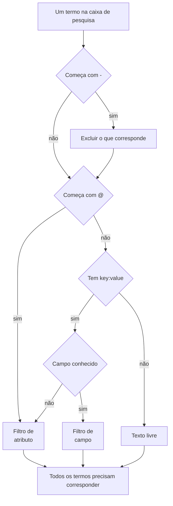

# Sintaxe de pesquisa

A caixa de pesquisa acima dos exploradores de registros, traces, métricas e exceções fala uma única linguagem de consulta. Uma consulta é uma lista de filtros separados por espaços, e **todos os filtros precisam corresponder**: não há OR implícito entre filtros. Use esta página como referência enquanto pesquisa.

:::cards
- [Os dois tipos de filtro](#os-dois-tipos-de-filtro): Campos integrados, atributos e texto livre.
- [Correspondência de valores](#correspondência-de-valores): Curingas, "contém", comparações e listas.
- [Excluir](#excluir): Inverter qualquer filtro com um `-` no início.
- [Campos por sinal](#campos-por-sinal): O que você pode filtrar em cada explorador.
:::

## Como uma consulta é lida

```text
severity:error @platform.team:a* -@http.method:GET timeout
```

Isso se lê assim: registros de nível erro cujo atributo `platform.team` começa com `a`, cujo atributo `http.method` não é `GET` e cuja mensagem menciona `timeout`.

| Termo | Tipo | Corresponde a |
| --- | --- | --- |
| `severity:error` | Campo | A gravidade do registro é Error. |
| `@platform.team:a*` | Atributo | O atributo `platform.team` começa com `a`. |
| `-@http.method:GET` | Atributo excluído | O atributo `http.method` é qualquer coisa menos `GET`. |
| `timeout` | Texto livre | A mensagem contém `timeout`. |

Cada termo separado por espaço é lido sozinho, e depois todos são combinados com AND:



## Os dois tipos de filtro

| Forma | Filtra | Exemplo |
| --- | --- | --- |
| `field:value` | Um campo integrado do sinal | `severity:error` |
| `@attribute:value` | Um atributo do OpenTelemetry na linha | `@http.status_code:500` |
| palavras soltas | A mensagem (registros), o nome do span (traces), o nome da métrica (métricas) ou a mensagem da exceção (exceções) | `connection refused` |

Um `key:value` solto cuja chave não é um campo conhecido é tratado como atributo, então `k8s.pod:api-0` e `@k8s.pod:api-0` significam a mesma coisa. O prefixo `@` sempre significa "procurar nos atributos", com uma exceção: no explorador de exceções, `@type:`, `@service:`, `@env:` e `@class:` continuam filtrando esses campos.

Um texto que apenas contém dois-pontos continua sendo texto: `https://example.com` e `12:30` são pesquisados como palavras, não lidos como filtros.

## Correspondência de valores

Tudo nesta tabela funciona com qualquer atributo e com a maioria dos campos integrados; [Campos por sinal](#campos-por-sinal) indica os campos que leem um valor de forma mais simples.

| Você digita | Corresponde a |
| --- | --- |
| `@k:abc` | exatamente `abc` |
| `@k:a*` | tudo o que começa com `a`: `abc`, `alpha` |
| `@k:*c` | tudo o que termina com `c` |
| `@k:a*c` | começa com `a` e termina com `c` |
| `@k:a?c` | `?` é exatamente um caractere: `abc`, `axc`, mas não `ac` |
| `@k:*` | o atributo está presente e não está vazio |
| `@k:~abc` | contém `abc` em qualquer posição |
| `@k:!abc` | tudo menos `abc` |
| `@k:>100` | maior que 100. Também `>=`, `<`, `<=` |
| `@k:(a OR b)` | qualquer um dos dois valores. `@k:[a, b]` é a mesma coisa |
| `@k:(a* OR b*)` | qualquer um dos dois padrões |

As correspondências com curinga e com "contém" ignoram maiúsculas e minúsculas; a correspondência exata não, porque compara com o valor exatamente como foi armazenado.

### Valores com espaços

Coloque o valor entre aspas duplas:

```text
name:"SELECT wp_options"
@k8s.container.name:"my container"
```

As aspas protegem os **espaços**, não os curingas: `@k:"a b*"` continua correspondendo a tudo o que começa com `a b`.

### `*`, `?` e outros sinais literais

Uma barra invertida torna literal o caractere seguinte:

| Você digita | Corresponde a |
| --- | --- |
| `@k:a\*b` | exatamente `a*b` |
| `@k:\~abc` | exatamente `~abc` |
| `@k:\>5` | exatamente `>5` |

Valores que contêm `%` ou `_` não precisam de escape: eles são sempre literais.

## Excluir

Um `-` no início inverte qualquer filtro, inclusive os acima:

| Você digita | Corresponde a |
| --- | --- |
| `-severity:debug` | tudo menos debug |
| `-@platform.team:a*` | tudo cujo `platform.team` **não** começa com `a`, inclusive linhas que não têm `platform.team` |
| `-@k:*` | o atributo está ausente ou vazio |
| `-@k:(a OR b)` | nenhum dos dois valores |
| `-@k:>100` | 100 ou menos |
| `-@k:~abc` | não contém `abc` |

No explorador de traces, `-` exclui apenas atributos. `-status:error` é lido como texto a procurar nos nomes de span, e não encontra nada; peça os valores que você quer, como `status:(ok OR unset)`.

## Campos por sinal

Nomes de campo não diferenciam maiúsculas de minúsculas: `statusMessage:` e `statusmessage:` são o mesmo campo.

### Registros

| Campo | Aliases | Observações |
| --- | --- | --- |
| `severity` | `level` | `fatal`, `error`, `warning` (ou `warn`), `info` (ou `information`), `debug`, `trace`, `unspecified`, com qualquer combinação de maiúsculas |
| `service` | | Nome do serviço, escrito por completo, com qualquer combinação de maiúsculas |
| `trace` | | ID do trace |
| `span` | | ID do span |
| `message` | `msg`, `log`, `body` | A linha de registro. Palavras soltas também a pesquisam |

### Traces

Os campos de trace aceitam um valor simples ou uma lista como `status:(ok OR unset)`, e `duration` também aceita `>` e `<`. Curingas, `~`, `!` e um `-` no início aqui só funcionam com atributos.

| Campo | Observações |
| --- | --- |
| `service` | Nome do serviço |
| `name` | Nome do span. Um único valor corresponde a qualquer parte do nome. Palavras soltas também o pesquisam |
| `status` | `ok`, `error`, `unset` (unset = Nenhum status de erro definido, o padrão do OpenTelemetry) |
| `kind` | `server`, `client`, `producer`, `consumer`, `internal` |
| `duration` | Milissegundos: `duration:>500`, `duration:<200` ou um valor exato |
| `statusMessage` | Texto da mensagem de status. Um único valor corresponde a qualquer parte do texto |
| `hasException` | `true` ou `false` |
| `trace`, `span` | IDs |

### Métricas

| Campo | Observações |
| --- | --- |
| `name` | Nome da métrica. Um valor simples corresponde a qualquer parte do nome, então `name:http.server` encontra `http.server.request.duration`. Palavras soltas também o pesquisam |
| `service` | Nome do serviço. Um valor simples corresponde a qualquer parte do nome |

### Exceções

| Campo | Aliases | Observações |
| --- | --- | --- |
| `type` | `exceptionType` | Tipo de exceção, por exemplo `type:TypeError` |
| `env` | `environment` | Ambiente, do atributo de recurso `deployment.environment` |
| `service` | | Nome do serviço. Um valor simples corresponde a qualquer parte do nome |
| `class` | `errorClass` | De quem é a culpa do erro: `code-fault`, `user-error`, `expected-denial`, `infrastructure` ou `unknown` |

Palavras soltas pesquisam a mensagem da exceção.

O explorador **Security Events** usa a mesma linguagem com campos próprios, como `severity`, `tactic` e `user`: consulte [Security Events](/docs/telemetry/security-events).

## Combinar filtros

Os filtros são combinados com AND. `AND` pode ser escrito entre eles e não muda nada:

```text
severity:error service:api          # both must hold
severity:error AND service:api      # identical
```

Não existe OR nem NOT **entre** filtros: os `OR` e `NOT` escritos ali são ignorados, então `NOT severity:debug` significa o mesmo que `severity:debug`. Exclua com um `-` no início (`-severity:debug`) e, para aceitar qualquer um de dois valores da mesma chave, use a forma de lista:

```text
@http.method:(GET OR POST)
```

Dois filtros na mesma chave são combinados com AND; é assim que se escreve um intervalo ou um padrão com duas pontas:

```text
@http.status_code:>=500 @http.status_code:<=599
@k:a* @k:*z
```

## Chips e a caixa de pesquisa

Pressionar Enter em um termo `key:value` o aplica, normalmente como um chip acima dos resultados. Um chip mantém o valor exatamente como foi digitado, então um curinga continua sendo um curinga. Um termo que um chip não consegue levar, como um `-key:value` excluído, fica na caixa de pesquisa e filtra a partir dali. Clicar em um valor na barra lateral de facetas adiciona o mesmo tipo de chip, com o valor escapado: um valor armazenado que contém `*` filtra por esse valor literal, não como padrão.

Os chips fazem parte da visualização salva e da URL da página, então um filtro sobrevive a uma atualização, a um favorito e a um link compartilhado.

## Bom saber

- As **chaves** de atributo são comparadas sem diferenciar maiúsculas de minúsculas nos filtros com curinga, "contém", prefixo e sufixo, então você não precisa lembrar se ela foi ingerida como `requestId` ou como `requestid`.
- Um filtro `-@k:...` também corresponde a linhas que nunca tiveram o atributo: uma linha sem `platform.team` obviamente não começa com `a`.
- Comparações numéricas funcionam com valores de atributo armazenados como texto; um valor que não é número nunca satisfaz uma comparação.

## Próximos passos

:::cards
- [Aplicar zoom em um intervalo de tempo](/docs/telemetry/charts-and-time-ranges): Restringir os exploradores ao momento que importa.
- [Pipelines de registros](/docs/telemetry/log-pipelines): Transformar partes de uma linha de registro em atributos pesquisáveis.
- [Monitor de logs](/docs/monitor/logs-monitor): Alertar quando os registros que você procura aparecerem.
- [OpenTelemetry](/docs/telemetry/open-telemetry): Enviar registros, métricas e traces para pesquisar.
:::
