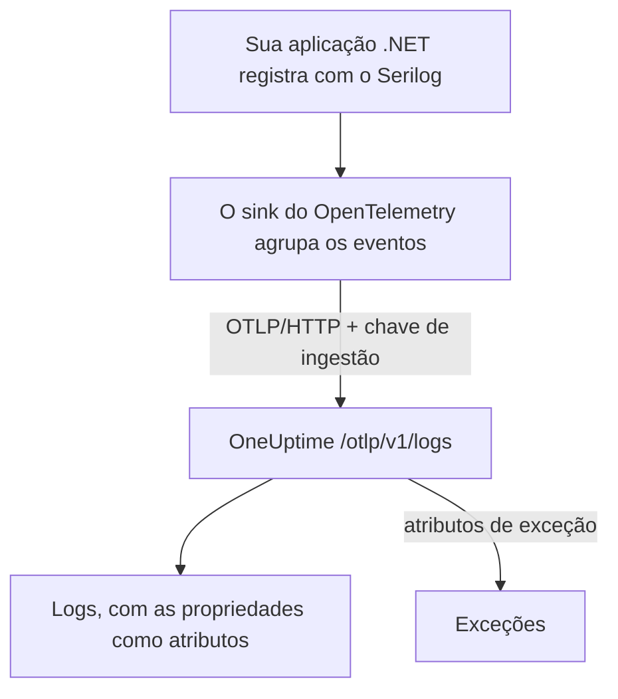

# Serilog (.NET)

O [Serilog](https://serilog.net) é a biblioteca de logging estruturado mais popular do .NET. Com o sink oficial [`Serilog.Sinks.OpenTelemetry`](https://github.com/serilog/serilog-sinks-opentelemetry), cada evento que a sua aplicação registra pelo Serilog é enviado ao OneUptime pelo OpenTelemetry Protocol (OTLP) e passa a ser pesquisável em **Produtos → Registros**, com suas propriedades estruturadas, a severidade e a correlação com traces.

Não há nenhum pacote específico do OneUptime para instalar: o sink fala com o mesmo endpoint OTLP que o OneUptime expõe para todos os dados do OpenTelemetry. Funciona com aplicações de console, worker services, aplicações ASP.NET Core e qualquer outra coisa que rode em .NET.

:::cards
- [Configurar o sink](#configurar-o-sink): Instale dois pacotes e configure-os no código ou no `appsettings.json`.
- [Exceções](#exceções): As exceções registradas viram problemas em Exceções.
- [Solução de problemas](#solução-de-problemas): O que verificar quando nenhum log chega.
:::

## Como funciona



O sink agrupa os eventos de log e os envia em segundo plano. Cada propriedade nomeada vira um atributo do log, e uma exceção registrada com o Serilog chega com os atributos que o OneUptime transforma em um problema.

## Antes de começar

- Um projeto do OneUptime. No OneUptime Cloud, a telemetria é cobrada por GB ingerido — veja os [preços](https://oneuptime.com/pricing) — e um projeto no plano Free precisa de um método de pagamento antes de poder enviar telemetria.
- Uma aplicação .NET que usa, ou pode usar, o Serilog.
- Uma chave de ingestão de telemetria para autenticar os seus logs. Se você ainda não tem uma:

:::steps
### Abrir as chaves de ingestão

Vá em **Produtos → Configurações do projeto**, abra **Telemetria e APM** no menu lateral e selecione **Chaves de ingestão**.


### Criar uma chave

Clique em **Criar chave de ingestão**. A janela já vem com o nome da chave preenchido e **Servidor** escolhido — o tipo de chave com que uma aplicação ou um collector envia —, então clique em **Criar chave de ingestão** para criá-la, ou renomeie-a antes.

### Copiar o segredo

A nova chave abre na própria página. Copie a **Chave secreta** dela: esse é o `YOUR_TELEMETRY_INGESTION_TOKEN` dos exemplos abaixo.


:::

## O que você precisa do OneUptime

| Configuração | Valor |
| ------------- | ------------------------------------------------------------ |
| Endpoint OTLP | `https://oneuptime.com/otlp` |
| Cabeçalho de autenticação | `x-oneuptime-token: YOUR_TELEMETRY_INGESTION_TOKEN` |
| Nome do serviço | O nome com que o seu serviço deve aparecer, por exemplo `my-service` |

> [!NOTE]
> Você hospeda o OneUptime por conta própria? Troque `https://oneuptime.com/otlp` por `https://YOUR-ONEUPTIME-HOST/otlp` (ou `http://...` se você não termina TLS). Todo o resto continua igual.

Com o protocolo definido como `HttpProtobuf`, o sink acrescenta o caminho `/v1/logs` ao endpoint, então a URL final para a qual ele envia é `https://oneuptime.com/otlp/v1/logs`. Você só precisa informar o endpoint base `/otlp`.

## Configurar o sink

:::steps
### Instalar os pacotes NuGet

Adicione o Serilog e o sink do OpenTelemetry ao seu projeto:

```bash
dotnet add package Serilog
dotnet add package Serilog.Sinks.OpenTelemetry
```

Se você configura o sink pelo `appsettings.json`, adicione também `Serilog.Settings.Configuration`. Para aplicações ASP.NET Core, adicione `Serilog.AspNetCore`, que liga o Serilog ao host e ao pipeline de requisições:

```bash
dotnet add package Serilog.Settings.Configuration
dotnet add package Serilog.AspNetCore
```

### Ajustar o sink

Aponte o sink para o seu endpoint OTLP do OneUptime, defina o protocolo como `HttpProtobuf`, passe o seu token de ingestão como cabeçalho e marque os logs com um `service.name`. Configure-o no código, no `appsettings.json` ou no host do ASP.NET Core:

:::tabs
@tab No código
```csharp title="Program.cs"
using Serilog;
using Serilog.Sinks.OpenTelemetry;

Log.Logger = new LoggerConfiguration()
    .MinimumLevel.Information()
    .Enrich.FromLogContext()
    .WriteTo.Console() // optional: keep local logs too
    .WriteTo.OpenTelemetry(options =>
    {
        // Base OTLP endpoint. The sink appends /v1/logs automatically.
        options.Endpoint = "https://oneuptime.com/otlp";
        options.Protocol = OtlpProtocol.HttpProtobuf;

        // Authenticate with your OneUptime telemetry ingestion token.
        options.Headers = new Dictionary<string, string>
        {
            ["x-oneuptime-token"] = "YOUR_TELEMETRY_INGESTION_TOKEN"
        };

        // Identify your service in OneUptime.
        options.ResourceAttributes = new Dictionary<string, object>
        {
            ["service.name"] = "my-service",
            ["deployment.environment"] = "production"
        };
    })
    .CreateLogger();

try
{
    Log.Information("Application starting up");
    // ... your application code ...
}
finally
{
    // Flush any buffered logs before the process exits.
    Log.CloseAndFlush();
}
```
@tab appsettings.json
Coloque as configurações do sink no `appsettings.json`:

```json title="appsettings.json"
{
  "Serilog": {
    "Using": ["Serilog.Sinks.OpenTelemetry"],
    "MinimumLevel": "Information",
    "WriteTo": [
      {
        "Name": "OpenTelemetry",
        "Args": {
          "endpoint": "https://oneuptime.com/otlp",
          "protocol": "HttpProtobuf",
          "headers": {
            "x-oneuptime-token": "YOUR_TELEMETRY_INGESTION_TOKEN"
          },
          "resourceAttributes": {
            "service.name": "my-service",
            "deployment.environment": "production"
          }
        }
      }
    ]
  }
}
```

Depois, monte o logger a partir da configuração:

```csharp title="Program.cs"
using Serilog;
using Microsoft.Extensions.Configuration;

IConfiguration configuration = new ConfigurationBuilder()
    .AddJsonFile("appsettings.json")
    .Build();

Log.Logger = new LoggerConfiguration()
    .ReadFrom.Configuration(configuration)
    .CreateLogger();
```
@tab ASP.NET Core
Para ASP.NET Core (hospedagem mínima, .NET 6 ou posterior), use `Serilog.AspNetCore` para que o Serilog substitua o logger padrão e capture também os logs do framework e das requisições:

```csharp title="Program.cs"
using Serilog;
using Serilog.Sinks.OpenTelemetry;

var builder = WebApplication.CreateBuilder(args);

builder.Host.UseSerilog((context, services, configuration) =>
{
    configuration
        .ReadFrom.Configuration(context.Configuration)
        .Enrich.FromLogContext()
        .WriteTo.OpenTelemetry(options =>
        {
            options.Endpoint = "https://oneuptime.com/otlp";
            options.Protocol = OtlpProtocol.HttpProtobuf;
            options.Headers = new Dictionary<string, string>
            {
                ["x-oneuptime-token"] = "YOUR_TELEMETRY_INGESTION_TOKEN"
            };
            options.ResourceAttributes = new Dictionary<string, object>
            {
                ["service.name"] = "my-service"
            };
        });
});

var app = builder.Build();

// Logs one summary event per HTTP request.
app.UseSerilogRequestLogging();

app.MapGet("/", () => "Hello World");
app.Run();
```
:::

> [!IMPORTANT]
> O sink agrupa os eventos de log e os envia de forma assíncrona. Sempre chame `Log.CloseAndFlush()` (ou descarte o logger) antes que a sua aplicação termine; caso contrário, o último lote de logs pode se perder. No ASP.NET Core, o `Serilog.AspNetCore` cuida disso para você num desligamento ordenado.

> [!TIP]
> Mantenha o token fora do controle de versão. Leia-o de uma variável de ambiente ou de um cofre de segredos e injete-o na configuração ao iniciar, em vez de fazer commit dele no `appsettings.json`.

### Escrever logs

Use o Serilog como de costume. As propriedades estruturadas são preservadas e viram atributos pesquisáveis no OneUptime:

```csharp
Log.Information("Order {OrderId} placed by {CustomerId} for {Amount:C}",
    orderId, customerId, amount);

Log.Warning("Payment gateway slow: {LatencyMs}ms", latencyMs);
```

Cada propriedade nomeada (`OrderId`, `CustomerId`, `Amount`, `LatencyMs`) é enviada como atributo do log, então você pode filtrar e pesquisar por elas no explorador de **Produtos → Registros**.

### Verificar se os logs chegam

Execute a sua aplicação e escreva alguns eventos de log. Em poucos segundos eles aparecem em **Produtos → Registros** e na página do seu serviço em **Produtos → Serviços** — o serviço recebe o nome do `service.name` que você definiu (`my-service`). As propriedades estruturadas ficam disponíveis como filtros.
:::

## Exceções

Quando você registra uma exceção com o Serilog, o sink anexa ao registro de log os atributos do OpenTelemetry `exception.type`, `exception.message` e `exception.stacktrace`:

```csharp
try
{
    ProcessPayment();
}
catch (Exception ex)
{
    Log.Error(ex, "Failed to process payment for order {OrderId}", orderId);
}
```

O OneUptime detecta esses atributos e agrupa o erro em um problema em **Exceções**, por impressão digital e atribuído ao serviço certo. Um erro relatado tanto por um trace quanto por um log é fundido num único problema. Veja [Exceções a partir de logs](/docs/telemetry/open-telemetry#exceções-a-partir-de-logs) para saber como a detecção funciona.

## Correlação com traces

Se a sua aplicação também for instrumentada com o SDK do OpenTelemetry para .NET para traces, os eventos do Serilog emitidos dentro de um span ativo recebem automaticamente o `TraceId` e o `SpanId` atuais (isso faz parte dos `IncludedData` padrão do sink). Assim, o OneUptime liga uma linha de log diretamente ao trace em que ela aconteceu, e você salta de um log para a requisição ao redor e de volta.

Para enviar também traces e métricas, veja a configuração .NET no [início rápido do OpenTelemetry](/docs/telemetry/open-telemetry#início-rápido).

## Solução de problemas

:::details Nenhum log aparece
Confira o valor de `x-oneuptime-token` e se ele pertence ao projeto que você está vendo. Verifique se o endpoint é `https://oneuptime.com/otlp` (só o caminho base — não acrescente `/v1/logs` você mesmo). Para ver por que o sink falha, ative na inicialização a saída de erros do próprio Serilog com `Serilog.Debugging.SelfLog.Enable(Console.Error)`: ela mostra o código de status com que o OneUptime responde.
:::

:::details Os logs só aparecem quando a aplicação encerra, ou os últimos logs somem
Garanta que `Log.CloseAndFlush()` rode no desligamento. O sink agrupa os eventos, então os logs em buffer se perdem se o processo for encerrado sem esvaziá-los.
:::

:::details 401 Unauthorized, e nada é ingerido
A chave está ausente, é desconhecida ou expirou. Confirme que o nome do cabeçalho é exatamente `x-oneuptime-token` e que o valor é a **Chave secreta** da chave.
:::

:::details 402 ou 422, e nada é ingerido
`402`: no OneUptime Cloud, o projeto está no plano Free e não tem método de pagamento. Adicione um em **Configurações do projeto → Cobrança e faturas → Cobrança**. `422`: a chave está desativada, ou é uma chave de navegador. Ligue de novo **Habilitado** nas configurações da chave, ou crie uma chave **Servidor**.
:::

:::details Os logs chegam com o nome de serviço errado
Defina `service.name` em `ResourceAttributes` (código) ou em `resourceAttributes` (appsettings.json). Sem ele, os seus logs ficam sob o nome provisório que o sink envia no lugar, e não sob o nome do seu serviço.
:::

:::details Erros de conexão com uma instância auto-hospedada
Verifique se o protocolo corresponde ao esquema do seu endpoint (`https://` ou `http://`) e se o seu host do OneUptime é acessível a partir da aplicação.
:::

Se tiver dúvidas ou precisar de ajuda, escreva para support@oneuptime.com.

## Próximos passos

:::cards
- [OpenTelemetry](/docs/telemetry/open-telemetry): Envie também traces e métricas do .NET.
- [Pipelines de registros](/docs/telemetry/log-pipelines): Analise e enriqueça os logs quando chegam.
- [Monitor de logs](/docs/monitor/logs-monitor): Alerte quando aparecerem logs correspondentes.
- [Sintaxe de pesquisa](/docs/telemetry/search-syntax): Filtre pelas suas propriedades do Serilog.
:::
