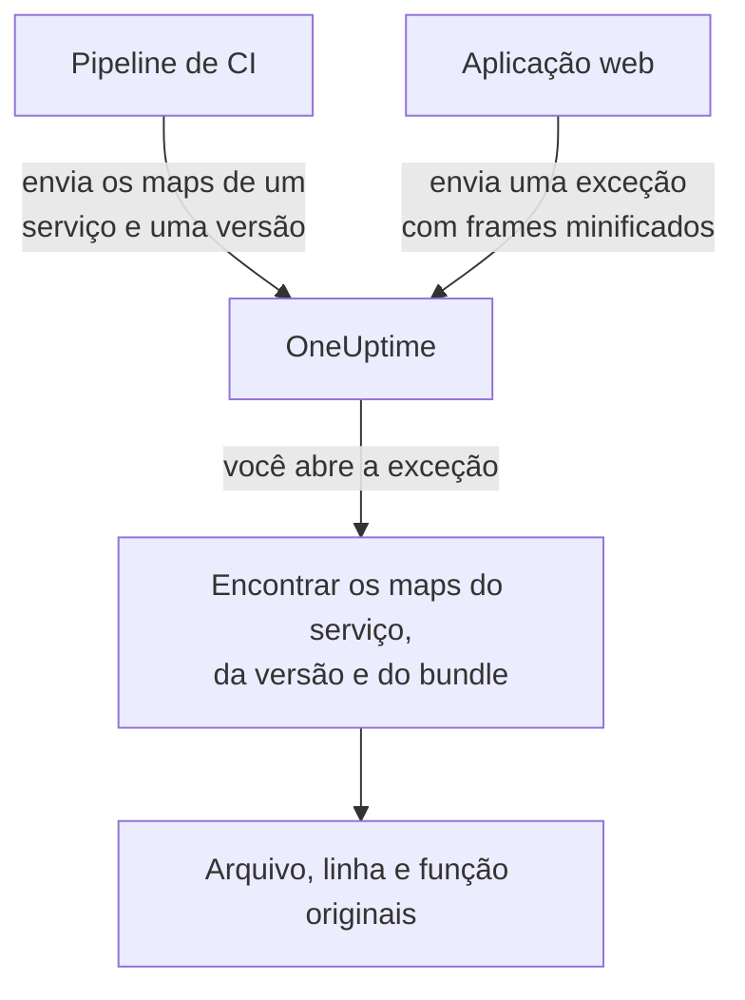

# Source maps

Envie ao OneUptime os source maps do build do seu front-end, e as exceções do navegador em **Exceções** passam a mostrar os nomes de arquivo, linhas e funções originais em vez dos minificados. Esta página é para desenvolvedores de front-end que já enviam telemetria do navegador ao OneUptime.

:::cards
- [Como a correspondência funciona](#como-a-correspondência-funciona): Nome do serviço, versão e arquivo do bundle.
- [Enviar source maps](#enviar-source-maps): Uma única requisição `curl` a partir da CI.
- [Limites](#limites): Tamanhos, quantidades e as configurações para auto-hospedagem.
- [Ver stack traces resolvidos](#ver-stack-traces-resolvidos): Como fica um frame resolvido.
:::

## Visão geral

Os bundles de front-end de produção são minificados, então uma exceção do navegador capturada pelo SDK web do OpenTelemetry chega com frames de pilha como estes:

```text
TypeError: Cannot read properties of undefined (reading 'id')
    at e.onSelect (https://app.example.com/assets/main.a8f1b2.js:1:48291)
```

Envie ao OneUptime os source maps do seu build e o painel de exceções resolve esses frames para o arquivo, a linha e o nome de função originais e, quando o map foi gerado com `sourcesContent`, para as linhas próximas do seu código-fonte original.

Os maps são enviados ao OneUptime por uma API autenticada e **nunca são buscados no seu site**, então você pode (e deve) continuar gerando o build com `hidden-source-map` (webpack) ou `sourcemap: 'hidden'` (Vite / Rollup) e nunca publicar os arquivos `.map` junto aos seus bundles.



## Como a correspondência funciona

Um source map é armazenado com três chaves:

| Chave | Precisa corresponder a |
|---|---|
| Nome do serviço | O atributo de recurso do OpenTelemetry `service.name` com que sua aplicação web envia telemetria |
| Versão do serviço | O atributo de recurso `service.version` (o identificador da sua versão) |
| Caminho do bundle | O arquivo minificado para o qual o map foi gerado, por exemplo `main.a8f1b2.js` |

Quando você abre uma exceção, o OneUptime procura os maps enviados para o serviço e a versão dessa exceção, associa cada frame da pilha a um bundle pelo nome do arquivo (sufixos de caminho bastam: `main.a8f1b2.js` corresponde a `https://app.example.com/assets/main.a8f1b2.js`) e resolve a linha e a coluna minificadas pelo map. A resolução acontece sob demanda quando a exceção é visualizada, nunca na ingestão, então um map enviado alguns minutos *depois* do primeiro erro de uma nova versão vale retroativamente.

## Antes de começar

- Uma chave de ingestão de telemetria do tipo **Servidor**, em **Configurações do projeto → Telemetria e APM → Chaves de ingestão**. Veja [Criar uma chave de ingestão](/docs/telemetry/open-telemetry#criar-uma-chave-de-ingestão).
- Uma aplicação web que já envia exceções ao OneUptime com o SDK web do OpenTelemetry: veja [Configuração para navegadores](/docs/rum/browser-setup).
- Um build que gera source maps, com `sourcesContent` incluído (o padrão na maioria dos bundlers) se você quiser trechos de código ao redor de cada frame.

## Enviar source maps

:::steps
### Enviar `service.version` com sua telemetria

Sua aplicação web precisa enviar `service.version`, e precisa ser a mesma string com que você envia os maps:

```javascript
import { resourceFromAttributes } from "@opentelemetry/resources";

const resource = resourceFromAttributes({
  "service.name": "my-web-app",
  "service.version": "1.4.2", // same value you upload maps with
});
```

Qualquer identificador de versão estável serve (uma versão semântica, o SHA de um commit do git, um número de build), desde que o `serviceVersion` enviado e o atributo de recurso `service.version` sejam a mesma string.

### Enviar os maps após cada build de produção

Envie a partir da CI, com sua chave de ingestão no cabeçalho `x-oneuptime-token`:

```bash
curl --fail -X POST "https://oneuptime.com/source-maps/v1/upload" \
  -H "x-oneuptime-token: YOUR_TELEMETRY_INGESTION_KEY" \
  -F "serviceName=my-web-app" \
  -F "serviceVersion=1.4.2" \
  -F "sourcemap=@dist/assets/main.a8f1b2.js.map" \
  -F "sourcemap=@dist/assets/vendor.9c3d4e.js.map"
```

Em instalações auto-hospedadas, substitua `oneuptime.com` pelo seu host do OneUptime. `Authorization: Bearer YOUR_KEY` é aceito como alternativa ao cabeçalho `x-oneuptime-token`.

### Conferir o envio

Um envio bem-sucedido retorna um corpo JSON com a lista dos maps armazenados, para que a CI possa verificar. Os maps também aparecem na página **Source Maps** do serviço no OneUptime.
:::

Uma etapa típica de CI envia todos os maps que o build gerou:

```bash
VERSION="$(git rev-parse --short HEAD)"

find dist -name "*.js.map" -print0 | while IFS= read -r -d '' map; do
  curl --fail -X POST "https://oneuptime.com/source-maps/v1/upload" \
    -H "x-oneuptime-token: $ONEUPTIME_INGESTION_KEY" \
    -F "serviceName=my-web-app" \
    -F "serviceVersion=$VERSION" \
    -F "sourcemap=@$map"
done
```

### Regras de envio

- O caminho do bundle de cada arquivo enviado é o nome dele sem o `.map` final: `main.a8f1b2.js.map` vira `main.a8f1b2.js`. Se o nome do seu arquivo de map não segue essa convenção, envie um arquivo por requisição e passe um campo `bundlePath` explícito.
- Reenviar o mesmo bundle para o mesmo serviço e a mesma versão substitui o map anterior, então as novas tentativas da CI são seguras.
- Os arquivos precisam ser JSON de [source map v3](https://tc39.es/ecma426/) (o que qualquer bundler moderno gera; maps indexados com `sections` também são suportados).
- Se o operador da sua instalação auto-hospedada desativou a ingestão de telemetria (`DISABLE_TELEMETRY_INGESTION`), os envios retornam uma resposta de sucesso vazia e nada é armazenado, o mesmo comportamento de todo endpoint de ingestão de telemetria nesse modo. Um envio real sempre retorna um corpo JSON com a lista dos maps armazenados, para que a CI consiga diferenciar os dois casos.

## Limites

Cada arquivo `.map` pode ter até 50 MB, mas o ingress também limita o **corpo inteiro da requisição** a 50 MB, então envie maps grandes um por requisição. São aceitos até 50 arquivos por requisição, e uma versão (serviço + versão) pode conter no máximo 1.000 maps no total; um envio que passaria disso é rejeitado com uma mensagem que cita o limite. Um build que gera mais maps do que uma requisição aceita simplesmente envia várias requisições: os envios da mesma versão se acumulam.

Instalações auto-hospedadas podem mudar esses valores. Os cinco são variáveis de ambiente comuns, e o chart do Helm os expõe em `sourceMaps` no `values.yaml`:

| `values.yaml` | Variável de ambiente | Padrão |
| --- | --- | --- |
| `sourceMaps.maxMapsPerRelease` | `SOURCE_MAP_MAX_MAPS_PER_RELEASE` | `1000` |
| `sourceMaps.maxFilesPerRequest` | `SOURCE_MAP_MAX_FILES_PER_REQUEST` | `50` |
| `sourceMaps.maxFileSizeBytes` | `SOURCE_MAP_MAX_FILE_SIZE_BYTES` | `52428800` |
| `sourceMaps.maxBytesPerResolve` | `SOURCE_MAP_MAX_BYTES_PER_RESOLVE` | `536870912` |
| `sourceMaps.retentionDays` | `SOURCE_MAP_RETENTION_DAYS` | `90` |

`maxMapsPerRelease` é o que você aumenta se o seu build passar do padrão; é só um limite de formato do armazenamento, porque a resolução é limitada por `maxBytesPerResolve`, e não por quantos maps uma versão tem. `maxFilesPerRequest` e `maxFileSizeBytes` só podem ser **reduzidos**: o corpo multipart é analisado antes de a requisição ser autenticada, então os tetos compartilhados acima deles são os que valem para qualquer chamador não autenticado, e um valor maior é reduzido em vez de aplicado.

## Ver stack traces resolvidos

Abra qualquer exceção em **Exceções** no painel. Os frames resolvidos por um source map mostram um selo **Source mapped** e exibem o nome da função e o local do arquivo originais; expandir um frame mostra o trecho do código-fonte original (quando o map traz `sourcesContent`) ao lado do local minificado.

Os maps enviados de um serviço podem ser revisados e excluídos em **Produtos → Serviços → seu serviço → Source Maps**, que lista a versão, o bundle, o tamanho e o horário de envio de cada map.

## Retenção

Os source maps são mantidos por 90 dias após o envio e depois excluídos automaticamente. Um map só é útil enquanto as exceções da versão dele estiverem dentro da sua janela de retenção de telemetria, então esse prazo sobra com folga em relação às exceções que ele desminifica. Reenvie os maps de uma versão se precisar deles de novo.

## Segurança

- Os maps são enviados por um endpoint autenticado e armazenados no seu projeto do OneUptime: nunca são buscados no seu site, então os source maps ocultos continuam ocultos.
- O conteúdo bruto de um map (que inclui seu código-fonte original quando gerado com `sourcesContent`) só pode ser lido de volta por proprietários e administradores do projeto e por quem tiver a permissão **Read Telemetry Source Map**. Os demais membros da equipe veem apenas os frames resolvidos e as poucas linhas de código ao redor de cada ponto de falha das exceções a que já têm acesso.
- Excluir um serviço exclui os source maps dele.

## Solução de problemas

:::details Os frames continuam minificados
A versão da exceção não tem maps correspondentes. Confira se o `service.version` que sua aplicação envia é exatamente o `serviceVersion` usado no envio, se `serviceName` corresponde a `service.name` e se um map foi enviado para esse arquivo de bundle: a página **Source Maps** do serviço lista a versão e o bundle de cada map.
:::

:::details O envio é rejeitado porque um map é grande demais
Um map pode ter até 50 MB, e a requisição inteira também. Envie maps grandes um por requisição, como faz o loop de CI acima.
:::

## Próximos passos

:::cards
- [Configuração para navegadores](/docs/rum/browser-setup): Enviar traces e exceções do navegador com o SDK web do OpenTelemetry.
- [Monitor de exceções](/docs/monitor/exceptions-monitor): Alertar quando surgirem novas exceções.
- [OpenTelemetry](/docs/telemetry/open-telemetry): Endpoints, chaves e limites para toda a telemetria.
:::
