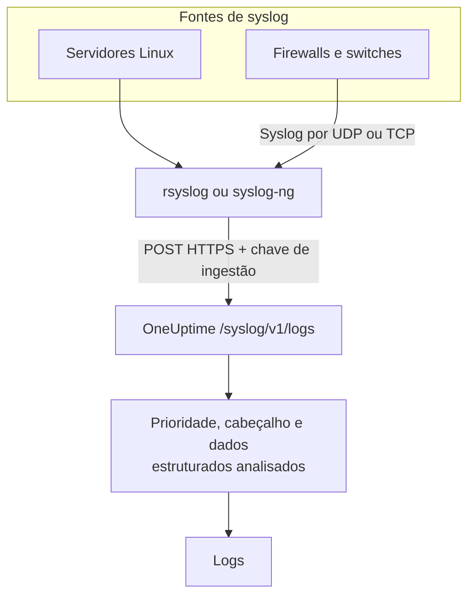

# Syslog

O OneUptime aceita syslog por HTTPS. Envie mensagens RFC 5424 ou RFC 3164 para `/syslog/v1/logs` com a sua chave de ingestão, e cada uma vira um log pesquisável, com prioridade, facility, severidade, host, aplicação e dados estruturados como atributos. Use-o para encaminhar a partir do rsyslog, do syslog-ng ou de qualquer relay capaz de fazer requisições HTTP.

:::cards
- [Enviar uma mensagem de teste](#enviar-uma-mensagem-de-teste): Uma única requisição `curl`.
- [Encaminhar a partir do rsyslog](#encaminhar-a-partir-do-rsyslog): Envie tudo o que um servidor ou relay recebe.
- [Atributos extraídos](#atributos-extraídos): O que o OneUptime extrai de cada mensagem.
- [Solução de problemas](#solução-de-problemas): Requisições recusadas e serviços inesperados.
:::

## Como funciona



O OneUptime responde assim que lê as mensagens da requisição, e as analisa e guarda um instante depois. O texto da mensagem fica no corpo do log; todo o resto vira atributo.

> [!TIP]
> Os dispositivos de rede que você monitora com uma sonda do OneUptime podem enviar o syslog diretamente à sonda por UDP, sem relay — os logs então aparecem no dispositivo dentro do OneUptime. Veja [Guias por fornecedor de rede](/docs/monitor/network-vendor-guides).

## Antes de começar

- **Um projeto do OneUptime** – no OneUptime Cloud, a telemetria é cobrada por GB ingerido, e um projeto no plano Free precisa de um método de pagamento antes de poder enviar telemetria.
- **Chave de ingestão de telemetria** – crie uma chave **Servidor** em **Produtos → Configurações do projeto → Telemetria e APM → Chaves de ingestão** e copie a **Chave secreta** dela. Você a envia no cabeçalho `x-oneuptime-token`.
- **Encaminhador de syslog** – qualquer ferramenta capaz de enviar requisições HTTP POST (por exemplo `curl`, `rsyslog` via `omhttp`, ou `syslog-ng` com o seu destino HTTP).
- **Nome do serviço (opcional)** – defina o cabeçalho `x-oneuptime-service-name` para agrupar os logs recebidos sob um serviço de telemetria específico. Sem ele, o OneUptime recorre ao `APP-NAME` do syslog, ao nome do host ou a `Syslog`.

## Endpoint

```http
POST https://oneuptime.com/syslog/v1/logs
```

| Cabeçalho | Obrigatório | Valor |
| --- | --- | --- |
| `x-oneuptime-token` | Sim | A sua chave de ingestão. |
| `Content-Type` | Sim, para corpos JSON | `application/json` |
| `x-oneuptime-service-name` | Não | O serviço ao qual os logs pertencem. |
| `Content-Encoding` | Não | `gzip`, para um corpo comprimido. |

Troque `oneuptime.com` pelo seu host se você hospeda o OneUptime por conta própria.

## Corpo da requisição

Envie uma carga JSON com um array `messages`. Os formatos RFC 5424 e RFC 3164 (BSD) são suportados, e você pode misturá-los numa mesma requisição:

```json
{
  "messages": [
    "<34>1 2025-03-02T14:48:05.003Z web-01 nginx 7421 ID47 [env@32473 host=\"web-01\"] 502 on /api/login",
    "<13>Feb  5 17:32:18 db-01 postgres[2419]: connection received from 10.0.0.12"
  ]
}
```

### Formatos de corpo suportados

| Corpo | Como enviar |
| --- | --- |
| Um objeto JSON com um array `messages` | `Content-Type: application/json` — o recomendado. |
| Um array JSON de mensagens | `Content-Type: application/json`. |
| Um objeto JSON com uma única `message` | `Content-Type: application/json`. Um valor com várias linhas é lido como várias mensagens. |
| Mensagens separadas por quebras de linha | Comprimidas com gzip e enviadas com `Content-Encoding: gzip`. |

Um corpo em texto simples que não esteja comprimido com gzip não é lido, e a requisição é recusada com `400`. Um corpo comprimido com gzip é sempre lido como mensagens separadas por quebras de linha, então não comprima um corpo JSON. Mantenha cada requisição abaixo de 1 MB: o ingress do OneUptime não aumenta o limite padrão do nginx para o corpo da requisição neste endpoint.

## Enviar uma mensagem de teste

```bash
curl \
  -X POST https://oneuptime.com/syslog/v1/logs \
  -H "Content-Type: application/json" \
  -H "x-oneuptime-token: YOUR_TELEMETRY_KEY" \
  -H "x-oneuptime-service-name: production-web" \
  -d '{
    "messages": [
      "<34>1 2025-03-02T14:48:05.003Z web-01 nginx 7421 ID47 [env@32473 host=\"web-01\"] 502 on /api/login"
    ]
  }'
```

Um `200` significa que a mensagem foi aceita. Abra **Produtos → Registros**: o log aparece no serviço `production-web` com o corpo `502 on /api/login`, a severidade `Error` e os atributos de [Atributos extraídos](#atributos-extraídos).

## Encaminhar a partir do rsyslog

O rsyslog envia ao OneUptime com o seu módulo de saída HTTP, o `omhttp`.

:::steps
### Garantir que o `omhttp` está disponível

A configuração abaixo o carrega com `module(load="omhttp")`. Se o rsyslog disser que não consegue carregar o módulo, instale o pacote que fornece o `omhttp` na sua distribuição.

### Adicionar o destino do OneUptime

Crie `/etc/rsyslog.d/oneuptime.conf`. O template reconstrói cada mensagem como uma linha RFC 5424 e a embrulha no corpo JSON que o OneUptime espera:

```text title="/etc/rsyslog.d/oneuptime.conf"
module(load="omhttp")

template(name="OneUptimeJson" type="string"
         string="{\"messages\":[\"<%PRI%>1 %TIMESTAMP:::date-rfc3339% %HOSTNAME% %APP-NAME% %PROCID% %MSGID% - %msg:::json%\"]}")

action(
  type="omhttp"
  server="oneuptime.com"
  serverport="443"
  usehttps="on"
  restpath="syslog/v1/logs"
  httpheaders=[
    "x-oneuptime-token: YOUR_TELEMETRY_KEY",
    "x-oneuptime-service-name: rsyslog-demo"
  ]
  template="OneUptimeJson"
)
```

`restpath` recebe o caminho sem a barra inicial. O `omhttp` envia por padrão um `Content-Type` JSON, que é exatamente o que este template produz.

### Verificar a configuração e reiniciar o rsyslog

```bash
sudo rsyslogd -N1
sudo systemctl restart rsyslog
```

`rsyslogd -N1` valida a configuração sem iniciar o rsyslog. Depois do reinício, as novas mensagens aparecem em **Produtos → Registros** no serviço `rsyslog-demo`.
:::

A ação encaminha toda mensagem que o rsyslog trata — programas locais, o journal do systemd quando o rsyslog o lê, e tudo o que ele recebe da rede.

### Encaminhar o syslog de dispositivos de rede

Firewalls, switches e outros appliances muitas vezes enviam syslog só por UDP ou TCP. Aponte-os para um relay rsyslog e deixe o relay encaminhar por HTTPS. Adicione um listener à configuração do relay, antes da `action`:

```text title="/etc/rsyslog.d/oneuptime.conf"
module(load="imudp")
input(type="imudp" port="514")
```

Defina `x-oneuptime-service-name` com um nome como `perimeter-firewall`, ou remova o cabeçalho para que os logs de cada dispositivo sejam agrupados pelo nome do host. Muitos appliances escrevem a mensagem como pares `key=value`; um [Key=Value Parser](/docs/telemetry/log-pipelines#keyvalue-parser) os transforma em atributos.

:::details Enviar em lotes em vez de uma requisição por mensagem
O rsyslog pode agrupar as mensagens e comprimi-las com gzip, o que o OneUptime lê como mensagens separadas por quebras de linha. Troque o template e a ação por:

```text title="/etc/rsyslog.d/oneuptime.conf"
template(name="OneUptimeLine" type="string"
         string="<%PRI%>1 %TIMESTAMP:::date-rfc3339% %HOSTNAME% %APP-NAME% %PROCID% %MSGID% - %msg%")

action(
  type="omhttp"
  server="oneuptime.com"
  serverport="443"
  usehttps="on"
  restpath="syslog/v1/logs"
  httpheaders=["x-oneuptime-token: YOUR_TELEMETRY_KEY"]
  template="OneUptimeLine"
  batch="on"
  batch.format="newline"
  compress="on"
)
```

Mantenha `compress="on"`: o OneUptime só lê mensagens separadas por quebras de linha de um corpo comprimido com gzip.
:::

### Outros encaminhadores

- **syslog-ng** – use o seu destino HTTP com a mesma URL, os mesmos cabeçalhos e o mesmo corpo JSON.
- **Fluent Bit** – receba o syslog com a entrada `syslog` do Fluent Bit e encaminhe-o como qualquer outro log. Veja [Fluent Bit](/docs/telemetry/fluentbit).

## Atributos extraídos

O OneUptime adiciona automaticamente os seguintes atributos a cada entrada de log:

| Atributo | Valor | Da mensagem de teste |
| --- | --- | --- |
| `syslog.priority` | A prioridade, `<PRI>` | `34` |
| `syslog.facility.code`, `syslog.facility.name` | A facility, a partir da prioridade | `4`, `security` |
| `syslog.severity.code`, `syslog.severity.name` | A severidade, a partir da prioridade | `2`, `critical` |
| `syslog.version` | A versão do RFC 5424 | `1` |
| `syslog.hostname` | `HOSTNAME` | `web-01` |
| `syslog.appName` | `APP-NAME`, ou a tag do RFC 3164 | `nginx` |
| `syslog.processId` | `PROCID` | `7421` |
| `syslog.messageId` | `MSGID` | `ID47` |
| `syslog.structured.raw` | Os dados estruturados do RFC 5424, como enviados | `[env@32473 host="web-01"]` |
| `syslog.structured.*` | Cada parâmetro dos dados estruturados, achatado | `syslog.structured.env_32473.host` = `web-01` |
| `syslog.raw` | A mensagem original, para rastreabilidade | a linha inteira |

Esses atributos ficam pesquisáveis no explorador de **Produtos → Registros** — por exemplo `@syslog.severity.name:error` ou `@syslog.hostname:web-01`. Veja [Sintaxe de pesquisa](/docs/telemetry/search-syntax).

A mensagem em si fica no corpo do log. Firewalls como Sophos XGS e Fortinet FortiGate a escrevem como pares `key=value` (`log_component="IPSec" con_name="HQ-Branch1" status="Terminated"`); adicione um processador **Key=Value Parser** num [pipeline de registros](/docs/telemetry/log-pipelines#keyvalue-parser) para transformar também esses pares em atributos.

### Severidade

| Severidade do syslog | Código | Severidade no OneUptime |
| --- | --- | --- |
| Emergency, Alert | `0`, `1` | `Fatal` |
| Critical, Error | `2`, `3` | `Error` |
| Warning | `4` | `Warning` |
| Notice, Informational | `5`, `6` | `Information` |
| Debug | `7` | `Debug` |
| Sem prioridade na mensagem | — | `Unspecified` |

Uma mensagem sem carimbo de data e hora é guardada com a hora em que o OneUptime a recebeu.

### Serviço

Cada log é guardado sob um serviço de telemetria, que o OneUptime cria na primeira vez que ele envia. O serviço é o primeiro disponível entre:

1. o cabeçalho `x-oneuptime-service-name`;
2. o `APP-NAME` (ou a tag) da mensagem;
3. o nome do host da mensagem;
4. `Syslog`.

## Solução de problemas

:::details HTTP 401
A chave está ausente, é desconhecida ou expirou. Verifique se o cabeçalho `x-oneuptime-token` leva a **Chave secreta** de uma chave de ingestão do projeto que deve receber os logs.
:::

:::details HTTP 402 ou 422
`402`: no OneUptime Cloud, o projeto está no plano Free e não tem método de pagamento. Adicione um em **Configurações do projeto → Cobrança e faturas → Cobrança**. `422`: a chave está desativada, ou é uma chave de navegador. Ligue de novo **Habilitado** nas configurações da chave, ou crie uma chave **Servidor**.
:::

:::details HTTP 400, ou nenhum log aparece
Confirme que o corpo da requisição contém de fato linhas de syslog, como JSON com `Content-Type: application/json`. Corpos vazios — e corpos em texto simples que não estejam comprimidos com gzip — são recusados com HTTP 400.
:::

:::details HTTP 413
A requisição é maior do que o ingress aceita. Envie menos mensagens por requisição.
:::

:::details Os logs chegam com um nome de serviço inesperado
Defina `x-oneuptime-service-name` para substituir a detecção padrão, que usa o `APP-NAME` e depois o nome do host.
:::

## Próximos passos

:::cards
- [Pipelines de registros](/docs/telemetry/log-pipelines): Transforme mensagens `key=value` em atributos.
- [Regras de gravação de registros](/docs/telemetry/log-recording-rules): Transforme os números do seu syslog em métricas.
- [Monitor de logs](/docs/monitor/logs-monitor): Alerte quando chegarem mensagens de syslog correspondentes.
:::
