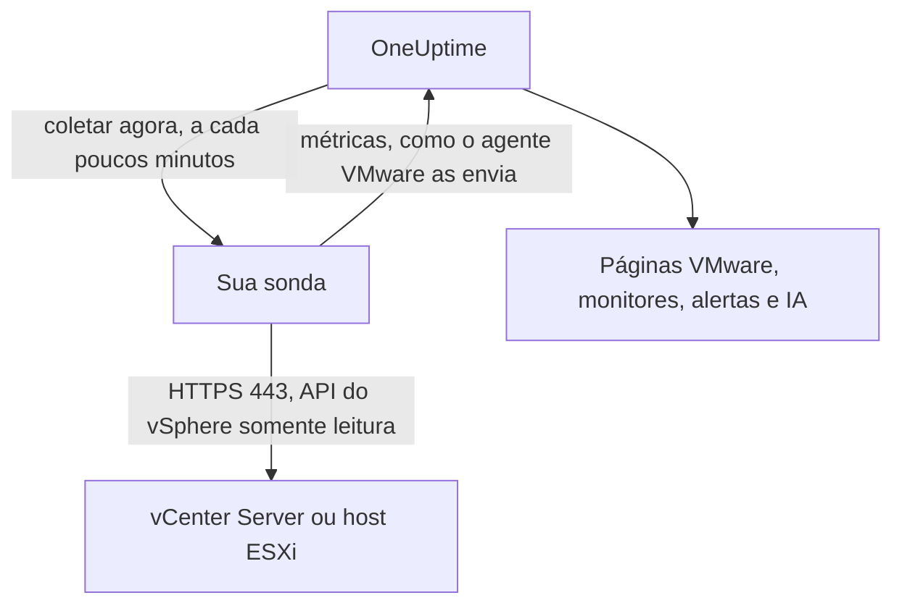

# VMware sem agente

Monitore um vCenter Server, ou um host ESXi autônomo, sem instalar nada: informe no OneUptime o endereço do vCenter e uma conta somente leitura, escolha a sonda que consegue alcançá-lo, e a sonda coleta os mesmos dados que o [agente VMware](/docs/telemetry/vmware). Não há agente para instalar, atualizar ou manter em execução, nem máquina própria para provisionar.

:::cards
- [Antes de começar](#antes-de-começar): Uma sonda que alcança o vCenter e uma conta somente leitura.
- [Conectar um vCenter](#conectar-um-vcenter): Quatro campos, um teste e um nome.
- [Solução de problemas](#solução-de-problemas): O que cada mensagem significa e o que a corrige.
:::

## Como funciona

A cada poucos minutos a sonda entra no vCenter com a conta que você salvou, lê o inventário, os contadores de desempenho e as estatísticas do vSAN, e os envia ao OneUptime. Eles chegam exatamente como os do agente VMware, então cada página VMware, cada [monitor VMware](/docs/monitor/vmware-monitor), cada modelo de alerta e o OneUptime AI os leem da mesma forma. A sonda mantém sua sessão do vCenter entre as coletas, para que o log de eventos do vCenter não se encha de logins.

## Sonda ou agente?

| | Uma sonda (esta página) | O agente VMware |
|---|---|---|
| O que você executa | Uma sonda que você já executa, ou uma nova | O agente, em uma máquina própria |
| Onde a conta fica | Criptografada no OneUptime, enviada somente à sonda | No arquivo `.env` do agente |
| O que ele precisa alcançar | O vCenter pela porta TCP 443, a partir da sonda | O vCenter pela porta TCP 443, a partir do agente |
| Maior vCenter | Cerca de 48 MiB de métricas por coleta | Sem limite |
| Syslog do ESXi e o agente de IA | Não incluídos | Incluídos |

Ambos enviam os mesmos dados. Você pode trocar um vCenter de um para o outro a qualquer momento na página **Configurações** dele.

## Antes de começar

- **Uma sonda que consiga alcançar o vCenter pela porta TCP 443.** Normalmente é uma [sonda personalizada](/docs/probe/custom-probe) na rede do vCenter. No OneUptime Cloud, as sondas compartilhadas nunca recebem a senha de um vCenter, então adicione uma sonda própria. Em uma instância auto-hospedada, as sondas da própria instância também podem coletar.
- **Um usuário do vSphere com a função Read-Only** no objeto vCenter de nível superior, com **Propagate to children** marcado. Siga [Criar o usuário somente leitura do vSphere](/docs/telemetry/vmware#create-the-read-only-vsphere-user): a conta é a mesma que o agente usa.

> [!IMPORTANT]
> Sem **Propagate to children**, o usuário entra mas não vê nada, e a sonda informa que a conta não consegue ler o inventário do vCenter.

## Conectar um vCenter

:::steps
### Abrir os vCenters
No OneUptime, abra **VMware → Todos os vCenters** e clique em **Conectar vCenter**.

### Informar o endereço e a conta
Informe o endereço em que você abre o vSphere Client, como `https://vcsa.example.com`, o nome de usuário com o domínio, como `oneuptime@vsphere.local`, e a senha. Escolha a sonda que alcança o vCenter.

### Testar a conexão
Na etapa seguinte, clique em **Testar conexão**. A sonda entra, lê o que a conta consegue ver e sai, e o resultado mostra quantos datacenters, clusters, hosts, máquinas virtuais e datastores ela encontrou.

### Confiar no certificado do vCenter
Por padrão, o vCenter usa um certificado da própria autoridade, em que a sonda não confia. O teste então mostra o certificado: compare a impressão digital dele com a do próprio vCenter e clique em **Confiar neste certificado**.

### Dar um nome e conectar
O nome padrão é o nome de host do vCenter. Clique em **Conectar vCenter** para salvar.
:::

A **Visão geral** do vCenter mostra um cartão **Coleta de dados**. Ele mostra **Verificando** até a primeira coleta, que começa em até um minuto, depois **Coletando**, e o inventário é preenchido.

## Certificados

A sonda nunca pula a verificação de certificados. Cada conexão completa um handshake TLS inteiro, e então:

- sem nenhum certificado confiável salvo, o certificado do vCenter precisa vir de uma autoridade em que a máquina da sonda confia, para o endereço informado;
- com um certificado confiável salvo, o vCenter precisa apresentar exatamente esse certificado, identificado pela impressão digital SHA-256. Nada mais é aceito, nem mesmo um certificado publicamente confiável.

Para verificar uma impressão digital, abra o vSphere Client em **Administration → Certificates → Certificate Management**, ou execute `openssl s_client -connect vcsa.example.com:443 </dev/null | openssl x509 -noout -fingerprint -sha256` na máquina da sonda.

Quando o certificado do vCenter é renovado, a coleta para com **O certificado do vCenter mudou** e o novo certificado é mostrado. Nada é enviado ao vCenter até que você confie nele, na página **Visão geral** ou **Configurações** do vCenter.

## A senha salva

A senha é criptografada e somente de escrita: ninguém consegue lê-la de volta, e a API nunca a retorna. Ela é enviada somente à sonda que coleta o vCenter, que a mantém na memória.

Uma senha salva só é enviada ao endereço, pela sonda e ao certificado para os quais foi informada. Alterar o endereço, a sonda ou o certificado confiável pede a senha novamente, então ninguém que possa editar o vCenter consegue enviá-la para outro lugar. Confiar no certificado que a sonda encontrou no endereço salvo a mantém.

## Alternar entre o agente e uma sonda

Abra a página **Configurações** do vCenter. O cartão **Coleta de dados** oferece **Coletar com uma sonda** para um vCenter que o agente envia, e **Usar o agente VMware** para um que uma sonda coleta. Ao mudar para o agente, a senha salva é esquecida.

> [!WARNING]
> Pare o agente VMware assim que a primeira coleta da sonda for concluída com sucesso. Enquanto os dois estiverem em execução, cada métrica chega duas vezes.

## Referência

| Configuração | Padrão | Observações |
|---|---|---|
| Coletar a cada | 2 minutos | De 1 a 60 minutos. Colete um vCenter grande com menos frequência para não sobrecarregá-lo. |
| Coletas simultâneas | 4 por sonda | Uma coleta mais lenta que o seu intervalo é ignorada, nunca empilhada. |
| Maior coleta | Cerca de 48 MiB | vCenters maiores precisam do agente VMware. |
| Teste de conexão | 90 segundos para começar | Um teste que nenhuma sonda pega a tempo, ou que dura mais de 2 minutos, é respondido como falho. |

## Solução de problemas

:::details O certificado do vCenter não é confiável
O vCenter apresenta um certificado da própria autoridade. Compare a impressão digital mostrada com o certificado do vCenter e clique em **Confiar neste certificado**.
:::

:::details O vCenter recusou o login
Use o nome de usuário completo com o domínio, como `oneuptime@vsphere.local`, e verifique a senha e se a conta não está bloqueada. Altere-os com **Editar conexão** na página **Configurações** do vCenter.
:::

:::details O usuário não consegue ler o inventário do vCenter
Atribua ao usuário a função Read-Only no objeto vCenter de nível superior, com **Propagate to children** marcado.
:::

:::details A sonda não recebe resposta do vCenter
A rede da sonda não consegue alcançar o vCenter pela porta TCP 443. Libere o tráfego no firewall, ou escolha uma sonda na rede do vCenter.
:::

:::details A sonda não pegou isto
A sonda está offline, ou executa uma versão do OneUptime anterior à coleta VMware. Verifique se ela está conectada na tabela **Sondas personalizadas**, e atualize-a.
:::

:::details Este vCenter é grande demais para ser coletado por uma sonda
Suas métricas são maiores do que um envio de uma sonda pode ser. Use o [agente VMware](/docs/telemetry/vmware) para este vCenter.
:::

## Próximos passos

:::cards
- [Monitor VMware](/docs/monitor/vmware-monitor): Alertas sobre hosts, máquinas virtuais, datastores e clusters.
- [Sonda personalizada](/docs/probe/custom-probe): Execute uma sonda na rede do vCenter.
- [Agente VMware](/docs/telemetry/vmware): Colete um vCenter com o agente em vez disso.
:::
