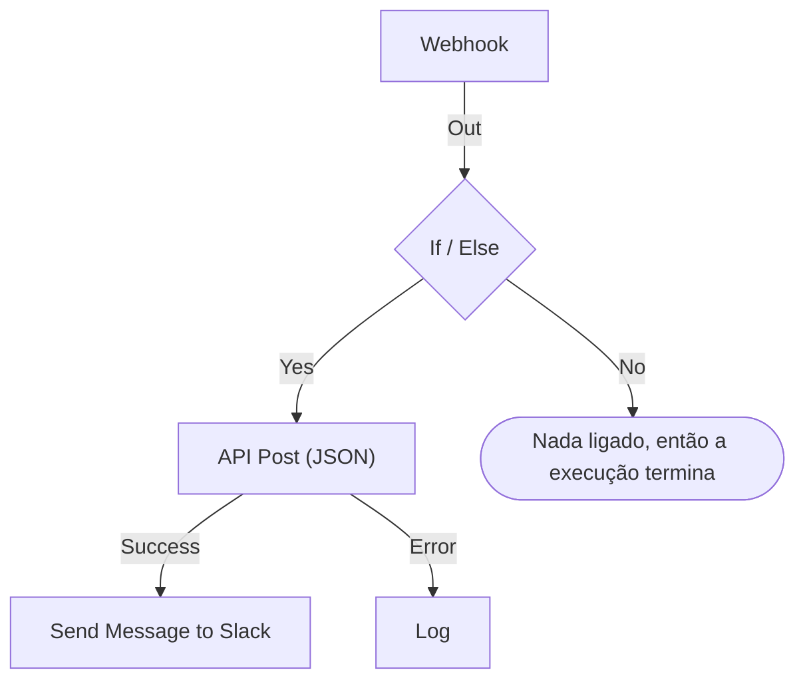

# Criar um workflow

Você monta um workflow no **Construtor** dele: um canvas onde você adiciona blocos, liga um ao outro e preenche as configurações de cada um. Esta página mostra como criar um workflow, [adicionar blocos](#adicionar-blocos), [ligá-los](#ligar-blocos) e [configurá-los](#configurar-um-bloco), [passar valores entre eles](#usar-valores-de-blocos-anteriores) e [ligar o workflow](#ligar-o-workflow).

Para criar um workflow, abra **Fluxos de trabalho** e clique em **Criar fluxo de trabalho**. A caixa de diálogo **Criar um fluxo de trabalho** pergunta primeiro como você quer começar e depois um nome. Um modelo que precisa de configurações próprias, como uma URL de webhook do Slack, pede essas configurações em mais um passo e as salva como variáveis do workflow, para que você possa alterá-las depois sem editar o workflow.

Escolha como começar:

- **Começar do zero**, no topo da caixa de diálogo, dá a você um canvas vazio. A maioria dos workflows começa por aqui.
- **Ou começar a partir de um modelo** lista alguns modelos **Recomendados**. Para os outros, escolha uma categoria ao lado da caixa de busca, como **Incidentes**, **Monitores** ou **Jira**, ou **Todos os modelos**, ou digite em **Pesquisar modelos…**. Todas as palavras que você digita precisam corresponder.

Clique em um modelo para ver o que ele faz: o gatilho, os blocos que o compõem e as configurações que ele vai pedir. Depois clique em **Usar este modelo**, ou dê um clique duplo no modelo. Na caixa de busca, as setas escolhem um modelo e **Enter** o usa. `/` leva você de volta à caixa de busca.

Os workflows são criados desligados, então nada roda até você ligá-los. Um novo workflow abre no **Construtor**, o canvas onde você o projeta.

## O canvas

Um workflow criado do zero abre com um único bloco tracejado escrito **Choose what starts this workflow**. Esse bloco é o ponto de partida: clique nele para escolher um gatilho. Um workflow criado a partir de um modelo abre com os blocos já no lugar.

Todo workflow tem exatamente um **gatilho** no topo. Todo o resto é um **componente** que faz alguma coisa. Para trocar o gatilho, exclua-o: o espaço reservado tracejado volta ao lugar dele, e clicar nele permite escolher outro. Excluir um bloco também exclui as linhas dele, então ligue de novo o novo gatilho ao primeiro bloco.

As alterações são salvas automaticamente. Um selo na barra de ferramentas acompanha isso: **Salvando…** enquanto a alteração está a caminho, depois **Salvo**, ou **Não foi possível salvar** se não deu certo. O canvas não tem botão de salvar nem uma etapa de publicação separada.

## Adicionar blocos

| Para adicionar         | Clique em                                                      | Painel que se abre            |
| ---------------------- | -------------------------------------------------------------- | ----------------------------- |
| O gatilho              | O bloco tracejado de espaço reservado                          | **Add Trigger**               |
| Qualquer outro bloco   | **Adicionar componente**, na barra de ferramentas acima do canvas | **Adicionar componente**   |

Os dois painéis abrem nos blocos que a maioria dos workflows usa, em **Popular**, seguidos pelos outros blocos integrados. Em **OneUptime resources**, clique em um recurso como **Incidente** para ver o que dá para fazer com ele; **Browse all resources** lista todos. Ou pesquise: digite algumas palavras, como `create incident`, e o resultado mais próximo aparece primeiro. Pressione `/` para ir à caixa de busca, as setas para percorrer os resultados e **Enter** para adicionar o bloco destacado. Clicar em um bloco o adiciona.

Um novo bloco aparece abaixo do bloco mais baixo do canvas, e um novo gatilho ocupa o lugar do bloco tracejado, no topo. O novo bloco fica selecionado e, se cair fora da área visível, o canvas rola só o suficiente para mostrá-lo. As configurações dele não se abrem sozinhas: clique no bloco quando estiver pronto para configurá-lo. Enquanto as configurações obrigatórias não estiverem preenchidas, ele mostra **Click to set up**.

Arraste os blocos para onde quiser; o canvas os encaixa em uma grade enquanto você arrasta. As posições dos blocos são salvas, então a próxima pessoa vê a mesma disposição que você deixou.

## O que há em um bloco

| Campo                                 | O que faz                                                                                                                                                                                                                                                                                                      |
| ------------------------------------- | -------------------------------------------------------------------------------------------------------------------------------------------------------------------------------------------------------------------------------------------------------------------------------------------------------------- |
| **Identifier** (em **ID**)            | O ID curto mostrado no bloco, como `log-1`. É assim que outros blocos se referem a este, então renomeá-lo quebra todas as referências `{{local.components.…}}` que apontam para ele. O título do bloco é o nome do próprio componente e não pode ser alterado.                                                    |
| **Configurações**                     | O que o bloco precisa para fazer o trabalho dele: uma URL, um canal do Slack, o corpo de uma mensagem. Campos opcionais têm a marca **(Opcional)**; todo o resto é obrigatório. Uma chave de liga/desliga não tem nenhuma das duas, porque sempre tem um valor. As configurações menos usadas ficam recolhidas em **Mais campos**, cujo cabeçalho as nomeia e mostra as que estão preenchidas. |
| **Input**                             | O ponto na borda de cima, onde chegam as linhas dos blocos anteriores. Gatilhos não têm: nada roda antes deles.                                                                                                                                                                                                 |
| **Outputs**                           | Os pontos ao longo da borda de baixo, com rótulos logo acima, de onde saem as linhas para os próximos blocos. Muitos blocos têm saídas **Success** e **Error** separadas, para você tratar os dois casos.                                                                                                       |

## Ligar blocos

Arraste de um ponto na parte de baixo de um bloco até o ponto no topo do próximo. A linha que você desenha decide o que roda em seguida.

- Se você liga a partir de **Success**, o próximo bloco só roda quando o anterior funcionou.
- Se você liga a partir de **Error**, o próximo bloco só roda quando o anterior falhou.
- Se você não liga uma saída, esse caminho simplesmente para.

Você pode ligar uma saída a vários blocos. Todos rodam, mas um depois do outro, em uma única fila, não em paralelo. Não conte com a ordem entre os ramos nem com que eles se sobreponham no tempo.

Cada bloco roda no máximo uma vez por execução. Uma linha que leva a um bloco que já rodou — subindo no canvas, ou a partir de um segundo ramo depois que o primeiro chegou a ele — para a execução com um erro, então um workflow não consegue entrar em loop.

## Configurar um bloco

Clique em um bloco para abrir as configurações dele em uma caixa de diálogo, ou chegue até ele com **Tab** e pressione **Enter**. Preencha as configurações e clique em **Salvar**.

Cada configuração tem o campo de que o valor dela precisa:

| A configuração contém                            | Você recebe                                                                    |
| ------------------------------------------------ | ------------------------------------------------------------------------------ |
| Palavras: uma mensagem, um prompt, um valor a registrar | Uma caixa que cresce enquanto você digita. **Enter** começa uma nova linha. |
| Um valor curto: uma URL, um ID, um assunto       | Uma única linha.                                                               |
| Código ou HTML                                   | Um editor de código.                                                           |
| JSON                                             | Um editor de JSON.                                                             |
| Ligado ou desligado                              | Uma chave com o nome dela ao lado. Clique na chave ou no nome para alterná-la. |

A caixa de diálogo abre no que você provavelmente veio procurar. Para um gatilho **Webhook**, é a URL dele, com um botão **Copiar URL**, os métodos que ele aceita e uma requisição de exemplo. Para um gatilho **Manual**, é como o workflow é iniciado. Qualquer outro bloco abre nas configurações dele. Um bloco sem configurações não tem seção **Configurações**.

Abaixo disso, de cima para baixo:

- **ID**, **Inputs** e **Outputs**, lado a lado — o identificador do bloco, de onde ele é alcançado e o que roda depois dele.
- **Returns** — os dados que este bloco entrega aos passos seguintes. Cada valor mostra a referência exata que o lê, com um botão para copiá-la.
- **How to use** — o que o bloco faz em uma frase, os passos para configurá-lo, um exemplo para copiar e os erros mais comuns. O exemplo é montado a partir do seu workflow: usa o ID deste bloco, e os valores do gatilho onde coloca dados em uma mensagem. **Learn more** abre a explicação mais longa, e os links levam ao guia completo. Todo bloco tem uma, e o botão **How to use** no topo da caixa de diálogo vai direto para ela.

O rodapé tem:

- **Excluir** — remove este bloco. Ele pergunta antes e nomeia o bloco pelo tipo e pelo identificador, como **Send Email (send-email-2)**, para você saber qual de vários blocos iguais vai embora.
- **Run just this step** — roda só este bloco, sem o resto do workflow. Os valores que ele teria lido de outros passos chegam vazios, e tudo o que ele envia, grava ou exclui acontece de verdade. Ele pula todas as condições antes do bloco, então só quem pode editar o workflow pode usá-lo.

### Usar valores de blocos anteriores

A maioria das configurações pode usar um valor de um bloco anterior ou uma variável — é assim que os dados passam de um bloco para o próximo. Cada uma dessas configurações tem um botão **{ }** no fim. Ele abre uma lista dos valores que você pode usar: cada bloco anterior pelo nome, com cada valor que ele devolve — como se chama, o que contém e o tipo —, e depois as variáveis do seu workflow e as globais. Pesquise na lista, escolha um com o mouse ou com as setas e **Enter**, e o valor vai para onde está o cursor.

Na configuração, um valor aparece como um chip, como **Webhook › Request Body**. Passe o mouse por cima para ver a referência que ele representa, `{{local.components.webhook-1.returnValues.request-body}}`, que é o que fica salvo. O cursor pula um chip de uma vez, **Backspace** o remove inteiro e copiá-lo copia a referência. Se você conhece a sintaxe, digite `{{`: a mesma lista se abre abaixo da configuração e vai se estreitando enquanto você digita.

- **Só são oferecidos valores que vão existir.** Ou seja, o gatilho e os blocos que rodam antes deste. Um bloco que roda depois ainda não tem saída. Enquanto um bloco não estiver ligado, só os valores do gatilho aparecem, e a lista avisa.
- **Um registro se abre nos campos dele.** Um bloco Find One ou On Create devolve um registro inteiro. Escolha-o para ver os campos, começando pelos que o **Select Fields** do bloco lê. Um valor JSON ou um conjunto de cabeçalhos se abre em uma caixa onde você digita um caminho, como `title` ou `alerts[0].status`.
- **Depois que um bloco roda, a lista sabe o que há nos valores dele.** Cada valor diz o que continha na última execução — `"production"` ou `3 fields` —, e um valor JSON ou um conjunto de cabeçalhos se abre nos campos que tinha, cada um com o seu conteúdo. Assim, do **Request Body** de um Webhook você escolhe **incident.title** em vez de digitar um caminho. A busca também encontra esses campos: digite `title`, ou `{{` e o começo de um caminho. Os campos de um registro também mostram o que continham. Os campos vêm da última execução, então um que uma requisição posterior omitir fica vazio nessa execução. Um valor que parece um segredo, como um cabeçalho `Authorization`, um token ou uma senha, aparece sem o conteúdo.
- **Um Webhook que ainda não recebeu nenhuma requisição avisa** no topo dos valores dele, com **Copy test request**: um comando `curl` que envia `{"message": "Hello"}` para a URL de webhook do workflow. Rode-o em um terminal com a lista aberta, e os campos da requisição aparecem nela assim que a execução que ela inicia terminar, normalmente em segundos. O workflow precisa estar habilitado, senão a requisição é recusada. Só quem pode ver a URL do webhook tem o botão. Um gatilho Incoming Email que ainda não recebeu nenhum e-mail avisa no mesmo lugar; envie um e-mail para o endereço dele, e os cabeçalhos e anexos aparecem do mesmo jeito.
- **Os editores de código têm Insert value na barra de ferramentas.** Em JSON, ele acrescenta as aspas de que um valor precisa dentro de um documento. **Run Custom JavaScript** lê valores pelos **Arguments** dele, então o código não tem seletor.
- **Números, senhas, chaves e datas mantêm o próprio controle,** com **{ }** ao lado. Um valor escolhido substitui o controle, e **abc** volta para a digitação.

Um chip fica âmbar quando o que ele lê não está lá: um bloco que foi renomeado ou excluído, um valor que o bloco não devolve, um bloco que roda depois ou uma variável que não existe. A dica dele diz qual é o caso. Veja [Variáveis](/docs/workflows/variables) para a sintaxe das referências.

## Verificações enquanto você monta

O Construtor verifica o grafo inteiro a cada alteração e informa o que encontra em um selo na barra de ferramentas. Clique no selo para abrir **Problems with this workflow**, que lista cada problema e leva você ao bloco responsável. No canvas, um bloco cujas configurações obrigatórias ainda estão vazias mostra **Click to set up**, e um bloco com qualquer outro problema leva um selo no canto: vermelho para um erro, âmbar para um aviso. Passe o mouse no selo para ler o que está errado.

Ele pega os erros que, de outro jeito, ficam invisíveis até uma execução dar errado:

- um workflow sem gatilho;
- dois blocos com o mesmo ID, ou um ID com um ponto;
- um bloco ao qual nada está ligado;
- uma configuração obrigatória deixada vazia;
- JSON malformado;
- espaços dentro de `{{ }}`;
- referências a um passo ou a um valor de retorno que não existe.

Uma coisa ele não consegue verificar: se o nome de uma variável existe. As configurações de um bloco conseguem — uma referência a uma variável que não existe aparece ali como um chip âmbar. Em qualquer outro lugar, uma variável renomeada só aparece no log da execução.

## O seu primeiro workflow

O jeito mais rápido de pegar o jeito do canvas é um workflow de dois blocos que você inicia manualmente:

:::steps
1. Clique no bloco tracejado de espaço reservado e depois em **Manual**, no painel **Add Trigger**.
2. Clique em **Adicionar componente** e depois em **Registro**, em **Popular**. O novo bloco aparece abaixo do gatilho. Ligue o ponto **Execute** do gatilho ao ponto de entrada do bloco Log, mais abaixo.
3. Clique no bloco Log, que mostra **Click to set up**, e digite `Hello from ` no **Value** dele. Clique em **{ }** e depois em **JSON**, em **Manual**. A configuração mostra **Manual › JSON** e salva `{{local.components.manual-1.returnValues.value}}`. `manual-1` é o **Identifier** do gatilho, mostrado no bloco do gatilho. Clique em **Salvar**.
4. Ative **Habilitado**, no topo do Construtor. Um workflow desabilitado não pode ser executado de jeito nenhum, nem manualmente; se você pular isso, **Executar fluxo de trabalho** pede para ligá-lo primeiro.
5. De volta ao **Construtor**, clique em **Executar fluxo de trabalho**, coloque `{ "name": "Ada" }` no campo **JSON**, clique em **Run Workflow Manually** e confirme com **Run**.
6. Um painel **Execução do Fluxo de Trabalho** se abre sozinho e acompanha a execução. O log mostra `Value:` seguido de `Hello from { "name": "Ada" }`.
:::

Esse ciclo — adicionar, ligar, configurar, executar, ler o log — é como você vai montar todo workflow.

> [!TIP]
> O JSON digitado em **Executar fluxo de trabalho** chega ao gatilho Manual como o texto que você digitou. Para ler um campo dele, como `name`, adicione um bloco **Text to JSON**, coloque o **JSON** do gatilho no **Text** dele e leia o campo a partir do **JSON** desse bloco: `{{local.components.text-to-json-1.returnValues.json.name}}`.

## Ligar o workflow

Os novos workflows começam desabilitados, assim como qualquer workflow que você duplique ou importe. Enquanto um workflow está desligado, o Construtor avisa acima do canvas, com um botão **Ativar fluxo de trabalho**.

A chave **Habilitado** fica no topo do **Construtor**, ao lado de **Adicionar componente** e **Executar fluxo de trabalho**. Ela também está na página **Visão geral** do workflow, cujo cartão **Detalhes do Fluxo de Trabalho** mostra o estado atual com um selo verde **Habilitado** ou vermelho **Desabilitado**: clique em **Editar fluxo de trabalho** e abra **Mais campos**. Só quem pode editar o workflow pode ligá-lo ou desligá-lo; os demais veem a chave em cinza.

Um workflow desabilitado não roda de jeito nenhum, seja como for iniciado:

| Iniciado por                                               | Enquanto o workflow está desligado                                                                                                                                                         |
| ---------------------------------------------------------- | ------------------------------------------------------------------------------------------------------------------------------------------------------------------------------------------ |
| O gatilho dele: um agendamento, um evento do OneUptime ou um e-mail | Ignorado.                                                                                                                                                                          |
| **Executar fluxo de trabalho** ou **Run just this step**    | O Construtor pergunta em vez disso **Ativar este fluxo de trabalho?**. **Ativar e executar** (ou **Ativar e executar etapa**) liga o workflow e depois executa o que você pediu, com os valores que você deu. |
| Uma chamada à URL de webhook dele                          | Recusada com HTTP 400 e "This workflow is turned off, so it can't run. Turn it on with the Enabled switch at the top of its Builder, then try again."                                         |
| O bloco **Execute Workflow** de outro workflow              | Esse bloco toma o caminho **Error**, e o erro nomeia o workflow que ele chamou.                                                                                                            |

Então a ordem é: monte, teste com **Executar fluxo de trabalho**, leia o log da execução e desligue **Habilitado** de novo se ainda não quiser que o gatilho dispare. Para testar um único bloco sem rodar o resto, use **Run just this step** nas configurações desse bloco.

Para pausar um workflow sem excluí-lo, desligue **Habilitado**. Nenhuma execução nova começa. Uma execução que está em andamento termina, mas uma que está parada em um bloco **Sleep** é cancelada ao acordar e registrada como erro.

## Organizar o canvas

- Arraste os blocos para movê-los. A disposição é salva.
- Para excluir uma linha, arraste uma das pontas dela para fora do ponto e solte em uma área vazia do canvas.
- Para excluir um bloco, clique nele e use **Excluir** no rodapé da caixa de diálogo de configurações. Selecionar um bloco ou uma linha e pressionar Backspace também o remove.
- Não há como duplicar um único bloco. **Duplicar: Fluxo de trabalho** na página **Configurações** do workflow copia tudo. O nome da cópia vem preenchido, numerado a partir dos workflows do projeto ("Nightly Sync" é copiado como "Nightly Sync 2"), e a cópia se abre, desabilitada.
- Empilhe os blocos de cima para baixo para que eles sejam lidos na direção em que rodam — as entradas ficam na borda de cima e as saídas na de baixo, então o fluxo desce naturalmente.

## Próximos passos

:::cards
- [Gatilhos](/docs/workflows/triggers): As cinco formas de um workflow começar.
- [Componentes](/docs/workflows/components): Todos os blocos que você pode adicionar, com as configurações e as saídas deles.
- [Variáveis](/docs/workflows/variables): Mova dados entre os blocos e mantenha os segredos fora deles.
- [Execuções](/docs/workflows/runs-and-logs): Confira o que cada execução fez, passo a passo.
:::
